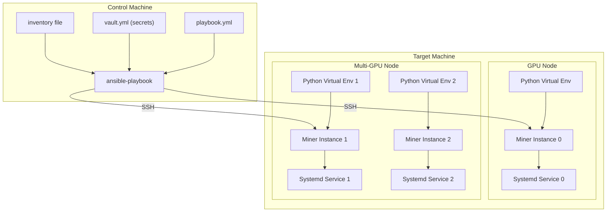
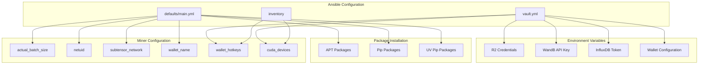
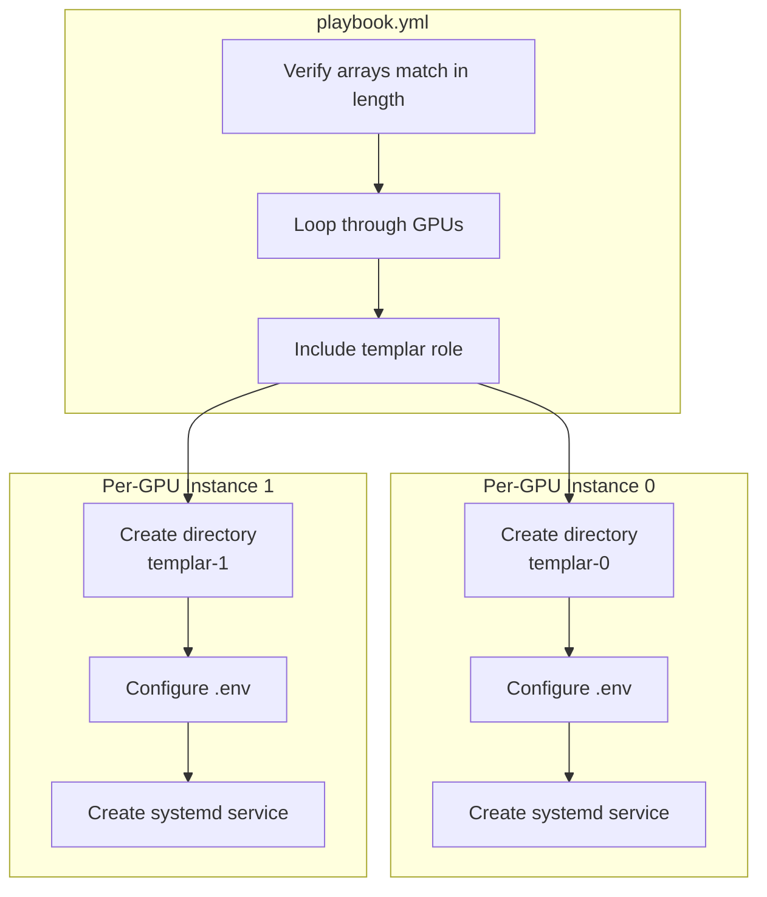

import SourceLink from '@components/SourceLink.astro';
import { Aside, Card, CardGrid, Tabs, TabItem, Steps, FileTree, Code, LinkButton, Badge } from '@astrojs/starlight/components';
import CollapsibleAside from '../../../components/CollapsibleAside.astro';

<CollapsibleAside title="Relevant Source Files">
  <SourceLink href="https://github.com/tplr-ai/templar/blob/bb2fc2a9/ansible/README.md" text="ansible/README.md" />
  <SourceLink href="https://github.com/tplr-ai/templar/blob/bb2fc2a9/ansible/group_vars/all/vault.yml.example" text="ansible/group_vars/all/vault.yml.example" />
  <SourceLink href="https://github.com/tplr-ai/templar/blob/bb2fc2a9/ansible/playbook.yml" text="ansible/playbook.yml" />
  <SourceLink href="https://github.com/tplr-ai/templar/blob/bb2fc2a9/ansible/roles/templar/defaults/main.yml" text="ansible/roles/templar/defaults/main.yml" />
  <SourceLink href="https://github.com/tplr-ai/templar/blob/bb2fc2a9/ansible/roles/templar/templates/miner.service.j2" text="ansible/roles/templar/templates/miner.service.j2" />
</CollapsibleAside>


This document describes how to deploy Templar using Ansible, focusing on automated provisioning of miner nodes across single or multiple GPUs. For Docker-based deployment, see [Docker Deployment](/guides/docker-deployment).

## Overview

The Templar Ansible playbook automates the deployment of miner nodes by:
- Cloning the repository
- Setting up Python virtual environments with CUDA support
- Installing required system packages
- Configuring environment variables
- Deploying miners as continuously running services (optionally with systemd)
- Supporting multi-GPU configurations with separate instances per GPU

### Deployment Architecture



Sources: <SourceLink href="https://github.com/tplr-ai/templar/blob/bb2fc2a9/ansible/playbook.yml" text="ansible/playbook.yml" />, <SourceLink href="https://github.com/tplr-ai/templar/blob/bb2fc2a9/ansible/README.md" text="ansible/README.md" />

## Prerequisites

Before using the Ansible deployment, ensure you have:

1. **On the control machine (where you run Ansible)**:
   - Ansible installed
   - A Unix-like environment (Linux/macOS) with SSH access to target hosts
   - Python 3 and pip

2. **On target hosts (where miners will run)**:
   - Ubuntu (recommended: 22.04)
   - CUDA support already installed
   - SSH server configured and accessible
   - Python installed (the playbook will install it if missing)
   - At least one CUDA-enabled GPU

Sources: <SourceLink href="https://github.com/tplr-ai/templar/blob/bb2fc2a9/ansible/README.md#L19-L29" text="ansible/README.md19-29" />

## Configuration

### Inventory File

The inventory file defines your target hosts and their GPU configurations:

```ini
[bittensor_subnet]
# Single GPU example
192.168.123.213 ansible_user=root ansible_port=12345 wallet_hotkeys='["miner"]' cuda_devices='["cuda"]'

# Multi-GPU example
192.168.222.111 ansible_user=root ansible_port=23456 wallet_hotkeys='["miner_1", "miner_2", "miner_3", "miner_4"]' cuda_devices='["cuda:0", "cuda:1", "cuda:2", "cuda:3"]'
```

**Note**: The `wallet_hotkeys` and `cuda_devices` arrays must have matching lengths to ensure proper pairing.

Sources: <SourceLink href="https://github.com/tplr-ai/templar/blob/bb2fc2a9/ansible/README.md#L32-L52" text="ansible/README.md32-52" />

### Environment Variables and Secrets

Sensitive configuration settings are managed via Ansible Vault. These include R2 storage credentials, wallet configuration, and API keys.

#### Creating a Vault File

1. Create directory structure:
   ```bash
   mkdir -p group_vars/all/
   ```

2. Create an encrypted vault file:
   ```bash
   ansible-vault create group_vars/all/vault.yml
   ```

3. Add your configuration in YAML format:

```yaml
env_vars:
  WANDB_API_KEY: "your_wandb_key"
  INFLUXDB_TOKEN: "your_influxdb_token"
  R2_ACCOUNT_ID: "your_r2_account_id"
  R2_GRADIENTS_ACCOUNT_ID: "your_r2_gradients_account_id"
  # Other R2 credentials...
  WALLET_NAME: "default"
  NETWORK: "finney"
  NETUID: "3"

# Miner configuration
cuda_devices: ["cuda:0"]
wallet_hotkeys: ["miner_0"]
```

Sources: <SourceLink href="https://github.com/tplr-ai/templar/blob/bb2fc2a9/ansible/group_vars/all/vault.yml.example" text="ansible/group_vars/all/vault.yml.example" />, <SourceLink href="https://github.com/tplr-ai/templar/blob/bb2fc2a9/ansible/README.md#L53-L87" text="ansible/README.md53-87" />

### Configuration Diagram



Sources: <SourceLink href="https://github.com/tplr-ai/templar/blob/bb2fc2a9/ansible/roles/templar/defaults/main.yml" text="ansible/roles/templar/defaults/main.yml" />, <SourceLink href="https://github.com/tplr-ai/templar/blob/bb2fc2a9/ansible/group_vars/all/vault.yml.example" text="ansible/group_vars/all/vault.yml.example" />

## Running the Deployment

### Basic Usage

From the `ansible` directory, run:

```bash
ansible-playbook -i inventory playbook.yml --ask-vault-pass
```

- The `-i inventory` option specifies your inventory file
- The `--ask-vault-pass` flag prompts for your vault password (if using encrypted vault)

Sources: <SourceLink href="https://github.com/tplr-ai/templar/blob/bb2fc2a9/ansible/README.md#L92-L99" text="ansible/README.md92-99" />

### Overriding Default Variables

You can override default variables in several ways:

1. **Via Command Line**:
   ```bash
   ansible-playbook -i inventory playbook.yml -e "actual_batch_size=5 wallet_name=default" --ask-vault-pass
   ```

2. **In Group/Host Variables Files**:
   Create files in `host_vars/your_host.yml` with your custom variables.

3. **In Inventory**:
   Set variables directly in your inventory file.

Sources: <SourceLink href="https://github.com/tplr-ai/templar/blob/bb2fc2a9/ansible/README.md#L101-L117" text="ansible/README.md101-117" />

## Multi-GPU Setup

The playbook automatically provisions separate instances for each GPU specified in your inventory:

### Multi-GPU Deployment Process



For each GPU:
- A separate clone of the repository is created in a unique directory (`templar-0`, `templar-1`, etc.)
- Environment variables are configured with GPU-specific settings
- A dedicated systemd service is created (when systemd is enabled)

The instance directory naming follows the pattern: `templar-<GPU index>` where the index is extracted from the `cuda:X` device name.

Sources: <SourceLink href="https://github.com/tplr-ai/templar/blob/bb2fc2a9/ansible/playbook.yml" text="ansible/playbook.yml" />, <SourceLink href="https://github.com/tplr-ai/templar/blob/bb2fc2a9/ansible/README.md#L133-L153" text="ansible/README.md133-153" />

## Systemd Service Configuration

When `use_systemd` is set to `true`, the playbook will create systemd services for each miner instance. The service:

- Runs the miner with the specified GPU and wallet
- Automatically restarts on failure
- Starts on system boot

The systemd service template parameters:

| Parameter | Description |
|-----------|-------------|
| `templar_dir` | Working directory for the instance |
| `wallet_name` | Name of the wallet to use |
| `wallet_hotkey` | Hotkey identifier for the wallet |
| `device` | CUDA device to use (e.g., `cuda:0`) |
| `netuid` | Network UID for the subnet |
| `subtensor_network` | Subtensor network (e.g., `finney`) |
| `actual_batch_size` | Batch size for training |

Sources: <SourceLink href="https://github.com/tplr-ai/templar/blob/bb2fc2a9/ansible/roles/templar/templates/miner.service.j2" text="ansible/roles/templar/templates/miner.service.j2" />, <SourceLink href="https://github.com/tplr-ai/templar/blob/bb2fc2a9/ansible/roles/templar/defaults/main.yml#L35-L36" text="ansible/roles/templar/defaults/main.yml35-36" />

## Customization

### Package Installation

You can customize package installation by modifying:

- `apt_packages`: System packages to install via APT
- `additional_apt_packages`: Additional system packages
- `essential_pip_packages`: Global pip packages
- `additional_pip_packages`: Additional global pip packages
- `additional_uv_pip_packages`: Additional packages to install in the virtual environment with `uv pip`

Sources: <SourceLink href="https://github.com/tplr-ai/templar/blob/bb2fc2a9/ansible/roles/templar/defaults/main.yml#L49-L69" text="ansible/roles/templar/defaults/main.yml49-69" />, <SourceLink href="https://github.com/tplr-ai/templar/blob/bb2fc2a9/ansible/README.md#L120-L124" text="ansible/README.md120-124" />

### Miner Parameters

Default miner parameters can be customized:

- `actual_batch_size`: Batch size for training
- `netuid`: Network UID for the subnet
- `subtensor_network`: Subtensor network name
- `wallet_name`: Name of the wallet to use
- `wallet_hotkeys`: Array of wallet hotkeys to use
- `cuda_devices`: Array of CUDA devices to use

Sources: <SourceLink href="https://github.com/tplr-ai/templar/blob/bb2fc2a9/ansible/roles/templar/defaults/main.yml#L38-L47" text="ansible/roles/templar/defaults/main.yml38-47" />, <SourceLink href="https://github.com/tplr-ai/templar/blob/bb2fc2a9/ansible/README.md#L126-L127" text="ansible/README.md126-127" />

## Troubleshooting

- Use the `-vvv` flag with `ansible-playbook` for verbose output when troubleshooting:
  ```bash
  ansible-playbook -i inventory playbook.yml --ask-vault-pass -vvv
  ```

- Ensure SSH keys and network connectivity are correctly configured
- Check that the `cuda_devices` and `wallet_hotkeys` arrays have the same length
- Verify that your vault file contains all required environment variables

Sources: <SourceLink href="https://github.com/tplr-ai/templar/blob/bb2fc2a9/ansible/README.md#L168-L171" text="ansible/README.md168-171" />