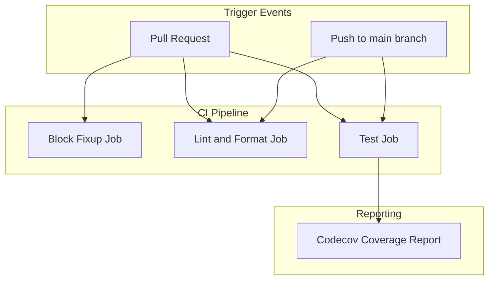
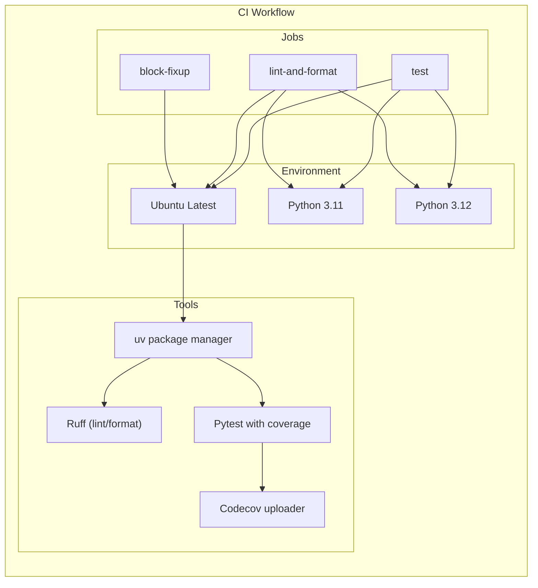
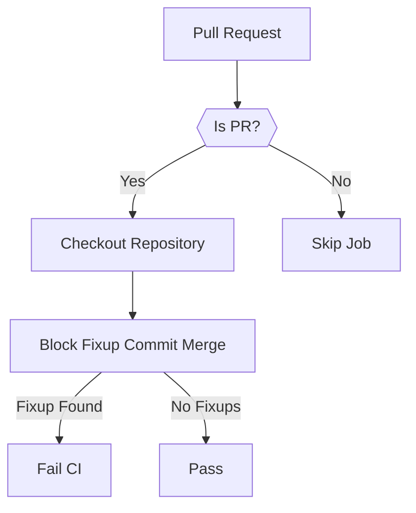
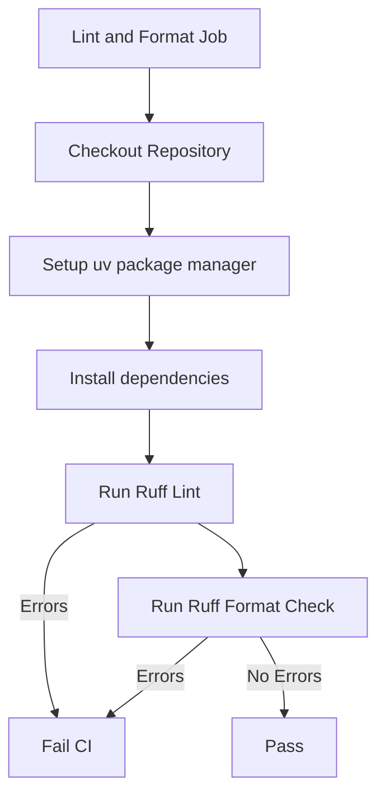
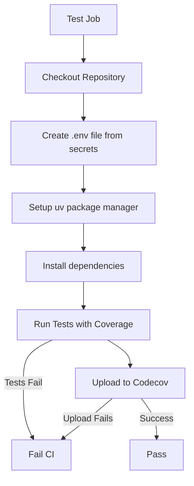
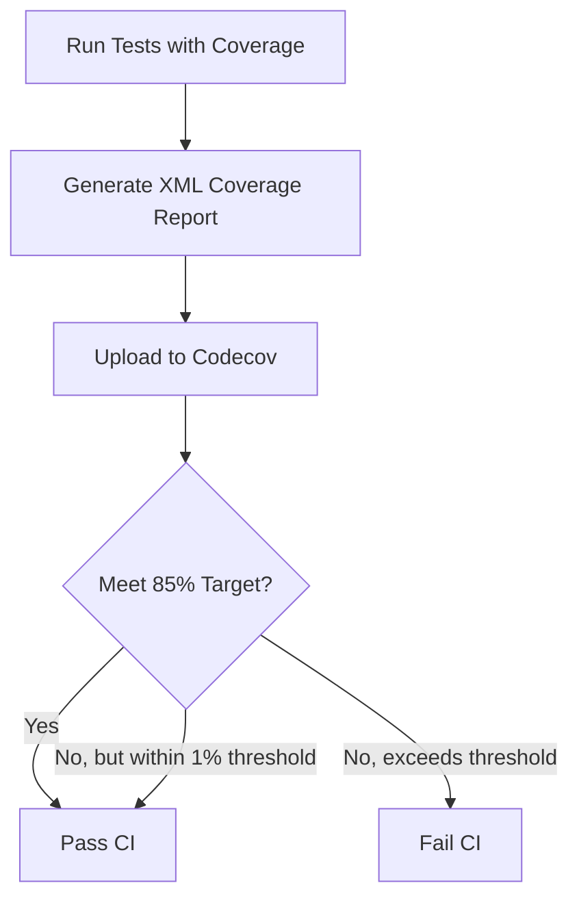
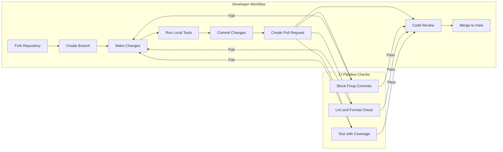
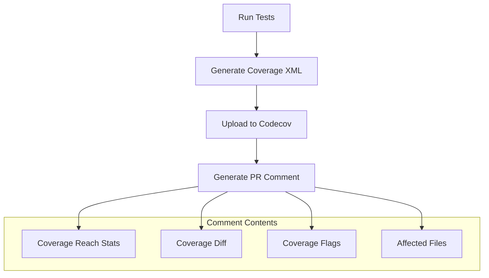

import SourceLink from '@components/SourceLink.astro';
import { Aside, Card, CardGrid, Tabs, TabItem, Steps, FileTree, Code, LinkButton, Badge } from '@astrojs/starlight/components';
import CollapsibleAside from '../../../components/CollapsibleAside.astro';

<CollapsibleAside title="Relevant Source Files">
  <SourceLink href="https://github.com/tplr-ai/templar/blob/bb2fc2a9/.github/workflows/ci.yml" text=".github/workflows/ci.yml" />
  <SourceLink href="https://github.com/tplr-ai/templar/blob/bb2fc2a9/codecov.yml" text="codecov.yml" />
</CollapsibleAside>

This document details the Continuous Integration and Continuous Deployment (CI/CD) pipeline implemented for the Templar project. It focuses on the automated workflows that run when code changes are pushed, ensuring code quality, test coverage, and consistent formatting. For information about the development environment setup, see [Development Environment](/guides/development-environment), and for testing strategies, see [Testing](/guides/testing).

## Pipeline Overview

The Templar project uses GitHub Actions as its primary CI/CD platform. The pipeline automates code quality checks, testing, and coverage reporting to maintain high standards of code quality while enabling rapid development.

Sources: <SourceLink href="https://github.com/tplr-ai/templar/blob/bb2fc2a9/.github/workflows/ci.yml#L3-L8" text=".github/workflows/ci.yml3-8" />

## Workflow Configuration

The CI/CD pipeline is configured in the GitHub Actions workflow file, which defines the jobs, their dependencies, and execution environments.

Sources: <SourceLink href="https://github.com/tplr-ai/templar/blob/bb2fc2a9/.github/workflows/ci.yml#L9-L122" text=".github/workflows/ci.yml9-122" />

## Jobs in the Pipeline

The pipeline consists of three main jobs, each serving a specific purpose in maintaining code quality.

### Block Fixup Job

This job prevents pull requests containing fixup commits from being merged, ensuring a clean git history.

Sources: <SourceLink href="https://github.com/tplr-ai/templar/blob/bb2fc2a9/.github/workflows/ci.yml#L10-L17" text=".github/workflows/ci.yml10-17" />

### Lint and Format Job

This job checks that code follows the project's styling and linting rules, running on both Python 3.11 and 3.12.

Sources: <SourceLink href="https://github.com/tplr-ai/templar/blob/bb2fc2a9/.github/workflows/ci.yml#L19-L44" text=".github/workflows/ci.yml19-44" />

### Test Job

This job runs the test suite with coverage reporting, ensuring that code changes don't break existing functionality and maintain adequate test coverage.

Sources: <SourceLink href="https://github.com/tplr-ai/templar/blob/bb2fc2a9/.github/workflows/ci.yml#L46-L122" text=".github/workflows/ci.yml46-122" />

## Environment Configuration

The test job requires specific environment variables to properly run tests that interact with storage services. These variables are securely stored as GitHub Secrets and injected into the workflow runtime.

### Secret Variables

The pipeline uses several R2 storage-related secrets for running tests that interact with Cloudflare R2 storage:

| Secret Category | Variables |
|----------------|-----------|
| Gradients Bucket | Account ID, Bucket Name, Read/Write Access Keys |
| Dataset Bucket | Account ID, Bucket Name, Read/Write Access Keys, Bucket List |
| Aggregator Bucket | Account ID, Bucket Name, Read Access Keys |

Sources: <SourceLink href="https://github.com/tplr-ai/templar/blob/bb2fc2a9/.github/workflows/ci.yml#L53-L70" text=".github/workflows/ci.yml53-70" />, <SourceLink href="https://github.com/tplr-ai/templar/blob/bb2fc2a9/.github/workflows/ci.yml#L78-L100" text=".github/workflows/ci.yml78-100" />

## Code Coverage Configuration

The project enforces code coverage requirements through Codecov integration, with specific targets defined in the configuration file.

Coverage requirements:
- Project target: 85% code coverage
- Patch target: 85% code coverage for changes
- Threshold: 1% tolerance for coverage changes

Sources: <SourceLink href="https://github.com/tplr-ai/templar/blob/bb2fc2a9/codecov.yml#L1-L10" text="codecov.yml1-10" />, <SourceLink href="https://github.com/tplr-ai/templar/blob/bb2fc2a9/.github/workflows/ci.yml#L112-L121" text=".github/workflows/ci.yml112-121" />

## Pipeline Integration with Development Workflow

The CI/CD pipeline is integrated into the development workflow to ensure code quality at different stages.

Sources: <SourceLink href="https://github.com/tplr-ai/templar/blob/bb2fc2a9/.github/workflows/ci.yml#L3-L8" text=".github/workflows/ci.yml3-8" />

## Package Management with UV

The CI pipeline uses the UV package manager for Python dependency management, which provides faster and more reliable dependency resolution than pip.

| Feature | Implementation |
|---------|---------------|
| Cache Support | Enabled for faster CI runs |
| Dependency Installation | `uv sync --all-extras --dev` |
| Python Versions | 3.11 and 3.12 matrix testing |

Sources: <SourceLink href="https://github.com/tplr-ai/templar/blob/bb2fc2a9/.github/workflows/ci.yml#L30-L35" text=".github/workflows/ci.yml30-35" />, <SourceLink href="https://github.com/tplr-ai/templar/blob/bb2fc2a9/.github/workflows/ci.yml#L102-L110" text=".github/workflows/ci.yml102-110" />

## Codecov Reporting Configuration

Codecov is configured to provide detailed feedback on code coverage through PR comments.

Sources: <SourceLink href="https://github.com/tplr-ai/templar/blob/bb2fc2a9/codecov.yml#L12-L15" text="codecov.yml12-15" />, <SourceLink href="https://github.com/tplr-ai/templar/blob/bb2fc2a9/.github/workflows/ci.yml#L116-L121" text=".github/workflows/ci.yml116-121" />

## Summary of CI/CD Components

The Templar CI/CD pipeline combines several key technologies to ensure code quality:

| Component | Tool | Purpose |
|-----------|------|---------|
| Workflow Engine | GitHub Actions | Orchestrates the CI/CD process |
| Package Management | UV | Fast, reliable dependency installation |
| Code Quality | Ruff | Linting and formatting |
| Testing | pytest | Running test suite |
| Coverage | pytest-cov | Generating coverage reports |
| Coverage Reporting | Codecov | Tracking and enforcing coverage targets |
| Commit Quality | block-fixup-merge-action | Ensuring clean git history |

Sources: <SourceLink href="https://github.com/tplr-ai/templar/blob/bb2fc2a9/.github/workflows/ci.yml#L1-L122" text=".github/workflows/ci.yml1-122" />, <SourceLink href="https://github.com/tplr-ai/templar/blob/bb2fc2a9/codecov.yml#L1-L15" text="codecov.yml1-15" />