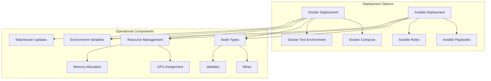
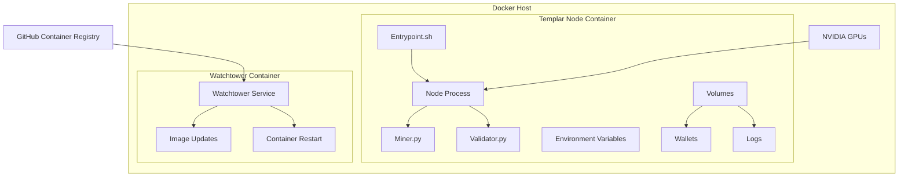
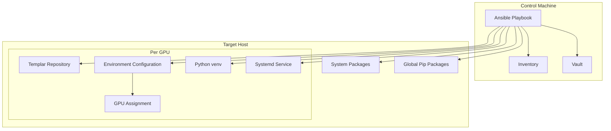
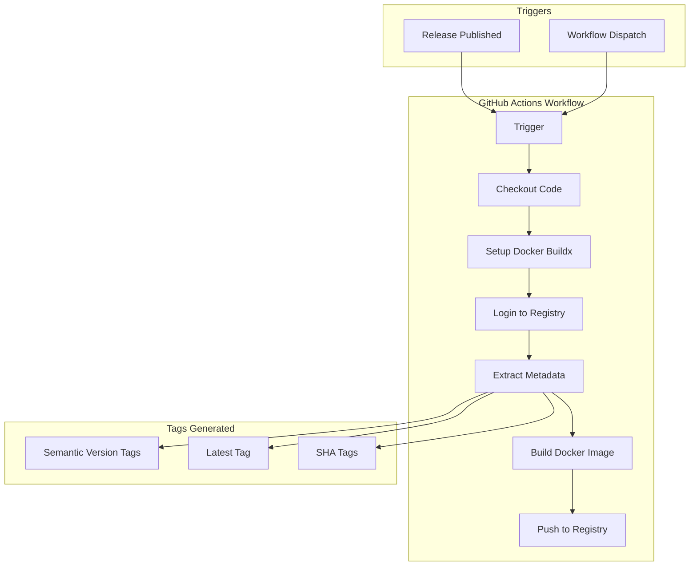

import SourceLink from '@components/SourceLink.astro';
import { Aside, Card, CardGrid, Tabs, TabItem, Steps, FileTree, Code, LinkButton, Badge } from '@astrojs/starlight/components';
import CollapsibleAside from '../../../components/CollapsibleAside.astro';

<CollapsibleAside title="Relevant Source Files">
  <SourceLink href="https://github.com/tplr-ai/templar/blob/bb2fc2a9/.github/workflows/docker.yml" text=".github/workflows/docker.yml" />
  <SourceLink href="https://github.com/tplr-ai/templar/blob/bb2fc2a9/ansible/README.md" text="ansible/README.md" />
  <SourceLink href="https://github.com/tplr-ai/templar/blob/bb2fc2a9/ansible/group_vars/all/vault.yml.example" text="ansible/group_vars/all/vault.yml.example" />
  <SourceLink href="https://github.com/tplr-ai/templar/blob/bb2fc2a9/ansible/playbook.yml" text="ansible/playbook.yml" />
  <SourceLink href="https://github.com/tplr-ai/templar/blob/bb2fc2a9/ansible/roles/templar/defaults/main.yml" text="ansible/roles/templar/defaults/main.yml" />
  <SourceLink href="https://github.com/tplr-ai/templar/blob/bb2fc2a9/ansible/roles/templar/templates/miner.service.j2" text="ansible/roles/templar/templates/miner.service.j2" />
  <SourceLink href="https://github.com/tplr-ai/templar/blob/bb2fc2a9/docker/Dockerfile" text="docker/Dockerfile" />
  <SourceLink href="https://github.com/tplr-ai/templar/blob/bb2fc2a9/docker/compose.yml" text="docker/compose.yml" />
  <SourceLink href="https://github.com/tplr-ai/templar/blob/bb2fc2a9/docker/docker-compose-test.yml" text="docker/docker-compose-test.yml" />
  <SourceLink href="https://github.com/tplr-ai/templar/blob/bb2fc2a9/scripts/entrypoint.sh" text="scripts/entrypoint.sh" />
</CollapsibleAside>


This page provides an overview of deployment options and considerations for the Templar decentralized training framework. It covers Docker-based and Ansible-based deployment approaches, environment configuration, and resource requirements for running miner and validator nodes.

For Docker-specific deployment details, see [Docker Deployment](/guides/docker-deployment). For Ansible-specific deployment instructions, see [Ansible Deployment](/guides/ansible-deployment).

## Deployment Options Overview

The Templar framework offers two primary deployment methods:

1. **Docker-based deployment** - Containerized approach with Docker and Docker Compose
2. **Ansible-based deployment** - Infrastructure-as-code approach for configuring hosts

The choice between these depends on your operational requirements, infrastructure management approach, and team preferences.



Sources: <SourceLink href="https://github.com/tplr-ai/templar/blob/bb2fc2a9/docker/compose.yml" text="docker/compose.yml" />, <SourceLink href="https://github.com/tplr-ai/templar/blob/bb2fc2a9/docker/Dockerfile" text="docker/Dockerfile" />, <SourceLink href="https://github.com/tplr-ai/templar/blob/bb2fc2a9/ansible/playbook.yml" text="ansible/playbook.yml" />, <SourceLink href="https://github.com/tplr-ai/templar/blob/bb2fc2a9/ansible/README.md" text="ansible/README.md" />

## Docker Deployment Architecture

Docker is the most streamlined deployment method for Templar, using NVIDIA GPU-enabled containers.



Sources: <SourceLink href="https://github.com/tplr-ai/templar/blob/bb2fc2a9/docker/compose.yml" text="docker/compose.yml" />, <SourceLink href="https://github.com/tplr-ai/templar/blob/bb2fc2a9/docker/Dockerfile" text="docker/Dockerfile" />, <SourceLink href="https://github.com/tplr-ai/templar/blob/bb2fc2a9/scripts/entrypoint.sh" text="scripts/entrypoint.sh" />

### Docker Image

The Templar Docker image is based on NVIDIA's CUDA runtime image, with Python and essential dependencies installed:

- Base image: `nvidia/cuda:12.6.0-runtime-ubuntu22.04`
- Python with dependencies installed via `uv`
- Entrypoint script for node startup

The official image is published to GitHub Container Registry as `ghcr.io/tplr-ai/templar`.

Sources: <SourceLink href="https://github.com/tplr-ai/templar/blob/bb2fc2a9/docker/Dockerfile" text="docker/Dockerfile" />, <SourceLink href="https://github.com/tplr-ai/templar/blob/bb2fc2a9/.github/workflows/docker.yml" text=".github/workflows/docker.yml" />

### Docker Compose Configuration

The `docker-compose.yml` file defines the services required for running Templar nodes:

1. **node service** - Configures the Templar node (miner or validator)
2. **watchtower service** - Provides automatic updates of container images

Key configuration aspects include:

- Volume mounts for wallet and log persistence
- Environment variable configuration
- GPU device assignment
- Automatic updates via Watchtower

For testing environments, a `docker-compose-test.yml` is provided that configures a multi-node setup with miners and validators.

Sources: <SourceLink href="https://github.com/tplr-ai/templar/blob/bb2fc2a9/docker/compose.yml" text="docker/compose.yml" />, <SourceLink href="https://github.com/tplr-ai/templar/blob/bb2fc2a9/docker/docker-compose-test.yml" text="docker/docker-compose-test.yml" />

### Environment Variables for Docker Deployment

Docker deployments require a number of environment variables to configure node behavior, access storage resources, and connect to the Bittensor network.

<div class="docker-env-table">

| Category | Variable Name | Description | Required |
|----------|--------------|-------------|----------|
| **Node Configuration** | NODE_TYPE | Either "miner" or "validator" | Yes |
| | WALLET_NAME | Bittensor wallet name | Yes |
| | WALLET_HOTKEY | Bittensor wallet hotkey | Yes |
| | CUDA_DEVICE | CUDA device to use (e.g., "cuda:0") | Yes |
| | NETWORK | Bittensor network (e.g., "finney", "test") | Yes |
| | NETUID | Bittensor subnet UID | Yes |
| | DEBUG | Enable debug mode (true/false) | No |
| **API Keys** | WANDB_API_KEY | Weights & Biases API key | Yes |
| **R2 Storage** | R2_GRADIENTS_ACCOUNT_ID | Cloudflare R2 account ID | Yes |
| | R2_GRADIENTS_BUCKET_NAME | Bucket name for gradients | Yes |
| | R2_GRADIENTS_READ_ACCESS_KEY_ID | Read access key ID | Yes |
| | R2_GRADIENTS_READ_SECRET_ACCESS_KEY | Read secret access key | Yes |
| | R2_GRADIENTS_WRITE_ACCESS_KEY_ID | Write access key ID | Yes |
| | R2_GRADIENTS_WRITE_SECRET_ACCESS_KEY | Write secret access key | Yes |
| | R2_DATASET_* | Similar set of variables for dataset bucket | Yes |
| | R2_AGGREGATOR_* | Similar set of variables for aggregator bucket | Yes |
| **GitHub Integration** | GITHUB_USER | GitHub username for Watchtower | No |
| | GITHUB_TOKEN | GitHub token for Watchtower | No |

</div>

Sources: <SourceLink href="https://github.com/tplr-ai/templar/blob/bb2fc2a9/docker/compose.yml" text="docker/compose.yml" />, <SourceLink href="https://github.com/tplr-ai/templar/blob/bb2fc2a9/scripts/entrypoint.sh" text="scripts/entrypoint.sh" />

## Ansible Deployment Approach

Ansible provides a more infrastructure-focused approach to deployment, suitable for managing multiple machines or complex deployments.



Sources: <SourceLink href="https://github.com/tplr-ai/templar/blob/bb2fc2a9/ansible/playbook.yml" text="ansible/playbook.yml" />, <SourceLink href="https://github.com/tplr-ai/templar/blob/bb2fc2a9/ansible/roles/templar/defaults/main.yml" text="ansible/roles/templar/defaults/main.yml" />, <SourceLink href="https://github.com/tplr-ai/templar/blob/bb2fc2a9/ansible/README.md" text="ansible/README.md" />

### Ansible Configuration

The Ansible deployment requires:

1. **Inventory file** - Defines target hosts and their GPU configurations
2. **Vault file** - Securely stores environment variables and secrets
3. **Playbook** - Orchestrates the deployment process

The Ansible setup supports multi-GPU deployments, creating separate instances for each GPU with dedicated directories and services.

Key files:
- `ansible/playbook.yml` - Main playbook
- `ansible/roles/templar/*` - Role definitions
- `group_vars/all/vault.yml` - Encrypted variables

Sources: <SourceLink href="https://github.com/tplr-ai/templar/blob/bb2fc2a9/ansible/playbook.yml" text="ansible/playbook.yml" />, <SourceLink href="https://github.com/tplr-ai/templar/blob/bb2fc2a9/ansible/roles/templar/defaults/main.yml" text="ansible/roles/templar/defaults/main.yml" />, <SourceLink href="https://github.com/tplr-ai/templar/blob/bb2fc2a9/ansible/README.md" text="ansible/README.md" />, <SourceLink href="https://github.com/tplr-ai/templar/blob/bb2fc2a9/ansible/group_vars/all/vault.yml.example" text="ansible/group_vars/all/vault.yml.example" />

### Systemd Service Configuration

For persistent operation, the Ansible deployment can configure systemd services to manage Templar processes:

```
[Unit]
Description=Templar Miner Service
After=network.target

[Service]
WorkingDirectory=/path/to/templar
EnvironmentFile=/path/to/templar/.env
ExecStart=/path/to/templar/.venv/bin/python neurons/miner.py [options]
Restart=always
RestartSec=5s
```

This ensures automatic restart on failure and proper startup sequence.

Sources: <SourceLink href="https://github.com/tplr-ai/templar/blob/bb2fc2a9/ansible/roles/templar/templates/miner.service.j2" text="ansible/roles/templar/templates/miner.service.j2" />

## Resource Requirements

Templar requires:

- CUDA-capable NVIDIA GPU(s)
- Sufficient RAM for model operations
- Storage for checkpoints and logs
- Network connectivity for Bittensor communication and R2 storage access

The docker-compose configuration allows assigning specific GPUs to containers using the device_ids property:

```yaml
deploy:
  resources:
    reservations:
      devices:
        - driver: nvidia
          device_ids: [ '0', '1', '2' ]
          capabilities: [ gpu ]
```

Sources: <SourceLink href="https://github.com/tplr-ai/templar/blob/bb2fc2a9/docker/compose.yml" text="docker/compose.yml" />, <SourceLink href="https://github.com/tplr-ai/templar/blob/bb2fc2a9/docker/docker-compose-test.yml" text="docker/docker-compose-test.yml" />

## CI/CD Pipeline

Templar includes a GitHub Actions workflow for building and publishing Docker images:



The workflow automatically builds images when releases are published and tags them appropriately based on semantic versioning.

Sources: <SourceLink href="https://github.com/tplr-ai/templar/blob/bb2fc2a9/.github/workflows/docker.yml" text=".github/workflows/docker.yml" />

## Startup Process

When a Templar container starts, the entrypoint script (`scripts/entrypoint.sh`) performs several initialization steps:

1. Validates required environment variables
2. Activates Python virtual environment
3. Checks CUDA availability
4. Logs in to Weights & Biases
5. Starts the appropriate node type (miner or validator)

The script constructs the correct command-line arguments based on environment variables.

Sources: <SourceLink href="https://github.com/tplr-ai/templar/blob/bb2fc2a9/scripts/entrypoint.sh" text="scripts/entrypoint.sh" />

## Troubleshooting

Common deployment issues include:

1. **CUDA availability** - Ensure NVIDIA drivers are installed and compatible with the container's CUDA version
2. **Environment variables** - Check that all required variables are set correctly
3. **GPU assignment** - Verify that GPUs are correctly assigned to containers
4. **Network connectivity** - Ensure access to Bittensor network and R2 storage

For Docker deployments, you can check logs with:
```
docker logs templar-{NODE_TYPE}-{WALLET_HOTKEY}
```

For Ansible deployments with systemd, check:
```
systemctl status templar-miner
journalctl -u templar-miner
```

Sources: <SourceLink href="https://github.com/tplr-ai/templar/blob/bb2fc2a9/scripts/entrypoint.sh" text="scripts/entrypoint.sh" />, <SourceLink href="https://github.com/tplr-ai/templar/blob/bb2fc2a9/docker/compose.yml" text="docker/compose.yml" />, <SourceLink href="https://github.com/tplr-ai/templar/blob/bb2fc2a9/ansible/roles/templar/templates/miner.service.j2" text="ansible/roles/templar/templates/miner.service.j2" />