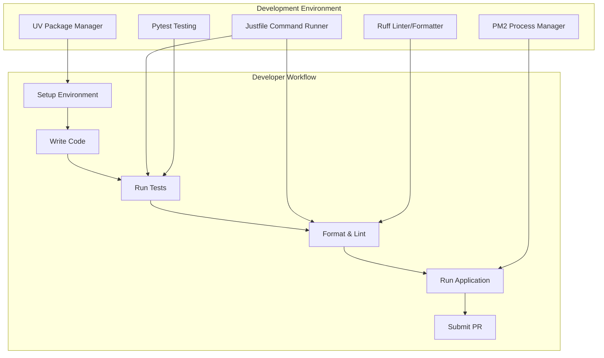
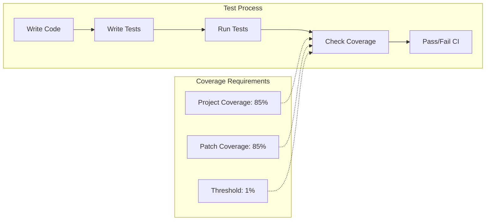
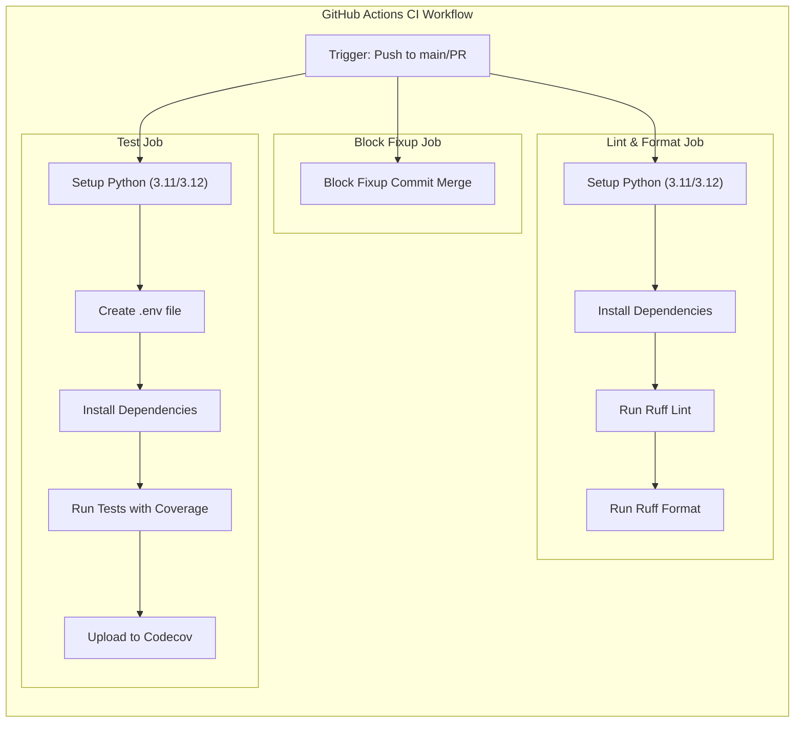

import SourceLink from '@components/SourceLink.astro';
import { Aside, Card, CardGrid, Tabs, TabItem, Steps, FileTree, Code, LinkButton, Badge } from '@astrojs/starlight/components';
import CollapsibleAside from '../../../components/CollapsibleAside.astro';

<CollapsibleAside title="Relevant Source Files">
  <SourceLink href="https://github.com/tplr-ai/templar/blob/bb2fc2a9/.github/workflows/ci.yml" text=".github/workflows/ci.yml" />
  <SourceLink href="https://github.com/tplr-ai/templar/blob/bb2fc2a9/.gitignore" text=".gitignore" />
  <SourceLink href="https://github.com/tplr-ai/templar/blob/bb2fc2a9/codecov.yml" text="codecov.yml" />
  <SourceLink href="https://github.com/tplr-ai/templar/blob/bb2fc2a9/justfile" text="justfile" />
  <SourceLink href="https://github.com/tplr-ai/templar/blob/bb2fc2a9/scripts/start.sh" text="scripts/start.sh" />
</CollapsibleAside>


This guide provides comprehensive instructions for developers contributing to the Templar project. It covers setting up your development environment, working with the codebase, testing procedures, and understanding the CI/CD pipeline. For deployment-specific information, see [Deployment](/guides/deployment).

## Development Environment Setup

Setting up your development environment requires installing the necessary dependencies and configuring your local system to work with the Templar codebase.

### Prerequisites

- Python 3.11 or 3.12
- Git
- PM2 (for process management)
- UV (Python package installer and environment manager)

### Installation

1. Clone the repository:
   ```bash
   git clone https://github.com/tplr-ai/templar.git
   cd templar
   ```

2. Install dependencies using UV:
   ```bash
   uv venv
   source .venv/bin/activate
   uv pip install --pre -e ".[dev]"
   ```

   Alternatively, use the provided convenience command in the justfile:
   ```bash
   just dev
   ```

3. Create a `.env` file with required environment variables (see the CI configuration for examples of required variables)

Sources: <SourceLink href="https://github.com/tplr-ai/templar/blob/bb2fc2a9/justfile#L23-L24" text="justfile23-24" />, <SourceLink href="https://github.com/tplr-ai/templar/blob/bb2fc2a9/.github/workflows/ci.yml#L77-L100" text=".github/workflows/ci.yml77-100" />

### Development Tools

Templar uses several development tools:

- **UV**: Modern Python package installer and environment manager
- **Ruff**: Fast Python linter and formatter
- **Pytest**: Testing framework
- **PM2**: Process manager for running multiple components
- **Just**: Command runner for common development tasks



Sources: <SourceLink href="https://github.com/tplr-ai/templar/blob/bb2fc2a9/.github/workflows/ci.yml#L30-L38" text=".github/workflows/ci.yml30-38" />, <SourceLink href="https://github.com/tplr-ai/templar/blob/bb2fc2a9/justfile#L5-L12" text="justfile5-12" />, <SourceLink href="https://github.com/tplr-ai/templar/blob/bb2fc2a9/scripts/start.sh#L1-L16" text="scripts/start.sh1-16" />

## Development Workflow

### Using Just Commands

The project includes a `justfile` that provides shortcuts for common development tasks:

| Command | Description |
|---------|-------------|
| `just lint` | Run ruff to check and format code |
| `just fix` | Alias for `just lint` |
| `just dev` | Install development dependencies |
| `just test` | Run tests |
| `just cov` | Run tests with coverage report |
| `just test-run` | Create a development version and start the application |
| `just bistro` | Check for running Bistro processes |

Sources: <SourceLink href="https://github.com/tplr-ai/templar/blob/bb2fc2a9/justfile#L1-L33" text="justfile1-33" />

### Code Formatting and Linting

The project uses Ruff for both code formatting and linting:

```bash
# Manually run linting
ruff check --fix .
ruff format .

# Or use the shortcut
just lint
```

The formatting rules are enforced in CI, so all code must pass these checks before being merged.

Sources: <SourceLink href="https://github.com/tplr-ai/templar/blob/bb2fc2a9/justfile#L5-L12" text="justfile5-12" />, <SourceLink href="https://github.com/tplr-ai/templar/blob/bb2fc2a9/.github/workflows/ci.yml#L40-L44" text=".github/workflows/ci.yml40-44" />

### Starting the Application

To start the application locally:

```bash
# Using PM2 process manager
./scripts/start.sh
```

This script will:
1. Stop any existing PM2 processes
2. Check for zombie processes
3. Start all applications defined in `ecosystem.config.js`
4. Show logs from the TM1 process

Sources: <SourceLink href="https://github.com/tplr-ai/templar/blob/bb2fc2a9/scripts/start.sh#L1-L16" text="scripts/start.sh1-16" />

## Testing

### Running Tests

Tests are written using pytest and can be run with:

```bash
# Run all tests
pytest tests/ -v

# Run with coverage report
pytest tests/ -v --cov=src --cov-report=xml --cov-report=term

# Or use the shortcuts
just test
just cov
```

Sources: <SourceLink href="https://github.com/tplr-ai/templar/blob/bb2fc2a9/justfile#L25-L32" text="justfile25-32" />, <SourceLink href="https://github.com/tplr-ai/templar/blob/bb2fc2a9/.github/workflows/ci.yml#L113-L114" text=".github/workflows/ci.yml113-114" />

### Test Coverage Requirements

The project maintains a minimum code coverage target of 85% with a threshold of 1%. This is enforced in the CI pipeline.



Sources: <SourceLink href="https://github.com/tplr-ai/templar/blob/bb2fc2a9/codecov.yml#L1-L11" text="codecov.yml1-11" />, <SourceLink href="https://github.com/tplr-ai/templar/blob/bb2fc2a9/.github/workflows/ci.yml#L112-L121" text=".github/workflows/ci.yml112-121" />

## CI/CD Pipeline

The project uses GitHub Actions for continuous integration and deployment. The CI pipeline runs on both push to main and pull requests.

### Workflow Steps



The CI workflow includes three main jobs:

1. **Block Fixup**: Prevents merging PRs that contain fixup commits
2. **Lint and Format**: Checks code style and formatting
3. **Test**: Runs the test suite with coverage reporting

Sources: <SourceLink href="https://github.com/tplr-ai/templar/blob/bb2fc2a9/.github/workflows/ci.yml#L1-L122" text=".github/workflows/ci.yml1-122" />

### Environment Setup in CI

The CI environment automatically sets up:

1. Python versions (3.11 and 3.12) using a matrix strategy
2. UV package manager
3. Environment variables for R2 storage services

Sources: <SourceLink href="https://github.com/tplr-ai/templar/blob/bb2fc2a9/.github/workflows/ci.yml#L47-L70" text=".github/workflows/ci.yml47-70" />, <SourceLink href="https://github.com/tplr-ai/templar/blob/bb2fc2a9/.github/workflows/ci.yml#L102-L110" text=".github/workflows/ci.yml102-110" />

### Code Coverage Reporting

Test coverage reports are uploaded to Codecov:

1. Coverage is generated as XML during test runs
2. The Codecov GitHub Action uploads the report
3. PRs must maintain coverage thresholds to pass checks

Sources: <SourceLink href="https://github.com/tplr-ai/templar/blob/bb2fc2a9/.github/workflows/ci.yml#L116-L121" text=".github/workflows/ci.yml116-121" />, <SourceLink href="https://github.com/tplr-ai/templar/blob/bb2fc2a9/codecov.yml#L1-L15" text="codecov.yml1-15" />

## Development Best Practices

### File Structure

Templar follows a standard Python package structure:

- `src/tplr/`: Core package code
- `tests/`: Test suite
- `scripts/`: Utility scripts
- `.github/workflows/`: CI configuration
- `justfile`: Development tasks

### Pull Request Process

1. Create a feature branch from `main`
2. Make your changes following the code style guidelines
3. Write tests to maintain coverage
4. Run linting and tests locally before pushing
5. Create a PR targeting `main`
6. Ensure all CI checks pass
7. Address review feedback
8. Merge when approved

### Version Management

The project automatically assigns development versions during test runs:

```bash
sed -i "s/__version__ = .*/__version__ = \"dev-$(cat /dev/urandom \
    | tr -dc 'a-z0-9' \
    | fold -w 8 \
    | head -n 1)\"/" \
    src/tplr/__init__.py
```

Sources: <SourceLink href="https://github.com/tplr-ai/templar/blob/bb2fc2a9/justfile#L13-L20" text="justfile13-20" />

### Gitignore Rules

The project's `.gitignore` is set up to exclude:
- Environment files (`.env`, `.env.yaml`)
- Python artifacts (`__pycache__`, `.egg-info`, etc.)
- Virtual environments (`.uv/`, `.venv/`, etc.)
- IDE files (`.idea/`, `.vscode/`, etc.)
- Project-specific files (`wandb`, models, etc.)

Sources: <SourceLink href="https://github.com/tplr-ai/templar/blob/bb2fc2a9/.gitignore#L1-L84" text=".gitignore1-84" />

## Next Steps

For information on how to deploy the system, refer to the [Deployment](/guides/deployment) guide.

For subsystem-specific details, check the following:
- [Miners](/reference/miners) for miner development
- [Validators](/reference/validators) for validator development
- [System Architecture](/reference/system-architecture) for understanding the overall system design