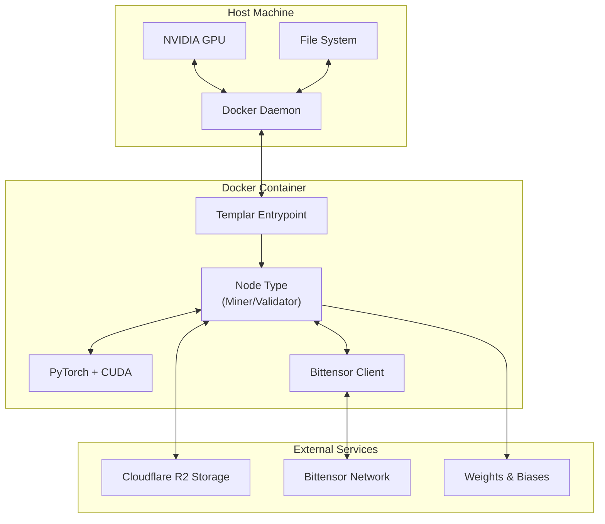
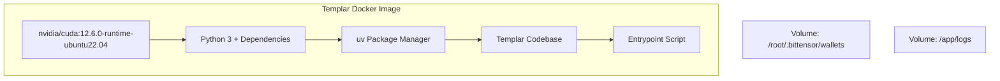
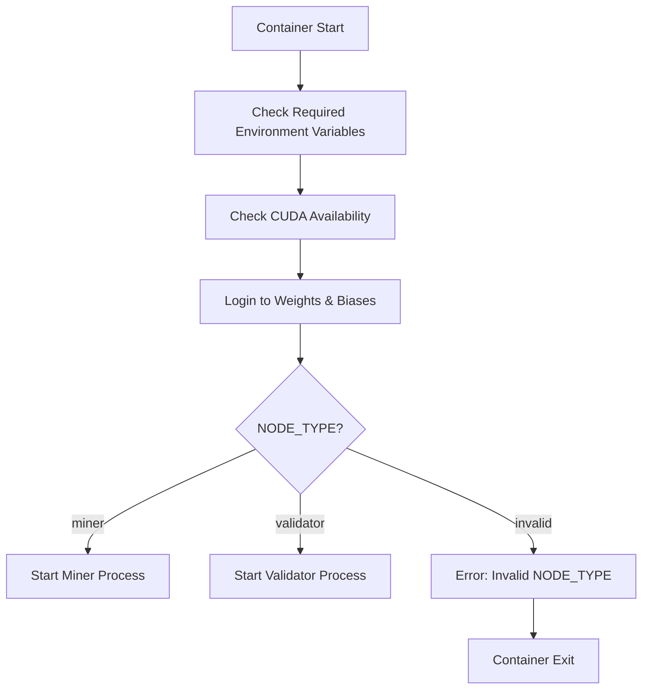
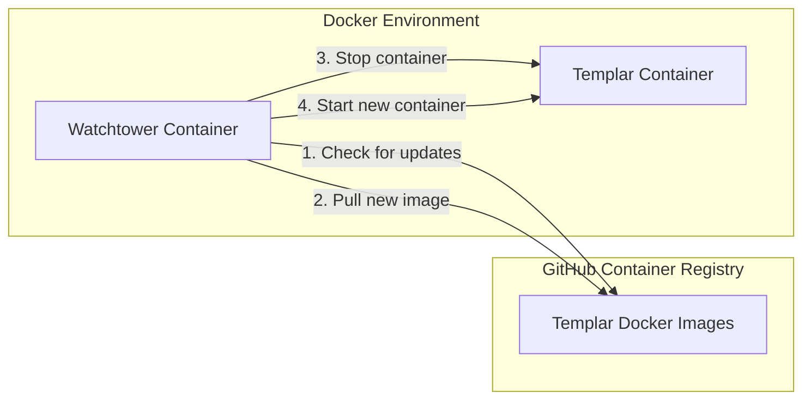
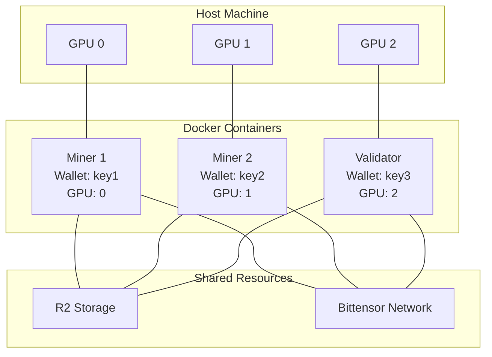

import SourceLink from '@components/SourceLink.astro';
import { Aside, Card, CardGrid, Tabs, TabItem, Steps, FileTree, Code, LinkButton, Badge } from '@astrojs/starlight/components';
import CollapsibleAside from '../../../components/CollapsibleAside.astro';

<CollapsibleAside title="Relevant Source Files">
  <SourceLink href="https://github.com/tplr-ai/templar/blob/bb2fc2a9/.github/workflows/docker.yml" text=".github/workflows/docker.yml" />
  <SourceLink href="https://github.com/tplr-ai/templar/blob/bb2fc2a9/docker/Dockerfile" text="docker/Dockerfile" />
  <SourceLink href="https://github.com/tplr-ai/templar/blob/bb2fc2a9/docker/compose.yml" text="docker/compose.yml" />
  <SourceLink href="https://github.com/tplr-ai/templar/blob/bb2fc2a9/docker/docker-compose-test.yml" text="docker/docker-compose-test.yml" />
  <SourceLink href="https://github.com/tplr-ai/templar/blob/bb2fc2a9/scripts/entrypoint.sh" text="scripts/entrypoint.sh" />
</CollapsibleAside>


This document details how to deploy Templar nodes (miners and validators) using Docker containers. Docker provides a consistent, isolated runtime environment for Templar, simplifying deployment across different machines while ensuring all dependencies are properly configured.

For information about deploying with Ansible, see [Ansible Deployment](/guides/ansible-deployment). For setting up a local Subtensor chain for development, see [Local Chain Setup](/guides/local-chain-setup).

## Prerequisites

Before deploying Templar using Docker, ensure you have:

1. Docker and Docker Compose installed on your system
2. NVIDIA drivers installed (for GPU support)
3. NVIDIA Container Toolkit installed and configured
4. A Bittensor wallet created and funded
5. Cloudflare R2 storage credentials configured
6. Weights & Biases API key (for logging and monitoring)

## Docker Architecture Overview

Templar's Docker deployment architecture consists of several components working together:



Sources: <SourceLink href="https://github.com/tplr-ai/templar/blob/bb2fc2a9/docker/Dockerfile" text="docker/Dockerfile" />, <SourceLink href="https://github.com/tplr-ai/templar/blob/bb2fc2a9/scripts/entrypoint.sh" text="scripts/entrypoint.sh" />

## Docker Image

Templar uses a custom Docker image based on NVIDIA's CUDA runtime environment:



The Docker image is automatically built and published to GitHub Container Registry via GitHub Actions when releases are made or manually triggered.

Sources: <SourceLink href="https://github.com/tplr-ai/templar/blob/bb2fc2a9/docker/Dockerfile" text="docker/Dockerfile" />, <SourceLink href="https://github.com/tplr-ai/templar/blob/bb2fc2a9/.github/workflows/docker.yml" text=".github/workflows/docker.yml" />

## Deployment Options

### Standard Deployment with Docker Compose

The standard deployment uses `compose.yml` to run a single Templar node (miner or validator) with the following components:

1. The Templar node container
2. Watchtower for automatic updates

```bash
# Clone the repository and navigate to the docker directory
git clone https://github.com/tplr-ai/templar.git
cd templar/docker

# Create an .env file with your configuration
# Start the container
docker-compose up -d
```

### Test Environment Deployment

For testing or development, the `docker-compose-test.yml` file provides a multi-node setup with:

- Two miners (on different GPUs)
- One validator (on a separate GPU)
- A shared Docker network

```bash
# Navigate to the docker directory
cd templar/docker

# Start the test environment
docker-compose -f docker-compose-test.yml up -d
```

Sources: <SourceLink href="https://github.com/tplr-ai/templar/blob/bb2fc2a9/docker/compose.yml" text="docker/compose.yml" />, <SourceLink href="https://github.com/tplr-ai/templar/blob/bb2fc2a9/docker/docker-compose-test.yml" text="docker/docker-compose-test.yml" />

## Configuration

### Environment Variables

The Templar Docker containers are configured via environment variables, which can be set in a `.env` file or passed directly to Docker Compose.

| Variable | Description | Default Value | Required |
|----------|-------------|---------------|----------|
| `NODE_TYPE` | Node type (miner or validator) | miner | Yes |
| `WALLET_NAME` | Bittensor wallet name | | Yes |
| `WALLET_HOTKEY` | Bittensor wallet hotkey | | Yes |
| `CUDA_DEVICE` | CUDA device to use | cuda:0 | Yes |
| `NETWORK` | Bittensor network | finney | Yes |
| `DEBUG` | Enable debug mode | false | No |
| `NETUID` | Network UID | 268 | Yes |
| `WANDB_API_KEY` | Weights & Biases API key | | Yes |
| `R2_*` | Cloudflare R2 configuration variables | | Yes |
| `GITHUB_USER` | GitHub username for Watchtower | | For auto-updates |
| `GITHUB_TOKEN` | GitHub token for Watchtower | | For auto-updates |

### GPU Configuration

NVIDIA GPU access is configured in the Docker Compose file:

```yaml
deploy:
  resources:
    reservations:
      devices:
        - driver: nvidia
          device_ids: [ '0', '1', '2' ]
          capabilities: [ gpu ]
```

This configuration allows the container to access GPUs 0, 1, and 2. Modify the `device_ids` array to select specific GPUs.

Sources: <SourceLink href="https://github.com/tplr-ai/templar/blob/bb2fc2a9/docker/compose.yml#L36-L42" text="docker/compose.yml36-42" />, <SourceLink href="https://github.com/tplr-ai/templar/blob/bb2fc2a9/docker/docker-compose-test.yml#L31-L37" text="docker/docker-compose-test.yml31-37" />

## Container Lifecycle

### Container Startup Process

The container startup process is managed by the entrypoint script:



The entrypoint script validates the environment, checks dependencies, and starts the appropriate node type.

Sources: <SourceLink href="https://github.com/tplr-ai/templar/blob/bb2fc2a9/scripts/entrypoint.sh" text="scripts/entrypoint.sh" />

### Persistence and Volumes

Two Docker volumes are used for persistence:

1. `/root/.bittensor/wallets` - Stores Bittensor wallet information
2. `/app/logs` - Stores application logs

These volumes persist data even when the container is restarted or updated.

### Automatic Updates with Watchtower

The standard Docker Compose configuration includes a Watchtower container that automatically checks for updated Templar Docker images and deploys them:



Watchtower checks for updates every 30 minutes and automatically updates containers with the `com.centurylinklabs.watchtower.enable=true` label.

Sources: <SourceLink href="https://github.com/tplr-ai/templar/blob/bb2fc2a9/docker/compose.yml#L46-L57" text="docker/compose.yml46-57" />

## Troubleshooting

### Common Issues

1. **CUDA not available** - Ensure NVIDIA drivers and NVIDIA Container Toolkit are properly installed.
2. **Missing environment variables** - Check your `.env` file or Docker Compose environment configuration.
3. **Wallet access issues** - Verify your wallet volume is correctly mounted and permissions are set.
4. **R2 connectivity problems** - Verify your R2 credentials and check the container logs for connection errors.

### Viewing Logs

```bash
# View logs for Templar node
docker logs templar-miner-YOUR_HOTKEY

# Follow logs in real-time
docker logs -f templar-miner-YOUR_HOTKEY
```

## Multi-Node Setup

For running multiple nodes on the same machine:

1. Create a copy of the `compose.yml` file for each node
2. Give each container a unique name
3. Assign different GPUs to each container
4. Use different wallet hotkeys for each node



The test Docker Compose file demonstrates this configuration pattern.

Sources: <SourceLink href="https://github.com/tplr-ai/templar/blob/bb2fc2a9/docker/docker-compose-test.yml" text="docker/docker-compose-test.yml" />