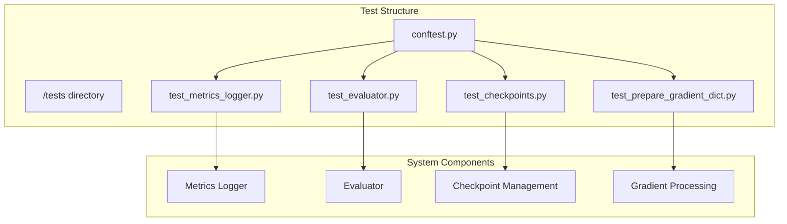
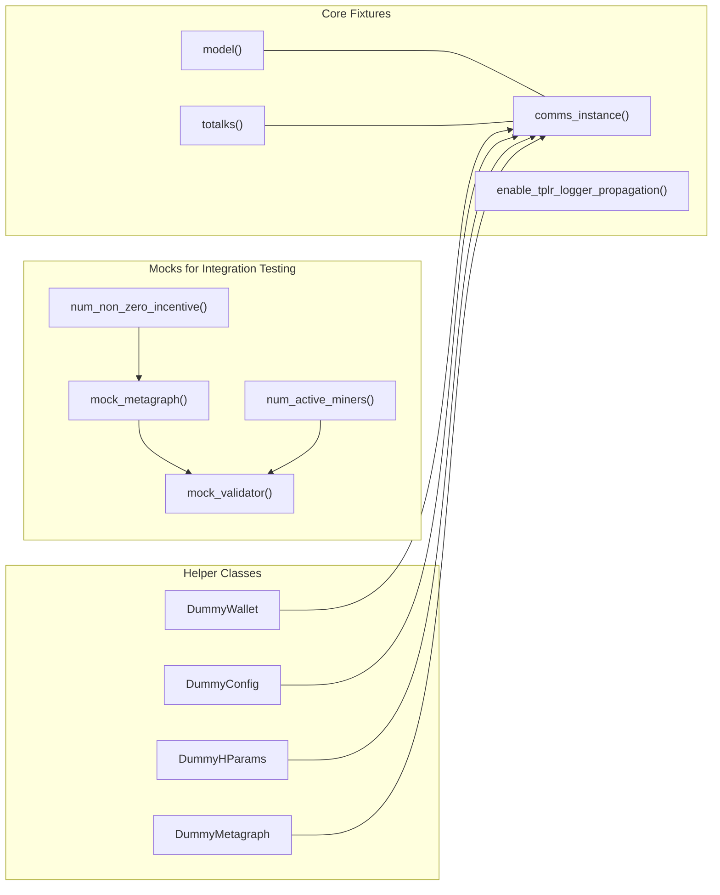
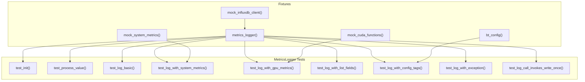
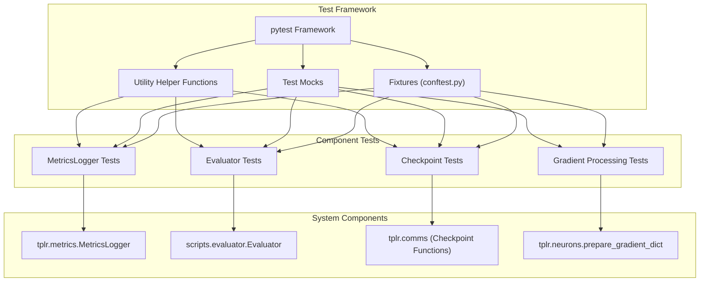

import SourceLink from '@components/SourceLink.astro';
import { Aside, Card, CardGrid, Tabs, TabItem, Steps, FileTree, Code, LinkButton, Badge } from '@astrojs/starlight/components';
import CollapsibleAside from '../../../components/CollapsibleAside.astro';

<CollapsibleAside title="Relevant Source Files">
  <SourceLink href="https://github.com/tplr-ai/templar/blob/bb2fc2a9/tests/conftest.py" text="tests/conftest.py" />
  <SourceLink href="https://github.com/tplr-ai/templar/blob/bb2fc2a9/tests/test_checkpoints.py" text="tests/test\_checkpoints.py" />
  <SourceLink href="https://github.com/tplr-ai/templar/blob/bb2fc2a9/tests/test_evaluator.py" text="tests/test\_evaluator.py" />
  <SourceLink href="https://github.com/tplr-ai/templar/blob/bb2fc2a9/tests/test_metrics_logger.py" text="tests/test\_metrics\_logger.py" />
  <SourceLink href="https://github.com/tplr-ai/templar/blob/bb2fc2a9/tests/test_prepare_gradient_dict.py" text="tests/test\_prepare\_gradient\_dict.py" />
</CollapsibleAside>


This page documents the testing infrastructure and practices for the Templar codebase. It covers the test organization, key test fixtures, testing of core components, and guidelines for running tests and creating new tests. For information about the CI/CD pipeline, see [CI/CD Pipeline](/guides/cicd-pipeline).

## Test Organization

The Templar project uses pytest as its primary testing framework. Tests are organized in the `tests/` directory, with individual test files corresponding to specific components of the system.



Sources: <SourceLink href="https://github.com/tplr-ai/templar/blob/bb2fc2a9/tests/conftest.py" text="tests/conftest.py" />, <SourceLink href="https://github.com/tplr-ai/templar/blob/bb2fc2a9/tests/test_metrics_logger.py" text="tests/test_metrics_logger.py" />, <SourceLink href="https://github.com/tplr-ai/templar/blob/bb2fc2a9/tests/test_evaluator.py" text="tests/test_evaluator.py" />, <SourceLink href="https://github.com/tplr-ai/templar/blob/bb2fc2a9/tests/test_checkpoints.py" text="tests/test_checkpoints.py" />, <SourceLink href="https://github.com/tplr-ai/templar/blob/bb2fc2a9/tests/test_prepare_gradient_dict.py" text="tests/test_prepare_gradient_dict.py" />

## Test Fixtures

Test fixtures provide a consistent environment for tests to run in. The `conftest.py` file defines fixtures that are available across all test files, including mock models, metadata, communications interfaces, and system configurations.



Sources: <SourceLink href="https://github.com/tplr-ai/templar/blob/bb2fc2a9/tests/conftest.py#L60-L197" text="tests/conftest.py60-197" />

## Testing Core Components

### Metrics Logging

The tests for the metrics logging system verify that metrics can be properly collected, formatted, and sent to the metrics storage backend (InfluxDB). The tests use mocking to isolate the metrics logger from the actual InfluxDB service.



Sources: <SourceLink href="https://github.com/tplr-ai/templar/blob/bb2fc2a9/tests/test_metrics_logger.py#L58-L341" text="tests/test_metrics_logger.py58-341" />

### Evaluator Testing

The evaluator tests verify that the evaluator component can properly detect, load, and evaluate new model checkpoints, handling versioning and tracking state correctly.

| Test Case | Purpose |
|-----------|---------|
| `test_evaluator_skips_old_checkpoints` | Verifies the evaluator doesn't reload already evaluated checkpoints |
| `test_evaluator_loads_new_checkpoints` | Confirms the evaluator correctly loads and processes new checkpoints |

Sources: <SourceLink href="https://github.com/tplr-ai/templar/blob/bb2fc2a9/tests/test_evaluator.py#L21-L143" text="tests/test_evaluator.py21-143" />

### Checkpoint Management Testing

The checkpoint tests verify the creation, storage, and loading of model checkpoints, which are critical for distributed training continuity and recovery.

```mermaid
flowchart TD
    subgraph "Checkpoint Tests"
        TCDS["test_checkpoint_data_structure()"]
        TMK["test_missing_key_in_checkpoint()"]
        TCF["test_corrupted_checkpoint_file()"]
        TCL["test_catch_up_logic()"]
        TNC["test_no_catch_up_when_aligned()"]
        TMC["test_miner_checkpoint_cycle()"]
        TSO["test_scheduler_optimizer_sync_after_catch_up()"]
        TAG["test_async_gather_failures()"]
        TCSF["test_checkpoint_save_trigger_frequency()"]
        TLFC["test_local_file_creation_after_checkpoint_save()"]
        TCPUV["test_cpu_device_verification_for_checkpoint_saved_tensors()"]
        TCSLC["test_checkpoint_save_and_load_cycle()"]
    end

    subgraph "Test Components"
        DC["DummyComponents"]
        CCD["create_checkpoint_data()"]
        DCOM["DummyComms"]
    end

    DC --> TCDS
    DC --> TMK
    DC --> TCL
    DC --> TNC
    DC --> TMC
    DC --> TSO
    DC --> TAG
    DC --> TCSF
    DC --> TLFC
    DC --> TCPUV
    DC --> TCSLC
    
    CCD --> TCDS
    CCD --> TMK
    CCD --> TCL
    CCD --> TNC
    
    DCOM --> TMK
    DCOM --> TCF
    DCOM --> TCL
    DCOM --> TNC
    DCOM --> TMC
    DCOM --> TSO
    DCOM --> TAG
    DCOM --> TCSF
    DCOM --> TLFC
    DCOM --> TCPUV
    DCOM --> TCSLC
```



Sources: <SourceLink href="https://github.com/tplr-ai/templar/blob/bb2fc2a9/tests/test_checkpoints.py#L236-L774" text="tests/test_checkpoints.py236-774" />

### Gradient Processing Testing

Tests for the `prepare_gradient_dict` function verify proper gradient processing, compression, momentum calculation, and metadata attachment.

| Test Case | Purpose |
|-----------|---------|
| `test_return_structure_and_types` | Verifies the function returns the expected structure |
| `test_metadata_attachment` | Confirms metadata is properly attached to gradients |
| `test_weight_decay_application` | Tests weight decay is correctly applied |
| `test_momentum_decay_and_gradient_accumulation` | Verifies momentum calculation |
| `test_compressor_and_transformer_calls` | Tests compression and transformation operations |
| `test_handling_multiple_parameters` | Verifies handling of multiple model parameters |
| `test_behavior_when_p_grad_is_none` | Tests error handling for missing gradients |
| `test_logging_behavior` | Verifies proper logging |
| `test_correct_use_of_scheduler_learning_rate` | Tests learning rate is properly used |
| `test_propagation_of_compressor_failure` | Tests exception handling from compressor |
| `test_propagation_of_transformer_failure` | Tests exception handling from transformer |

Sources: <SourceLink href="https://github.com/tplr-ai/templar/blob/bb2fc2a9/tests/test_prepare_gradient_dict.py#L80-L516" text="tests/test_prepare_gradient_dict.py80-516" />

## Test Fixtures and Mock Objects

Templar tests use a variety of fixtures and mock objects to create isolated test environments. These include:

### Core Fixtures

1. **Model Fixture**
   ```python
   @pytest.fixture
   def model():
       # Create a simple dummy model for testing.
       return torch.nn.Sequential(torch.nn.Linear(10, 10))
   ```

2. **Communications Fixture**
   ```python
   @pytest.fixture
   async def comms_instance():
       # Initialize communications with mock dependencies
       comms = comms_module.Comms(...)
       # Add transformer and compressor
       return comms
   ```

3. **Metagraph and Validator Fixtures**
   ```python
   @pytest.fixture
   def mock_metagraph(mocker, num_non_zero_incentive, num_miners=250):
       # Create a mock metagraph with specified miners and incentive distribution
       metagraph = mocker.Mock()
       # Configure properties
       return metagraph
   
   @pytest.fixture
   def mock_validator(mocker, mock_metagraph, num_active_miners):
       # Initialize mock validator
       validator = object.__new__(Validator)
       # Set up necessary attributes
       return validator
   ```

Sources: <SourceLink href="https://github.com/tplr-ai/templar/blob/bb2fc2a9/tests/conftest.py#L60-L198" text="tests/conftest.py60-198" />

## Running Tests

Tests can be run using pytest. The Templar project has both synchronous and asynchronous tests, with the latter being marked with the `@pytest.mark.asyncio` decorator.

### Basic Test Execution

```bash
# Run all tests
pytest

# Run tests in a specific file
pytest tests/test_metrics_logger.py

# Run a specific test function
pytest tests/test_metrics_logger.py::TestMetricsLogger::test_init
```

### Handling Asynchronous Tests

Asynchronous tests are configured via the `pytest_configure` function in `conftest.py`:

```python
def pytest_configure(config):
    config.addinivalue_line("markers", "asyncio: mark test as requiring async")
```

When writing asynchronous tests, use the `@pytest.mark.asyncio` decorator and `async def` function definition:

```python
@pytest.mark.asyncio
async def test_async_function():
    # Test code here
    pass
```

Sources: <SourceLink href="https://github.com/tplr-ai/templar/blob/bb2fc2a9/tests/conftest.py#L1-L6" text="tests/conftest.py1-6" />, <SourceLink href="https://github.com/tplr-ai/templar/blob/bb2fc2a9/tests/test_evaluator.py#L59-L143" text="tests/test_evaluator.py59-143" />, <SourceLink href="https://github.com/tplr-ai/templar/blob/bb2fc2a9/tests/test_checkpoints.py#L279-L593" text="tests/test_checkpoints.py279-593" />

## Testing Patterns

### Fixture-Based Testing

Templar tests use pytest fixtures extensively to set up test dependencies:

```python
@pytest.fixture
def metrics_logger(self, mock_influxdb_client):
    # Create a MetricsLogger instance for testing
    logger = MetricsLogger(...)
    return logger
```

### Mock Implementation Patterns

Mocks are used to isolate components under test:

```python
@pytest.fixture
def mock_influxdb_client(self):
    # Patch InfluxDBClient, configure mocks, and return the mock class
    with patch("tplr.metrics.InfluxDBClient", autospec=True) as mock_client_class:
        # Configure mock
        yield mock_client_class
```

### Waiting For Asynchronous Operations

For asynchronous operations, the codebase includes helper functions like `wait_for_mock_call`:

```python
def wait_for_mock_call(mock_object: Mock, timeout: float = 3.0):
    """Waits for a mock object to be called at least once."""
    start_time = time.monotonic()
    while time.monotonic() < start_time + timeout:
        if mock_object.call_count > 0:
            return True
        time.sleep(0.05)
    return False
```

Sources: <SourceLink href="https://github.com/tplr-ai/templar/blob/bb2fc2a9/tests/test_metrics_logger.py#L40-L55" text="tests/test_metrics_logger.py40-55" />, <SourceLink href="https://github.com/tplr-ai/templar/blob/bb2fc2a9/tests/test_metrics_logger.py#L84-L114" text="tests/test_metrics_logger.py84-114" />, <SourceLink href="https://github.com/tplr-ai/templar/blob/bb2fc2a9/tests/test_metrics_logger.py#L60-L82" text="tests/test_metrics_logger.py60-82" />

## Adding New Tests

When adding new tests to the Templar project, follow these guidelines:

1. **Test Organization**: Place tests in the appropriate file based on the component being tested
2. **Fixtures**: Use existing fixtures from `conftest.py` when possible, or add new ones if needed
3. **Mocking**: Use mocks to isolate the component under test from external dependencies
4. **Async Testing**: Use the `@pytest.mark.asyncio` decorator for asynchronous tests
5. **Test Coverage**: Aim to test both normal operation and error conditions

## Test Architecture and Component Relationship

The test architecture mirrors the Templar system architecture, with tests for each major component and their interactions.



Sources: <SourceLink href="https://github.com/tplr-ai/templar/blob/bb2fc2a9/tests/conftest.py" text="tests/conftest.py" />, <SourceLink href="https://github.com/tplr-ai/templar/blob/bb2fc2a9/tests/test_metrics_logger.py" text="tests/test_metrics_logger.py" />, <SourceLink href="https://github.com/tplr-ai/templar/blob/bb2fc2a9/tests/test_evaluator.py" text="tests/test_evaluator.py" />, <SourceLink href="https://github.com/tplr-ai/templar/blob/bb2fc2a9/tests/test_checkpoints.py" text="tests/test_checkpoints.py" />, <SourceLink href="https://github.com/tplr-ai/templar/blob/bb2fc2a9/tests/test_prepare_gradient_dict.py" text="tests/test_prepare_gradient_dict.py" />