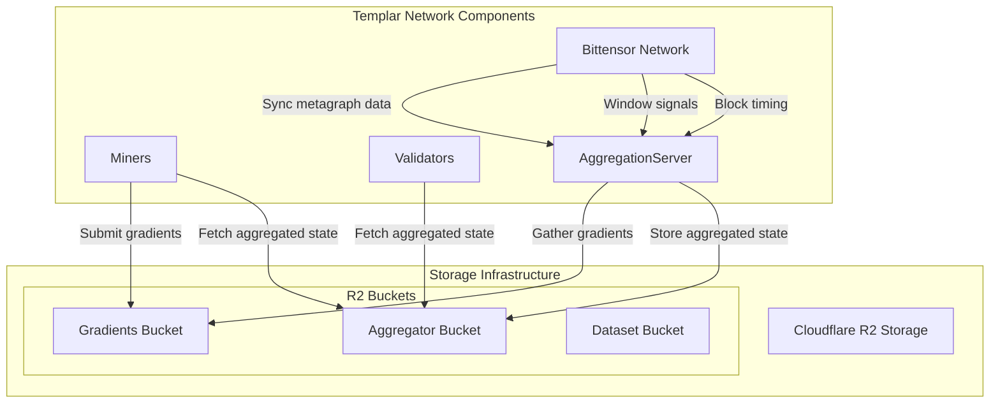
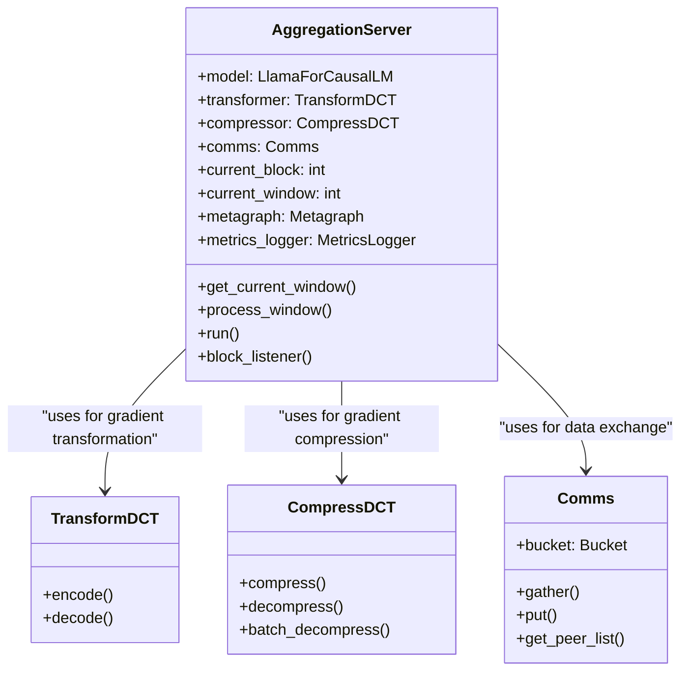
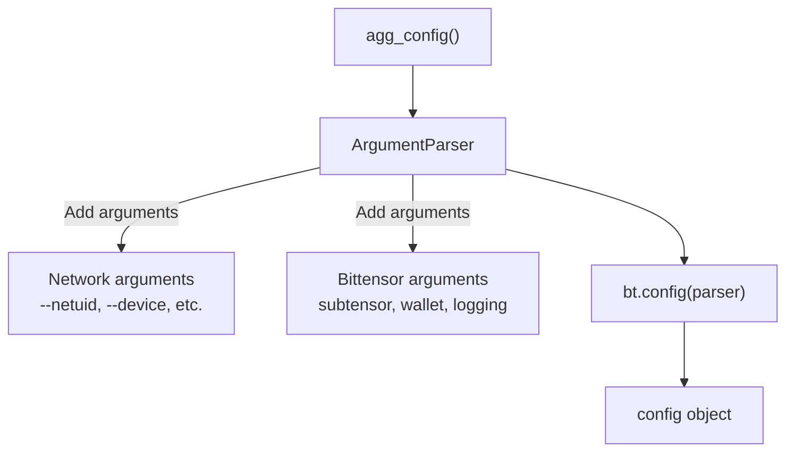
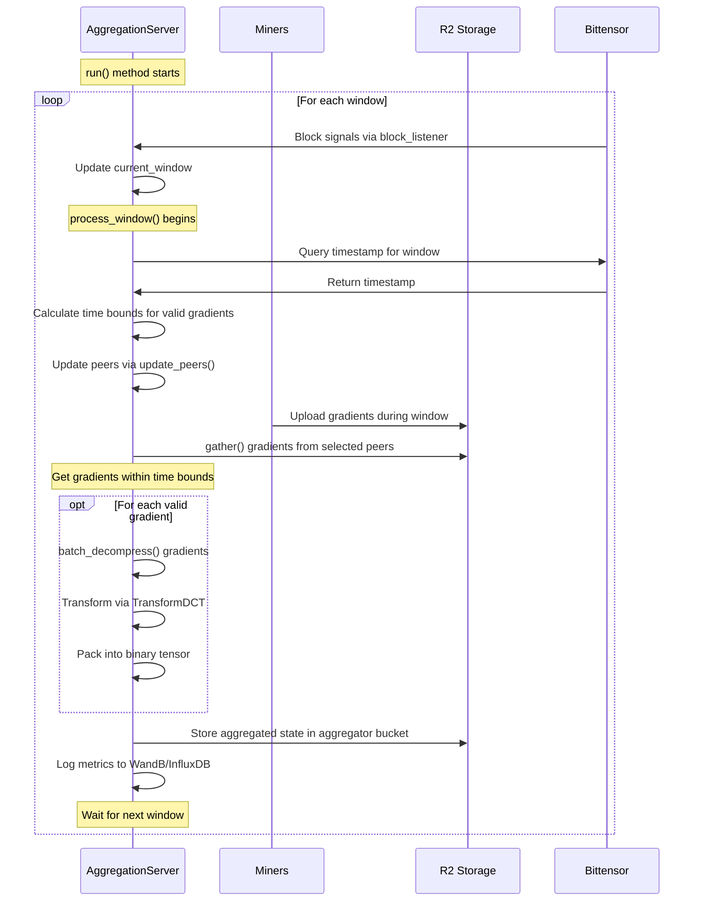
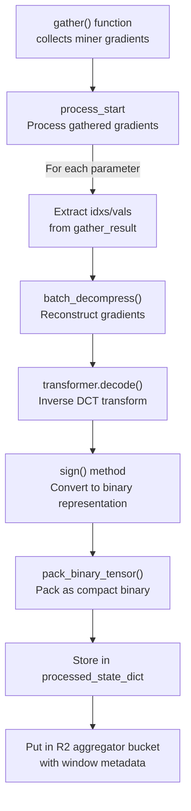
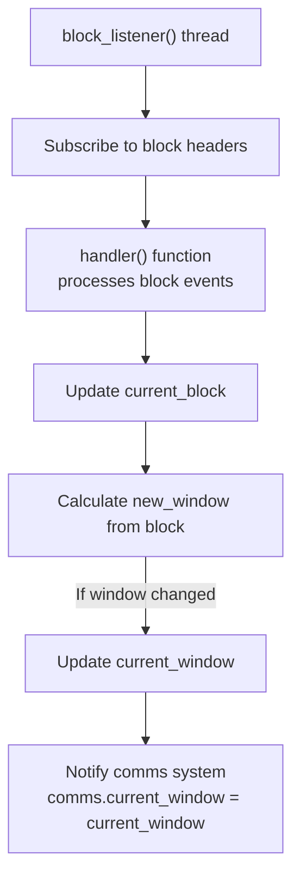

import SourceLink from '@components/SourceLink.astro';
import { Aside, Card, CardGrid, Tabs, TabItem, Steps, FileTree, Code, LinkButton, Badge } from '@astrojs/starlight/components';
import CollapsibleAside from '../../../components/CollapsibleAside.astro';

<CollapsibleAside title="Relevant Source Files">
  <SourceLink href="https://github.com/tplr-ai/templar/blob/bb2fc2a9/README.md" text="`README.md`" />
  <SourceLink href="https://github.com/tplr-ai/templar/blob/bb2fc2a9/docs/miner.md" text="`docs/miner.md`" />
  <SourceLink href="https://github.com/tplr-ai/templar/blob/bb2fc2a9/docs/validator.md" text="`docs/validator.md`" />
  <SourceLink href="https://github.com/tplr-ai/templar/blob/bb2fc2a9/neurons/aggregator.py" text="`neurons/aggregator.py`" />
  <SourceLink href="https://github.com/tplr-ai/templar/blob/bb2fc2a9/src/tplr/chain.py" text="`src/tplr/chain.py`" />
  <SourceLink href="https://github.com/tplr-ai/templar/blob/bb2fc2a9/src/tplr/compress.py" text="`src/tplr/compress.py`" />
  <SourceLink href="https://github.com/tplr-ai/templar/blob/bb2fc2a9/src/tplr/neurons.py" text="`src/tplr/neurons.py`" />
  <SourceLink href="https://github.com/tplr-ai/templar/blob/bb2fc2a9/telemetry/simulator/loki-test.py" text="`telemetry/simulator/loki-test.py`" />
  <SourceLink href="https://github.com/tplr-ai/templar/blob/bb2fc2a9/tests/test_model_comparison.py" text="`tests/test_model_comparison.py`" />
</CollapsibleAside>


The Aggregation Server is a critical component in the Templar distributed training framework that collects gradients from miners, aggregates them, and makes them available to all network participants. This central coordination allows the system to maintain consistent model state across decentralized nodes, facilitating efficient convergence during distributed training.

For information about gradient processing by miners, see [Gradient Processing](/reference/gradient-processing). For details on how validators use aggregated gradients, see [Weight Setting](/reference/weight-setting).

## System Overview

The Aggregation Server serves as a central aggregation point in Templar's architecture, bridging the operations of miners and validators while ensuring model consistency.



Sources: <SourceLink href="https://github.com/tplr-ai/templar/blob/bb2fc2a9/neurons/aggregator.py#L40-L155" text="neurons/aggregator.py40-155" />, <SourceLink href="https://github.com/tplr-ai/templar/blob/bb2fc2a9/README.md#L52-L56" text="README.md52-56" />

## Architectural Components

The Aggregation Server implementation consists of several key components that work together to process gradients in a synchronized manner.



Sources: <SourceLink href="https://github.com/tplr-ai/templar/blob/bb2fc2a9/neurons/aggregator.py#L40-L155" text="neurons/aggregator.py40-155" />, <SourceLink href="https://github.com/tplr-ai/templar/blob/bb2fc2a9/src/tplr/compress.py#L35-L124" text="src/tplr/compress.py35-124" />

## Initialization and Configuration

The Aggregation Server initializes a lightweight model instance for gradient processing, sets up communication channels, and configures compression parameters.

### Configuration Setup
The server uses a standard argument parser with additional Bittensor-specific arguments:



Sources: <SourceLink href="https://github.com/tplr-ai/templar/blob/bb2fc2a9/neurons/aggregator.py#L41-L69" text="neurons/aggregator.py41-69" />

### Core Components Initialization

During initialization, the Aggregation Server:

1. Creates a model instance for processing gradients (using `LlamaForCausalLM`)
2. Initializes compression tools (`TransformDCT` and `CompressDCT`)
3. Configures communication channels (`Comms`)
4. Sets up telemetry (WandB and InfluxDB)
5. Establishes blockchain connectivity

Sources: <SourceLink href="https://github.com/tplr-ai/templar/blob/bb2fc2a9/neurons/aggregator.py#L72-L155" text="neurons/aggregator.py72-155" />

## The Aggregation Process

The server operates in synchronized windows aligned with Bittensor's block timing system. The process follows these key steps:



Sources: <SourceLink href="https://github.com/tplr-ai/templar/blob/bb2fc2a9/neurons/aggregator.py#L162-L424" text="neurons/aggregator.py162-424" />, <SourceLink href="https://github.com/tplr-ai/templar/blob/bb2fc2a9/src/tplr/neurons.py#L127-L197" text="src/tplr/neurons.py127-197" />

## Gradient Processing Details

The server employs a sophisticated gradient processing pipeline that uses DCT (Discrete Cosine Transform) for efficient compression and aggregation.

### Gradient Gathering

The `process_window` method gathers gradients from miners using time-bounded collection:

1. Determines the current window and time bounds for valid gradients
2. Selects peers for gradient collection based on network parameters
3. Uses the `comms.gather()` method to collect gradients from the selected peers

Sources: <SourceLink href="https://github.com/tplr-ai/templar/blob/bb2fc2a9/neurons/aggregator.py#L209-L291" text="neurons/aggregator.py209-291" />

### Gradient Processing

Once gradients are gathered, they are processed as follows:



Sources: <SourceLink href="https://github.com/tplr-ai/templar/blob/bb2fc2a9/neurons/aggregator.py#L292-L372" text="neurons/aggregator.py292-372" />, <SourceLink href="https://github.com/tplr-ai/templar/blob/bb2fc2a9/src/tplr/neurons.py#L478-L516" text="src/tplr/neurons.py478-516" />

## Synchronization with Nodes

Miners and validators synchronize with the aggregation server through the `catchup_with_aggregation_server()` function in the `tplr.neurons` module. This ensures all nodes converge to a consistent model state.

### Catchup Process Flow

```mermaid
graph TD
    CS["catchup_with_aggregation_server()"] --> CW["Calculate windows to catch up<br>checkpoint_window → target_window"]
    CW --> |"For each window"| LA["load_aggregation() from server"]
    LA --> PD["process_loaded_data()<br>Unpack compressed tensors"]
    PD --> |"For each parameter"| AT["Apply gradients to model parameters"]
    AT --> OS["optimizer.step()<br>scheduler.step()"]
    OS --> DD["Compare with debug_dict<br>to verify synchronization"]
    DD --> GS["Update global_step"]
```



Sources: <SourceLink href="https://github.com/tplr-ai/templar/blob/bb2fc2a9/src/tplr/neurons.py#L199-L368" text="src/tplr/neurons.py199-368" />

### Data Loading and Processing

When nodes fetch data from the aggregation server, they:

1. Load the aggregated state for a specific window
2. Process and unpack the binary tensor representation
3. Apply the gradients to their local model parameters
4. Verify synchronization through model comparison

Sources: <SourceLink href="https://github.com/tplr-ai/templar/blob/bb2fc2a9/src/tplr/neurons.py#L371-L477" text="src/tplr/neurons.py371-477" />

## Block Listening and Window Synchronization

The Aggregation Server stays synchronized with the blockchain through a block listener thread that monitors new blocks and updates the current window.



Sources: <SourceLink href="https://github.com/tplr-ai/templar/blob/bb2fc2a9/neurons/aggregator.py#L489-L527" text="neurons/aggregator.py489-527" />

## Error Handling and Resilience

The server implements several error handling mechanisms to ensure continuous operation:

1. Retry logic for blockchain connections with exponential backoff
2. Graceful handling of missing or invalid gradients
3. Exception catching in the main processing loop 
4. Fallback time window calculation if blockchain timestamps are unavailable

Sources: <SourceLink href="https://github.com/tplr-ai/templar/blob/bb2fc2a9/neurons/aggregator.py#L425-L486" text="neurons/aggregator.py425-486" />

## Running the Aggregation Server

The Aggregation Server is designed to run as a standalone service and can be started using:

```bash
python neurons/aggregator.py --netuid <netuid> --device <device>
```

The server uses `uvloop` for improved performance and runs an asynchronous event loop to process windows continuously.

Sources: <SourceLink href="https://github.com/tplr-ai/templar/blob/bb2fc2a9/neurons/aggregator.py#L529-L532" text="neurons/aggregator.py529-532" />

## Integration with Other System Components

The Aggregation Server integrates closely with both miners and validators in the Templar system:

### Miner Integration

Miners:
1. Submit their gradients to the gradients bucket
2. Periodically synchronize with the Aggregation Server to get the latest model state
3. Apply aggregated gradients to their local model during catchup periods

Sources: <SourceLink href="https://github.com/tplr-ai/templar/blob/bb2fc2a9/docs/miner.md#L446-L461" text="docs/miner.md446-461" />

### Validator Integration

Validators:
1. Evaluate miner contributions based on the current model state
2. Synchronize with the Aggregation Server to maintain a consistent reference model
3. Use the aggregated state to ensure fair evaluation of miner gradients

Sources: <SourceLink href="https://github.com/tplr-ai/templar/blob/bb2fc2a9/docs/validator.md#L387-L398" text="docs/validator.md387-398" />

## Monitoring and Telemetry

The Aggregation Server provides comprehensive monitoring and telemetry:

1. **Weights & Biases**: Logs aggregation metrics, success rates, and timing information
2. **InfluxDB**: Detailed performance metrics with tagging by window and iteration
3. **Loki Logging**: Structured logging for operational events and error tracing

Key metrics tracked include:
- Aggregation success rate
- Number of peers selected and successfully aggregated
- Processing time for gathering, processing, and storing
- Skipped UIDs and error counts

Sources: <SourceLink href="https://github.com/tplr-ai/templar/blob/bb2fc2a9/neurons/aggregator.py#L374-L414" text="neurons/aggregator.py374-414" />, <SourceLink href="https://github.com/tplr-ai/templar/blob/bb2fc2a9/telemetry/simulator/loki-test.py#L18-L45" text="telemetry/simulator/loki-test.py18-45" />

## Conclusion

The Aggregation Server is a critical component in the Templar framework that enables efficient distributed training by providing a consistent aggregation mechanism for gradients across the network. By centralizing the aggregation process while maintaining the decentralized nature of the training system, it helps achieve convergence in model training while reducing communication overhead through its compression techniques.