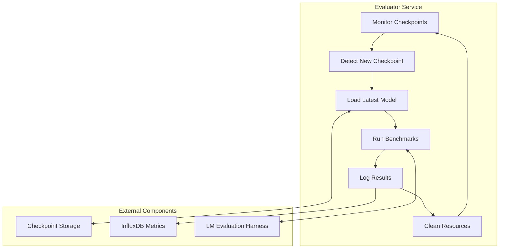
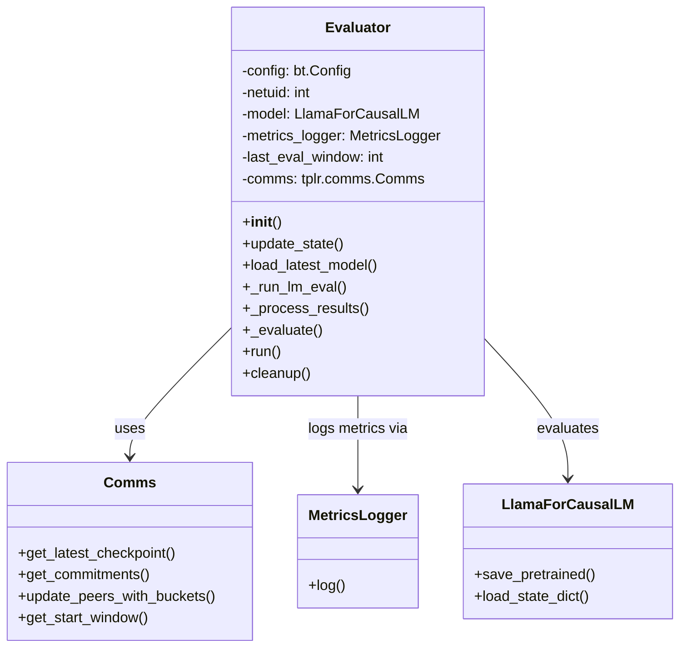
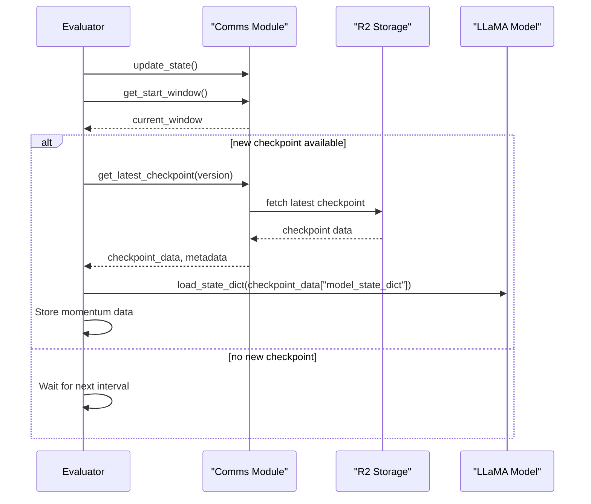
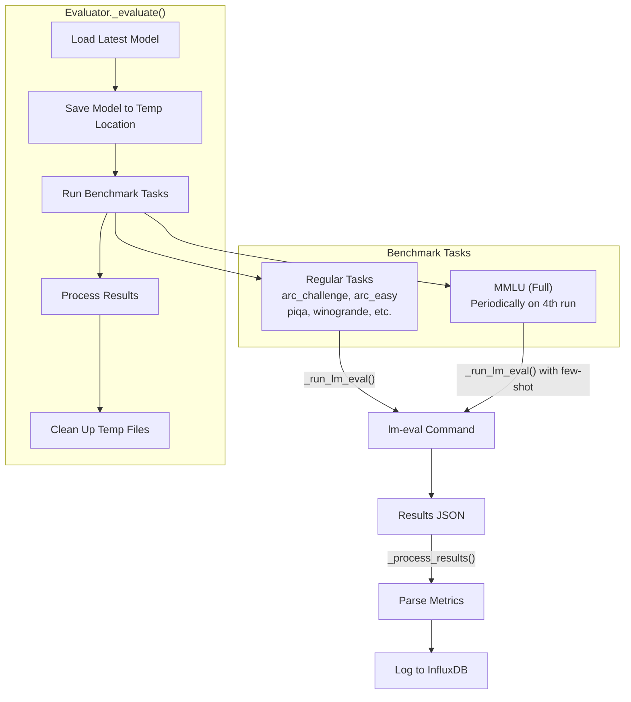
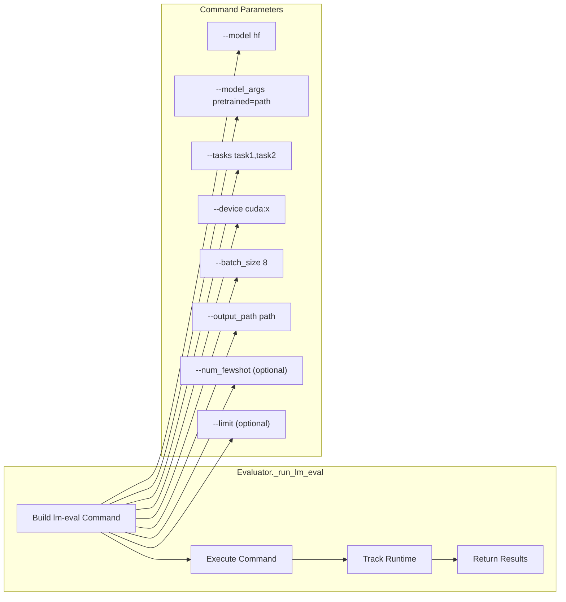
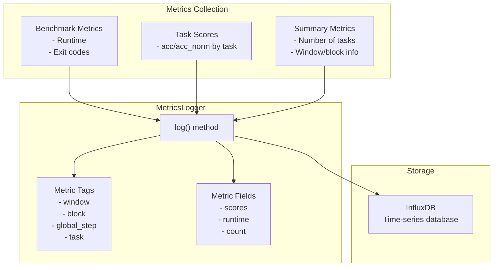

import SourceLink from '@components/SourceLink.astro';
import { Aside, Card, CardGrid, Tabs, TabItem, Steps, FileTree, Code, LinkButton, Badge } from '@astrojs/starlight/components';
import CollapsibleAside from '../../../components/CollapsibleAside.astro';

<CollapsibleAside title="Relevant Source Files">
  <SourceLink href="https://github.com/tplr-ai/templar/blob/bb2fc2a9/pytest.ini" text="pytest.ini" />
  <SourceLink href="https://github.com/tplr-ai/templar/blob/bb2fc2a9/scripts/evaluator-setup/compose.yml" text="scripts/evaluator-setup/compose.yml" />
  <SourceLink href="https://github.com/tplr-ai/templar/blob/bb2fc2a9/scripts/evaluator.py" text="scripts/evaluator.py" />
  <SourceLink href="https://github.com/tplr-ai/templar/blob/bb2fc2a9/tests/test_checkpoints.py" text="tests/test_checkpoints.py" />
  <SourceLink href="https://github.com/tplr-ai/templar/blob/bb2fc2a9/tests/test_evaluator.py" text="tests/test_evaluator.py" />
  <SourceLink href="https://github.com/tplr-ai/templar/blob/bb2fc2a9/tests/test_influx_integration.py" text="tests/test_influx_integration.py" />
  <SourceLink href="https://github.com/tplr-ai/templar/blob/bb2fc2a9/tests/test_prepare_gradient_dict.py" text="tests/test_prepare_gradient_dict.py" />
</CollapsibleAside>


The Evaluator is an autonomous service in the Templar framework that continuously assesses model performance by running standardized benchmark tasks on the latest checkpoints. It operates independently from miners and validators, providing objective measurements of model capabilities throughout the training process.

Sources: <SourceLink href="https://github.com/tplr-ai/templar/blob/bb2fc2a9/scripts/evaluator.py#L1-L40" text="scripts/evaluator.py1-40" />

## Overview

The Evaluator performs the following key functions:

1. Monitors for new model checkpoints by window number
2. Downloads and loads the latest checkpoint
3. Executes standardized benchmark tasks (e.g., ARC, MMLU, Winogrande)
4. Logs evaluation results to InfluxDB for monitoring and analysis
5. Manages resources efficiently for continuous operation

Unlike miners that generate gradients or validators that assess gradient quality, the Evaluator focuses exclusively on measuring the end-to-end capabilities of the current model against established benchmarks.



Sources: <SourceLink href="https://github.com/tplr-ai/templar/blob/bb2fc2a9/scripts/evaluator.py#L125-L147" text="scripts/evaluator.py125-147" />, <SourceLink href="https://github.com/tplr-ai/templar/blob/bb2fc2a9/scripts/evaluator.py#L559-L568" text="scripts/evaluator.py559-568" />

## Architecture

The Evaluator operates as a standalone service that interacts with the Templar checkpoint storage system and metrics infrastructure. It leverages the Language Model Evaluation Harness (lm-eval) to execute standardized benchmarks.



Sources: <SourceLink href="https://github.com/tplr-ai/templar/blob/bb2fc2a9/scripts/evaluator.py#L125-L198" text="scripts/evaluator.py125-198" />

## Evaluation Workflow

### Checkpoint Detection and Loading

The Evaluator continuously monitors the blockchain for the latest checkpoint by window number. When a new checkpoint is detected, it downloads and loads the model weights.



Sources: <SourceLink href="https://github.com/tplr-ai/templar/blob/bb2fc2a9/scripts/evaluator.py#L211-L282" text="scripts/evaluator.py211-282" />, <SourceLink href="https://github.com/tplr-ai/templar/blob/bb2fc2a9/tests/test_evaluator.py#L59-L83" text="tests/test_evaluator.py59-83" />

### Benchmark Execution

When a new checkpoint is loaded, the Evaluator executes a series of benchmark tasks using the LM Evaluation Harness (lm-eval). Different tasks can be configured and executed on a schedule.



Sources: <SourceLink href="https://github.com/tplr-ai/templar/blob/bb2fc2a9/scripts/evaluator.py#L446-L557" text="scripts/evaluator.py446-557" />

### Results Processing

After each benchmark run, the Evaluator processes the results by:
1. Parsing the JSON output from lm-eval
2. Extracting relevant metrics (accuracy scores)
3. Logging both individual task results and summary metrics to InfluxDB

The system prioritizes certain metrics in a specific order (e.g., `acc_norm` over `acc`) based on their relevance and reliability.

Sources: <SourceLink href="https://github.com/tplr-ai/templar/blob/bb2fc2a9/scripts/evaluator.py#L338-L441" text="scripts/evaluator.py338-441" />

## Benchmark Tasks

The Evaluator supports multiple benchmark tasks that assess different capabilities of the language model:

| Task | Description | Metric | Execution Mode |
|------|-------------|--------|---------------|
| arc_challenge | AI2 Reasoning Challenge (hard) | acc/acc_norm | Zero-shot |
| arc_easy | AI2 Reasoning Challenge (easy) | acc/acc_norm | Zero-shot |
| winogrande | Winograd Schema Challenge | acc/acc_norm | Zero-shot |
| piqa | Physical Interaction QA | acc/acc_norm | Zero-shot |
| hellaswag | Commonsense NLI | acc/acc_norm | Zero-shot |
| openbookqa | Open Book Question Answering | acc/acc_norm | Zero-shot |
| mmlu | Massive Multitask Language Understanding | acc/acc_norm | Both zero-shot and 5-shot |

For MMLU specifically, the Evaluator can run it in two modes:
- Regular zero-shot evaluation with other tasks
- Periodic 5-shot evaluation (every 4th run) with different configuration

Sources: <SourceLink href="https://github.com/tplr-ai/templar/blob/bb2fc2a9/scripts/evaluator.py#L89-L94" text="scripts/evaluator.py89-94" />, <SourceLink href="https://github.com/tplr-ai/templar/blob/bb2fc2a9/scripts/evaluator.py#L493-L545" text="scripts/evaluator.py493-545" />

### Benchmark Execution Details

The Evaluator runs benchmarks by:
1. Saving the model to a temporary location
2. Executing the lm-eval command with appropriate parameters
3. Collecting and parsing results from the output JSON



Sources: <SourceLink href="https://github.com/tplr-ai/templar/blob/bb2fc2a9/scripts/evaluator.py#L284-L336" text="scripts/evaluator.py284-336" />

## Configuration Options

The Evaluator provides several configuration options to customize its behavior:

| Parameter | Description | Default |
|-----------|-------------|---------|
| --netuid | Bittensor network UID | 3 |
| --actual_batch_size | Evaluation batch size | 8 |
| --device | Device to use for evaluation | cuda:7 |
| --tasks | Comma-separated list of tasks | arc_challenge,arc_easy,openbookqa,winogrande,piqa,hellaswag,mmlu |
| --checkpoint_path | Path to save/load checkpoints | checkpoints/ |
| --eval_interval | Seconds between evaluations | 600 (10 mins) |
| --uid | Override the wallet's UID | None |
| --skip-gaps | Skip gaps in the evaluation process | False |

Sources: <SourceLink href="https://github.com/tplr-ai/templar/blob/bb2fc2a9/scripts/evaluator.py#L61-L122" text="scripts/evaluator.py61-122" />

## Deployment

The Evaluator is designed to run as a continuous service. It can be deployed using Docker via the provided compose file.

### Docker Deployment

The repository includes a Docker Compose configuration for deploying the Evaluator:

```yaml
# Key elements from the compose.yml file:
# - Uses the Templar container image
# - Maps Bittensor wallet directory
# - Sets up required environment variables
# - Configures GPU access
# - Sets up logging with journald
# - Includes watchtower for automatic updates
```

Sources: <SourceLink href="https://github.com/tplr-ai/templar/blob/bb2fc2a9/scripts/evaluator-setup/compose.yml#L1-L33" text="scripts/evaluator-setup/compose.yml1-33" />

### Environment Requirements

The Evaluator requires several environment variables:

- `R2_DATASET_ACCOUNT_ID`: R2 dataset account identifier
- `R2_DATASET_BUCKET_NAME`: R2 storage bucket name
- `R2_DATASET_READ_ACCESS_KEY_ID`: R2 read access key
- `R2_DATASET_READ_SECRET_ACCESS_KEY`: R2 secret access key
- `INFLUXDB_TOKEN`: InfluxDB API token (optional)

Sources: <SourceLink href="https://github.com/tplr-ai/templar/blob/bb2fc2a9/scripts/evaluator.py#L15-L25" text="scripts/evaluator.py15-25" />

## Metrics Logging

The Evaluator logs detailed metrics to InfluxDB:

1. **Benchmark Metrics**: Runtime performance and execution details
2. **Task Results**: Individual scores for each benchmark task
3. **Summary Metrics**: Aggregated statistics across all tasks



Sources: <SourceLink href="https://github.com/tplr-ai/templar/blob/bb2fc2a9/scripts/evaluator.py#L368-L441" text="scripts/evaluator.py368-441" />

## Integration with Other Systems

The Evaluator integrates with several other components of the Templar framework:

1. **Comms System**: For checkpoint retrieval and blockchain interaction
2. **Metrics System**: For logging evaluation results
3. **Storage System**: For accessing model checkpoints

It operates independently of miners and validators but provides crucial feedback on the quality of the model being trained by the network.

Sources: <SourceLink href="https://github.com/tplr-ai/templar/blob/bb2fc2a9/scripts/evaluator.py#L184-L196" text="scripts/evaluator.py184-196" />