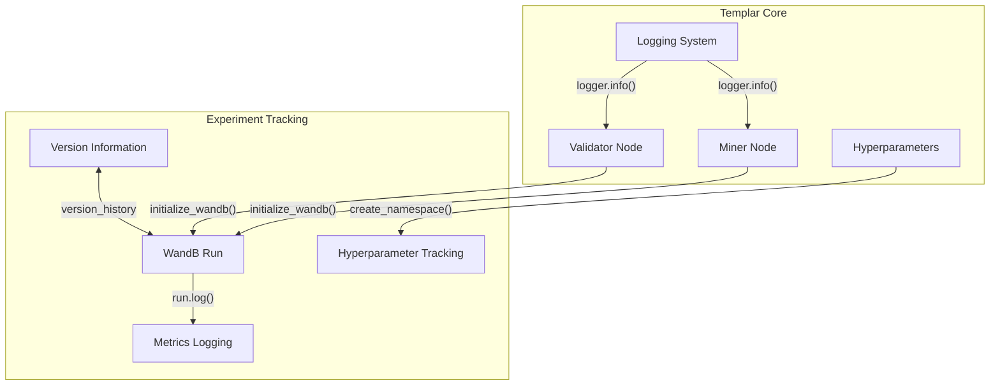
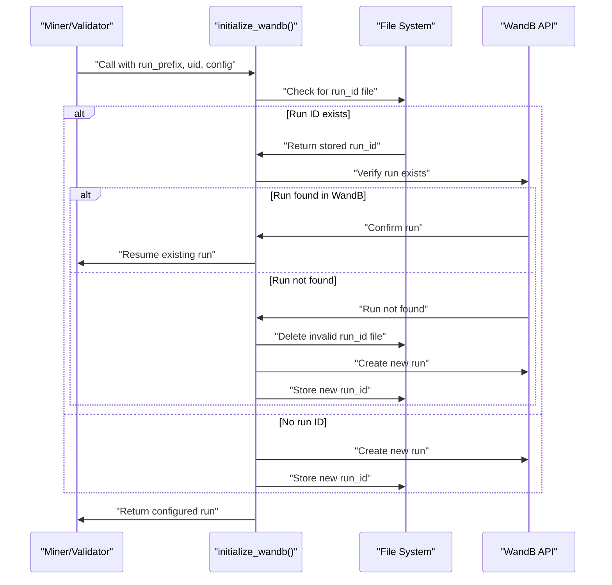
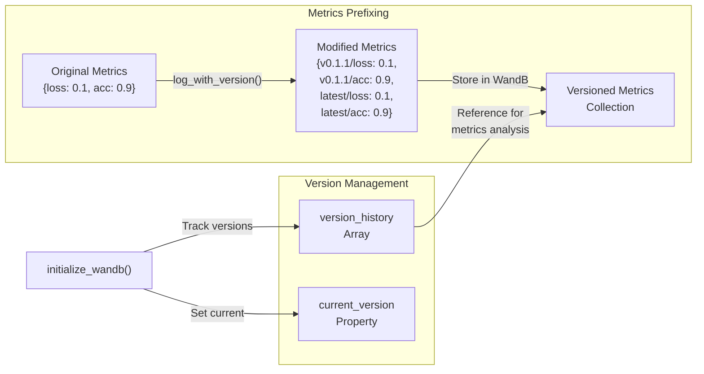
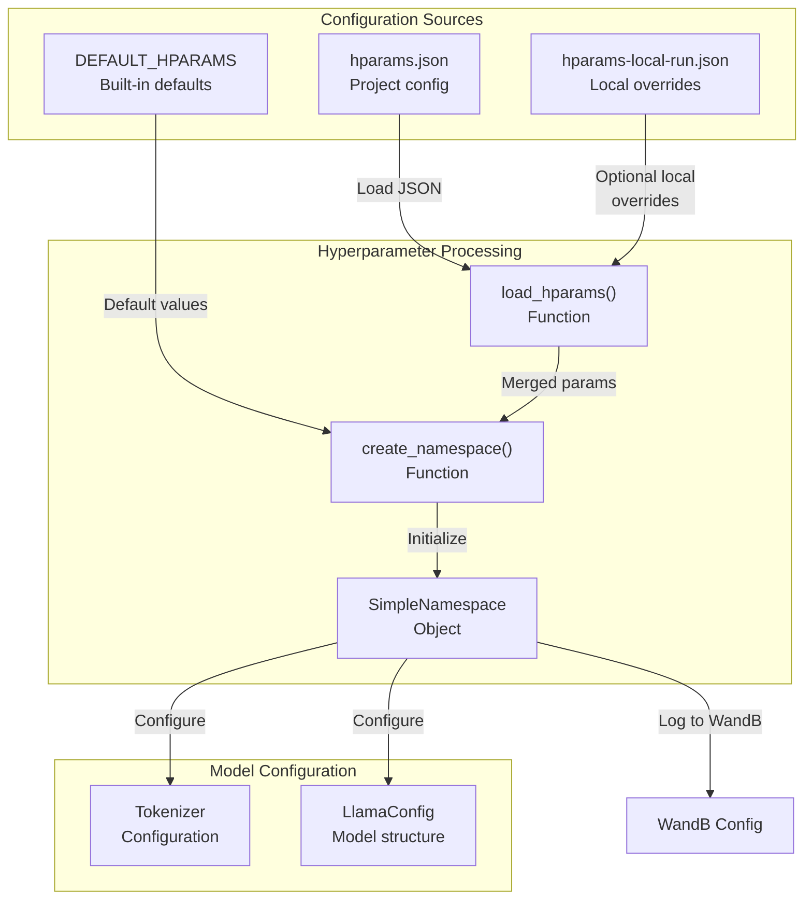
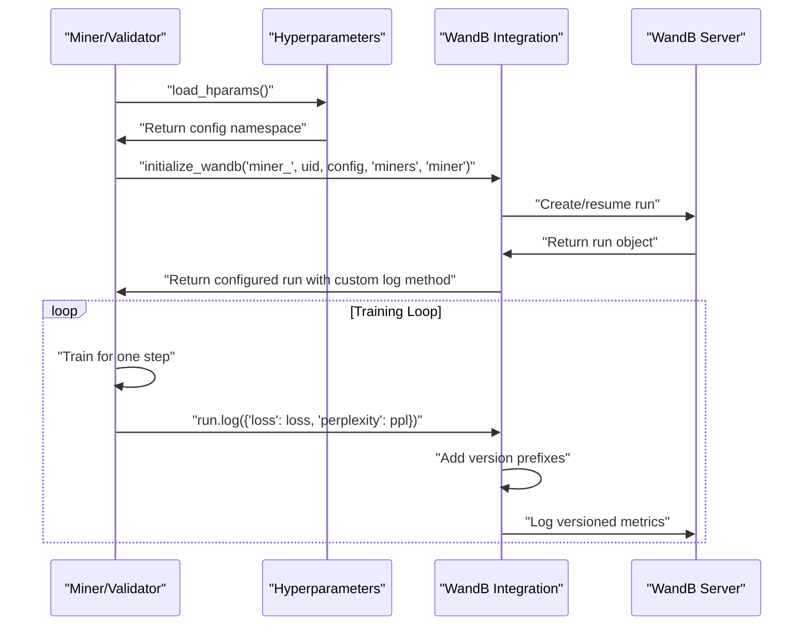

import SourceLink from '@components/SourceLink.astro';
import { Aside, Card, CardGrid, Tabs, TabItem, Steps, FileTree, Code, LinkButton, Badge } from '@astrojs/starlight/components';
import CollapsibleAside from '../../../components/CollapsibleAside.astro';

<CollapsibleAside title="Relevant Source Files">
  <SourceLink href="https://github.com/tplr-ai/templar/blob/bb2fc2a9/hparams-local-run.json" text="hparams-local-run.json" />
  <SourceLink href="https://github.com/tplr-ai/templar/blob/bb2fc2a9/src/tplr/dataset.py" text="src/tplr/dataset.py" />
  <SourceLink href="https://github.com/tplr-ai/templar/blob/bb2fc2a9/src/tplr/hparams.py" text="src/tplr/hparams.py" />
  <SourceLink href="https://github.com/tplr-ai/templar/blob/bb2fc2a9/src/tplr/logging.py" text="src/tplr/logging.py" />
  <SourceLink href="https://github.com/tplr-ai/templar/blob/bb2fc2a9/src/tplr/schemas.py" text="src/tplr/schemas.py" />
  <SourceLink href="https://github.com/tplr-ai/templar/blob/bb2fc2a9/src/tplr/wandb.py" text="src/tplr/wandb.py" />
</CollapsibleAside>

This document describes how the Templar framework handles experiment tracking and monitoring using Weights & Biases (WandB) integration. It covers run initialization, version tracking, metrics logging, and hyperparameter management. For information about metrics logging to InfluxDB, see [Metrics Logging](/reference/metrics-logging), and for visualization with dashboards, see [Dashboards](/reference/dashboards).

## Overview of Experiment Tracking

Templar integrates deeply with Weights & Biases to provide comprehensive experiment tracking capabilities. This integration allows miners and validators to log model training metrics, hyperparameters, and version information in a structured manner, enabling detailed analysis of training progress across distributed nodes.

### Key Features

- **Run Management**: Automatic creation and resumption of experiment runs
- **Version Tracking**: Tracking metrics across different code versions
- **Hyperparameter Logging**: Comprehensive tracking of model configurations
- **Metrics Namespacing**: Versioned metrics organization for easy comparison

Sources: <SourceLink href="https://github.com/tplr-ai/templar/blob/bb2fc2a9/src/tplr/wandb.py#L20-L125" text="src/tplr/wandb.py20-125" />

## WandB Integration Architecture

The experiment tracking system integrates with other Templar components as shown below:

Sources: <SourceLink href="https://github.com/tplr-ai/templar/blob/bb2fc2a9/src/tplr/wandb.py#L20-L125" text="src/tplr/wandb.py20-125" />, <SourceLink href="https://github.com/tplr-ai/templar/blob/bb2fc2a9/src/tplr/hparams.py#L62-L104" text="src/tplr/hparams.py62-104" />

## Run Management

The `initialize_wandb` function handles WandB run creation and resumption. It automatically detects existing runs based on a persistent run ID stored in the file system.

### Run Initialization Process

Sources: <SourceLink href="https://github.com/tplr-ai/templar/blob/bb2fc2a9/src/tplr/wandb.py#L20-L45" text="src/tplr/wandb.py20-45" />, <SourceLink href="https://github.com/tplr-ai/templar/blob/bb2fc2a9/src/tplr/wandb.py#L120-L124" text="src/tplr/wandb.py120-124" />

## Version Tracking System

Templar meticulously tracks software versions used for each experiment run. This allows for comparing metrics across different code versions and understanding the impact of code changes.

### Key Features:

1. **Version History**: Each run maintains a history of all versions that contributed to it
2. **Current Version**: The active code version is always tracked
3. **Versioned Metrics**: All metrics are automatically prefixed with the version that logged them

Sources: <SourceLink href="https://github.com/tplr-ai/templar/blob/bb2fc2a9/src/tplr/wandb.py#L64-L68" text="src/tplr/wandb.py64-68" />, <SourceLink href="https://github.com/tplr-ai/templar/blob/bb2fc2a9/src/tplr/wandb.py#L92-L117" text="src/tplr/wandb.py92-117" />

## Metrics Logging

The WandB integration includes a custom logging wrapper that automatically adds version information to all metrics. This provides clear separation between metrics logged by different code versions.

### Metrics Transformation Process

1. Original metrics are captured during training
2. `log_with_version` transforms metrics by adding version prefixes
3. Both version-specific (`v{__version__}/metric`) and latest (`latest/metric`) paths are maintained
4. Step counting is handled automatically or can be explicitly provided

Sources: <SourceLink href="https://github.com/tplr-ai/templar/blob/bb2fc2a9/src/tplr/wandb.py#L92-L117" text="src/tplr/wandb.py92-117" />

## Hyperparameter Management

Templar uses a structured approach to hyperparameter management, with defaults that can be overridden by configuration files.

### Hyperparameter Loading Flow

The system supports special local configurations through `hparams-local-run.json`, which is useful for development and testing.

Sources: <SourceLink href="https://github.com/tplr-ai/templar/blob/bb2fc2a9/src/tplr/hparams.py#L26-L59" text="src/tplr/hparams.py26-59" />, <SourceLink href="https://github.com/tplr-ai/templar/blob/bb2fc2a9/src/tplr/hparams.py#L107-L145" text="src/tplr/hparams.py107-145" />, <SourceLink href="https://github.com/tplr-ai/templar/blob/bb2fc2a9/hparams-local-run.json#L1-L9" text="hparams-local-run.json1-9" />

## WandB Run Configuration Options

The following table shows the key configuration options used when initializing WandB runs:

| Parameter | Description | Default Value |
|-----------|-------------|---------------|
| `project` | Project name | From config.project |
| `entity` | Team or user account | "tplr" (or None for private) |
| `id` | Run ID (for resuming) | From stored run ID file |
| `resume` | Resume policy | "must" if run ID exists, "never" otherwise |
| `name` | Run name | "miner_node_123" |
| `group` | Grouping for related runs | From parameter |
| `job_type` | Type of job (miner/validator) | From parameter |
| `tags` | Version tags | ["v1.2.3"] |

Sources: <SourceLink href="https://github.com/tplr-ai/templar/blob/bb2fc2a9/src/tplr/wandb.py#L46-L61" text="src/tplr/wandb.py46-61" />

## Typical Usage Workflow

When running a miner or validator node, the experiment tracking system is initialized with appropriate parameters that identify the node type and purpose. The system will automatically handle run resumption if the node restarts.

Sources: <SourceLink href="https://github.com/tplr-ai/templar/blob/bb2fc2a9/src/tplr/wandb.py#L20-L125" text="src/tplr/wandb.py20-125" />

## Integration with Logging System

The experiment tracking system integrates with Templar's logging system, allowing error messages and information to be properly captured both in the console and in remote logging systems.

Sources: <SourceLink href="https://github.com/tplr-ai/templar/blob/bb2fc2a9/src/tplr/logging.py#L80-L85" text="src/tplr/logging.py80-85" />, <SourceLink href="https://github.com/tplr-ai/templar/blob/bb2fc2a9/src/tplr/wandb.py#L17-L17" text="src/tplr/wandb.py17" />