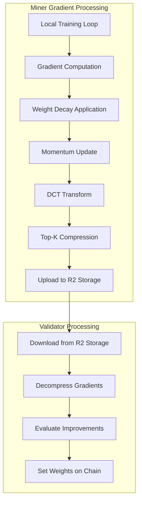
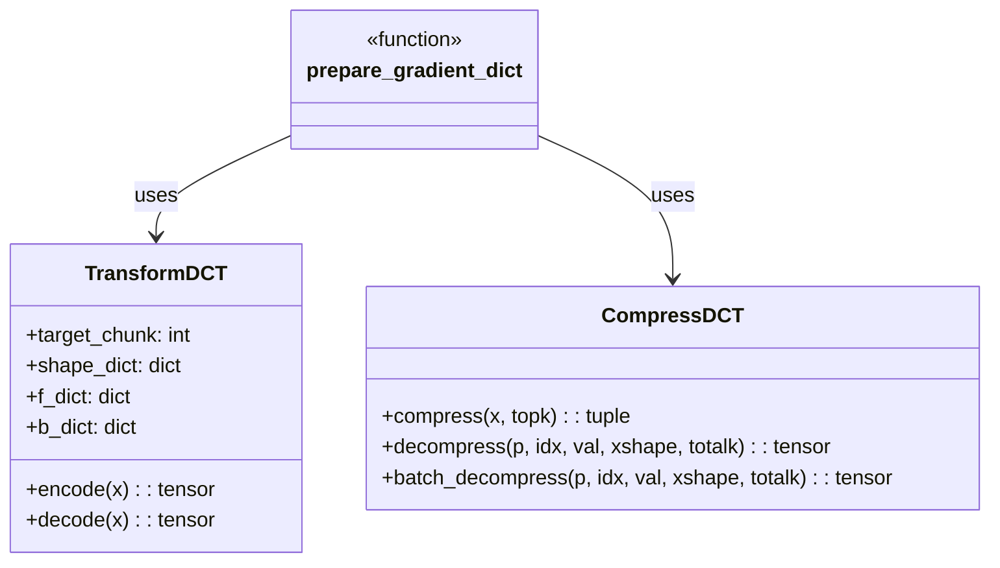
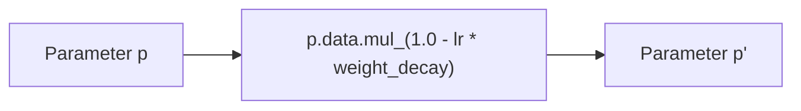
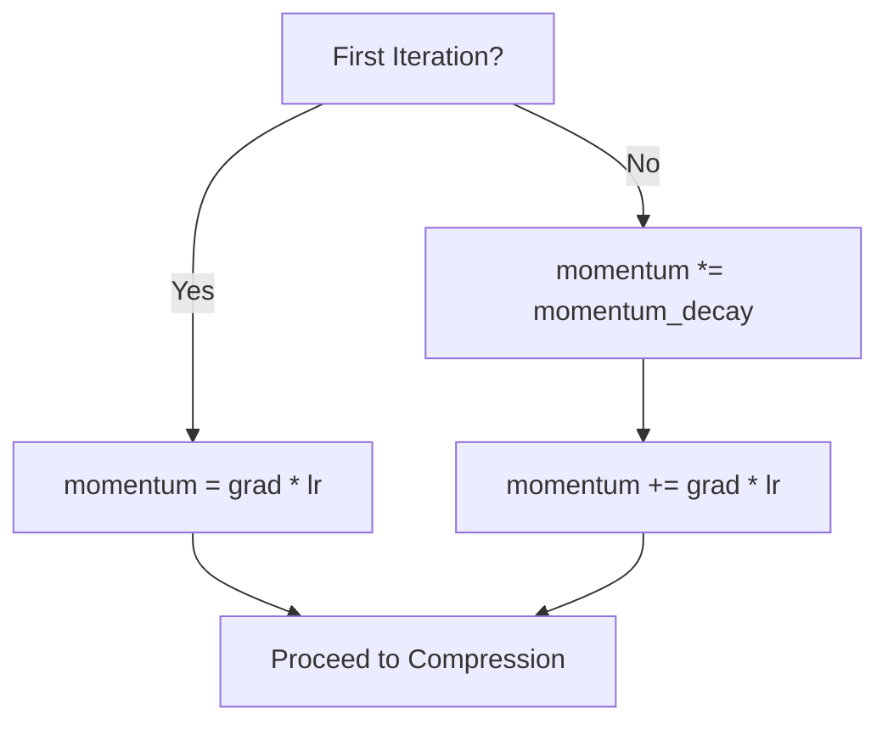
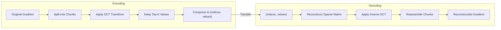
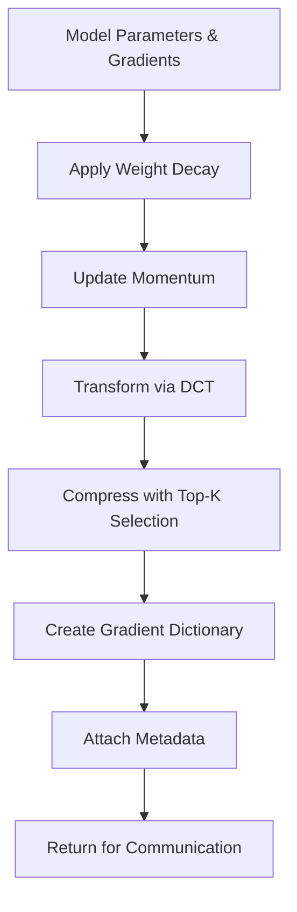
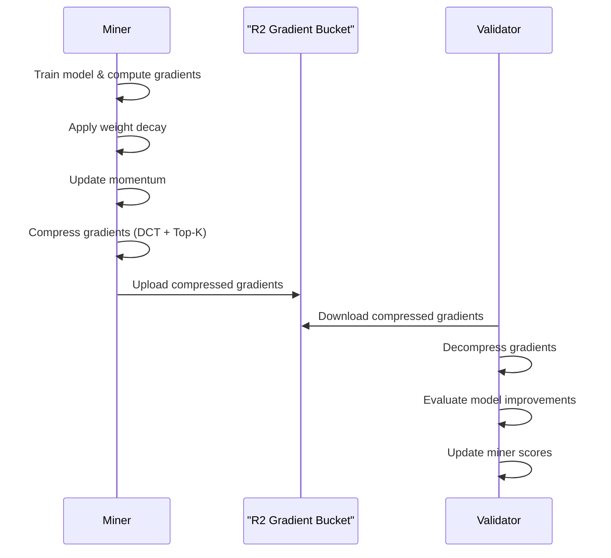
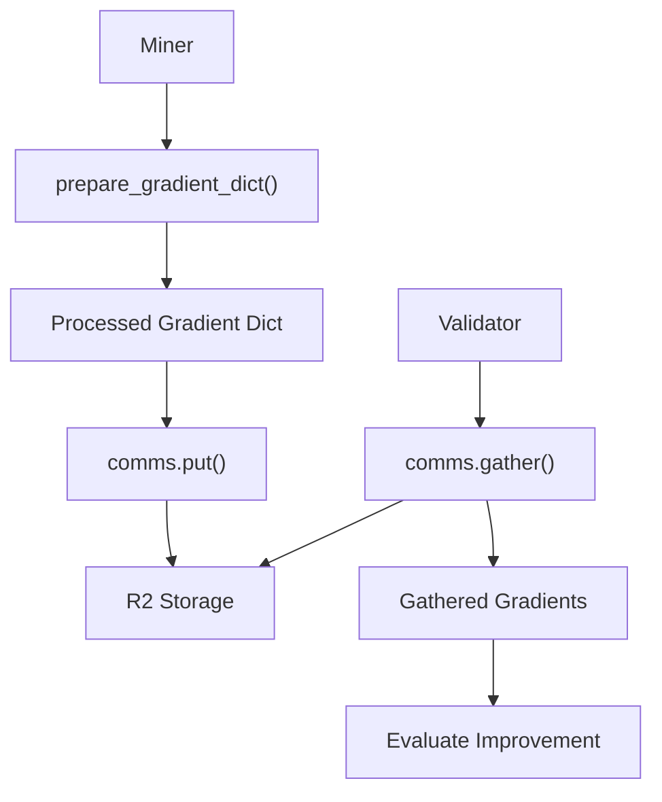

import SourceLink from '@components/SourceLink.astro';
import { Aside, Card, CardGrid, Tabs, TabItem, Steps, FileTree, Code, LinkButton, Badge } from '@astrojs/starlight/components';
import CollapsibleAside from '../../../components/CollapsibleAside.astro';

<CollapsibleAside title="Relevant Source Files">
  <SourceLink href="https://github.com/tplr-ai/templar/blob/bb2fc2a9/ecosystem.config.js" text="`ecosystem.config.js`" />
  <SourceLink href="https://github.com/tplr-ai/templar/blob/bb2fc2a9/hparams.json" text="`hparams.json`" />
  <SourceLink href="https://github.com/tplr-ai/templar/blob/bb2fc2a9/neurons/miner.py" text="`neurons/miner.py`" />
  <SourceLink href="https://github.com/tplr-ai/templar/blob/bb2fc2a9/neurons/validator.py" text="`neurons/validator.py`" />
  <SourceLink href="https://github.com/tplr-ai/templar/blob/bb2fc2a9/src/tplr/__init__.py" text="`src/tplr/__init__.py`" />
  <SourceLink href="https://github.com/tplr-ai/templar/blob/bb2fc2a9/src/tplr/chain.py" text="`src/tplr/chain.py`" />
  <SourceLink href="https://github.com/tplr-ai/templar/blob/bb2fc2a9/src/tplr/comms.py" text="`src/tplr/comms.py`" />
  <SourceLink href="https://github.com/tplr-ai/templar/blob/bb2fc2a9/src/tplr/compress.py" text="`src/tplr/compress.py`" />
  <SourceLink href="https://github.com/tplr-ai/templar/blob/bb2fc2a9/src/tplr/neurons.py" text="`src/tplr/neurons.py`" />
  <SourceLink href="https://github.com/tplr-ai/templar/blob/bb2fc2a9/tests/test_model_comparison.py" text="`tests/test_model_comparison.py`" />
</CollapsibleAside>

This page explains how miners in the Templar framework process and share gradients, including momentum, weight decay, and the compression techniques used to efficiently distribute updates across the network. For information about how validators evaluate these gradients, see [Weight Setting](/reference/weight-setting).

## Gradient Processing Pipeline Overview

Gradient processing is a critical component of the decentralized training process in Templar. Miners compute gradients during local training, process them through a series of transformations, and then share these compressed representations with validators and other miners via the Cloudflare R2 storage system.

Sources: <SourceLink href="https://github.com/tplr-ai/templar/blob/bb2fc2a9/neurons/miner.py#L399-L402" text="neurons/miner.py399-402" />, <SourceLink href="https://github.com/tplr-ai/templar/blob/bb2fc2a9/neurons/validator.py#L827-L838" text="neurons/validator.py827-838" />, <SourceLink href="https://github.com/tplr-ai/templar/blob/bb2fc2a9/src/tplr/neurons.py#L40-L124" text="src/tplr/neurons.py40-124" />

## Technical Components

The gradient processing system consists of several key components that work together to optimize, compress, and distribute model updates:

Sources: <SourceLink href="https://github.com/tplr-ai/templar/blob/bb2fc2a9/src/tplr/compress.py#L35-L178" text="src/tplr/compress.py35-178" />, <SourceLink href="https://github.com/tplr-ai/templar/blob/bb2fc2a9/src/tplr/neurons.py#L40-L124" text="src/tplr/neurons.py40-124" />

## Momentum and Weight Decay Implementation

During training, miners apply weight decay and momentum updates to gradients before compression. This process helps stabilize training and improve convergence.

### Weight Decay

Weight decay helps prevent overfitting by regularizing model parameters. It is applied directly to the parameters before updating the momentum:

### Momentum Update

Momentum helps accelerate gradients in the relevant direction and dampens oscillations. In Templar, momentum is:
1. First scaled by a decay factor to reduce the influence of older gradients
2. Then updated with the current gradient scaled by the learning rate
3. For the first iteration, momentum is set directly to the gradient to avoid cold starts

Sources: <SourceLink href="https://github.com/tplr-ai/templar/blob/bb2fc2a9/src/tplr/neurons.py#L80-L97" text="src/tplr/neurons.py80-97" />, <SourceLink href="https://github.com/tplr-ai/templar/blob/bb2fc2a9/neurons/miner.py#L80-L97" text="neurons/miner.py80-97" />

## DCT-Based Gradient Compression

The Templar system uses Discrete Cosine Transform (DCT) based compression to efficiently share gradients across the network.

### Transformation Process

The `TransformDCT` class handles the encoding and decoding process, while `CompressDCT` manages the selection of top-K components and creates compressed representations.

Sources: <SourceLink href="https://github.com/tplr-ai/templar/blob/bb2fc2a9/src/tplr/compress.py#L35-L178" text="src/tplr/compress.py35-178" />, <SourceLink href="https://github.com/tplr-ai/templar/blob/bb2fc2a9/src/tplr/neurons.py#L100-L112" text="src/tplr/neurons.py100-112" />

### Compression Parameters

Two key hyperparameters control the compression process:

| Parameter | Description | Default Value |
|-----------|-------------|---------------|
| `target_chunk` | Size of chunks for DCT transform | 64 |
| `topk_compression` | Number of DCT coefficients to keep | 32 |

The combination of these parameters allows for significant compression while preserving essential gradient information.

Sources: <SourceLink href="https://github.com/tplr-ai/templar/blob/bb2fc2a9/hparams.json#L12-L13" text="hparams.json12-13" />, <SourceLink href="https://github.com/tplr-ai/templar/blob/bb2fc2a9/neurons/miner.py#L132-L134" text="neurons/miner.py132-134" />

## prepare_gradient_dict Function

The `prepare_gradient_dict` function is the central component that orchestrates the entire gradient processing pipeline:

This function:
1. Applies weight decay to model parameters
2. Updates momentum tensors with current gradients
3. Transforms and compresses using DCT
4. Creates a dictionary containing compressed gradient data
5. Attaches metadata like the current window and pages information

Sources: <SourceLink href="https://github.com/tplr-ai/templar/blob/bb2fc2a9/src/tplr/neurons.py#L40-L124" text="src/tplr/neurons.py40-124" />

## Implementation Details

### TransformDCT

The `TransformDCT` class handles the mathematical transformation of gradients using Discrete Cosine Transform. It:

1. Initializes by generating DCT basis matrices for all parameter shapes
2. Encodes parameters by transforming them into the frequency domain
3. Decodes parameters by transforming from frequency domain back to spatial domain

The DCT transformation concentrates most of the signal energy in fewer coefficients, allowing for effective compression by discarding less important components.

Sources: <SourceLink href="https://github.com/tplr-ai/templar/blob/bb2fc2a9/src/tplr/compress.py#L35-L120" text="src/tplr/compress.py35-120" />

### CompressDCT

The `CompressDCT` class handles the actual compression by:

1. Taking DCT-transformed tensors and selecting the top-K components by magnitude
2. Storing only the indices and values of these components
3. Providing methods to reconstruct the original tensor from the compressed representation

Sources: <SourceLink href="https://github.com/tplr-ai/templar/blob/bb2fc2a9/src/tplr/compress.py#L123-L178" text="src/tplr/compress.py123-178" />

## Gradient Data Flow

The flow of gradient data through the system illustrates how miners and validators interact through gradients:

Each gradient upload contains:
- Compressed parameter indices and values for each layer
- Metadata about the current window and training pages
- Timestamp information for proper synchronization

Sources: <SourceLink href="https://github.com/tplr-ai/templar/blob/bb2fc2a9/neurons/miner.py#L415-L426" text="neurons/miner.py415-426" />, <SourceLink href="https://github.com/tplr-ai/templar/blob/bb2fc2a9/neurons/validator.py#L827-L859" text="neurons/validator.py827-859" />

## Integration with Communication System

Gradients are shared via the Comms system, which handles all data exchange in Templar:

The gradient dictionary follows a structured format with special keys:
- Parameter names with "idxs" suffix containing compressed indices
- Parameter names with "vals" suffix containing compressed values
- "metadata" key with window and page information

Sources: <SourceLink href="https://github.com/tplr-ai/templar/blob/bb2fc2a9/neurons/miner.py#L399-L426" text="neurons/miner.py399-426" />, <SourceLink href="https://github.com/tplr-ai/templar/blob/bb2fc2a9/src/tplr/comms.py#L324-L373" text="src/tplr/comms.py324-373" />

## Special Handling During Early Training

The gradient processing includes special handling for the initial training iterations:

1. In the first iteration, the momentum is set directly to the gradient scaled by the learning rate
2. For the first 5 iterations, the system skips subtracting transmitted gradients from the momentum 

This approach helps stabilize early training and enables faster initial convergence.

Sources: <SourceLink href="https://github.com/tplr-ai/templar/blob/bb2fc2a9/src/tplr/neurons.py#L91-L112" text="src/tplr/neurons.py91-112" />

## Gradient Compression Performance

The DCT-based compression technique achieves significant reduction in communication overhead:

| Parameter | Raw Size (MB) | Compressed (KB) | Compression Ratio |
|-----------|---------------|-----------------|-------------------|
| Large models | 100s-1000s | 10s | ~100x-1000x |
| Target parameters | Full model | topk per tensor | Proportional to topk value |
| Retained information | 100% | Significant | Based on frequency spectrum |

The compression approach prioritizes the most important gradient components by leveraging the sparsity that emerges when transforming to the frequency domain using DCT.

Sources: <SourceLink href="https://github.com/tplr-ai/templar/blob/bb2fc2a9/hparams.json#L12-L13" text="hparams.json12-13" />, <SourceLink href="https://github.com/tplr-ai/templar/blob/bb2fc2a9/src/tplr/compress.py#L100-L112" text="src/tplr/compress.py100-112" />

## Model Updates in Miners

After receiving and decompressing gradients from other miners, the miner applies these updates to the model:

1. The gathered gradients are decompressed and transformed back to parameter space
2. The decompressed gradients are assigned to the `.grad` attribute of model parameters
3. The optimizer's `step()` method is called to apply the updates using the configured learning rate
4. The scheduler updates the learning rate for the next iteration

Sources: <SourceLink href="https://github.com/tplr-ai/templar/blob/bb2fc2a9/neurons/miner.py#L559-L600" text="neurons/miner.py559-600" />