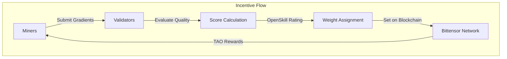
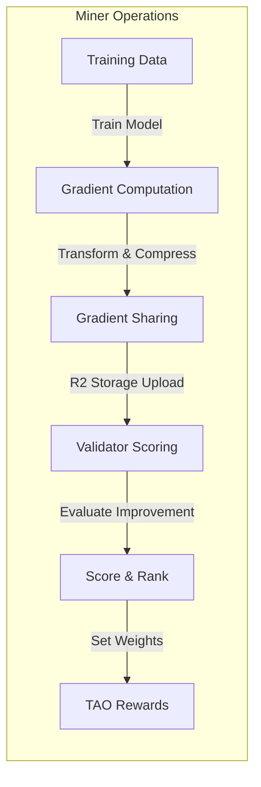
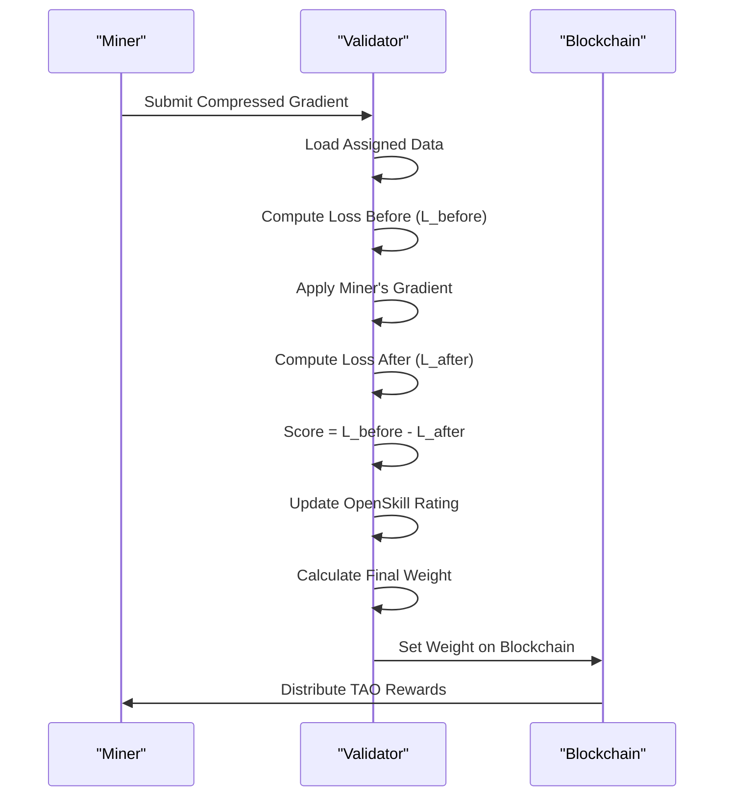
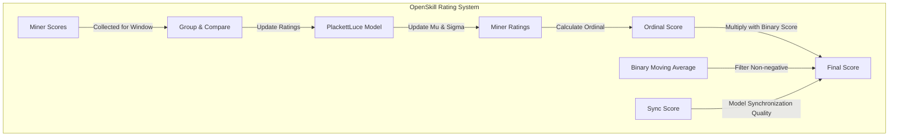
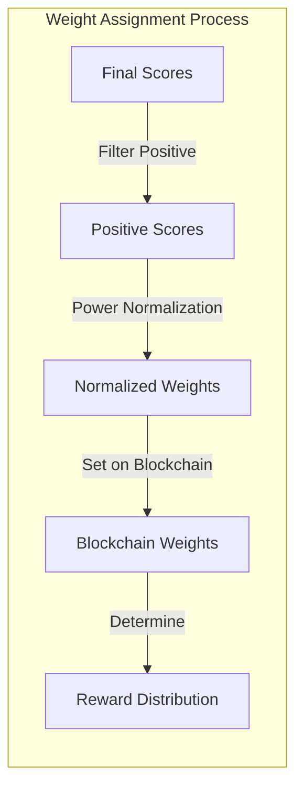

import SourceLink from '@components/SourceLink.astro';
import { Aside, Card, CardGrid, Tabs, TabItem, Steps, FileTree, Code, LinkButton, Badge } from '@astrojs/starlight/components';
import CollapsibleAside from '../../../components/CollapsibleAside.astro';
import CollapsibleCode from '../../../components/CollapsibleCode.astro';

<CollapsibleAside title="Relevant Source Files">
  <SourceLink href="https://github.com/tplr-ai/templar/blob/bb2fc2a9/README.md" text="`README.md`" />
  <SourceLink href="https://github.com/tplr-ai/templar/blob/bb2fc2a9/docs/miner.md" text="`docs/miner.md`" />
  <SourceLink href="https://github.com/tplr-ai/templar/blob/bb2fc2a9/docs/validator.md" text="`docs/validator.md`" />
  <SourceLink href="https://github.com/tplr-ai/templar/blob/bb2fc2a9/ecosystem.config.js" text="`ecosystem.config.js`" />
  <SourceLink href="https://github.com/tplr-ai/templar/blob/bb2fc2a9/hparams.json" text="`hparams.json`" />
  <SourceLink href="https://github.com/tplr-ai/templar/blob/bb2fc2a9/neurons/miner.py" text="`neurons/miner.py`" />
  <SourceLink href="https://github.com/tplr-ai/templar/blob/bb2fc2a9/neurons/validator.py" text="`neurons/validator.py`" />
  <SourceLink href="https://github.com/tplr-ai/templar/blob/bb2fc2a9/src/tplr/__init__.py" text="`src/tplr/__init__.py`" />
  <SourceLink href="https://github.com/tplr-ai/templar/blob/bb2fc2a9/src/tplr/comms.py" text="`src/tplr/comms.py`" />
</CollapsibleAside>


This document explains the incentive mechanisms that drive the distributed training process in the Templar framework. It covers how miners are motivated to contribute quality gradients and how validators evaluate and reward these contributions. For information about the overall system architecture, see [System Architecture](/reference/system-architecture).

## Overview of Incentive Mechanism

Templar's incentive mechanism aligns the interests of individual miners with the collective goal of improving model performance. The system uses an evaluation-based approach where validators assess the quality of miners' gradient contributions by measuring their impact on model loss.



Sources: <SourceLink href="https://github.com/tplr-ai/templar/blob/bb2fc2a9/neurons/validator.py#L373-L437" text="neurons/validator.py373-437" />, <SourceLink href="https://github.com/tplr-ai/templar/blob/bb2fc2a9/neurons/miner.py#L228-L329" text="neurons/miner.py228-329" />

The incentive flow creates a reinforcement loop: miners producing higher quality gradients receive better scores, leading to higher weights on the blockchain and greater TAO rewards, encouraging continued quality contributions.

## Miner Incentive Structure

Miners are incentivized to generate high-quality gradients through the following mechanisms:

1. **Direct performance evaluation**: Miners' contributions are scored based on their ability to improve model performance
2. **Window-based training cycles**: Each miner works on assigned data for a specific window
3. **Gradient sharing system**: Miners benefit from both their contributions and the collective improvement



Sources: <SourceLink href="https://github.com/tplr-ai/templar/blob/bb2fc2a9/neurons/miner.py#L228-L329" text="neurons/miner.py228-329" />, <SourceLink href="https://github.com/tplr-ai/templar/blob/bb2fc2a9/neurons/validator.py#L486-L515" text="neurons/validator.py486-515" />

### How Miners Maximize Rewards

Miners aim to maximize their rewards by:

1. Computing accurate gradients that lead to model improvement
2. Maintaining model synchronization with the network
3. Consistently contributing across training windows

The optimal strategy for miners is one that genuinely improves the model performance as measured by the validators.

## Validator Evaluation System

Validators employ a sophisticated evaluation system to measure the quality of miners' contributions and assign appropriate weights.

### Loss Improvement Calculation

The core of the evaluation is measuring how a miner's gradient improves model performance:

1. Compute loss before applying gradient: `L_before`
2. Apply miner's gradient to model
3. Compute loss after applying gradient: `L_after`
4. Calculate improvement score: `s_i = L_before - L_after`



Sources: <SourceLink href="https://github.com/tplr-ai/templar/blob/bb2fc2a9/neurons/validator.py#L486-L515" text="neurons/validator.py486-515" />, <SourceLink href="https://github.com/tplr-ai/templar/blob/bb2fc2a9/neurons/validator.py#L356-L445" text="neurons/validator.py356-445" />

### OpenSkill Rating System

Validators use the PlackettLuce model from the OpenSkill library to maintain a probabilistic skill rating for each miner:



Sources: <SourceLink href="https://github.com/tplr-ai/templar/blob/bb2fc2a9/neurons/validator.py#L356-L437" text="neurons/validator.py356-437" />

The OpenSkill system has these key properties:

- **Mu (μ)**: Represents the estimated skill level of a miner
- **Sigma (σ)**: Represents the uncertainty in the skill estimate
- **Ordinal**: A conservative estimate of skill (μ - k·σ) that accounts for uncertainty
- **Parameters**:
  - Beta: 20 (controls the dynamics of rating updates)
  - Tau: 0.1 (dynamic factor that prevents ratings from stagnating)

### Binary Scores and Sync Quality

In addition to gradient quality, validators track:

1. **Binary Indicator Scores**: Whether miner updates improve or harm the model
2. **Sync Scores**: How well miners' models stay synchronized with the network

These factors are combined with the OpenSkill ordinal to produce the final score.

## Weight Normalization and Assignment

Validator weights are calculated using a power normalization approach to ensure a fair distribution:



Sources: <SourceLink href="https://github.com/tplr-ai/templar/blob/bb2fc2a9/neurons/validator.py#L446-L488" text="neurons/validator.py446-488" />

The weight normalization process:

1. Creates a mask for peers that have been evaluated
2. Creates a mask for evaluated peers with positive scores
3. Applies power normalization to only the positive scores
4. Verifies that weights sum to approximately 1.0

This approach ensures that:
- Only positive contributions receive rewards
- Higher-quality contributions receive proportionally larger rewards
- The distribution of rewards is balanced across contributors

## Reward Allocation and Penalties

### Reward Allocation

Miners who contribute to model improvement receive weights proportional to their contribution quality. The moving average smooths temporary fluctuations, creating a stable reward mechanism.

### Penalties for Inactivity and Poor Performance

Validators implement several penalty mechanisms:

| Penalty Type | Condition | Reduction Rate |
|--------------|-----------|----------------|
| Inactivity | Peer inactive for a window | 25% per window |
| Missing Gradient | Failed to submit gradient | 75% |
| Poor Sync | Model out of sync with network | 75% |
| Long-term Inactivity | Inactive > 25 windows | Complete reset |

Sources: <SourceLink href="https://github.com/tplr-ai/templar/blob/bb2fc2a9/neurons/validator.py#L702-L770" text="neurons/validator.py702-770" />, <SourceLink href="https://github.com/tplr-ai/templar/blob/bb2fc2a9/neurons/validator.py#L877-L912" text="neurons/validator.py877-912" />

## Security Considerations

The incentive design addresses several potential security concerns:

1. **Sybil Resistance**: Creating multiple identities offers no advantage as rewards are based on contribution quality, not peer count
2. **Free-Riding Prevention**: Miners only receive rewards for genuine, measurable contributions
3. **Nash Equilibrium**: The optimal strategy is honest participation and genuine improvement
4. **Collusion Resistance**: Evaluation is based on objective model improvement metrics

## Implementation Details

### Key Parameters

The incentive system is configured with these parameters from hparams.json:

| Parameter | Value | Function |
|-----------|-------|----------|
| gradient_score_ma_alpha | 0.6 | Weight for gradient score moving average |
| binary_score_ma_alpha | 0.05 | Weight for binary indicator score moving average |
| final_score_ma_alpha | 0.75 | Weight for final score moving average |
| power_normalisation | 2.0 | Exponent for power normalization of weights |
| openskill_beta | 20 | Controls dynamics of rating updates |
| openskill_tau | 0.1 | Prevents ratings from stagnating |
| reset_inactivity_windows | 25 | Windows before peer score is fully reset |

Sources: <SourceLink href="https://github.com/tplr-ai/templar/blob/bb2fc2a9/hparams.json#L14-L17" text="hparams.json14-17" />, <SourceLink href="https://github.com/tplr-ai/templar/blob/bb2fc2a9/hparams.json#L40-L40" text="hparams.json40" />, <SourceLink href="https://github.com/tplr-ai/templar/blob/bb2fc2a9/hparams.json#L50-L51" text="hparams.json50-51" />, <SourceLink href="https://github.com/tplr-ai/templar/blob/bb2fc2a9/hparams.json#L47-L47" text="hparams.json47" />

### Code Implementation

The core validation and scoring system is implemented in validator.py, with key functions:

<CollapsibleCode title="View Python Code Implementation" lang="python">
```python
import torch
from torch.cuda.amp import autocast

# Mocking dependencies for the sake of a runnable and understandable example
class MockTplr:
    def __init__(self):
        self.logger = MockLogger()

class MockLogger:
    def info(self, msg):
        print(f"INFO: {msg}")
    def debug(self, msg):
        print(f"DEBUG: {msg}")
    def warning(self, msg):
        print(f"WARNING: {msg}")
    def error(self, msg):
        print(f"ERROR: {msg}")

tplr = MockTplr() # Global mock logger instance

class MockWandb:
    def log(self, data, step):
        # In a real scenario, this would log to Weights & Biases
        print(f"WANDB_LOG (step {step}): {data}")

class MockMetricsLogger:
    def log(self, measurement, tags, fields):
        # In a real scenario, this would log to a metrics database like InfluxDB
        print(f"METRICS_LOG: measurement={measurement}, tags={tags}, fields={fields}")

def min_power_normalization(scores, power):
    """
    Applies power normalization to a tensor of scores.
    Scores are raised to the given power and then normalized to sum to 1.
    """
    if not isinstance(scores, torch.Tensor):
        scores = torch.tensor(scores, dtype=torch.float32)
    if scores.numel() == 0:
        return torch.tensor([]) # Return empty tensor if input is empty

    # Handle potential for negative scores if power could lead to complex numbers,
    # though typically scores for weighting are non-negative.
    if torch.any(scores < 0) and power < 1 and power % 1 != 0: # e.g., sqrt of negative
        tplr.logger.warning("Applying fractional power normalization to negative scores can lead to complex numbers or errors.")
        # Apply power only to non-negative part or handle as per specific domain logic
        # For this example, we proceed, but a robust version would need careful handling.
    
    powered_scores = torch.pow(scores.float(), power) # Ensure float for pow
    
    # Normalize so they sum to 1
    sum_powered_scores = powered_scores.sum()
    if sum_powered_scores == 0:
        # Avoid division by zero; return zeros or uniform distribution if appropriate
        return torch.zeros_like(powered_scores)
    
    normalized_scores = powered_scores / sum_powered_scores
    return normalized_scores

class Validator:
    def __init__(self, hparams=None, model_instance=None, tokenizer_instance=None, openskill_model_instance=None, sync_window=10, global_step=0, num_uids=256):
        """
        Initializes the Validator with necessary components and parameters.
        Args:
            hparams (object, optional): Hyperparameters, including power_normalisation.
            model_instance (torch.nn.Module, optional): The PyTorch model.
            tokenizer_instance (object, optional): The tokenizer for the model.
            openskill_model_instance (object, optional): The OpenSkill rating model.
            sync_window (int, optional): The window size for synchronization.
            global_step (int, optional): The current global step for logging.
            num_uids (int, optional): Number of UIDs to initialize tensors for.
        """
        # Hyperparameters (e.g., for power normalization)
        self.hparams = hparams if hparams else type('HParams', (object,), {'power_normalisation': 1.0})()
        
        # Core components
        self.model = model_instance if model_instance else self.MockTorchModel()
        self.tokenizer = tokenizer_instance if tokenizer_instance else self.MockTokenizer()
        self.openskill_model = openskill_model_instance if openskill_model_instance else self.MockOpenSkillModel()
        
        # State attributes
        self.sync_window = sync_window
        self.global_step = global_step
        self.current_window_scores = {}  # Stores scores for UIDs in the current window: {uid: score}
        self.openskill_ratings = {}      # Stores OpenSkill rating objects for UIDs: {uid: rating_obj}
        self.sync_scores = {}            # Stores synchronization scores for UIDs: {uid: tensor_score}
        self.evaluated_uids = set()      # Set of UIDs evaluated in the current cycle

        # Scores and weights tensors, initialized based on num_uids
        # These would typically be sized according to the number of active UIDs in the network
        self.final_scores = torch.zeros(num_uids, dtype=torch.float32)
        self.binary_moving_averages = torch.zeros(num_uids, dtype=torch.float32) # Example MA scores
        self.weights = torch.zeros(num_uids, dtype=torch.float32)

        # Mock logging and metrics utilities
        self.wandb = MockWandb()
        self.metrics_logger = MockMetricsLogger()

    # --- Mock inner classes for demonstration ---
    class MockOpenSkillModel:
        def rate(self, teams, scores):
            updated_ratings = []
            max_score_val = max(scores) if scores else 1.0 # Avoid division by zero
            for i, team_member_list in enumerate(teams):
                # This mock simulates an update. Real OpenSkill objects would be more complex.
                # score_val is the raw score for this team/player
                score_val = scores[i]
                
                # Mock a rating object. Real OpenSkill ratings have mu, sigma, etc.
                # We'll create a dynamic type here for simplicity.
                mock_rating_obj = type('MockRating', (object,), {
                    'mu': score_val * 10 + 1500,  # Example: scale score to a mu-like value
                    'sigma': 350 - (score_val / max_score_val if max_score_val > 0 else 0) * 100, # Sigma decreases with better relative score
                    'ordinal': lambda self_obj=None, mu_val=score_val * 10 + 1500: mu_val # Simplified ordinal as mu
                })()
                updated_ratings.append([mock_rating_obj]) # OpenSkill expects list of lists of players
            return updated_ratings

    class MockTokenizer:
        def __init__(self):
            self.pad_token_id = 0  # Example padding token ID

    class MockTorchModel(torch.nn.Module):
        def __init__(self):
            super().__init__()
            # A dummy layer to make it a valid nn.Module
            self.dummy_layer = torch.nn.Linear(10, 1) 
            # Determine device: use CUDA if available, else CPU
            self.device = torch.device("cuda" if torch.cuda.is_available() else "cpu")
            self.to(self.device) # Move model to the determined device

        def forward(self, input_ids, labels=None):
            # This mock forward pass needs to return an object with a 'loss' attribute.
            # The actual model's forward pass would be significantly more complex.
            # For demonstration, we'll simulate a loss.
            # A real model would use input_ids and labels to compute the loss.
            mock_loss_value = torch.rand(1, device=self.device) * 0.1 + 0.5 # Simulate some small loss
            
            # Return an object that mimics the structure of HuggingFace model outputs
            outputs = type('ModelOutputs', (object,), {'loss': mock_loss_value})()
            return outputs

        def eval(self):
            # Sets the model to evaluation mode (e.g., disables dropout)
            super().eval()
    # --- End of Mock inner classes ---

    def update_openskill_ratings(self):
        """
        Updates OpenSkill ratings based on gradient scores from the current window
        and recalculates final scores for each evaluated peer.
        """
        if not hasattr(self, "current_window_scores") or len(self.current_window_scores) <= 1:
            tplr.logger.info("Not enough scores in the current window to update OpenSkill ratings (needs > 1).")
            return

        window_uids = list(self.current_window_scores.keys())
        
        # Initialize OpenSkill ratings for any new UIDs
        for uid in window_uids:
            if uid not in self.openskill_ratings:
                # This is a simplified default; real OpenSkill objects might be created differently
                self.openskill_ratings[uid] = type('MockRating', (object,), {'mu': 1500, 'sigma': 350, 'ordinal': lambda: 1500})()

        # Prepare scores and teams for OpenSkill model
        # The 'scores' for openskill.rate should be higher for better performance
        # as per the original code's comment: "higher gradient scores indicate better performance"
        scores_for_openskill_update = [self.current_window_scores[uid] for uid in window_uids]
        teams_for_openskill_update = [[self.openskill_ratings[uid]] for uid in window_uids] # Each UID is its own team

        # Update ratings using the OpenSkill model
        rated_teams = self.openskill_model.rate(teams_for_openskill_update, scores=scores_for_openskill_update)

        # Process updated ratings and calculate final scores
        for i, uid in enumerate(window_uids):
            self.openskill_ratings[uid] = rated_teams[i][0] # Update stored rating

            # Extract OpenSkill metrics
            openskill_mu = float(self.openskill_ratings[uid].mu)
            openskill_sigma = float(self.openskill_ratings[uid].sigma)
            openskill_ordinal_score = float(self.openskill_ratings[uid].ordinal()) # This is often mu - k*sigma

            # Get other score components (sync score, binary moving average)
            # These should be tensors or have .item() method
            sync_score_value = self.sync_scores.get(uid, torch.tensor(0.0)).item()
            
            binary_ma_value = 0.0
            if isinstance(self.binary_moving_averages, dict): # If UIDs are not dense indices
                binary_ma_value = self.binary_moving_averages.get(uid, torch.tensor(0.0)).item()
            elif uid < len(self.binary_moving_averages):
                binary_ma_value = self.binary_moving_averages[uid].item()

            # Calculate final score
            final_score = openskill_ordinal_score * binary_ma_value * sync_score_value
            self.final_scores[uid] = final_score

        # Normalize final scores to sum to 1
        self.final_scores = min_power_normalization(self.final_scores, self.hparams.power_normalisation)

    def calculate_weights(self):
        """
        Calculates weights for each evaluated peer based on final scores.
        """
        # Create a mask for evaluated peers
        evaluated_mask = torch.zeros_like(self.final_scores, dtype=torch.bool)
        evaluated_mask[list(self.evaluated_uids)] = True

        # Create a mask for evaluated peers with positive scores
        positive_scores_mask = (self.final_scores > 0) & evaluated_mask

        # Apply power normalization to only the positive scores
        normalized_scores = min_power_normalization(self.final_scores[positive_scores_mask], self.hparams.power_normalisation)

        # Assign normalized scores to the weights tensor
        self.weights[positive_scores_mask] = normalized_scores

        # Verify that weights sum to approximately 1.0
        assert torch.isclose(self.weights.sum(), torch.tensor(1.0), atol=1e-6), "Weights do not sum to approximately 1.0"

    def apply_penalties(self):
        """
        Applies penalties to weights based on inactivity and poor performance.
        """
        # Inactivity penalty
        for uid in self.evaluated_uids:
            if uid not in self.current_window_scores:
                self.weights[uid] *= 0.75  # 25% penalty per window

        # Missing gradient penalty
        for uid in self.evaluated_uids:
            if uid not in self.current_window_scores:
                self.weights[uid] *= 0.25  # 75% penalty

        # Poor sync penalty
        for uid in self.evaluated_uids:
            if uid in self.sync_scores and self.sync_scores[uid] < 0.5:
                self.weights[uid] *= 0.25  # 75% penalty

        # Long-term inactivity penalty
        # Mocking self.last_evaluated_window as it's not defined in the provided snippet
        # In a real scenario, this would track the last window a UID was evaluated.
        self.last_evaluated_window = getattr(self, 'last_evaluated_window', {uid: self.global_step for uid in self.evaluated_uids})
        for uid in self.evaluated_uids:
            if uid not in self.current_window_scores and (self.global_step - self.last_evaluated_window.get(uid, self.global_step)) > 25:
                self.weights[uid] = 0.0  # Complete reset

    def update_weights(self):
        """
        Updates weights for each evaluated peer based on final scores,
        applying penalties for inactivity and poor performance.
        """
        self.calculate_weights()
        self.apply_penalties()

    def run_validation_cycle(self):
        """
        Runs a full validation cycle, updating OpenSkill ratings,
        calculating weights, and logging metrics.
        """
        self.update_openskill_ratings()
        self.update_weights()

        # Log metrics
        self.wandb.log({"final_scores": self.final_scores}, step=self.global_step)
        self.wandb.log({"weights": self.weights}, step=self.global_step)
        self.metrics_logger.log("validation_cycle", {"global_step": self.global_step}, {"final_scores": self.final_scores.tolist(), "weights": self.weights.tolist()})

        # Reset state for the next cycle
        self.current_window_scores = {}
        self.sync_scores = {}
        self.evaluated_uids = set()
        self.global_step += 1

    def submit_gradient(self, uid, gradient):
        """
        Submits a gradient for a given UID and updates the current window scores.
        """
        self.current_window_scores[uid] = gradient
        self.evaluated_uids.add(uid)

    def set_sync_score(self, uid, score):
        """
        Sets the synchronization score for a given UID.
        """
        self.sync_scores[uid] = score

    # Mocking time for the start method example
    import time 

    def start(self):
        """
        Starts the validation loop.
        """
        while True:
            # Wait for gradients to be submitted
            time.sleep(1)

            # Run a validation cycle
            self.run_validation_cycle()

            # Reset state for the next cycle
            self.current_window_scores = {}
            self.sync_scores = {}
            self.evaluated_uids = set()
            self.global_step += 1
```
</CollapsibleCode>

Sources: <SourceLink href="https://github.com/tplr-ai/templar/blob/bb2fc2a9/neurons/validator.py#L356-L437" text="neurons/validator.py356-L437" />, <SourceLink href="https://github.com/tplr-ai/templar/blob/bb2fc2a9/neurons/validator.py#L446-L488" text="neurons/validator.py446-L488" />, <SourceLink href="https://github.com/tplr-ai/templar/blob/bb2fc2a9/neurons/validator.py#L489-L515" text="neurons/validator.py489-L515" />

## Alignment with Templar's Goals

The incentive design aligns with Templar's core goals by:

1. **Encouraging Quality**: Rewards are proportional to model improvement
2. **Promoting Collaboration**: Miners benefit from the collective improvement of the model
3. **Ensuring Robustness**: Multiple validation metrics create a more reliable evaluation
4. **Supporting Decentralization**: Independent validators assess contributions fairly
5. **Enabling Heterogeneity**: Miners with varying hardware can contribute meaningfully

In summary, Templar's incentive design creates a self-regulating ecosystem where honest participation and genuine model improvement are the most rewarding strategies.

Sources: <SourceLink href="https://github.com/tplr-ai/templar/blob/bb2fc2a9/neurons/validator.py#L356-L488" text="neurons/validator.py356-L488" />, <SourceLink href="https://github.com/tplr-ai/templar/blob/bb2fc2a9/neurons/miner.py#L228-L329" text="neurons/miner.py228-329" />
