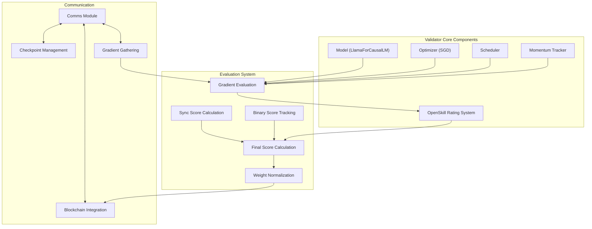
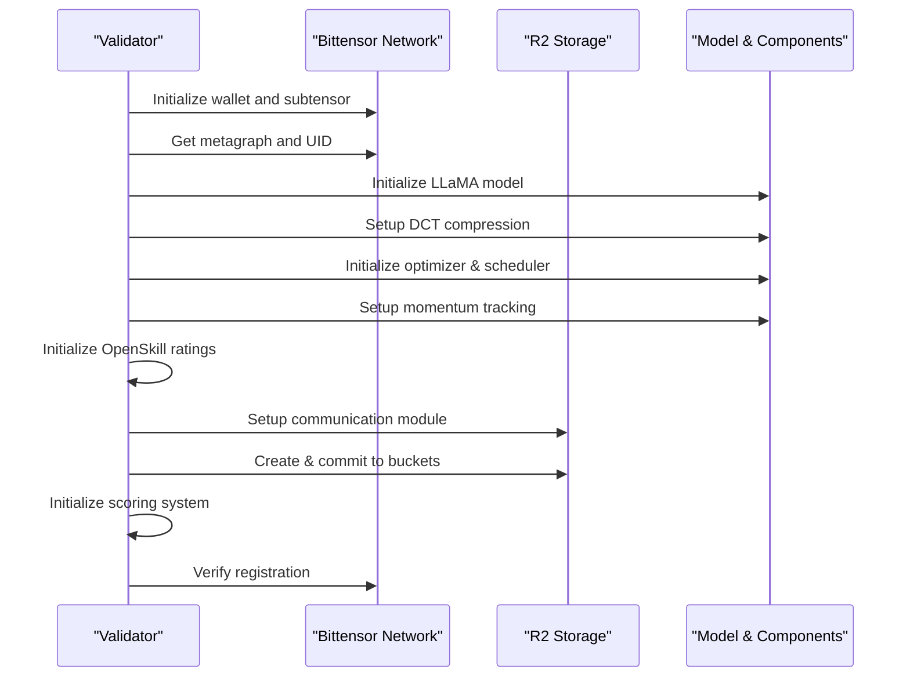
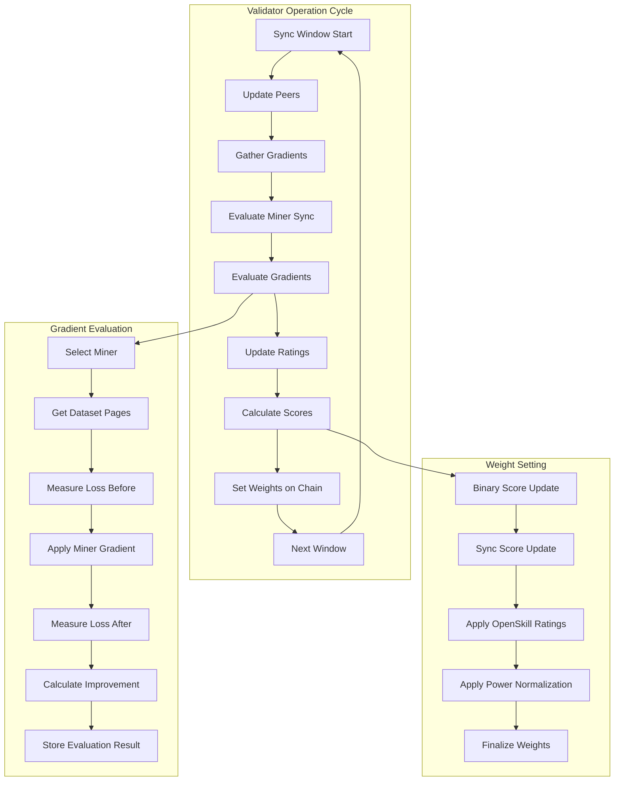
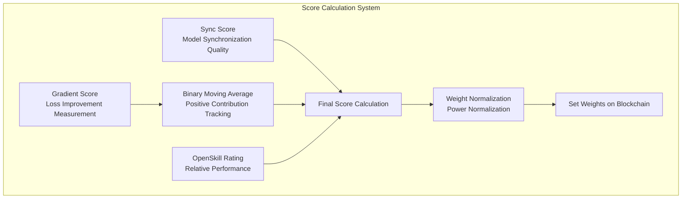
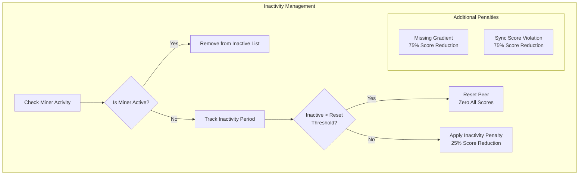
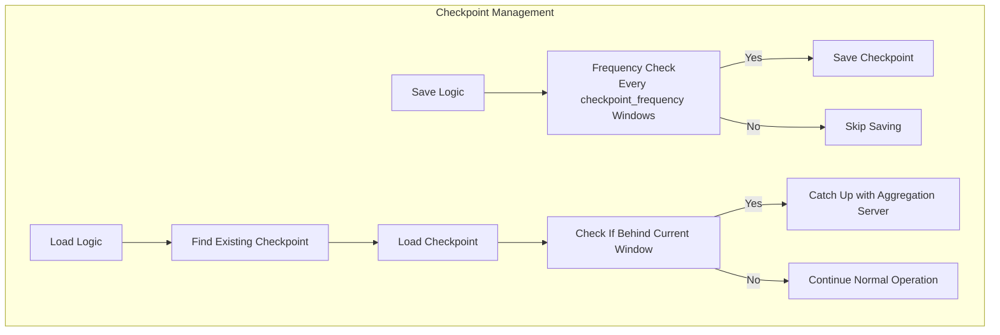
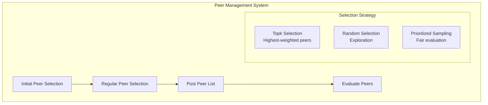
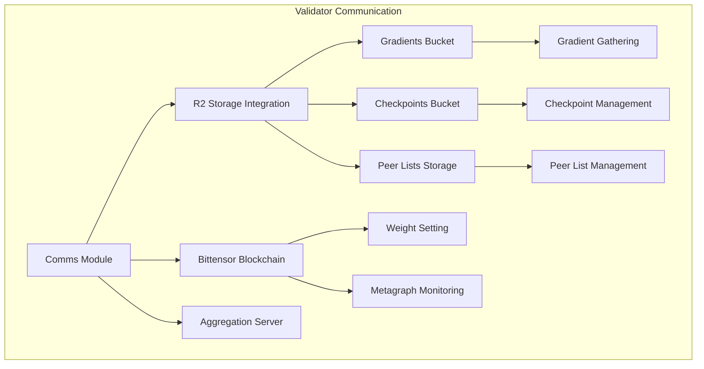

import SourceLink from '@components/SourceLink.astro';
import { Aside, Card, CardGrid, Tabs, TabItem, Steps, FileTree, Code, LinkButton, Badge } from '@astrojs/starlight/components';
import CollapsibleAside from '../../../components/CollapsibleAside.astro';

<CollapsibleAside title="Relevant Source Files">
  <SourceLink href="https://github.com/tplr-ai/templar/blob/bb2fc2a9/README.md" text="`README.md`" />
  <SourceLink href="https://github.com/tplr-ai/templar/blob/bb2fc2a9/docs/miner.md" text="`docs/miner.md`" />
  <SourceLink href="https://github.com/tplr-ai/templar/blob/bb2fc2a9/docs/validator.md" text="`docs/validator.md`" />
  <SourceLink href="https://github.com/tplr-ai/templar/blob/bb2fc2a9/ecosystem.config.js" text="`ecosystem.config.js`" />
  <SourceLink href="https://github.com/tplr-ai/templar/blob/bb2fc2a9/hparams.json" text="`hparams.json`" />
  <SourceLink href="https://github.com/tplr-ai/templar/blob/bb2fc2a9/neurons/miner.py" text="`neurons/miner.py`" />
  <SourceLink href="https://github.com/tplr-ai/templar/blob/bb2fc2a9/neurons/validator.py" text="`neurons/validator.py`" />
  <SourceLink href="https://github.com/tplr-ai/templar/blob/bb2fc2a9/src/tplr/__init__.py" text="`src/tplr/__init__.py`" />
  <SourceLink href="https://github.com/tplr-ai/templar/blob/bb2fc2a9/src/tplr/comms.py" text="`src/tplr/comms.py`" />
  <SourceLink href="https://github.com/tplr-ai/templar/blob/bb2fc2a9/tests/test_checkpoints.py" text="`tests/test_checkpoints.py`" />
  <SourceLink href="https://github.com/tplr-ai/templar/blob/bb2fc2a9/tests/test_evaluator.py" text="`tests/test_evaluator.py`" />
  <SourceLink href="https://github.com/tplr-ai/templar/blob/bb2fc2a9/tests/test_prepare_gradient_dict.py" text="`tests/test_prepare_gradient_dict.py`" />
</CollapsibleAside>


Validators are a critical component of the Templar decentralized training framework. They are responsible for evaluating miners' gradient contributions, assessing their quality, and setting weights on the Bittensor blockchain to determine reward distribution. This page details the architecture, functionality, and operation of validators within the Templar system.

For information about the miners that validators evaluate, see [Miners](/reference/miners). For details on how validators set weights on the blockchain, see [Weight Setting](/reference/weight-setting).

## Validator Architecture

Validators maintain model state, evaluate gradients from miners, and update weights on the Bittensor blockchain. The architectural design enables efficient evaluation of multiple miners while maintaining system integrity.



Sources: <SourceLink href="https://github.com/tplr-ai/templar/blob/bb2fc2a9/neurons/validator.py#L85-L267" text="neurons/validator.py85-267" />, <SourceLink href="https://github.com/tplr-ai/templar/blob/bb2fc2a9/neurons/validator.py#L355-L480" text="neurons/validator.py355-480" />

## Validator Initialization

Validators initialize with a model identical to miners, along with compression systems for efficient gradient processing, and integration with the Bittensor network.



The Validator class is initialized with several key components:

1. **Bittensor Network Integration**: Wallet, subtensor, and metagraph objects for blockchain interaction
2. **Model**: LlamaForCausalLM instance identical to what miners use
3. **Compression**: DCT transformation and compression for efficient gradient handling
4. **Optimizer and Momentum**: SGD optimizer and momentum tracking for gradient evaluation
5. **Rating System**: OpenSkill-based rating system for evaluating miner contributions
6. **Storage Integration**: R2 bucket communication for gradient exchange

Sources: <SourceLink href="https://github.com/tplr-ai/templar/blob/bb2fc2a9/neurons/validator.py#L126-L267" text="neurons/validator.py126-267" />

## Validation Workflow

The validator's main operation revolves around evaluating miner gradients by checking how they affect model performance.



Sources: <SourceLink href="https://github.com/tplr-ai/templar/blob/bb2fc2a9/neurons/validator.py#L516-L635" text="neurons/validator.py516-635" />. <SourceLink href="https://github.com/tplr-ai/templar/blob/bb2fc2a9/neurons/validator.py#L695-L787" text="neurons/validator.py695-787" />, <SourceLink href="https://github.com/tplr-ai/templar/blob/bb2fc2a9/neurons/validator.py#L374-L445" text="neurons/validator.py374-445" />

## Gradient Evaluation Process

Validators assess miners by measuring the improvement in model performance after applying their gradients:

1. **Gather Miner Gradients**: Validators collect compressed gradients from miners for the current window
2. **Decompress Gradients**: Transform the compressed gradients back to usable form
3. **Evaluate Improvement**: Apply the gradients to the model and measure improvement in loss
4. **Calculate Scores**: Determine quality scores based on the measured improvement
5. **Update Ratings**: Update miner ratings using the OpenSkill system

```mermaid
graph TD
    subgraph "Gradient Evaluation Flow"
        Begin["Start Evaluation"] --> GatherGrad["Gather Miner Gradients"]
        GatherGrad --> Decompress["Decompress Gradients"]
        Decompress --> EvalBeforeLoss["Evaluate Loss Before"]
        EvalBeforeLoss --> ApplyGrad["Apply Gradients to Model"]
        ApplyGrad --> EvalAfterLoss["Evaluate Loss After"]
        EvalAfterLoss --> CalcImprovement["Calculate Improvement\nLossBefore - LossAfter"]
        CalcImprovement --> UpdateScore["Update Miner Score"]
        UpdateScore --> OpenSkill["Update OpenSkill Rating"]
        OpenSkill --> SyncEval["Evaluate Model Sync"]
        SyncEval --> FinalScore["Calculate Final Score"]
    end
```



Key components of the evaluation process:

- **Loss Calculation**: `evaluate_model_on_batches()` calculates loss on the same dataset used by the miner
- **Improvement Metric**: Improvement is measured as the difference between loss before and after applying gradients
- **Batch Sampling**: Validators sample a subset of batches to efficiently evaluate performance
- **OpenSkill Rating**: The PlackettLuce model updates ratings based on relative performance

Sources: <SourceLink href="https://github.com/tplr-ai/templar/blob/bb2fc2a9/neurons/validator.py#L489-L514" text="neurons/validator.py489-514" />, <SourceLink href="https://github.com/tplr-ai/templar/blob/bb2fc2a9/neurons/validator.py#L374-L445" text="neurons/validator.py374-445" />

## Scoring Mechanisms

Validators use multiple scoring components to evaluate miners:

### OpenSkill Rating System

The OpenSkill rating system provides a probabilistic skill rating that accounts for uncertainty and relative performance between peers:

```python
# Each miner has an OpenSkill rating maintained by validators
openskill_mu = float(self.openskill_ratings[uid].mu)         # Mean skill
openskill_sigma = float(self.openskill_ratings[uid].sigma)   # Uncertainty
openskill_ordinal = float(self.openskill_ratings[uid].ordinal()) # Combined score
```

Validators update these ratings based on gradient evaluation results, using the PlackettLuce model where higher gradient scores indicate better performance.

### Score Components

Multiple scoring components are combined for the final weight calculation:

1. **Gradient Scores**: Direct measurement of loss improvement
2. **Binary Indicator Scores**: Tracks whether contributions are consistently positive
3. **Sync Scores**: Measures how well miners stay synchronized with the global model
4. **Final Scores**: Combination of all metrics that determines weights



The final score calculation combines:

```python
# Final score formula
self.final_scores[uid] = (
    openskill_ordinal * 
    max(0, self.binary_moving_averages[uid].item()) * 
    sync_score
)
```

Sources: <SourceLink href="https://github.com/tplr-ai/templar/blob/bb2fc2a9/neurons/validator.py#L374-L445" text="neurons/validator.py374-445" />, <SourceLink href="https://github.com/tplr-ai/templar/blob/bb2fc2a9/neurons/validator.py#L356-L380" text="neurons/validator.py356-380" />

## Handling Inactivity and Penalties

Validators manage peer inactivity through a sophisticated penalty system:



Key inactivity handling mechanisms:

1. **Tracking System**: Validators track when miners become inactive
2. **Graduated Penalties**: Scores are reduced by 25% per window of inactivity
3. **Complete Reset**: After extended inactivity (25 windows), scores are completely reset
4. **Additional Penalties**: 
   - Missing gradients during gather: 75% score reduction
   - Poor model synchronization: 75% score reduction

Sources: <SourceLink href="https://github.com/tplr-ai/templar/blob/bb2fc2a9/neurons/validator.py#L302-L315" text="neurons/validator.py302-315" />, <SourceLink href="https://github.com/tplr-ai/templar/blob/bb2fc2a9/neurons/validator.py#L706-L733" text="neurons/validator.py706-733" />

## Checkpoint Management

Validators are responsible for managing checkpoints that maintain the global model state:



The checkpoint system ensures:

1. **State Persistence**: Model parameters, optimizer state, and momentum are preserved
2. **Consistent Startup**: Validators can recover from the last saved state
3. **Synchronization**: Validators that fall behind can catch up to the current window
4. **Global Consistency**: All validators operate on a consistent model state

Sources: <SourceLink href="https://github.com/tplr-ai/templar/blob/bb2fc2a9/neurons/validator.py#L576-L623" text="neurons/validator.py576-623" />

## Peer Management and Evaluation

Validators strategically manage which miners to evaluate and interact with:



Validators employ strategies to:

1. **Balance Exploration and Exploitation**: Sample both high-performing and untested miners
2. **Ensure Fair Evaluation**: Distribute evaluation opportunities evenly
3. **Maintain Network Health**: Regularly replace peers to prevent network stagnation
4. **Post Peer Lists**: Share selected peers with the network via R2 storage

Sources: <SourceLink href="https://github.com/tplr-ai/templar/blob/bb2fc2a9/neurons/validator.py#L642-L704" text="neurons/validator.py642-704" />

## Communication System

The validator's communication system handles interaction with the blockchain, storage systems, and other network components:



Key communication functions include:

1. **Gradient Exchange**: Gathering miner gradients from R2 storage
2. **Checkpoint Management**: Loading and saving model checkpoints
3. **Peer List Posting**: Sharing selected peers for evaluation
4. **Blockchain Integration**: Setting weights and monitoring network state
5. **Aggregation Server Integration**: Synchronizing with global model state

Sources: <SourceLink href="https://github.com/tplr-ai/templar/blob/bb2fc2a9/neurons/validator.py#L831-L860" text="neurons/validator.py831-860" />, <SourceLink href="https://github.com/tplr-ai/templar/blob/bb2fc2a9/src/tplr/comms.py#L64-L682" text="src/tplr/comms.py64-682" />

## Environment Requirements

Validators have specific hardware and software requirements:

| Component | Requirement | Notes |
|-----------|-------------|-------|
| GPU       | NVIDIA H100 (recommended) | Minimum 80GB VRAM |
| Storage   | 200GB+ SSD  | For model and evaluation data |
| RAM       | 32GB+       | For efficient processing |
| Network   | High bandwidth | For state synchronization |
| Software  | PyTorch, Bittensor | With CUDA support |

Additionally, validators require Cloudflare R2 bucket configuration for gradient exchange and checkpoint management.

Sources: <SourceLink href="https://github.com/tplr-ai/templar/blob/bb2fc2a9/docs/validator.md#L306-L313" text="docs/validator.md306-313" />

## Configuration and Setup

Validators are configured via command-line arguments and environment variables:

```python
# Key configuration options
parser.add_argument("--netuid", type=int, default=268, help="Bittensor network UID.")
parser.add_argument("--device", type=str, default="cuda", help="Device for training")
parser.add_argument("--store-gathers", action="store_true", help="Store gathered gradients")
parser.add_argument("--test", action="store_true", help="Test mode - use all peers")
parser.add_argument("--local", action="store_true", help="Local run with toy model")
```

Environment variables control R2 storage credentials, network configuration, and monitoring settings.

The Validator can also be deployed using Docker Compose for easier management.

Sources: <SourceLink href="https://github.com/tplr-ai/templar/blob/bb2fc2a9/neurons/validator.py#L86-L124" text="neurons/validator.py86-124" />, <SourceLink href="https://github.com/tplr-ai/templar/blob/bb2fc2a9/docs/validator.md#L116-L150" text="docs/validator.md116-150" />

## Related Systems

The validator integrates with several other Templar systems:

1. **Miners**: The nodes that validators evaluate ([Miners](/reference/miners))
2. **Aggregation Server**: Provides synchronized model state ([Aggregation Server](/reference/aggregation-server))
3. **Bittensor Network**: Blockchain for weight setting ([Chain Integration](/reference/chain-integration))
4. **R2 Storage**: Communication medium for gradient exchange ([R2 Storage](/reference/r2-storage))
5. **Monitoring**: Performance tracking via WandB and InfluxDB ([Monitoring and Telemetry](/reference/monitoring-and-telemetry))

## Conclusion

Validators are a cornerstone of the Templar framework, providing the critical evaluation mechanism that drives the incentive system. By accurately assessing miner contributions, validators ensure that high-quality gradients are rewarded, maintaining the integrity and performance of the collectively trained model.

The validator's sophisticated scoring and rating systems, combined with efficient communication and checkpoint management, create a robust framework for decentralized model training that aligns individual incentives with collective performance goals.