import SourceLink from '@components/SourceLink.astro';
import { Aside, Card, CardGrid, Tabs, TabItem, Steps, FileTree, Code, LinkButton, Badge } from '@astrojs/starlight/components';
import CollapsibleAside from '../../../components/CollapsibleAside.astro';

<CollapsibleAside title="Relevant Source Files">
  <SourceLink href="https://github.com/tplr-ai/templar/blob/bb2fc2a9/ecosystem.config.js" text="ecosystem.config.js" />
  <SourceLink href="https://github.com/tplr-ai/templar/blob/bb2fc2a9/hparams.json" text="hparams.json" />
  <SourceLink href="https://github.com/tplr-ai/templar/blob/bb2fc2a9/neurons/miner.py" text="neurons/miner.py" />
  <SourceLink href="https://github.com/tplr-ai/templar/blob/bb2fc2a9/neurons/validator.py" text="neurons/validator.py" />
  <SourceLink href="https://github.com/tplr-ai/templar/blob/bb2fc2a9/src/tplr/__init__.py" text="src/tplr/\_\_init\_\_.py" />
  <SourceLink href="https://github.com/tplr-ai/templar/blob/bb2fc2a9/src/tplr/chain.py" text="src/tplr/chain.py" />
  <SourceLink href="https://github.com/tplr-ai/templar/blob/bb2fc2a9/src/tplr/comms.py" text="src/tplr/comms.py" />
  <SourceLink href="https://github.com/tplr-ai/templar/blob/bb2fc2a9/src/tplr/compress.py" text="src/tplr/compress.py" />
  <SourceLink href="https://github.com/tplr-ai/templar/blob/bb2fc2a9/src/tplr/neurons.py" text="src/tplr/neurons.py" />
  <SourceLink href="https://github.com/tplr-ai/templar/blob/bb2fc2a9/tests/test_model_comparison.py" text="tests/test\_model\_comparison.py" />
</CollapsibleAside>


This document explains how validators evaluate miner-produced gradients and set weights on the Bittensor blockchain in the Templar decentralized training framework. Weight setting is the critical mechanism that determines the rewards miners receive for their contributions to model training, ensuring that validators can appropriately incentivize high-quality gradient contributions.

## Overview of Weight Setting Process

Weight setting in Templar involves multiple interconnected evaluation mechanisms that assess different aspects of miner performance. The process combines gradient quality assessment, model synchronization verification, and consistency tracking to produce final weights.


Sources: <SourceLink href="https://github.com/tplr-ai/templar/blob/bb2fc2a9/neurons/validator.py#L355-L455" text="neurons/validator.py355-455" />. <SourceLink href="https://github.com/tplr-ai/templar/blob/bb2fc2a9/neurons/validator.py#L489-L514" text="neurons/validator.py489-514" />

## Score Components and Calculation

Validators in Templar use several types of scores to comprehensively evaluate miner performance:

| Score Type | Purpose | Implementation |
|------------|---------|----------------|
| Gradient Scores | Evaluate the quality of gradients | Measures improvement in loss after applying gradients |
| Sync Scores | Verify model synchronization | Calculates how closely a miner's model matches the global model |
| Binary Indicator Scores | Track consistency | Binary indicator of whether a miner is contributing positively |
| Final Scores | Determine weights | Combination of all scores for final weighting |

The calculation of these scores involves testing miner-submitted gradients on validation data and measuring the resulting improvement in model performance.


Sources: <SourceLink href="https://github.com/tplr-ai/templar/blob/bb2fc2a9/neurons/validator.py#L489-L514" text="neurons/validator.py489-514" />. <SourceLink href="https://github.com/tplr-ai/templar/blob/bb2fc2a9/neurons/validator.py#L914-L1028" text="neurons/validator.py914-1028" />

## OpenSkill Rating System

Templar uses the OpenSkill rating system with a PlackettLuce model to maintain probabilistic skill ratings for each miner. This system accounts for uncertainty and relative performance among peers.


Key parameters for the OpenSkill rating system are controlled by hyperparameters:
- `openskill_beta`: Controls the dynamics of rating changes (default: 20)
- `openskill_tau`: Controls the uncertainty in ratings (default: 0.1)

Sources: <SourceLink href="https://github.com/tplr-ai/templar/blob/bb2fc2a9/neurons/validator.py#L356-L445" text="neurons/validator.py356-445" />. <SourceLink href="https://github.com/tplr-ai/templar/blob/bb2fc2a9/hparams.json#L50-L51" text="hparams.json50-51" />

## Weight Normalization

After calculating final scores for each miner, the validator normalizes these scores into weights that sum to 1.0. This uses a min-power normalization approach that emphasizes higher-performing miners.

```mermaid
flowchart TB
    subgraph "Weight Normalization"
        direction TB
        A["Final Scores"] --> B["Filter Positive Scores"]
        B --> C["Apply Power Normalization"]
        C --> D["Verify Sum ≈ 1.0"]
        D --> E["Normalized Weights"]
    end
```



The power normalization is controlled by the `power_normalisation` hyperparameter (default: 2.0), which determines how much the system should favor higher-scoring miners.

Key implementation details:
- Only miners with positive scores receive non-zero weights
- The power normalization function is applied to ensure weights sum to 1.0
- The implementation checks that the sum of weights is approximately 1.0

Sources: <SourceLink href="https://github.com/tplr-ai/templar/blob/bb2fc2a9/neurons/validator.py#L446-L488" text="neurons/validator.py446-488" />. <SourceLink href="https://github.com/tplr-ai/templar/blob/bb2fc2a9/hparams.json#L40-L40" text="hparams.json40" />

## Model Evaluation Mechanism

The validator assesses gradient quality by measuring how much a miner's gradient improves model performance on evaluation data batches:


Sources: <SourceLink href="https://github.com/tplr-ai/templar/blob/bb2fc2a9/neurons/validator.py#L489-L514" text="neurons/validator.py489-514" />. <SourceLink href="https://github.com/tplr-ai/templar/blob/bb2fc2a9/neurons/validator.py#L914-L1028" text="neurons/validator.py914-1028" />

## Inactivity Handling

Validators apply penalties to miners who become inactive or fail to submit gradients in a particular window:


Inactivity penalties are configured with several parameters:
- `inactivity_slash_rate`: 25% score reduction per window for inactive miners
- `missing_gradient_slash_rate`: 75% score reduction for miners failing to submit gradients
- `sync_score_slash_rate`: 75% score reduction for miners with poor synchronization
- `reset_inactivity_windows`: Number of windows after which an inactive miner is fully reset (default: 25)

Sources: <SourceLink href="https://github.com/tplr-ai/templar/blob/bb2fc2a9/neurons/validator.py#L302-L316" text="neurons/validator.py302-316" />. <SourceLink href="https://github.com/tplr-ai/templar/blob/bb2fc2a9/neurons/validator.py#L697-L769" text="neurons/validator.py697-769" />. <SourceLink href="https://github.com/tplr-ai/templar/blob/bb2fc2a9/hparams.json#L48-L48" text="hparams.json48" />

## Integration with Synchronization Verification

Validators also evaluate how well miners stay synchronized with the global model state by comparing model parameters:


The synchronization verification process:
1. Loads debug dictionaries containing parameter samples from miners
2. Calculates various distance metrics between miner and expected model parameters
3. Computes "steps behind" metrics to quantify synchronization lag
4. Updates sync scores based on these metrics

Sources: <SourceLink href="https://github.com/tplr-ai/templar/blob/bb2fc2a9/neurons/validator.py#L875-L892" text="neurons/validator.py875-892" />. <SourceLink href="https://github.com/tplr-ai/templar/blob/bb2fc2a9/src/tplr/neurons.py#L403-L476" text="src/tplr/neurons.py403-476" />

## Implementation in Code

The weight setting functionality is primarily implemented in the `Validator` class in `neurons/validator.py`. Key methods include:

- `update_openskill_ratings()`: Updates miner ratings using the OpenSkill system
- `update_weights()`: Normalizes scores into weights
- `evaluate_model_on_batches()`: Evaluates model performance on data batches
- `reset_peer()`: Handles resetting peers after extended inactivity
- `evaluate_miner_sync()`: Evaluates miner model synchronization

The process is controlled by hyperparameters defined in `hparams.json`, including:
- `openskill_beta` and `openskill_tau` for rating configuration
- `power_normalisation` for weight normalization
- `sync_max_steps_behind` for synchronization thresholds
- Various slash rates for penalties

Sources: <SourceLink href="https://github.com/tplr-ai/templar/blob/bb2fc2a9/neurons/validator.py#L356-L445" text="neurons/validator.py356-445" />. <SourceLink href="https://github.com/tplr-ai/templar/blob/bb2fc2a9/neurons/validator.py#L446-L488" text="neurons/validator.py446-488" />. <SourceLink href="https://github.com/tplr-ai/templar/blob/bb2fc2a9/neurons/validator.py#L302-L316" text="neurons/validator.py302-316" />. <SourceLink href="https://github.com/tplr-ai/templar/blob/bb2fc2a9/hparams.json#L40-L52" text="hparams.json40-52" />

## Architecture Integration


The weight setting process forms a critical feedback loop in the Templar architecture:
1. Miners compute and submit gradients
2. Validators evaluate these gradients
3. Validators set weights on the blockchain based on evaluations
4. Miner rewards are determined by these weights
5. Miners are incentivized to improve their gradient quality

Sources: <SourceLink href="https://github.com/tplr-ai/templar/blob/bb2fc2a9/neurons/validator.py" text="neurons/validator.py" />. <SourceLink href="https://github.com/tplr-ai/templar/blob/bb2fc2a9/neurons/miner.py#L229-L755" text="neurons/miner.py229-755" />

## Technical Details

The weight setting function `update_weights()` creates a mask for evaluated peers with positive scores and applies power normalization only to those positive scores:

```python
def update_weights(self) -> None:
    """
    Update the weights for all evaluated peers using min power normalization.
    This method:
    1. Creates a mask for peers that have been evaluated
    2. Creates a mask for evaluated peers with positive scores
    3. Applies power normalization to only the positive scores
    4. Verifies that weights sum to approximately 1.0
    This approach only assigns weights to peers with positive scores.
    """
```

This implementation ensures that only miners contributing positively to the model training receive rewards, creating a robust incentive mechanism for the decentralized training process.

Sources: <SourceLink href="https://github.com/tplr-ai/templar/blob/bb2fc2a9/neurons/validator.py#L446-L488" text="neurons/validator.py446-488" />