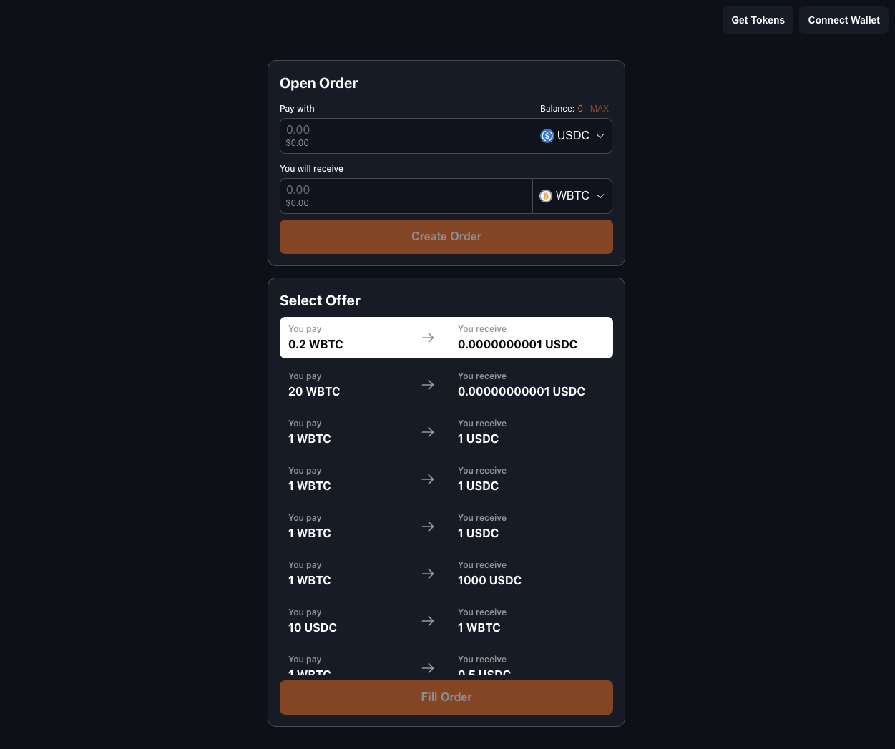

Welcome to the Distributed Crafts frontend interview challenge.

# Introduction

This live coding challenge aims to explore the most of your knowledge. Therefore, something that this challenge is not:


If you feel stuck, we will do our best to help you continue through the challenge so that the process is fair and smooth for everyone.

## About the challenge

**Time:** 1 hour (extensions possible)

During this period, we want to gain a general overview of your knowledge, and observe how you approach and solve challenges in a typical workday setting. Therefore, you should aim to make your code **readable**, **scalable**, and **well-organized with good composition**. Pay special attention to UI/UX, ensuring that it works on both mobile and desktop devices.

**Note:** you are free to use Google, MDN, ChatGPT, etc. Please note that the time spent on these searches will count against the total time allocated for the interview.

This challenge requires an EVM account funded with ETH on our BOB Sepolia network.

The challenge starts with existing code. When you run the app, you will see a header with two buttons: “Get Tokens” (a faucet for ERC20 tokens) and “Connect Wallet” (to connect your EVM wallet). Additionally, there is a card with an incomplete form, which will serve as the starting point for this challenge.

We will be using [BOB Sepolia Explorer](https://testnet-explorer.gobob.xyz/) when we dive into contract interactions, more precisely our [P2P Swap Contract](https://testnet-explorer.gobob.xyz/address/0xE0Fd942cEa2f2e56f26AAC279F8D0F280bF52d7C?tab=contact_code), which is verified.

## Challenge Topics

Here are the prevalent topics that will be covered in this challenge:

1. HTML + CSS
2. a11y
3. React
4. Web3 (wagmi)

# Challenge

You will build the foundation of an ERC20 P2P swap dapp, leveraging a smart contract to create and fulfil swap orders. You will be responsible for writing the necessary code to enable swaps.

## Setup

```sh
$ npm i

$ npm run dev
```

## End Product Example

You can use the image below to guide yourself throughout the challenge.


