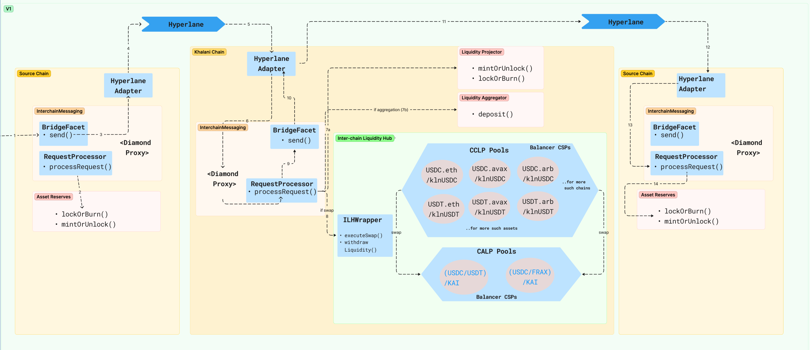

# Khalani Core

Khalani is the first Universal Liquidity Protocol designed from the ground up for the interoperable blockchains. Built to scale permissionlessly with high capital efficiency and security, Khalani is ready to serve as the liquidity foundation for the next 10,000 modular blockchains.

## Useful Links
- [Explore the docs](https://docs.khalani.network/)
- [Try testnet](https://app.testnet.khalani.network/bridge)
- [Request Feature or Bug Report](https://github.com/tvl-labs/khalani-core/issues/new/choose)
---

## Khalani Architecture
- **Application Layer** : Crosschain Apps and SDK
- **Liquidity Layer** : Khalani Interchain Liquidity Hub [Balancer Composable Stable Pool v4](https://docs.balancer.fi/concepts/pools/composable-stable.html)
- **Messaging Transport layer** : [Hyperlane](https://docs.hyperlane.xyz/docs/introduction/readme)

### Architecture


#### [Interchain Messaging](https://github.com/tvl-labs/khalani-core/tree/main/src/InterchainMessaging)
  - ERC-2535: Diamonds, Multi-Facet Proxy contracts to provide end point for [Bridging](https://github.com/tvl-labs/khalani-core/tree/main/src/InterchainMessaging/facets/Bridge) and [Processing request](https://github.com/tvl-labs/khalani-core/tree/main/src/InterchainMessaging/facets/RequestProcessor) from a remote chian

  - Adapter : [AMP Bridge Adapter](https://github.com/tvl-labs/khalani-core/tree/main/src/InterchainMessaging/adapters) contract to integrate with Hyperlane

#### [Asset Reserves](https://github.com/tvl-labs/khalani-core/blob/main/src/LiquidityReserves/remote/IAssetReserves.sol)
  - Khalani uses Asset Reserves on every connected blockchain to keep custody of provided liquidity. Liquidity Providers can supply single or multiple sided
liquidity and expect to withdraw their funds on the same blockchain.

#### [Liquidity Projector](https://github.com/tvl-labs/khalani-core/blob/main/src/LiquidityReserves/khalani/ILiquidityProjector.sol)
  - A Liquidity Projector monitors the balances of all asset reserves on a connected blockchain and issues mirror tokens as depository receipts for liquidity providers. These depository receipts can be used to redeem against the reserves on the original chain, allowing the assets to stay on the original chain, while the claims against them can be traded outside of it. The functioning of a Liquidity Projector relies on cross-chain messaging and it's tightly coupled with a specific ISM. As such, a projected liquidity token can also be viewed as a mirror token that's bundled with the infrastructure risks associated with the external blockchain and the cross-chain messaging mechanisms, as surfaced by the ISMs deployed on the connected blockchain and the Khalani Chain.
 
#### [Liquidity Aggregator](https://github.com/tvl-labs/khalani-core/blob/main/src/LiquidityReserves/khalani/kln/LiquidityAggregator.sol)
  - The Liquidity Aggregator enables Khalani to aggregate multiple chain-specific asset liquidity into chain-agnostic and fungible liquidity. The protocol can then utilize this aggregated fungible liquidity to enable inter-chain value transfers, essentially operating as a cross-chain market maker.
 
#### **Inter-chain Liquidty Hub**
  - **Cross-chain Liquidity Pools (CCLPs)**
   CCLPs are engineered to price inter-chain, same-asset liquidity. Chain-specific, same-asset liquidity (for instance, USDCs from multiple blockchains) are paired with a chain-agnostic Khalani native asset (in this case, klnUSDC). Using a forgiving bonding curve for pricing, these pools allow efficient cross-chain value transfers and incentivize arbitrageurs to maintain equilibrium across various blockchains.
  - **Cross-asset Liquidity Pools (CALPs)**
CALPs bridge similar but different assets, such as USDC, USDT, and other USD-pegged stablecoins. CALPs are paired with Kai, Khalani's native USD-paired stablecoin, allowing liquidity providers to clearly understand their risk exposures.
  -  [Interchain Liquidity Hub Wrapper](https://github.com/tvl-labs/khalani-core/blob/main/src/InterchainLiquidityHub/InterchainLiquidityHubWrapper.sol)
     This contract functions as both a helper and a wrapper, designed to facilitate a swap within the CCLP and CALP. Its purpose is to assist and complete requests originating from other blockchains. Additionally, it provides functions to streamline the process of liquidity withdrawal and transitioning to another chain through a singular request.

---

## Setup
### Dependecies
- Foundry
```
$ curl -L https://foundry.paradigm.xyz | bash
$ source ~/.bashrc # or open a new terminal
$ foundryup
```
### Clone
```
$ git clone --recurse-submodules https://github.com/tvl-labs/khalani-core.git
```
### First time build
```
$ forge install
$ forge build
```

### Regular Build
```
$ forge build
```
In order to run all test 
```
$ forge test
```
