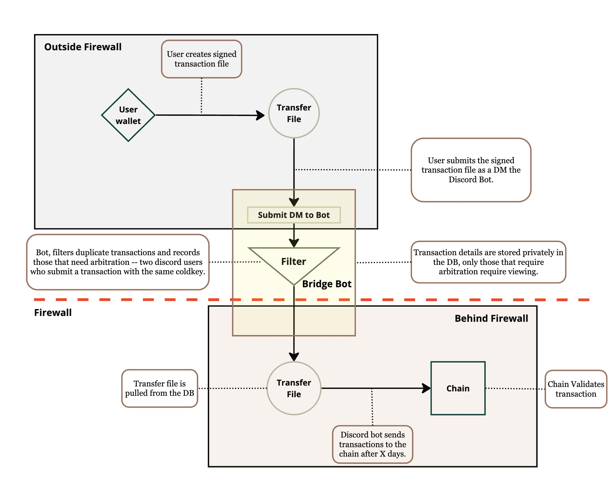

# Safe Transfer

---

## DISCLAIMER

> **If you used a wallet browser extension or wallet application such as the Bittensor Wallet (for Chrome or iOS), SafeWallet, Talisman, Polkadot Vault, Tensor Wallet, Nova Wallet, polkadot.js, or websites that utilize polkadot.js such as Taostats.io for staking unstaking, and or hold you TAO on exchanges, then you SAFE and do not need to follow these instructions.**



---

## Introduction

On July 2nd 2024 the Bittensor network experienced hacks on a number of wallets. In response to this abrupt and large scale attack the Opentensor Foundation decided to firewall the chain ("make the chain un-accessible to further transactions") until the attack could be contained. On the following day we (OTF) discovered that the root cause of the attack came from a compromised Bittensor 6.12.2 version, which was latest on PyPy from May 22nd until May 29th 2024 and which leaked the wallet mnemonic details to the attacker when users called some wallet functions. For a detailed report on this incident, see [Bittensor Community Update — July 3, 2024](https://blog.bittensor.com/bittnesor-community-update-july-3-2024-45661b1d542d).

It is possible that a number of wallets that were actively using the Bittensor CLI at that time were compromised by the attack.

## Purpose of this repository

This repository presents a method, a tool and the instructions to help those users whose wallets were potentially compromised by the attack. **This is an opt-in process. You are not required to participate in this process.**

## Summary steps

This section is for a high-level summary only, before you get started. Detailed step-by-step instructions are provided below in this document. 

### If your wallet is potentially impacted

If you decide to make use of this tool, then below is a summary of the steps for you. Detailed steps are described below this section. 

- Create a `safe_transfer` transaction, i.e., a legitimately signed transfer transaction **from your potentially compromised wallet**. 
- This `safe_transfer` transaction will then be hand-carried by the OTF across the chain firewall and be allowed to execute on the Bittensor Finney network (mainnet). 

**IMPORTANT:** Some of the wallets making these `safe_transfer` transactions could be compromised already, and therefore the attacker could create legitimate transactions which we (OTF) would not be able to detect. To mitigate this risk OTF will run an arbitration process to filter and arbitrate between malicious transactions and those submitted by their previous owners. For details on this arbitration process, please refer to the [Arbitration Process](#step-5-arbitration-process) section at the bottom of this document.

### How to create a safe transfer?

1. **Create the file**: To create a `safe_transfer` transaction, you will run the command, `python safe_transfer.py` which will create a transaction details file. 
2. **Send the file**: You will then send the transaction details file to a verified member of the Bittensor Discord. This verified member will have the Discord username `safe_transfer_helper` within the Discord channel `safe_transfer`.
3. OTF will collect all transaction detail files during a period of X days. The OTF will then filter these transaction detail files according to the arbitration process explained in [Arbitration Process](#step-5-arbitration-process).

---

## Detailed steps

## Step 1: Clone the Repository and Install

Git clone this repository on to your computer from the command line. You can copy and paste the below command. **Please make sure that you use a computer that was not previously compromised.**

```bash
git clone https://github.com/opentensor/safe-transfer.git
```

Next, install the requirements for this repository. There are only two simple requirements: `bittensor>=7.0.0` and `rich` for terminal output colouring.

```bash
cd safe-transfer; python -m pip install -r requirements.txt
```

**BEFORE YOU CONTINUE**: Please check to see if you are running the compromised version of bittensor==6.12.2 before continuing. Run the below command to check.
```
python -c "import bittensor as bt; print('\nThis version of bittensor is COMPROMISED.' if bt.__version__ == '6.12.2' else '\nYour version of bittensor is SAFE')"
```

---

## Step 2: Create a new secure wallet

If you have a non-compromised wallet, please use it. If you do not have it, then create a new wallet. You can create a new wallet any way you prefer, either via a [web wallet](https://bittensor.com/wallet), an iOS wallet, or through the Bittensor cli itself.

If you wish to use the Bittensor CLI to create a new wallet, run the below command:

```bash
# Create the new wallet
btcli wallet new_coldkey --wallet.name MY_NEW_WALLET_NAME
```

List the newly-created wallet address: 

```bash
# List the wallet addresses on the command line
btcli wallet list 
```

Example output:

```bash
$ btcli wallet list 
> Wallets
> ├── 
> │   MY_NEW_WALLET_NAME (5DPB62QK6XsSbuFd9g4QAzqq9P5Pzi32P2wBSRS4jdJGLcew) # This is the wallet SS58 address you will use in the next steps.
```

**You will use the above wallet SS58 address in the next steps.**

---

## Step 3: Regenerate your potentially compromised wallet

On your safe machine, regenerate your potentially compromised wallet so that you can create the transaction. Run the below command by using your preferred name for the regenerated wallet, in place of MY_REGEN_WALLET_NAME:

```bash
# Regnerate your compromised wallet on your safe machine with name MY_REGEN_WALLET_NAME
$ btcli wallet regen_coldkey --wallet.name MY_REGEN_WALLET_NAME
```

---

## Step 4: Generate the transaction file

Run the `python safe_transfer.py` command as follows:

- Provide your MY_REGEN_WALLET_NAME to the `--old_wallet` option. **This is the source wallet for the transfer of the funds.**
- Provide the SS58 address from the above Step 2 to the `--new_wallet_address` option. **This is the destination wallet for the transfer of the funds.**

**BEFORE YOU PROCEED**

1. You must run the `safe_transfer.py` script on a machine where the `old_wallet` exists, that is, where the MY_REGEN_WALLET_NAME exists.
2. The `safe_transfer.py` script does **NOT execute the transfer** of any funds. The script simply creates the transaction details and prints the details to the screen.
3. Make sure that **YOU** own the destination wallet you passed to the option `--new_wallet_address`. For example, check for this wallet on the Bittensor wallet extension. Or run `btcli w list` and confirm that you see the SS58 address of the wallet you are using as a destination wallet for the transfer.

**RUN THE COMMAND**

```bash
# Fill in the < > items with the correct values.
python safe_transfer.py --old_wallet=<the name of your regenerated wallet> --new_wallet_address=<the ss58_address to the new wallet>
```

Example output (example output only):
```bash
python safe_transfer.py --old_wallet=MY_REGEN_WALLET_NAME --new_wallet_address=5DPB62QK6XsSbuFd9g4QAzqq9P5Pzi32P2wBSRS4jdJGLcew
> Print Safe Transfer Transaction?
>        > From wallet name: default with address: 5DPB62QK6XsSbuFd9g4QAzqq9P5Pzi32P2wBSRS4jdJGLcew
>        > To wallet address: 5GhNeygPMJWZ8Z81LeSEXLCXq4Gmtwby7YCHkT1G6nydJU2P

## Provide the password for the old wallet.
> Enter password to unlock key: 

> We have  written the transaction details to the file '/Users/you_user/path/to/dir/safe-transfer/my_transfer_XXXXXXXX.json' in your local directory.
> Find `my_transfer_XXXXXXXX.json`, you will need to send it as an attachment in the following steps from the README.md
```

---

## Step 5: Submit the Transaction File

Follow these instructions to send the transfer **to the right person** who will pass it through to the chain.

- 5.a. Review all the items in the transfer details to ensure you are transferring to and from the correct keys. The destination should be a wallet under your control.
- 5.b. Locate the file `my_transfer_XXXXXXXX.json` which was written by the above script when you ran the `python safe_transfer.py` command. The file will be in the same directory where you ran this command.
- 5.c. Join or enter the Bittensor Discord server by following this link: [https://discord.gg/bittensor](https://discord.gg/bittensor).
- 5.d. Navigate to the `bridge_transfer` channel in the Bittensor Discord and find the message from Const that says "Message this bot with your transaction details file: @bridge_transaction_bot" 
- 5.e. Click on **@bridge_transaction_bot** name/link in Const's post to bring up the bot's profile preview, and then open a private DM with the Bot by entering /help in the field that reads "Message the @bridge_transfer_bot" and pressing `<enter>` or `<return>`.
- 5.f. Ensure that your Discord permissions are permissive enough to talk with users that are not your friends.
      > Go to User Settings > Privacy & Safety on your Discord.
      > Ensure that "Allow direct messages from server members" is enabled.
- 5.g. Type "/help" into the direct message channel with the Bot.
- 5.h. Drag and drop the `my_transfer_XXXXXXX.json` file you previously generated while running `safe_transfer.py` directly into your DM with the bot and hit `<enter>` or `<return>` to send it.
- 5.i. If you changed your permissions in step **5.f.**, change them back after you have successfully sent the file.

---

### Step 6: Arbitration Process

There is a chance that two people submit a transfer signed with the same key within the X days of OTF providing this script. Notably, those two people would be ***you*** and a ***Discord user from the attacking group*** whom have compromised your keys. This is highly unlikely, however we will perform the following steps to try our best to filter out this attack vector.

1. If one of the users has submitted more than 1 transaction which overlaps with another user, then both of their transactions will be discarded. This will force the attacking group to use many unique discord accounts. 

2. If both users have submitted more than 1 transaction which overlaps (required arbitration) we will remove both transactions.

3. If both users have only submitted 1 transaction and there is an overlap, we will ask both to provide a cryptographic signature from an acocunt which previously transfered funds to the wallet address in question prior to July 2nd 2024.

4. If only one can provide the above signature this transfer will be used and the other discarded.

5. If both users can provide this signature or if none can provide this signature we will take into account both the time when the user entered the Bittensor Discord and how active the user is in the Discord as indication of legitimacy -- in this event we may reach out the community at large for help referencing the user, however there is no guarantee that this process will be conclusive.

6. If step 5 remains inconclusive we will discard both transactions and not pass them through to the chain.

This arbitration process is designed to maximize the chances of legitimate transactions being processed while minimizing the risk of processing transactions from compromised wallets. However, there may still be cases with extremely low probability that we cannot determine the legitimacy of the keys. 

```bash
# The MIT License (MIT)
# Copyright © 2024 Opentensor Foundation

# Permission is hereby granted, free of charge, to any person obtaining a copy of this software and associated
# documentation files (the “Software”), to deal in the Software without restriction, including without limitation
# the rights to use, copy, modify, merge, publish, distribute, sublicense, and/or sell copies of the Software,
# and to permit persons to whom the Software is furnished to do so, subject to the following conditions:

# The above copyright notice and this permission notice shall be included in all copies or substantial portions of
# the Software.

# THE SOFTWARE IS PROVIDED “AS IS”, WITHOUT WARRANTY OF ANY KIND, EXPRESS OR IMPLIED, INCLUDING BUT NOT LIMITED TO
# THE WARRANTIES OF MERCHANTABILITY, FITNESS FOR A PARTICULAR PURPOSE AND NONINFRINGEMENT. IN NO EVENT SHALL
# THE AUTHORS OR COPYRIGHT HOLDERS BE LIABLE FOR ANY CLAIM, DAMAGES OR OTHER LIABILITY, WHETHER IN AN ACTION
# OF CONTRACT, TORT OR OTHERWISE, ARISING FROM, OUT OF OR IN CONNECTION WITH THE SOFTWARE OR THE USE OR OTHER
# DEALINGS IN THE SOFTWARE.
```
