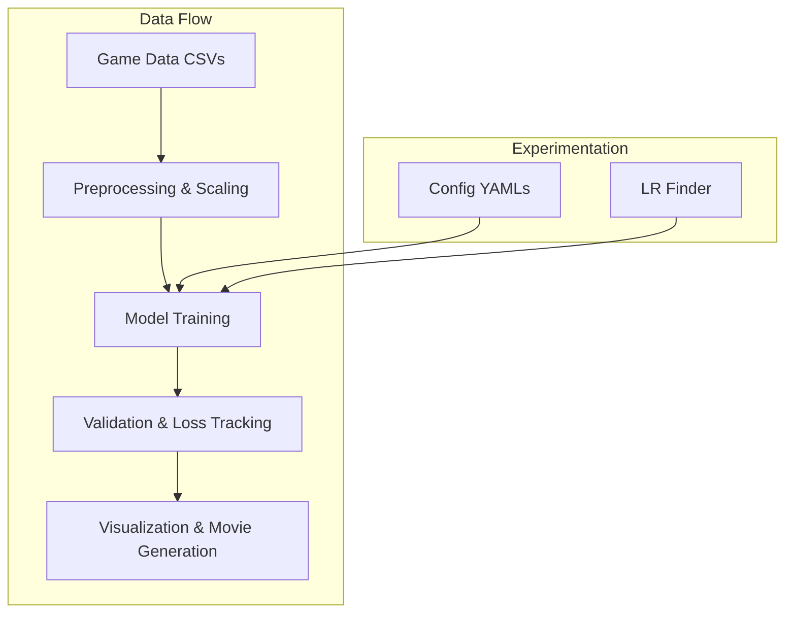

# Football Neural Network Models

This repository contains a suite of PyTorch models and tools for predicting soccer outcomes from player and ball positions and velocities. The project supports a variety of architectures, from simple baselines to physics-inspired and spatial reasoning models.

---

## Model Overview

| Model Name           | Description                                                                                                 |
|----------------------|-------------------------------------------------------------------------------------------------------------|
| **simple**           | A small MLP that uses only the ball's position and velocity as input. Good baseline for ball-centric tasks. |
| **deep**             | A much deeper MLP (many layers) using only ball position and velocity. Tests the effect of depth alone.     |
| **full**             | Processes ball and both teams' player positions with separate subnetworks, then combines them.              |
| **ball_anticipation**| Physics-inspired: learns to anticipate the ball's future position using velocity, friction, and Δt.         |
| **spatial_influence**| Builds spatial "influence maps" for each team and the ball, using learnable smoothing and CNNs.             |
| **shallow_spatial**  | A lighter version of spatial_influence with fewer convolutional and dense layers.                           |
| **shallower_spatial**| The simplest spatial model: a single convolutional layer and linear output.                                 |
| **goalie**           | Combines ball anticipation with a subnetwork that models the effect of the goalkeeper's position.           |

**Modeling Ideas:**
- Ball-centric models focus on the ball's state and physics.
- Full and goalie models incorporate both teams' player positions for richer tactical context.
- Spatial models convert player and ball positions into field-wide influence maps, allowing the network to reason about space and possession.
- Physics-inspired models explicitly model ball motion using learnable physical parameters (friction, time step).

---

## Workflow Diagram



---

## Parameter Reference Guide

### Training Parameters

| Parameter         | Type    | Description                                                                                 |
|-------------------|---------|---------------------------------------------------------------------------------------------|
| `seed`            | int     | Random seed for reproducibility.                                                            |
| `batch_size`      | int     | Number of samples per training batch. Larger values use more memory but can speed up training.|
| `learning_rate`   | float   | Initial learning rate for the optimizer.                                                    |
| `epochs`          | int     | Number of full passes through the training data.                                            |
| `train_split`     | float   | Fraction of data files used for training (e.g., 0.8 = 80%).                                |
| `val_split`       | float   | Fraction of data files used for validation.                                                 |
| `scheduler`       | dict    | Learning rate scheduler settings (see below).                                               |

#### Scheduler Sub-Parameters

| Parameter   | Type    | Description                                                                                      |
|-------------|---------|--------------------------------------------------------------------------------------------------|
| `type`      | str     | Scheduler type (e.g., `ReduceLROnPlateau`).                                                     |
| `factor`    | float   | Multiplicative factor for reducing the learning rate (e.g., 0.5 halves the LR).                 |
| `patience`  | int     | Number of epochs with no improvement before reducing the LR.                                     |
| `min_lr`    | float   | Minimum learning rate allowed.                                                                  |

### Model Parameters

| Parameter             | Type    | Description                                                                                 |
|-----------------------|---------|---------------------------------------------------------------------------------------------|
| `type`                | str     | Model type/architecture (e.g., `simple`, `full`, `deep`, `spatial_influence`, etc.).        |
| `name`                | str     | Human-readable name for the model.                                                          |
| `grid_size`           | [int,int]| (Spatial models) Discretization of the field: `[height, width]` (e.g., `[50, 80]`).         |
| `initial_sigma_player`| float   | (Spatial models) Initial smoothing parameter for player influence (in meters).               |
| `initial_sigma_ball`  | float   | (Spatial models) Initial smoothing parameter for ball influence (in meters).                 |
| `initial_delta_t`     | float   | (Physics models) Initial time step for ball anticipation (in seconds).                       |
| `initial_friction`    | float   | (Physics models) Initial friction coefficient for ball deceleration.                         |

### Data Parameters

| Parameter     | Type    | Description                                                                                     |
|---------------|---------|-------------------------------------------------------------------------------------------------|
| `data_dir`    | str     | Directory containing the CSV files with game state data.                                        |

### Output Parameters

| Parameter     | Type    | Description                                                                                     |
|---------------|---------|-------------------------------------------------------------------------------------------------|
| `base_dir`    | str     | Base directory for saving model outputs, checkpoints, and visualizations.                       |

---

## Example: `configs/spatial_influence.yaml`

```yaml
training:
  seed: 42
  batch_size: 256
  learning_rate: 0.001
  epochs: 500
  train_split: 0.8
  val_split: 0.1
  scheduler:
    type: 'ReduceLROnPlateau'
    factor: 0.5
    patience: 10
    min_lr: 1e-6

model:
  type: 'spatial_influence'
  name: 'spatial_influence'
  grid_size: [50, 80]
  initial_sigma_player: 5.0
  initial_sigma_ball: 3.0
  initial_delta_t: 1.0
  initial_friction: 0.1

data:
  data_dir: 'data'

output:
  base_dir: 'outputs'
```

---

## Tips

- **Batch Size:** Increase for faster training if you have enough GPU/CPU memory. Decrease if you get out-of-memory errors.
- **Learning Rate:** Use the learning rate finder to select a good initial value.
- **Scheduler:** Adjust `patience` and `factor` if the learning rate drops too quickly or too slowly.
- **Grid Size:** Finer grids (larger numbers) give more spatial detail but use more memory and computation.
- **Model Type:** Choose the model architecture that best fits your experiment (see `simlearn/approaches/models/` for options).

For more details on each model, see the docstrings in their respective Python files.


## Thoughts

My initial feeling is that (i) we need 100x more simulated data for good learning without overfitting and (ii) I need to rewrite the simulations to have perfect player symmetry and (iii) probably use symmetric neural network constructs and (iv) going to need some grunt and should decide on the most cost effective way to train.
