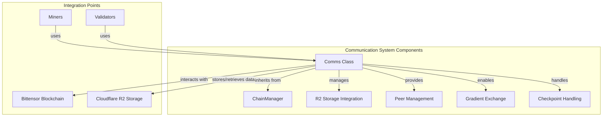
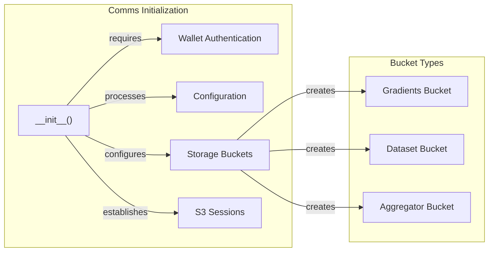
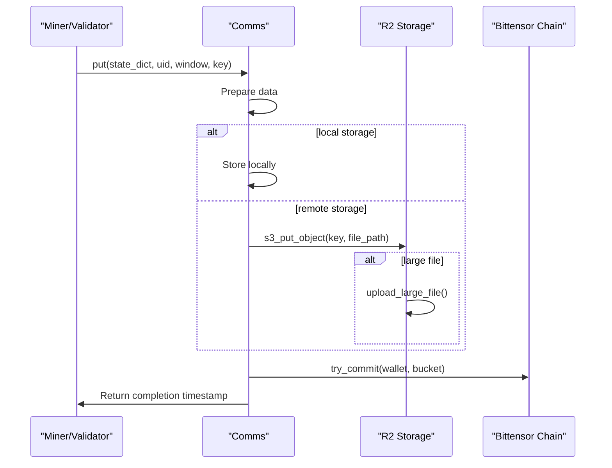
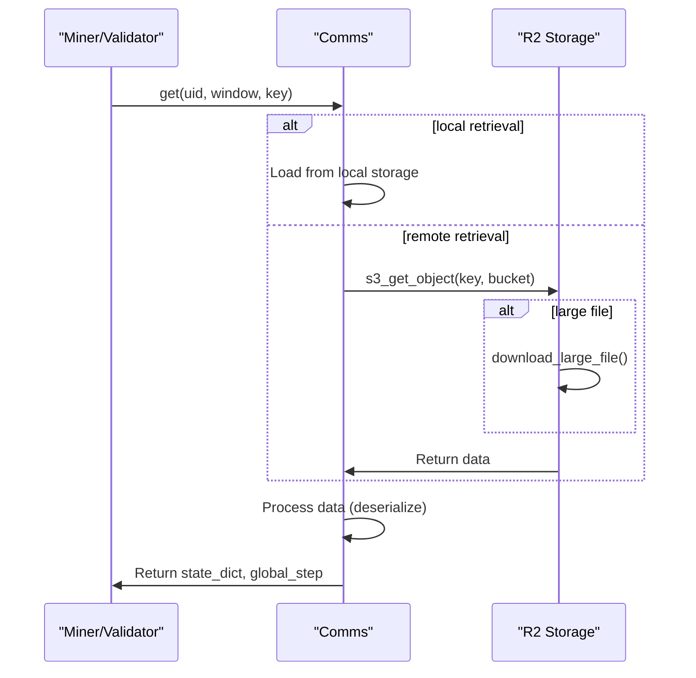
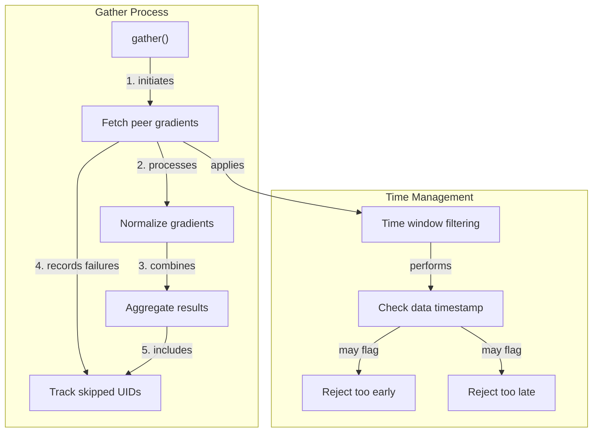
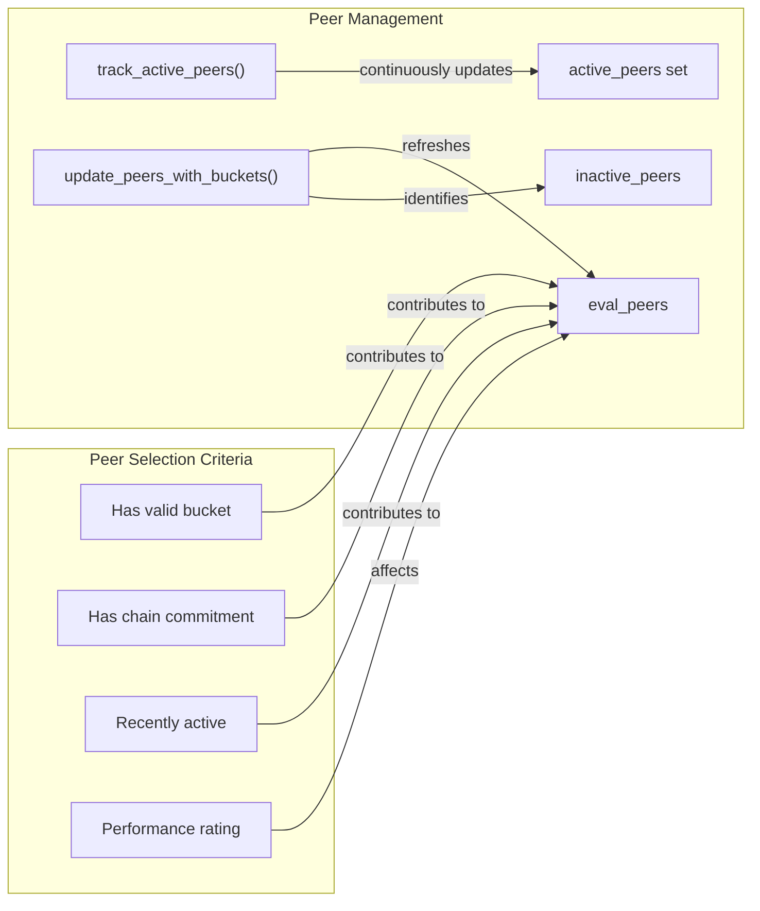
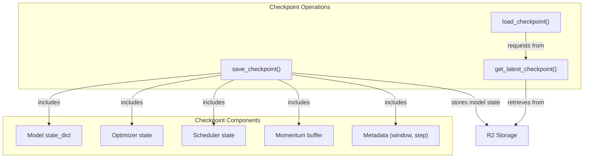

---

title: "Communication System"

---


import CollapsibleAside from '@components/CollapsibleAside.astro';

import SourceLink from '@components/SourceLink.astro';


<CollapsibleAside title="Relevant Source Files">

  <SourceLink text="ecosystem.config.js" href="https://github.com/tplr-ai/templar/blob/bb2fc2a9/ecosystem.config.js" />

  <SourceLink text="hparams.json" href="https://github.com/tplr-ai/templar/blob/bb2fc2a9/hparams.json" />

  <SourceLink text="neurons/miner.py" href="https://github.com/tplr-ai/templar/blob/bb2fc2a9/neurons/miner.py" />

  <SourceLink text="neurons/validator.py" href="https://github.com/tplr-ai/templar/blob/bb2fc2a9/neurons/validator.py" />

  <SourceLink text="pyproject.toml" href="https://github.com/tplr-ai/templar/blob/bb2fc2a9/pyproject.toml" />

  <SourceLink text="src/tplr/__init__.py" href="https://github.com/tplr-ai/templar/blob/bb2fc2a9/src/tplr/__init__.py" />

  <SourceLink text="src/tplr/comms.py" href="https://github.com/tplr-ai/templar/blob/bb2fc2a9/src/tplr/comms.py" />

  <SourceLink text="tests/test_comms.py" href="https://github.com/tplr-ai/templar/blob/bb2fc2a9/tests/test_comms.py" />

  <SourceLink text="uv.lock" href="https://github.com/tplr-ai/templar/blob/bb2fc2a9/uv.lock" />

</CollapsibleAside>


The Communication System in Templar provides a robust data exchange mechanism for distributed training across the network. It manages gradient sharing, checkpoint synchronization, peer coordination, and storage integration to enable effective communication between miners and validators. This page covers the core communication infrastructure, while related topics such as checkpoint specifics and blockchain integration are covered in [Checkpoint Management](/communication-system/checkpoint-management#6.1) and [Chain Integration](/communication-system/chain-integration#6.2).

## Architecture Overview

The Communication System is built around the `Comms` class, which serves as a centralized interface for all network communication operations. It inherits from `ChainManager` to integrate with the Bittensor blockchain and leverages Cloudflare R2 storage for data persistence.



Sources: <SourceLink text="src/tplr/comms.py:64-121" href="https://github.com/tplr-ai/templar/blob/bb2fc2a9/src/tplr/comms.py#L64-L121" />. <SourceLink text="neurons/miner.py:174-188" href="https://github.com/tplr-ai/templar/blob/bb2fc2a9/neurons/miner.py#L174-L188" />. <SourceLink text="neurons/validator.py:208-220" href="https://github.com/tplr-ai/templar/blob/bb2fc2a9/neurons/validator.py#L208-L220" />.

## Core Functionality

### Initialization and Configuration

The `Comms` class is initialized with a wallet, configuration, and references to the network context. It sets up connections to R2 storage buckets and prepares for blockchain interactions.



Sources: <SourceLink text="src/tplr/comms.py:64-121" href="https://github.com/tplr-ai/templar/blob/bb2fc2a9/src/tplr/comms.py#L64-L121" />. <SourceLink text="src/tplr/comms.py:174-220" href="https://github.com/tplr-ai/templar/blob/bb2fc2a9/src/tplr/comms.py#L174-L220" />.

### Storage Integration

The Communication System uses Cloudflare R2 for persistent storage of gradients, model checkpoints, and peer information. It manages connections to different buckets and handles data serialization/deserialization.

| Bucket Type | Purpose | Access Control |
|-------------|---------|----------------|
| Gradients | Stores gradient updates from miners | Read/Write separated |
| Dataset | Contains training datasets | Read-only for most users |
| Aggregator | Stores aggregated model states | Managed access |

The system provides efficient methods for large file handling through multipart uploads and downloads.

Sources: <SourceLink text="src/tplr/comms.py:122-169" href="https://github.com/tplr-ai/templar/blob/bb2fc2a9/src/tplr/comms.py#L122-L169" />. <SourceLink text="src/tplr/comms.py:322-389" href="https://github.com/tplr-ai/templar/blob/bb2fc2a9/src/tplr/comms.py#L322-L389" />. <SourceLink text="src/tplr/comms.py:476-683" href="https://github.com/tplr-ai/templar/blob/bb2fc2a9/src/tplr/comms.py#L476-L683" />.

### Data Exchange

#### Put Operations



Sources: <SourceLink text="src/tplr/comms.py:322-371" href="https://github.com/tplr-ai/templar/blob/bb2fc2a9/src/tplr/comms.py#L322-L371" />. <SourceLink text="src/tplr/comms.py:476-573" href="https://github.com/tplr-ai/templar/blob/bb2fc2a9/src/tplr/comms.py#L476-L573" />. <SourceLink text="neurons/miner.py:417-435" href="https://github.com/tplr-ai/templar/blob/bb2fc2a9/neurons/miner.py#L417-L435" />.

#### Get Operations



Sources: <SourceLink text="src/tplr/comms.py:372-474" href="https://github.com/tplr-ai/templar/blob/bb2fc2a9/src/tplr/comms.py#L372-L474" />. <SourceLink text="src/tplr/comms.py:574-683" href="https://github.com/tplr-ai/templar/blob/bb2fc2a9/src/tplr/comms.py#L574-L683" />.

### Gradient Gathering

The gradient gathering process is central to Templar's distributed training approach. Validators collect gradient updates from multiple miners, normalize them, and apply them to update their models.



Sources: <SourceLink text="src/tplr/comms.py:684-1118" href="https://github.com/tplr-ai/templar/blob/bb2fc2a9/src/tplr/comms.py#L684-L1118" />. <SourceLink text="neurons/validator.py:827-846" href="https://github.com/tplr-ai/templar/blob/bb2fc2a9/neurons/validator.py#L827-L846" />. <SourceLink text="neurons/miner.py:489-501" href="https://github.com/tplr-ai/templar/blob/bb2fc2a9/neurons/miner.py#L489-L501" />.

## Peer Management

The Communication System incorporates sophisticated peer management to ensure efficient and fair participation in the training process.

### Peer Selection and Tracking



Sources: <SourceLink text="src/tplr/comms.py:1228-1386" href="https://github.com/tplr-ai/templar/blob/bb2fc2a9/src/tplr/comms.py#L1228-L1386" />. <SourceLink text="neurons/validator.py:695-704" href="https://github.com/tplr-ai/templar/blob/bb2fc2a9/neurons/validator.py#L695-L704" />. <SourceLink text="neurons/miner.py:477-485" href="https://github.com/tplr-ai/templar/blob/bb2fc2a9/neurons/miner.py#L477-L485" />.

### Peer List Management

The system manages peer lists to coordinate which nodes should communicate with each other during different training windows.

| Method | Purpose | 
|--------|---------|
| `post_peer_list` | Publishes a list of selected peers for a future window |
| `get_peer_list` | Retrieves the peer list for the current window |
| `update_peers_with_buckets` | Refreshes peer information with storage access |

Sources: <SourceLink text="src/tplr/comms.py:1228-1336" href="https://github.com/tplr-ai/templar/blob/bb2fc2a9/src/tplr/comms.py#L1228-L1336" />. <SourceLink text="neurons/validator.py:678-686" href="https://github.com/tplr-ai/templar/blob/bb2fc2a9/neurons/validator.py#L678-L686" />.

## Checkpoint Management

The Communication System provides mechanisms for saving and loading model checkpoints to enable consistent model state across the network.



Sources: <SourceLink text="src/tplr/comms.py:1489-1566" href="https://github.com/tplr-ai/templar/blob/bb2fc2a9/src/tplr/comms.py#L1489-L1566" />. <SourceLink text="src/tplr/comms.py:1567-1677" href="https://github.com/tplr-ai/templar/blob/bb2fc2a9/src/tplr/comms.py#L1567-L1677" />. <SourceLink text="neurons/miner.py:727-747" href="https://github.com/tplr-ai/templar/blob/bb2fc2a9/neurons/miner.py#L727-L747" />. <SourceLink text="neurons/validator.py:582-602" href="https://github.com/tplr-ai/templar/blob/bb2fc2a9/neurons/validator.py#L582-L602" />.

## Error Handling and Resilience

The Communication System incorporates several mechanisms to ensure reliable operation in a distributed environment:

1. **Retry Logic**: Automatic retries for network operations with exponential backoff
2. **Client Reconnection**: Purging and recreation of S3 clients when connection issues occur
3. **Stale Data Cleanup**: Regular removal of outdated data from both local and remote storage
4. **Timeout Handling**: Graceful handling of operations that exceed time limits
5. **Concurrency Control**: Semaphores to limit the number of concurrent operations

Sources: <SourceLink text="src/tplr/comms.py:366-371" href="https://github.com/tplr-ai/templar/blob/bb2fc2a9/src/tplr/comms.py#L366-L371" />. <SourceLink text="src/tplr/comms.py:484-497" href="https://github.com/tplr-ai/templar/blob/bb2fc2a9/src/tplr/comms.py#L484-L497" />. <SourceLink text="src/tplr/comms.py:237-258" href="https://github.com/tplr-ai/templar/blob/bb2fc2a9/src/tplr/comms.py#L237-L258" />.

## Integration with Neurons

Both miners and validators integrate with the Communication System to participate in the distributed training process.

### Miner Integration

Miners use the Communication System to:
- Retrieve model checkpoints to align with the network state
- Upload their own gradient updates
- Gather peer gradients to update their models
- Share debug information and metrics

```python
# Miner initialization of Comms
self.comms = tplr.comms.Comms(
    wallet=self.wallet,
    save_location="/tmp",
    key_prefix="model",
    config=self.config,
    netuid=self.config.netuid,
    metagraph=self.metagraph,
    hparams=self.hparams,
    uid=self.uid,
)
```

Sources: <SourceLink text="neurons/miner.py:174-188" href="https://github.com/tplr-ai/templar/blob/bb2fc2a9/neurons/miner.py#L174-L188" />. <SourceLink text="neurons/miner.py:417-435" href="https://github.com/tplr-ai/templar/blob/bb2fc2a9/neurons/miner.py#L417-L435" />. <SourceLink text="neurons/miner.py:489-501" href="https://github.com/tplr-ai/templar/blob/bb2fc2a9/neurons/miner.py#L489-L501" />.

### Validator Integration

Validators use the Communication System to:
- Maintain the latest model state via checkpoints
- Gather gradients from miners for evaluation
- Post peer lists to coordinate network communication
- Commit storage information to the blockchain

```python
# Validator gradient gathering
gather_result = await self.comms.gather(
    my_uid=self.uid,
    uids=self.comms.peers,
    window=self.sync_window,
    key="gradient",
    timeout=35,
    device=self.config.device,
    local=False,
    totalks=self.totalks,
    time_min=time_min,
    time_max=time_max,
)
```

Sources: <SourceLink text="neurons/validator.py:208-220" href="https://github.com/tplr-ai/templar/blob/bb2fc2a9/neurons/validator.py#L208-L220" />. <SourceLink text="neurons/validator.py:678-686" href="https://github.com/tplr-ai/templar/blob/bb2fc2a9/neurons/validator.py#L678-L686" />. <SourceLink text="neurons/validator.py:827-846" href="https://github.com/tplr-ai/templar/blob/bb2fc2a9/neurons/validator.py#L827-L846" />.

## Performance Considerations

The Communication System is designed for efficiency in a distributed environment:

1. **Chunked Transfers**: Large files are processed in manageable chunks
2. **Resource Optimization**: Adaptive resource allocation based on available CPU/GPU
3. **Persistent Connections**: S3 clients are reused to avoid connection overhead
4. **Concurrent Operations**: Parallel processing of multiple data transfers
5. **Time Window Filtering**: Implements temporal boundaries for data relevance

Sources: <SourceLink text="src/tplr/comms.py:476-573" href="https://github.com/tplr-ai/templar/blob/bb2fc2a9/src/tplr/comms.py#L476-L573" />. <SourceLink text="src/tplr/comms.py:574-683" href="https://github.com/tplr-ai/templar/blob/bb2fc2a9/src/tplr/comms.py#L574-L683" />. <SourceLink text="src/tplr/comms.py:122-147" href="https://github.com/tplr-ai/templar/blob/bb2fc2a9/src/tplr/comms.py#L122-L147" />.

## Configuration

The Communication System is configured through:

1. **Environment Variables**: R2 credentials and bucket information
2. **Hyperparameters**: Network settings from the hparams configuration
3. **Runtime Parameters**: Passed during neuron initialization

Key configuration parameters include:

| Parameter | Purpose | Source |
|-----------|---------|--------|
| `active_check_interval` | Frequency for checking peer activity | hparams.json |
| `recent_windows` | Number of windows to check for activity | hparams.json |
| `peer_replacement_frequency` | How often to update peer lists | hparams.json |
| `time_window_delta_seconds` | Temporal boundary for data relevance | hparams.json |

Sources: <SourceLink text="src/tplr/comms.py:64-121" href="https://github.com/tplr-ai/templar/blob/bb2fc2a9/src/tplr/comms.py#L64-L121" />. <SourceLink text="hparams.json:38-46" href="https://github.com/tplr-ai/templar/blob/bb2fc2a9/hparams.json#L38-L46" />.

## Summary

The Communication System is a fundamental component of Templar that enables decentralized training by facilitating efficient data exchange between miners and validators. Through integration with Cloudflare R2 storage and the Bittensor blockchain, it provides a reliable infrastructure for gradient sharing, checkpoint synchronization, and peer coordination.