---

title: "Chain Integration"

---


import CollapsibleAside from '@components/CollapsibleAside.astro';

import SourceLink from '@components/SourceLink.astro';


<CollapsibleAside title="Relevant Source Files">

  <SourceLink text="ecosystem.config.js" href="https://github.com/tplr-ai/templar/blob/bb2fc2a9/ecosystem.config.js" />

  <SourceLink text="hparams.json" href="https://github.com/tplr-ai/templar/blob/bb2fc2a9/hparams.json" />

  <SourceLink text="neurons/miner.py" href="https://github.com/tplr-ai/templar/blob/bb2fc2a9/neurons/miner.py" />

  <SourceLink text="neurons/validator.py" href="https://github.com/tplr-ai/templar/blob/bb2fc2a9/neurons/validator.py" />

  <SourceLink text="src/tplr/__init__.py" href="https://github.com/tplr-ai/templar/blob/bb2fc2a9/src/tplr/__init__.py" />

  <SourceLink text="src/tplr/chain.py" href="https://github.com/tplr-ai/templar/blob/bb2fc2a9/src/tplr/chain.py" />

  <SourceLink text="src/tplr/comms.py" href="https://github.com/tplr-ai/templar/blob/bb2fc2a9/src/tplr/comms.py" />

  <SourceLink text="src/tplr/compress.py" href="https://github.com/tplr-ai/templar/blob/bb2fc2a9/src/tplr/compress.py" />

  <SourceLink text="src/tplr/neurons.py" href="https://github.com/tplr-ai/templar/blob/bb2fc2a9/src/tplr/neurons.py" />

  <SourceLink text="tests/test_model_comparison.py" href="https://github.com/tplr-ai/templar/blob/bb2fc2a9/tests/test_model_comparison.py" />

</CollapsibleAside>


## Purpose and Scope

This document explains how Templar integrates with the Bittensor blockchain to enable decentralized model training. It covers the core components responsible for blockchain interaction, commitment management, block processing, window tracking, and peer management. For information about model checkpoint management, see [Checkpoint Management](/communication-system/checkpoint-management#6.1).

## Chain Architecture Overview

The following diagram illustrates how Templar interacts with the Bittensor blockchain:

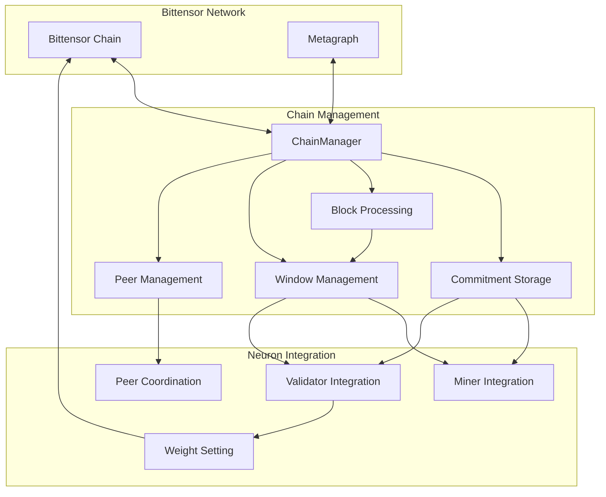

Sources: <SourceLink text="src/tplr/chain.py:37-487" href="https://github.com/tplr-ai/templar/blob/bb2fc2a9/src/tplr/chain.py#L37-L487" />, <SourceLink text="src/tplr/comms.py:64-102" href="https://github.com/tplr-ai/templar/blob/bb2fc2a9/src/tplr/comms.py#L64-L102" />

## ChainManager Class

The foundation of Templar's blockchain integration is the `ChainManager` class. It provides methods for committing and retrieving data from the chain, monitoring blocks, and managing peer relationships.

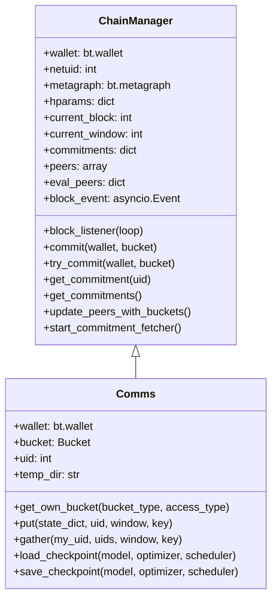

Sources: <SourceLink text="src/tplr/chain.py:37-49" href="https://github.com/tplr-ai/templar/blob/bb2fc2a9/src/tplr/chain.py#L37-L49" />, <SourceLink text="src/tplr/comms.py:64-102" href="https://github.com/tplr-ai/templar/blob/bb2fc2a9/src/tplr/comms.py#L64-L102" />

## Commitment System

Templar uses chain commitments to securely store and share access information for R2 storage buckets. Each neuron commits its bucket details to the blockchain, allowing other nodes to retrieve this information for data exchange.

### Commitment Format

Commitments follow a fixed format of concatenated strings:
- `account_id`: 32 characters
- `access_key_id`: 32 characters 
- `secret_access_key`: 64 characters

Total length: 128 characters

### Commitment Flow

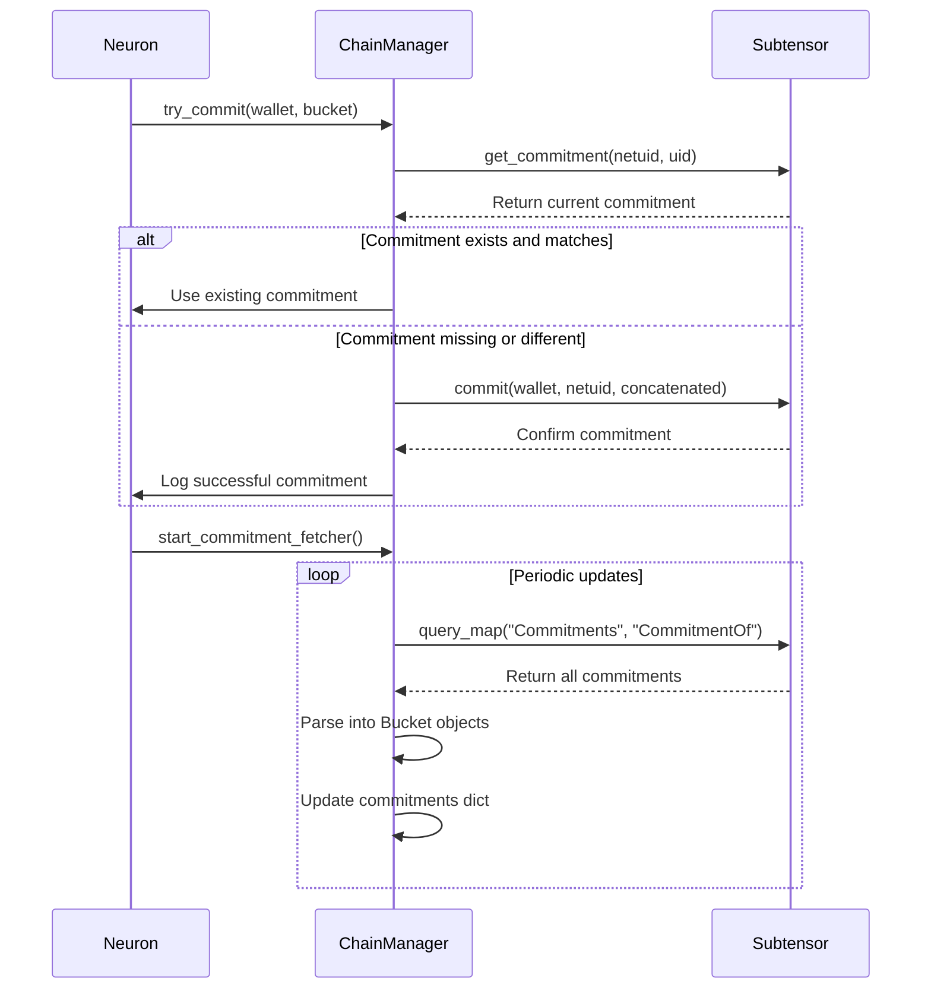

Sources: <SourceLink text="src/tplr/chain.py:174-233" href="https://github.com/tplr-ai/templar/blob/bb2fc2a9/src/tplr/chain.py#L174-L233" />, <SourceLink text="src/tplr/chain.py:304-397" href="https://github.com/tplr-ai/templar/blob/bb2fc2a9/src/tplr/chain.py#L304-L397" />

## Block and Window Management

Templar uses blockchain blocks to synchronize the training process across the network. Blocks are grouped into windows based on the `blocks_per_window` parameter, with each window driving a training iteration.

### Block Listener

Each neuron runs a background thread that subscribes to block headers from the Bittensor network. When a new block arrives, it updates the current block number and recalculates the current window if needed.

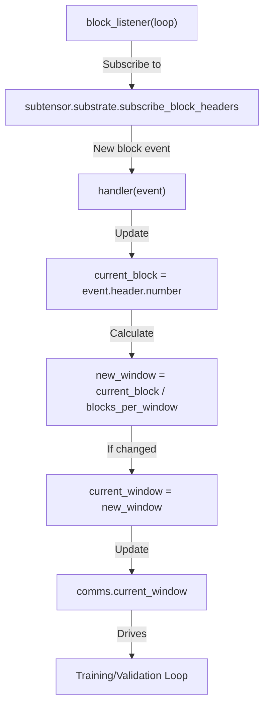

Sources: <SourceLink text="src/tplr/chain.py:143-172" href="https://github.com/tplr-ai/templar/blob/bb2fc2a9/src/tplr/chain.py#L143-L172" />, <SourceLink text="neurons/miner.py:757-777" href="https://github.com/tplr-ai/templar/blob/bb2fc2a9/neurons/miner.py#L757-L777" />, <SourceLink text="neurons/validator.py:522-525" href="https://github.com/tplr-ai/templar/blob/bb2fc2a9/neurons/validator.py#L522-L525" />

### Window-Based Training

The window concept is central to Templar's training process:

1. **Global Step**: Calculated as `current_window - start_window`, tracking overall training progress
2. **Window Synchronization**: Miners and validators wait for window transitions to coordinate actions
3. **Learning Rate Schedule**: Tied to the global step for coordinated optimization
4. **Start Window Coordination**: Ensures all neurons begin training from the same point

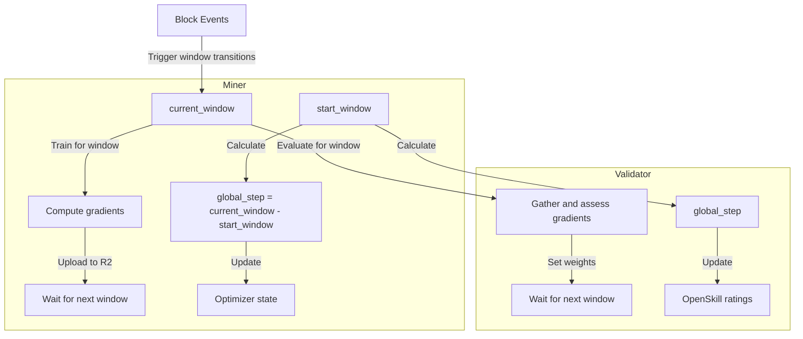

Sources: <SourceLink text="neurons/miner.py:229-325" href="https://github.com/tplr-ai/templar/blob/bb2fc2a9/neurons/miner.py#L229-L325" />, <SourceLink text="neurons/validator.py:516-567" href="https://github.com/tplr-ai/templar/blob/bb2fc2a9/neurons/validator.py#L516-L567" />

## Peer Management

The blockchain integration enables coordinated peer management for training and evaluation.

### Commitment-Based Peer Discovery

Templar discovers and filters peers by retrieving and processing commitments from the blockchain:

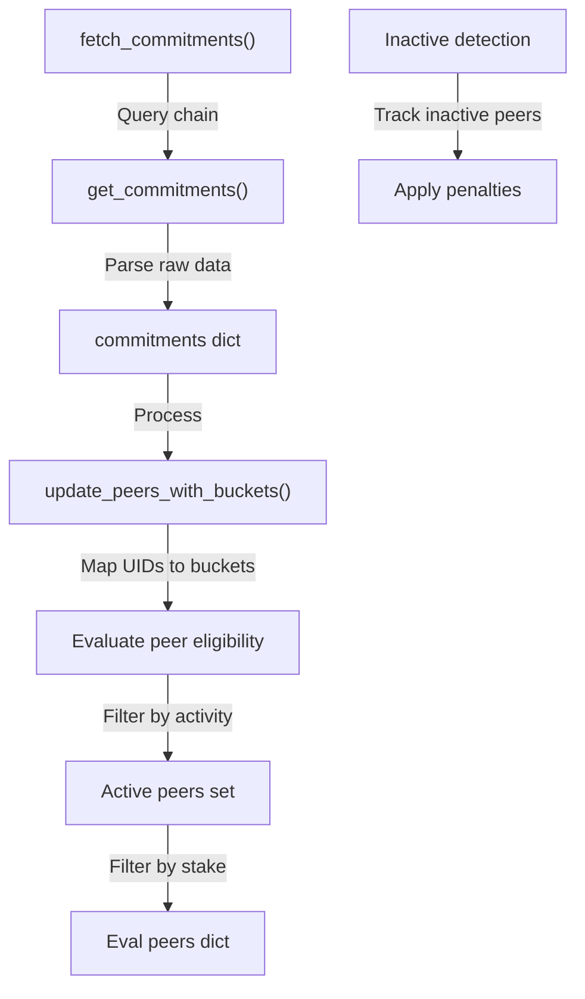

Sources: <SourceLink text="src/tplr/chain.py:418-427" href="https://github.com/tplr-ai/templar/blob/bb2fc2a9/src/tplr/chain.py#L418-L427" />, <SourceLink text="src/tplr/chain.py:448-487" href="https://github.com/tplr-ai/templar/blob/bb2fc2a9/src/tplr/chain.py#L448-L487" />

### Peer Selection and Distribution

Validators select and distribute peer lists for coordinated training:

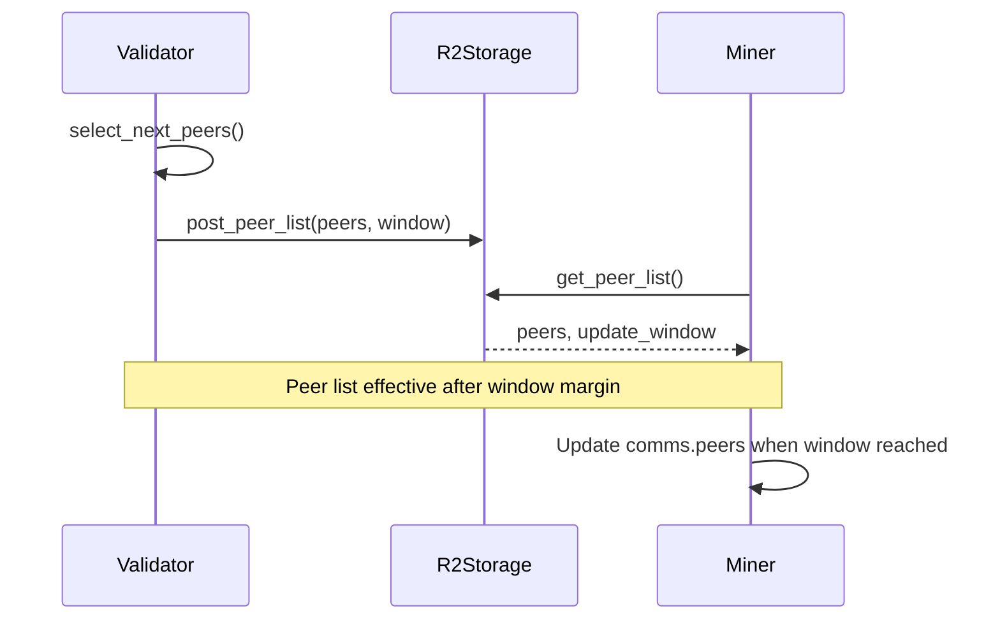

Sources: <SourceLink text="neurons/validator.py:674-686" href="https://github.com/tplr-ai/templar/blob/bb2fc2a9/neurons/validator.py#L674-L686" />, <SourceLink text="src/tplr/neurons.py:127-197" href="https://github.com/tplr-ai/templar/blob/bb2fc2a9/src/tplr/neurons.py#L127-L197" />

## Code Implementation

### ChainManager Initialization

Both miners and validators initialize the chain components as part of their setup:

```python
# In both Miner.__init__ and Validator.__init__
self.wallet = bt.wallet(config=self.config)
self.subtensor = bt.subtensor(config=self.config)
self.metagraph = self.subtensor.metagraph(self.config.netuid)
if self.wallet.hotkey.ss58_address not in self.metagraph.hotkeys:
    tplr.logger.error(f"The wallet {self.wallet} is not registered on subnet: {self.metagraph.netuid}")
    sys.exit()
self.uid = self.metagraph.hotkeys.index(self.wallet.hotkey.ss58_address)

# Initialize Comms with chain components
self.comms = tplr.comms.Comms(
    wallet=self.wallet,
    save_location="/tmp",
    key_prefix="model",
    config=self.config,
    netuid=self.config.netuid,
    metagraph=self.metagraph,
    hparams=self.hparams,
    uid=self.uid,
)
```

Sources: <SourceLink text="neurons/miner.py:107-143" href="https://github.com/tplr-ai/templar/blob/bb2fc2a9/neurons/miner.py#L107-L143" />, <SourceLink text="neurons/validator.py:134-174" href="https://github.com/tplr-ai/templar/blob/bb2fc2a9/neurons/validator.py#L134-L174" />

### Commitment Management

The commitment system securely stores and retrieves bucket information:

```python
# Checking and updating commitments
self.bucket = self.comms.get_own_bucket("gradients", "read")
self.comms.try_commit(self.wallet, self.bucket)

# Retrieving and parsing commitments
self.comms.commitments = await self.comms.get_commitments()
```

The `try_commit` method checks if the current bucket configuration matches what's on the chain and updates it if needed:

```python
def try_commit(self, wallet: Wallet, bucket: Bucket) -> None:
    # Get existing commitment
    commitment = self.get_commitment(self.metagraph.hotkeys.index(wallet.hotkey.ss58_address))
    
    # Compare with current bucket details
    if bucket_details_from_env != commitment_str:
        self.commit(wallet, bucket)
```

Sources: <SourceLink text="src/tplr/chain.py:174-233" href="https://github.com/tplr-ai/templar/blob/bb2fc2a9/src/tplr/chain.py#L174-L233" />, <SourceLink text="neurons/miner.py:246-247" href="https://github.com/tplr-ai/templar/blob/bb2fc2a9/neurons/miner.py#L246-L247" />

### Block Listener Implementation

The block listener thread monitors blockchain events:

```python
# Starting the listener thread
self.listener = threading.Thread(
    target=self.block_listener,
    args=(self.loop,),
    daemon=True,
).start()
```

The handler updates state based on new blocks:

```python
def handler(event):
    self.current_block = int(event["header"]["number"])
    if int(self.current_block / self.hparams.blocks_per_window) != self.current_window:
        self.current_window = int(self.current_block / self.hparams.blocks_per_window)
        self.comms.current_window = self.current_window
```

Sources: <SourceLink text="neurons/miner.py:235-240" href="https://github.com/tplr-ai/templar/blob/bb2fc2a9/neurons/miner.py#L235-L240" />, <SourceLink text="src/tplr/chain.py:155-166" href="https://github.com/tplr-ai/templar/blob/bb2fc2a9/src/tplr/chain.py#L155-L166" />

## Integration in Neurons

### Miner Chain Integration

Miners use chain integration for:

1. **Block-driven training**: The training loop proceeds based on window transitions
2. **Start window coordination**: Fetching the global start window from validators
3. **Peer discovery**: Retrieving and using validator-selected peers
4. **Bucket commitment**: Sharing storage access information

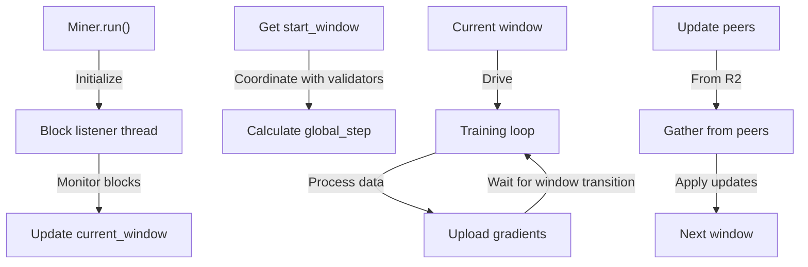

Sources: <SourceLink text="neurons/miner.py:229-325" href="https://github.com/tplr-ai/templar/blob/bb2fc2a9/neurons/miner.py#L229-L325" />, <SourceLink text="neurons/miner.py:757-777" href="https://github.com/tplr-ai/templar/blob/bb2fc2a9/neurons/miner.py#L757-L777" />

### Validator Chain Integration

Validators use chain integration for:

1. **Window coordination**: The validation process syncs with block-derived windows
2. **Start window publishing**: Setting the global training starting point
3. **Weight setting**: Evaluating miners and setting chain weights
4. **Peer management**: Selecting and distributing peer lists

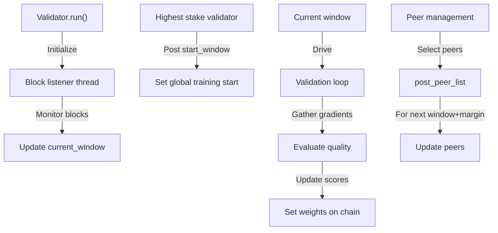

Sources: <SourceLink text="neurons/validator.py:516-579" href="https://github.com/tplr-ai/templar/blob/bb2fc2a9/neurons/validator.py#L516-L579" />, <SourceLink text="neurons/validator.py:522-525" href="https://github.com/tplr-ai/templar/blob/bb2fc2a9/neurons/validator.py#L522-L525" />

## Weight Setting Process

Validators evaluate miners and set weights on the blockchain:

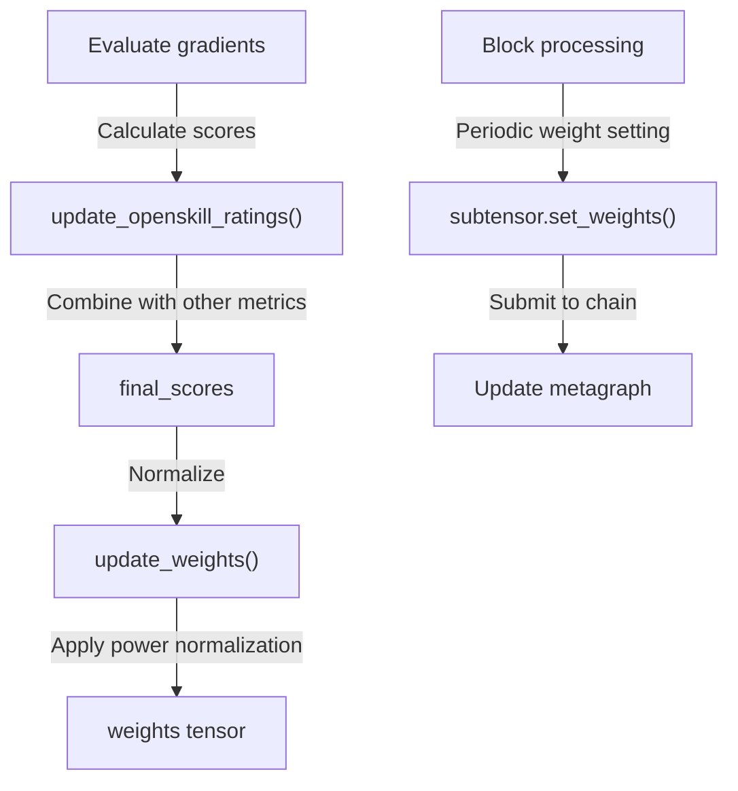

Sources: <SourceLink text="neurons/validator.py:374-437" href="https://github.com/tplr-ai/templar/blob/bb2fc2a9/neurons/validator.py#L374-L437" />, <SourceLink text="neurons/validator.py:446-487" href="https://github.com/tplr-ai/templar/blob/bb2fc2a9/neurons/validator.py#L446-L487" />

## Window-Based Synchronization

### Start Window Coordination

To ensure all nodes start training from the same point, Templar coordinates a global start window:

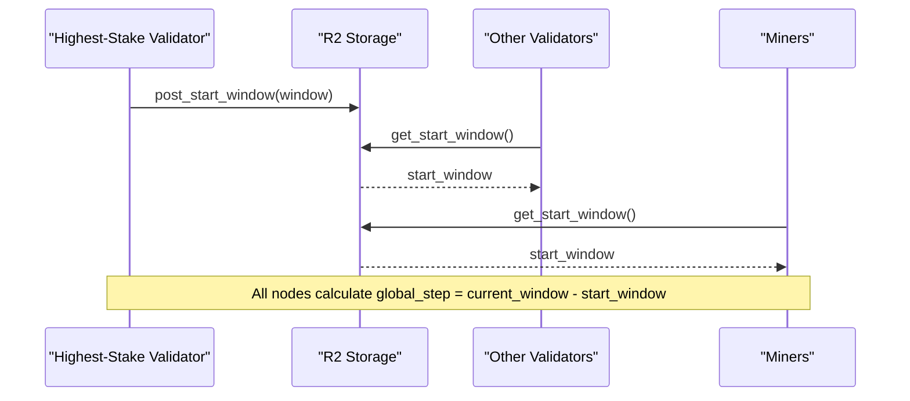

Sources: <SourceLink text="neurons/validator.py:534-563" href="https://github.com/tplr-ai/templar/blob/bb2fc2a9/neurons/validator.py#L534-L563" />, <SourceLink text="neurons/miner.py:250-259" href="https://github.com/tplr-ai/templar/blob/bb2fc2a9/neurons/miner.py#L250-L259" />

### Window-Driven Training Loop

Both miners and validators use window transitions to drive their main loops:

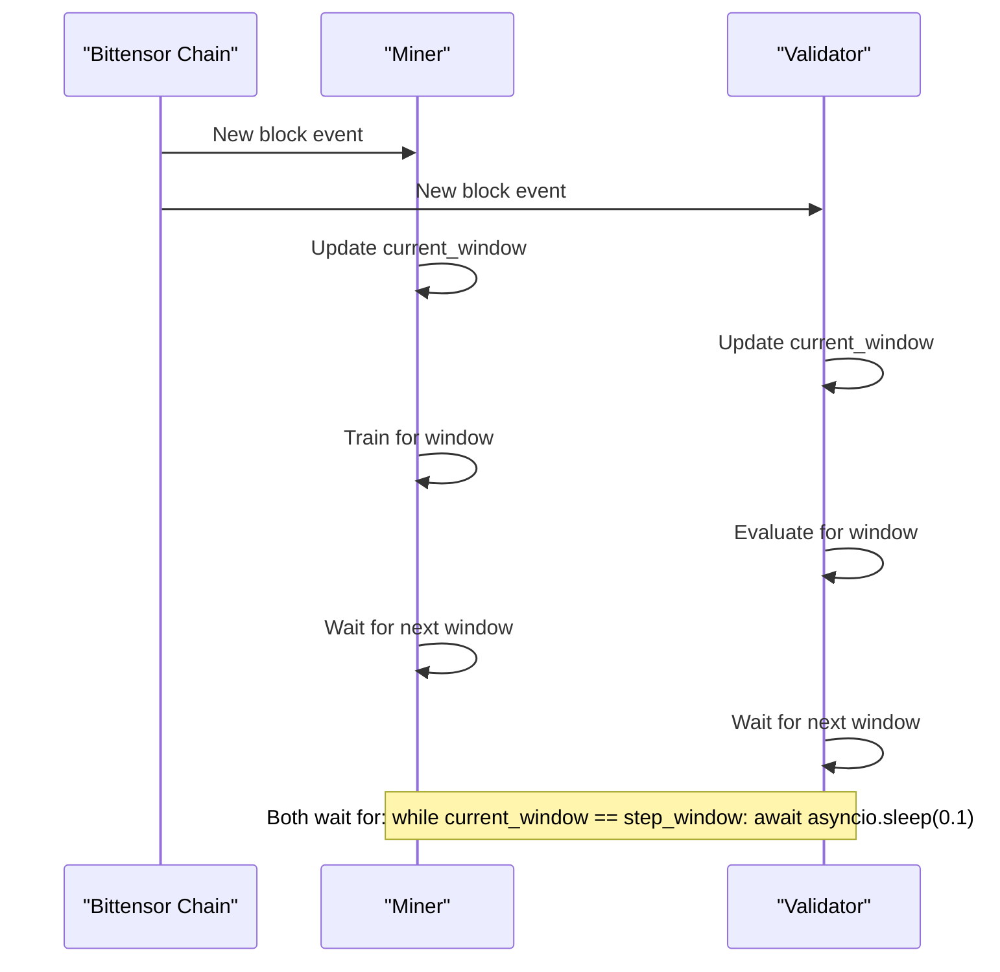

Sources: <SourceLink text="neurons/miner.py:751-754" href="https://github.com/tplr-ai/templar/blob/bb2fc2a9/neurons/miner.py#L751-L754" />, <SourceLink text="neurons/validator.py:627-636" href="https://github.com/tplr-ai/templar/blob/bb2fc2a9/neurons/validator.py#L627-L636" />

## Configuration Parameters

Key configuration parameters for chain integration:

| Parameter | Description | Default | Source |
|-----------|-------------|---------|--------|
| `netuid` | Bittensor network UID | 268 | <SourceLink text="neurons/miner.py:71" href="https://github.com/tplr-ai/templar/blob/bb2fc2a9/neurons/miner.py#L71" /> |
| `blocks_per_window` | Number of blocks per training window | 7 | <SourceLink text="hparams.json:8" href="https://github.com/tplr-ai/templar/blob/bb2fc2a9/hparams.json#L8" /> |
| `validator_offset` | Windows validators lag behind miners | 2 | <SourceLink text="hparams.json:30" href="https://github.com/tplr-ai/templar/blob/bb2fc2a9/hparams.json#L30" /> |
| `peer_replacement_frequency` | Windows between peer list updates | 5 | <SourceLink text="hparams.json:36" href="https://github.com/tplr-ai/templar/blob/bb2fc2a9/hparams.json#L36" /> |
| `peer_list_window_margin` | Windows before peer list takes effect | 2 | <SourceLink text="hparams.json:37" href="https://github.com/tplr-ai/templar/blob/bb2fc2a9/hparams.json#L37" /> |
| `reset_inactivity_windows` | Windows before inactive peer reset | 25 | <SourceLink text="hparams.json:46" href="https://github.com/tplr-ai/templar/blob/bb2fc2a9/hparams.json#L46" /> |

Sources: <SourceLink text="hparams.json:8-47" href="https://github.com/tplr-ai/templar/blob/bb2fc2a9/hparams.json#L8-L47" />, <SourceLink text="neurons/miner.py:71" href="https://github.com/tplr-ai/templar/blob/bb2fc2a9/neurons/miner.py#L71" />, <SourceLink text="neurons/validator.py:90" href="https://github.com/tplr-ai/templar/blob/bb2fc2a9/neurons/validator.py#L90" />

## Using in Development

For local development, the <SourceLink text="ecosystem.config.js" href="https://github.com/tplr-ai/templar/blob/bb2fc2a9/ecosystem.config.js" /> file shows how to configure neurons to interact with a local Bittensor chain:

```javascript
// Example from ecosystem.config.js
{
    name: "TM1",
    script: "neurons/miner.py",
    interpreter: "python3",
    args: `--wallet.name templar_test --wallet.hotkey M1 --device cuda:1 --subtensor.network local --netuid 2 --use_wandb --project "${PROJECT_NAME}"`
}
```

The `--subtensor.network local` flag directs the neurons to use a local Subtensor chain for development and testing.

Sources: <SourceLink text="ecosystem.config.js:8-16" href="https://github.com/tplr-ai/templar/blob/bb2fc2a9/ecosystem.config.js#L8-L16" />