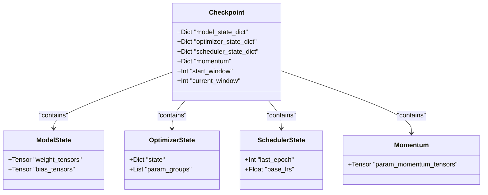
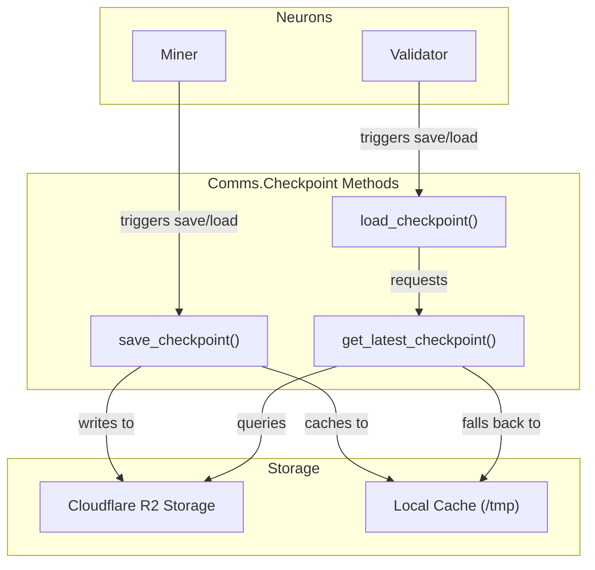
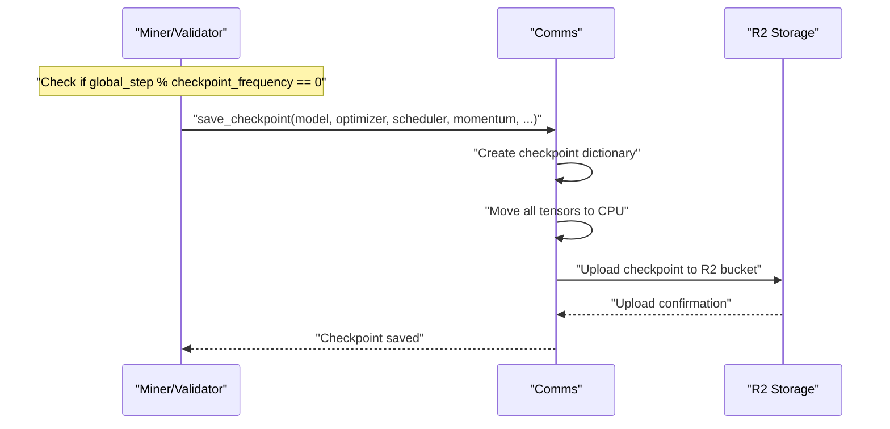
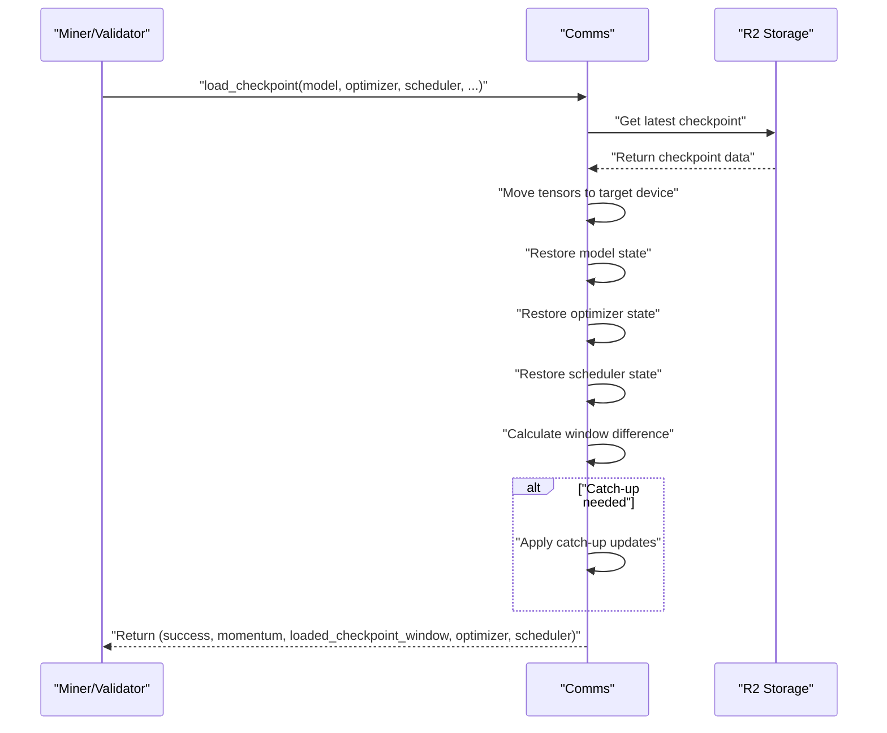
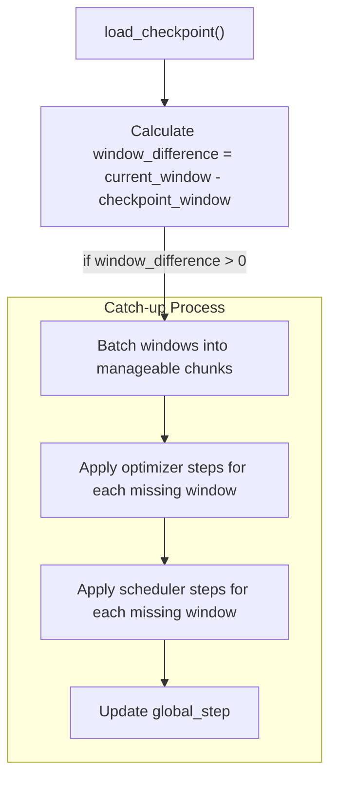
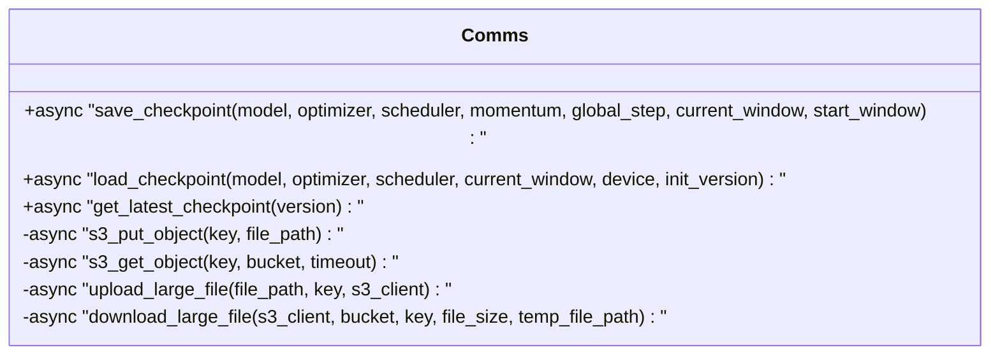
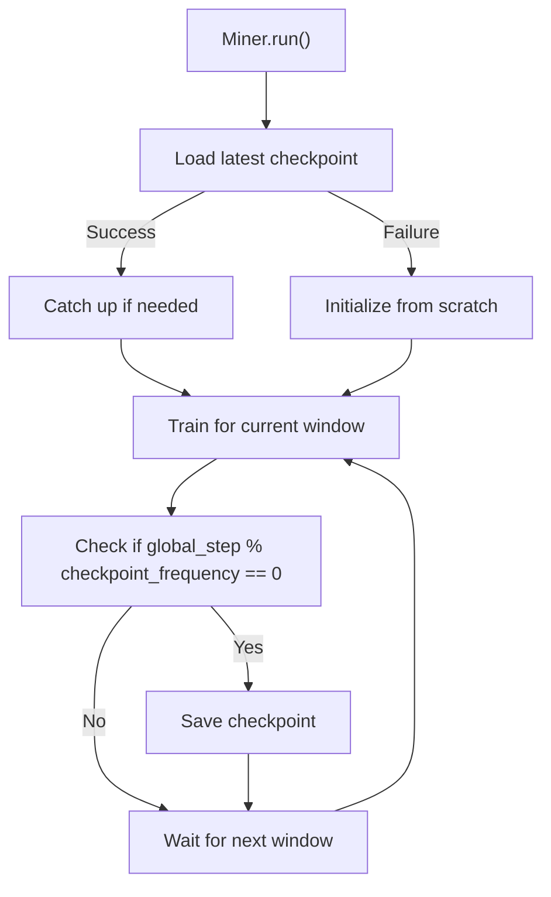
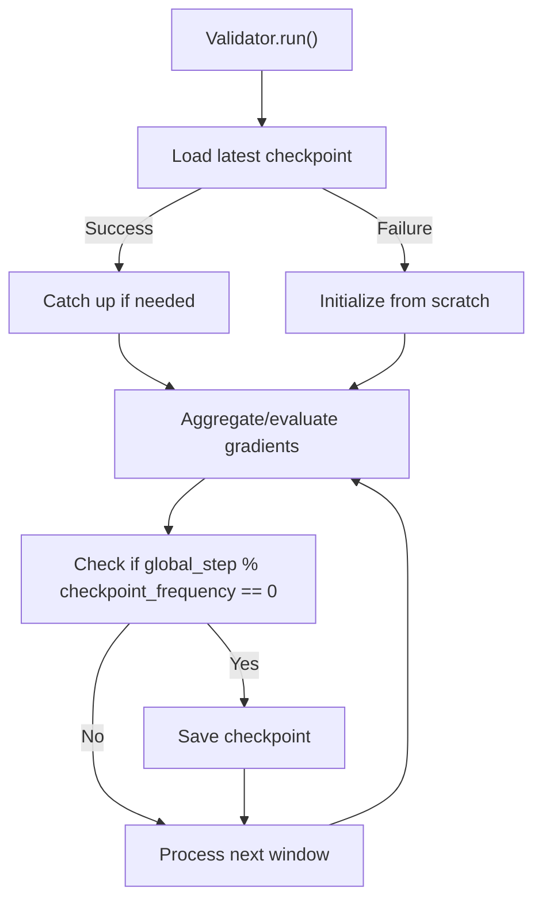
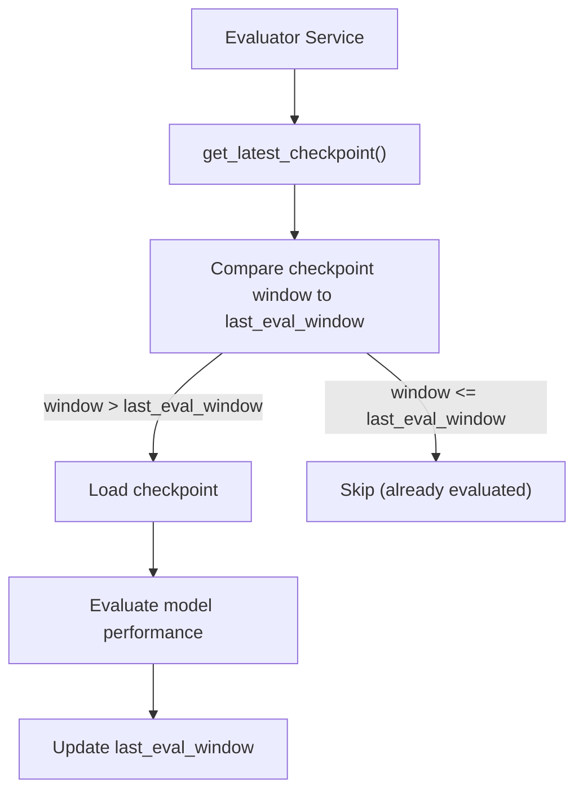

---

title: "Checkpoint Management"

---


import CollapsibleAside from '@components/CollapsibleAside.astro';

import SourceLink from '@components/SourceLink.astro';


<CollapsibleAside title="Relevant Source Files">

  <SourceLink text="ecosystem.config.js" href="https://github.com/tplr-ai/templar/blob/bb2fc2a9/ecosystem.config.js" />

  <SourceLink text="hparams.json" href="https://github.com/tplr-ai/templar/blob/bb2fc2a9/hparams.json" />

  <SourceLink text="neurons/miner.py" href="https://github.com/tplr-ai/templar/blob/bb2fc2a9/neurons/miner.py" />

  <SourceLink text="neurons/validator.py" href="https://github.com/tplr-ai/templar/blob/bb2fc2a9/neurons/validator.py" />

  <SourceLink text="pyproject.toml" href="https://github.com/tplr-ai/templar/blob/bb2fc2a9/pyproject.toml" />

  <SourceLink text="src/tplr/__init__.py" href="https://github.com/tplr-ai/templar/blob/bb2fc2a9/src/tplr/__init__.py" />

  <SourceLink text="src/tplr/comms.py" href="https://github.com/tplr-ai/templar/blob/bb2fc2a9/src/tplr/comms.py" />

  <SourceLink text="tests/test_checkpoints.py" href="https://github.com/tplr-ai/templar/blob/bb2fc2a9/tests/test_checkpoints.py" />

  <SourceLink text="tests/test_comms.py" href="https://github.com/tplr-ai/templar/blob/bb2fc2a9/tests/test_comms.py" />

  <SourceLink text="tests/test_evaluator.py" href="https://github.com/tplr-ai/templar/blob/bb2fc2a9/tests/test_evaluator.py" />

  <SourceLink text="tests/test_prepare_gradient_dict.py" href="https://github.com/tplr-ai/templar/blob/bb2fc2a9/tests/test_prepare_gradient_dict.py" />

  <SourceLink text="uv.lock" href="https://github.com/tplr-ai/templar/blob/bb2fc2a9/uv.lock" />

</CollapsibleAside>


## Purpose and Scope

This page documents the checkpoint management system in Templar, which is responsible for saving and loading model states, optimizers, schedulers, and momentum values during distributed training. This system is crucial for ensuring training resilience, enabling nodes to recover from failures, synchronize with the network, and resume training from previous states. For information about how checkpoint management interacts with blockchain commitments, see [Chain Integration](/communication-system/chain-integration#6.2).

## Checkpoint Structure and Contents

A Templar checkpoint contains all the state information needed to fully restore training:



Sources: <SourceLink text="neurons/miner.py:265-282" href="https://github.com/tplr-ai/templar/blob/bb2fc2a9/neurons/miner.py#L265-L282" />, <SourceLink text="tests/test_checkpoints.py:40-54" href="https://github.com/tplr-ai/templar/blob/bb2fc2a9/tests/test_checkpoints.py#L40-L54" />

Each component serves a specific purpose:

| Component | Description |
|-----------|-------------|
| `model_state_dict` | Parameter tensors for the LLaMA model |
| `optimizer_state_dict` | SGD optimizer state (step counts, parameter-specific states) |
| `scheduler_state_dict` | Learning rate scheduler state (current epoch, base learning rates) |
| `momentum` | Momentum tensors for gradient accumulation |
| `start_window` | Training start window (for global step calculation) |
| `current_window` | Window at which the checkpoint was saved |

All tensors in checkpoints are stored on CPU to ensure compatibility when loading across different devices.

Sources: <SourceLink text="src/tplr/comms.py:924-937" href="https://github.com/tplr-ai/templar/blob/bb2fc2a9/src/tplr/comms.py#L924-L937" />

## Storage System

Templar uses Cloudflare R2 Storage as the primary checkpoint repository, with local filesystem caching for performance.



Sources: <SourceLink text="src/tplr/comms.py:122-148" href="https://github.com/tplr-ai/templar/blob/bb2fc2a9/src/tplr/comms.py#L122-L148" />, <SourceLink text="neurons/miner.py:730-747" href="https://github.com/tplr-ai/templar/blob/bb2fc2a9/neurons/miner.py#L730-L747" />, <SourceLink text="neurons/validator.py:582-613" href="https://github.com/tplr-ai/templar/blob/bb2fc2a9/neurons/validator.py#L582-L613" />

### Checkpoint File Naming

Checkpoint files follow this naming convention:
```
checkpoint-{global_step}-{uid}-v{version}.pt
```

Where:
- `global_step`: Training step at which the checkpoint was saved
- `uid`: Unique identifier of the node that created the checkpoint
- `version`: Code version (from `tplr.__version__`)

This convention enables efficient filtering and retrieval of checkpoints by version, step, or node.

Sources: <SourceLink text="tests/test_checkpoints.py:83-87" href="https://github.com/tplr-ai/templar/blob/bb2fc2a9/tests/test_checkpoints.py#L83-L87" />

## Checkpoint Operations

### Saving Checkpoints

Checkpoints are saved periodically during training based on the `checkpoint_frequency` parameter in `hparams.json`.



The checkpoint saving process:

1. Creates a checkpoint dictionary containing all state components
2. Ensures all tensors are moved to CPU for compatibility
3. Saves the checkpoint to R2 storage with versioning information
4. Handles large file uploads using multipart upload when necessary

Sources: <SourceLink text="neurons/miner.py:730-747" href="https://github.com/tplr-ai/templar/blob/bb2fc2a9/neurons/miner.py#L730-L747" />, <SourceLink text="src/tplr/comms.py:894-949" href="https://github.com/tplr-ai/templar/blob/bb2fc2a9/src/tplr/comms.py#L894-L949" />

### Loading Checkpoints

Loading checkpoints is performed at node startup and involves several steps:



The checkpoint loading process:

1. Retrieves the latest compatible checkpoint from R2 storage
2. Moves tensors to the appropriate device (CPU, CUDA)
3. Restores model, optimizer, and scheduler states
4. Determines if catch-up is needed
5. Applies catch-up updates if necessary

Sources: <SourceLink text="neurons/miner.py:273-316" href="https://github.com/tplr-ai/templar/blob/bb2fc2a9/neurons/miner.py#L273-L316" />, <SourceLink text="neurons/validator.py:582-613" href="https://github.com/tplr-ai/templar/blob/bb2fc2a9/neurons/validator.py#L582-L613" />, <SourceLink text="src/tplr/comms.py:955-1073" href="https://github.com/tplr-ai/templar/blob/bb2fc2a9/src/tplr/comms.py#L955-L1073" />

### Catch-up Mechanism

The catch-up mechanism brings models up-to-date when loading checkpoints from earlier windows:



This ensures learning rates and optimizer states match current training progress when loading an older checkpoint.

Sources: <SourceLink text="neurons/miner.py:300-316" href="https://github.com/tplr-ai/templar/blob/bb2fc2a9/neurons/miner.py#L300-L316" />, <SourceLink text="tests/test_checkpoints.py:472-543" href="https://github.com/tplr-ai/templar/blob/bb2fc2a9/tests/test_checkpoints.py#L472-L543" />

## Version Management

Templar's checkpoint system handles version compatibility through:

1. Version-specific checkpoint files (`v{version}.pt` suffix)
2. Bootstrap version configuration (`checkpoint_init_version` in hparams.json)
3. Fallback to local cache when compatible R2 versions are unavailable

During startup, miners and validators will attempt to load the latest checkpoint matching their current version. For initial setup, they use the configured bootstrap version.

Sources: <SourceLink text="neurons/miner.py:167-168" href="https://github.com/tplr-ai/templar/blob/bb2fc2a9/neurons/miner.py#L167-L168" />, <SourceLink text="neurons/validator.py:201-205" href="https://github.com/tplr-ai/templar/blob/bb2fc2a9/neurons/validator.py#L201-L205" />, <SourceLink text="hparams.json:52" href="https://github.com/tplr-ai/templar/blob/bb2fc2a9/hparams.json#L52" />

## Configuration

The checkpoint system is configured through hyperparameters:

| Parameter | Description | Default |
|-----------|-------------|---------|
| `checkpoint_frequency` | How often to save checkpoints (in global steps) | 100 |
| `checkpoint_init_version` | Version to use for initial checkpoint loading | "0.2.73" |

Sources: <SourceLink text="hparams.json:31-52" href="https://github.com/tplr-ai/templar/blob/bb2fc2a9/hparams.json#L31-L52" />

## Implementation Details

### Key Methods

The checkpoint management system is implemented in the `Comms` class with these core methods:



The system handles multiple file sizes with specialized methods for large file transfers, properly managing asynchronous I/O operations.

Sources: <SourceLink text="src/tplr/comms.py:894-1073" href="https://github.com/tplr-ai/templar/blob/bb2fc2a9/src/tplr/comms.py#L894-L1073" />

### Error Handling

The checkpoint system includes robust error handling for:

- Network failures during upload/download operations
- Corrupted checkpoint files
- Version incompatibilities
- Missing checkpoint files

It implements:
- Retry logic with exponential backoff
- Local cache fallback
- Detailed error logging
- Graceful failure modes that won't crash the application

Sources: <SourceLink text="src/tplr/comms.py:366-371" href="https://github.com/tplr-ai/templar/blob/bb2fc2a9/src/tplr/comms.py#L366-L371" />, <SourceLink text="src/tplr/comms.py:423-427" href="https://github.com/tplr-ai/templar/blob/bb2fc2a9/src/tplr/comms.py#L423-L427" />

## Usage Patterns

### In Miner Nodes



Sources: <SourceLink text="neurons/miner.py:267-317" href="https://github.com/tplr-ai/templar/blob/bb2fc2a9/neurons/miner.py#L267-L317" />, <SourceLink text="neurons/miner.py:730-747" href="https://github.com/tplr-ai/templar/blob/bb2fc2a9/neurons/miner.py#L730-L747" />

### In Validator Nodes



Sources: <SourceLink text="neurons/validator.py:576-620" href="https://github.com/tplr-ai/templar/blob/bb2fc2a9/neurons/validator.py#L576-L620" />, <SourceLink text="neurons/validator.py:729-735" href="https://github.com/tplr-ai/templar/blob/bb2fc2a9/neurons/validator.py#L729-L735" />

## Evaluator Integration

The Evaluator service uses the checkpoint system to periodically load the latest model checkpoints and evaluate their performance on benchmarks. It maintains a record of the last evaluated window to prevent duplicate evaluations.



Sources: <SourceLink text="tests/test_evaluator.py:60-146" href="https://github.com/tplr-ai/templar/blob/bb2fc2a9/tests/test_evaluator.py#L60-L146" />

## Troubleshooting

Common checkpoint-related issues and solutions:

| Issue | Possible Causes | Solution |
|-------|----------------|----------|
| Checkpoint loading fails | Version mismatch, corrupted file | Check version compatibility, verify R2 access |
| Catch-up process errors | Large window gap, memory issues | Reduce catch-up batch size, ensure sufficient memory |
| Slow checkpoint saving | Large model size, network issues | Check network connectivity, monitor R2 performance |
| Missing checkpoint | Process started for first time | Node will initialize from scratch |

Sources: <SourceLink text="src/tplr/comms.py:423-427" href="https://github.com/tplr-ai/templar/blob/bb2fc2a9/src/tplr/comms.py#L423-L427" />, <SourceLink text="neurons/miner.py:305-316" href="https://github.com/tplr-ai/templar/blob/bb2fc2a9/neurons/miner.py#L305-L316" />

## Summary

The checkpoint management system is a critical component of Templar that ensures training resilience and continuity. By periodically saving complete training state and providing efficient loading mechanisms, it enables nodes to recover from failures, sync with the network, and maintain training progress in a distributed environment.

Through careful version management and the catch-up mechanism, the system ensures that nodes can join or rejoin training seamlessly, maintaining the integrity of the distributed training process.