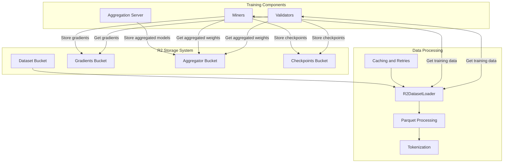
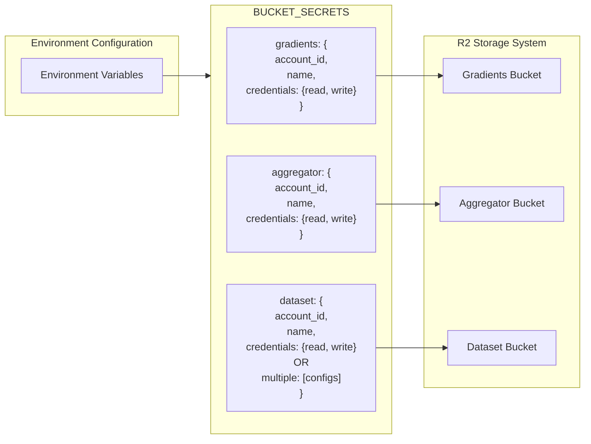
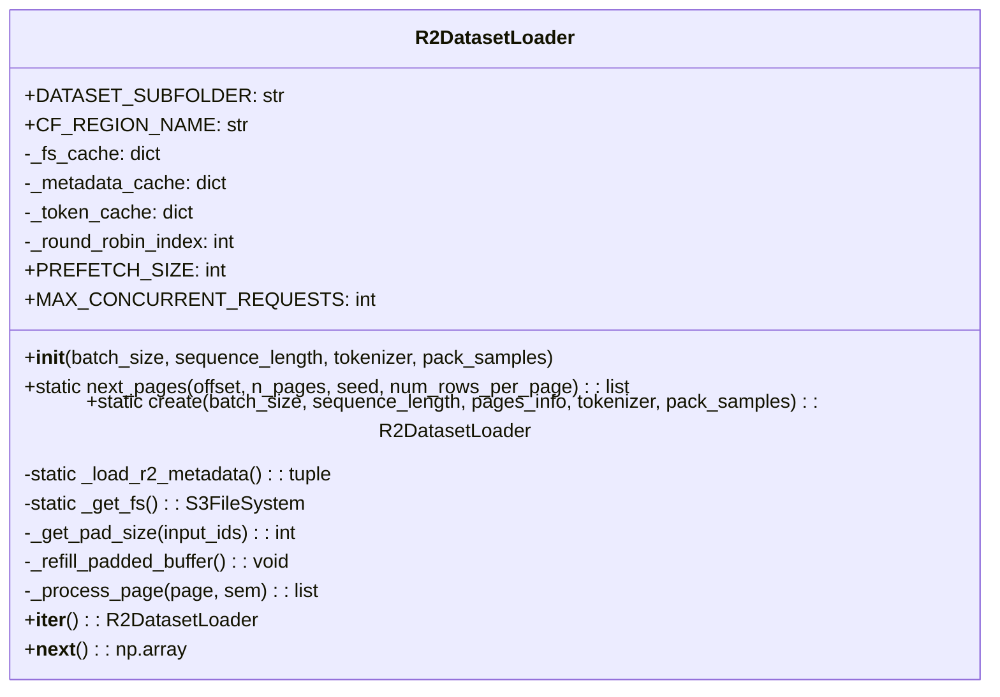
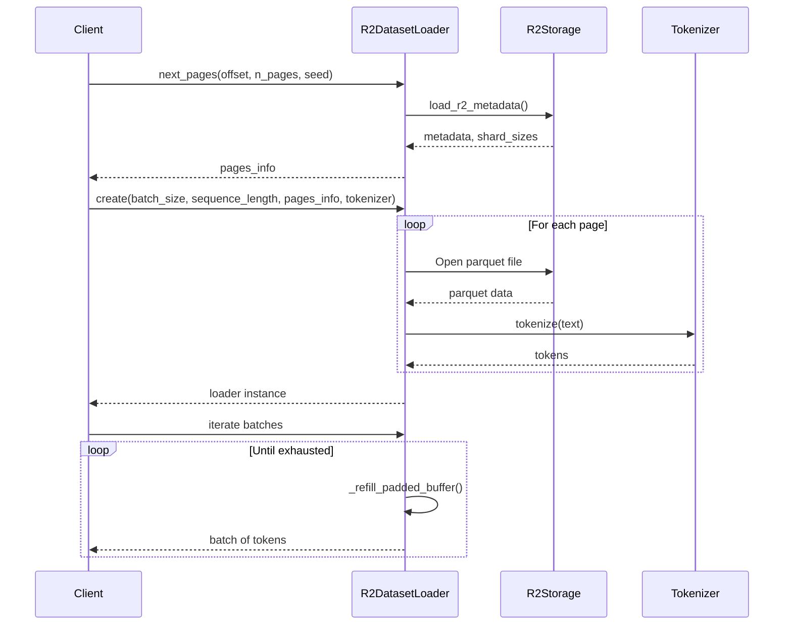
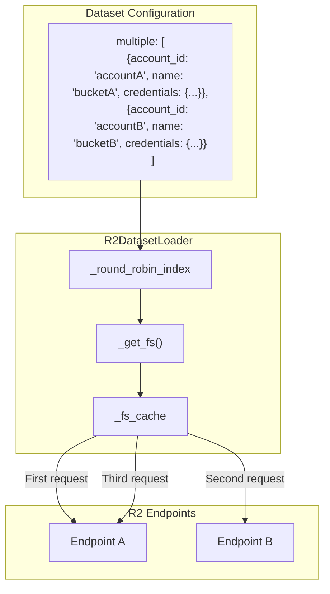
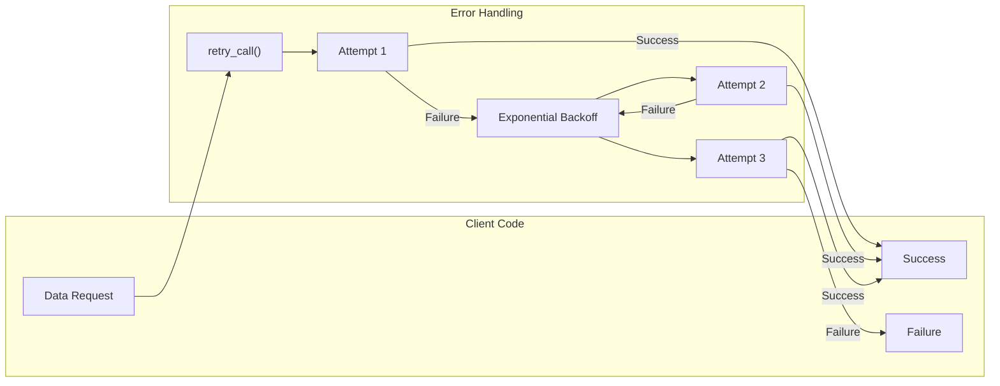
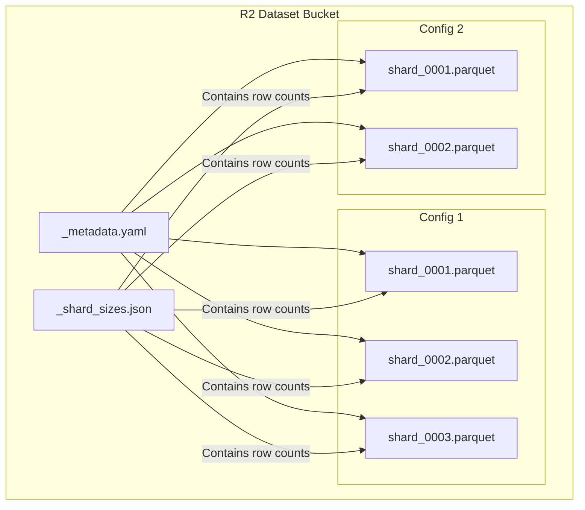
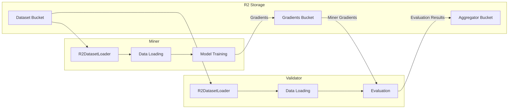

---

title: "Data Management"

---

import CollapsibleAside from '@components/CollapsibleAside.astro';

import SourceLink from '@components/SourceLink.astro';

<CollapsibleAside title="Relevant Source Files">

  <SourceLink text="scripts/benchmarks/benchmark_parquet_loader.py" href="https://github.com/tplr-ai/templar/blob/bb2fc2a9/scripts/benchmarks/benchmark_parquet_loader.py" />

  <SourceLink text="scripts/benchmarks/benchmark_results/avg_batch_time_analysis.png" href="https://github.com/tplr-ai/templar/blob/bb2fc2a9/scripts/benchmarks/benchmark_results/avg_batch_time_analysis.png" />

  <SourceLink text="scripts/benchmarks/benchmark_results/memory_used_mb_analysis.png" href="https://github.com/tplr-ai/templar/blob/bb2fc2a9/scripts/benchmarks/benchmark_results/memory_used_mb_analysis.png" />

  <SourceLink text="scripts/benchmarks/benchmark_results/parquet_loader_results.csv" href="https://github.com/tplr-ai/templar/blob/bb2fc2a9/scripts/benchmarks/benchmark_results/parquet_loader_results.csv" />

  <SourceLink text="scripts/benchmarks/benchmark_results/sequence_length_heatmap.png" href="https://github.com/tplr-ai/templar/blob/bb2fc2a9/scripts/benchmarks/benchmark_results/sequence_length_heatmap.png" />

  <SourceLink text="scripts/benchmarks/benchmark_results/tokens_per_second_analysis.png" href="https://github.com/tplr-ai/templar/blob/bb2fc2a9/scripts/benchmarks/benchmark_results/tokens_per_second_analysis.png" />

  <SourceLink text="scripts/benchmarks/benchmark_results/total_duration_analysis.png" href="https://github.com/tplr-ai/templar/blob/bb2fc2a9/scripts/benchmarks/benchmark_results/total_duration_analysis.png" />

  <SourceLink text="src/tplr/config.py" href="https://github.com/tplr-ai/templar/blob/bb2fc2a9/src/tplr/config.py" />

  <SourceLink text="src/tplr/r2_dataset.py" href="https://github.com/tplr-ai/templar/blob/bb2fc2a9/src/tplr/r2_dataset.py" />

  <SourceLink text="tests/test_dataset_equivalence.py" href="https://github.com/tplr-ai/templar/blob/bb2fc2a9/tests/test_dataset_equivalence.py" />

  <SourceLink text="tests/test_r2_loader.py" href="https://github.com/tplr-ai/templar/blob/bb2fc2a9/tests/test_r2_loader.py" />

</CollapsibleAside>

This page documents the data management system within Templar, which provides efficient loading, processing, and distribution of datasets and model artifacts across the decentralized training framework. The system is designed to support distributed training over the internet with high-performance access to large datasets stored in cloud object storage.

For information about specific checkpoint management and saving/loading models, see [Checkpoint Management](/communication-system/checkpoint-management#6.1).

## Overview

The Templar data management system enables miners and validators to efficiently access training data and exchange model artifacts during the decentralized training process. It uses Cloudflare R2 storage as its primary storage backend, with specialized components for loading and processing dataset files in parallel.

Sources: <SourceLink text="src/tplr/r2_dataset.py:33-46" href="https://github.com/tplr-ai/templar/blob/bb2fc2a9/src/tplr/r2_dataset.py#L33-L46" />, <SourceLink text="src/tplr/config.py:28-144" href="https://github.com/tplr-ai/templar/blob/bb2fc2a9/src/tplr/config.py#L28-L144" />

## Storage Architecture

The data management system uses Cloudflare R2 as its primary storage backend, with four key buckets for different data types:

1. **Dataset Bucket**: Contains training datasets in Parquet format, organized by configuration
2. **Gradients Bucket**: Used for exchanging gradients between miners and validators
3. **Aggregator Bucket**: Stores aggregated model states
4. **Checkpoints Bucket**: Stores model checkpoints

Access to these buckets is configured through environment variables, with separate read and write credentials for each bucket.

Sources: <SourceLink text="src/tplr/config.py:28-144" href="https://github.com/tplr-ai/templar/blob/bb2fc2a9/src/tplr/config.py#L28-L144" />

### R2 Bucket Configuration

The system loads bucket configuration from environment variables using the `load_bucket_secrets()` function in the config module. This creates a `BUCKET_SECRETS` dictionary with the following structure for each bucket:

- `account_id`: R2 account identifier
- `bucket_name`: Name of the R2 bucket
- `credentials`: Contains separate read and write credential sets:
  - `read`: Read-only access credentials
  - `write`: Write access credentials

The dataset bucket can be configured with multiple endpoints for load balancing, using a JSON array in the `R2_DATASET_BUCKET_LIST` environment variable.

Sources: <SourceLink text="src/tplr/config.py:28-144" href="https://github.com/tplr-ai/templar/blob/bb2fc2a9/src/tplr/config.py#L28-L144" />

## The R2DatasetLoader

The `R2DatasetLoader` class is responsible for efficiently loading training data from R2 storage. It handles dataset metadata caching, parallel data loading, tokenization, and batch creation.

Sources: <SourceLink text="src/tplr/r2_dataset.py:33-595" href="https://github.com/tplr-ai/templar/blob/bb2fc2a9/src/tplr/r2_dataset.py#L33-L595" />

### Dataset Loading Process

The dataset loading process involves several key steps:

1. **Metadata Loading**: The loader first fetches and caches dataset metadata and shard sizes from R2 storage
2. **Page Selection**: Random pages are selected based on a seed for reproducible training
3. **Parallel Loading**: Selected pages are loaded in parallel using asyncio
4. **Tokenization**: Text data is tokenized using the provided tokenizer
5. **Batch Creation**: Tokenized data is organized into batches of the requested size

Sources: <SourceLink text="src/tplr/r2_dataset.py:180-240" href="https://github.com/tplr-ai/templar/blob/bb2fc2a9/src/tplr/r2_dataset.py#L180-L240" />, <SourceLink text="src/tplr/r2_dataset.py:241-303" href="https://github.com/tplr-ai/templar/blob/bb2fc2a9/src/tplr/r2_dataset.py#L241-L303" />, <SourceLink text="src/tplr/r2_dataset.py:380-518" href="https://github.com/tplr-ai/templar/blob/bb2fc2a9/src/tplr/r2_dataset.py#L380-L518" />

### Load Balancing with Round-Robin

The system supports distributing dataset access across multiple R2 endpoints using a round-robin approach. This feature is enabled by configuring multiple dataset configurations in the `R2_DATASET_BUCKET_LIST` environment variable.

The `_get_fs()` method implements the round-robin strategy by:
1. Incrementing the `_round_robin_index` counter
2. Selecting a configuration based on the index modulo the number of configurations
3. Caching S3FileSystem instances to avoid repeated instantiation

Sources: <SourceLink text="src/tplr/r2_dataset.py:333-378" href="https://github.com/tplr-ai/templar/blob/bb2fc2a9/src/tplr/r2_dataset.py#L333-L378" />, <SourceLink text="tests/test_r2_loader.py:543-907" href="https://github.com/tplr-ai/templar/blob/bb2fc2a9/tests/test_r2_loader.py#L543-L907" />

### Error Handling and Retry Mechanisms

The `R2DatasetLoader` implements robust error handling and retry mechanisms to deal with transient failures when accessing R2 storage. This is essential for reliable operation in a distributed environment.

Key error handling features include:
- Exponential backoff between retry attempts
- Separate retry configurations for different operations
- Thread-safe filesystem and connection management
- Caching of successful results to avoid redundant operations

Sources: <SourceLink text="src/tplr/r2_dataset.py:435-469" href="https://github.com/tplr-ai/templar/blob/bb2fc2a9/src/tplr/r2_dataset.py#L435-L469" />, <SourceLink text="tests/test_r2_loader.py:311-498" href="https://github.com/tplr-ai/templar/blob/bb2fc2a9/tests/test_r2_loader.py#L311-L498" />

## Dataset Structure and Format

The Templar framework uses Parquet files for dataset storage. These files are organized into shards, with metadata describing the contents and structure of each shard.

### Parquet File Structure

Each dataset configuration contains multiple shards, with each shard containing rows of text data. The system uses metadata files to track:

- Total rows per configuration
- Number of rows per shard
- Shard file paths
- Dataset splits (train/valid/test)

The dataset structure includes:
- `_metadata.yaml`: Contains configuration information about the dataset
- `_shard_sizes.json`: Maps configurations to shard files with row counts
- Parquet files: Contain actual text data in columnar format

Sources: <SourceLink text="src/tplr/r2_dataset.py:180-240" href="https://github.com/tplr-ai/templar/blob/bb2fc2a9/src/tplr/r2_dataset.py#L180-L240" />, <SourceLink text="src/tplr/r2_dataset.py:270-331" href="https://github.com/tplr-ai/templar/blob/bb2fc2a9/src/tplr/r2_dataset.py#L270-L331" />

## Performance Optimizations

The `R2DatasetLoader` implements several performance optimizations to efficiently load and process large datasets:

1. **Metadata Caching**: Dataset metadata is cached locally to avoid repeated network requests
2. **Parallel Loading**: Multiple pages are loaded in parallel using asyncio and semaphores
3. **Connection Pooling**: S3FileSystem instances are configured with connection pooling
4. **Result Caching**: Tokenized results are cached to avoid redundant processing
5. **Prefetching**: Data is prefetched in the background while processing current batches
6. **Thread Safety**: Thread locks ensure safe concurrent access to shared resources

Sources: <SourceLink text="src/tplr/r2_dataset.py:56-88" href="https://github.com/tplr-ai/templar/blob/bb2fc2a9/src/tplr/r2_dataset.py#L56-L88" />, <SourceLink text="src/tplr/r2_dataset.py:333-378" href="https://github.com/tplr-ai/templar/blob/bb2fc2a9/src/tplr/r2_dataset.py#L333-L378" />, <SourceLink text="scripts/benchmarks/benchmark_parquet_loader.py:54-242" href="https://github.com/tplr-ai/templar/blob/bb2fc2a9/scripts/benchmarks/benchmark_parquet_loader.py#L54-L242" />

## Integration with Training Pipeline

The data management system integrates with the Templar training pipeline, providing data for miners and validators during the decentralized training process:

The integration points include:
- Miners use the `R2DatasetLoader` to fetch training data
- Validators use the `R2DatasetLoader` to fetch evaluation data
- Both components access other buckets for gradient exchange and aggregation

Sources: <SourceLink text="src/tplr/r2_dataset.py:33-46" href="https://github.com/tplr-ai/templar/blob/bb2fc2a9/src/tplr/r2_dataset.py#L33-L46" />

## Benchmarking and Performance

The system includes benchmark tools to evaluate the performance of the data loading system under different configurations. Key metrics include:

- Tokens per second processing rate
- Memory usage
- Total processing time
- Batch processing time

These benchmarks help optimize configuration parameters like:
- Number of concurrent requests
- Batch size
- Sequence length
- Buffer sizes

Sources: <SourceLink text="scripts/benchmarks/benchmark_parquet_loader.py:54-242" href="https://github.com/tplr-ai/templar/blob/bb2fc2a9/scripts/benchmarks/benchmark_parquet_loader.py#L54-L242" />, <SourceLink text="scripts/benchmarks/benchmark_results/parquet_loader_results.csv:1-23" href="https://github.com/tplr-ai/templar/blob/bb2fc2a9/scripts/benchmarks/benchmark_results/parquet_loader_results.csv#L1-L23" />

## Configuration Parameters

The `R2DatasetLoader` can be configured with several parameters to optimize performance:

| Parameter | Description | Default Value |
|-----------|-------------|---------------|
| `MAX_CONCURRENT_REQUESTS` | Maximum parallel requests | 8 |
| `PREFETCH_SIZE` | Number of pages to prefetch | 3 |
| `READ_BUFFER_SIZE` | Buffer size for reading | 4MB |
| `BATCH_SIZE` | Default batch size for tokenization | 128 |
| `CF_REGION_NAME` | Cloudflare region name | "enam" |
| `DATASET_SUBFOLDER` | Subfolder in bucket containing dataset | "HuggingFaceFW_fineweb-edu-score-2" |

Sources: <SourceLink text="src/tplr/r2_dataset.py:75-88" href="https://github.com/tplr-ai/templar/blob/bb2fc2a9/src/tplr/r2_dataset.py#L75-L88" />

## Environment Configuration

The data management system requires specific environment variables to be set for proper operation:

| Environment Variable | Description |
|----------------------|-------------|
| `R2_GRADIENTS_ACCOUNT_ID` | Account ID for gradients bucket |
| `R2_GRADIENTS_BUCKET_NAME` | Bucket name for gradients |
| `R2_GRADIENTS_READ_ACCESS_KEY_ID` | Read access key for gradients |
| `R2_GRADIENTS_READ_SECRET_ACCESS_KEY` | Read secret key for gradients |
| `R2_GRADIENTS_WRITE_ACCESS_KEY_ID` | Write access key for gradients |
| `R2_GRADIENTS_WRITE_SECRET_ACCESS_KEY` | Write secret key for gradients |
| `R2_AGGREGATOR_ACCOUNT_ID` | Account ID for aggregator bucket |
| `R2_AGGREGATOR_BUCKET_NAME` | Bucket name for aggregator |
| ... | (Similar variables for aggregator read/write) |
| `R2_DATASET_ACCOUNT_ID` | Account ID for dataset bucket |
| `R2_DATASET_BUCKET_NAME` | Bucket name for dataset |
| ... | (Similar variables for dataset read/write) |
| `R2_DATASET_BUCKET_LIST` | Optional JSON array of multiple dataset configs |

Sources: <SourceLink text="src/tplr/config.py:28-144" href="https://github.com/tplr-ai/templar/blob/bb2fc2a9/src/tplr/config.py#L28-L144" />, <SourceLink text="tests/test_r2_loader.py:22-44" href="https://github.com/tplr-ai/templar/blob/bb2fc2a9/tests/test_r2_loader.py#L22-L44" />