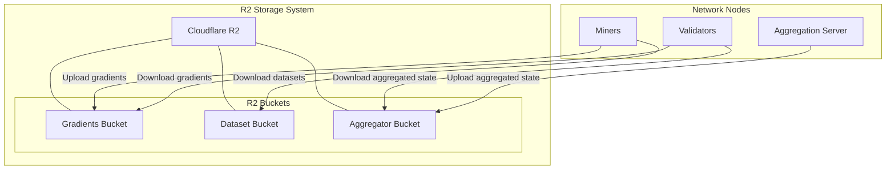
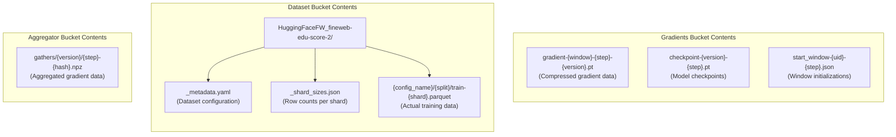
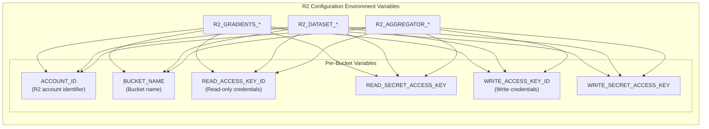
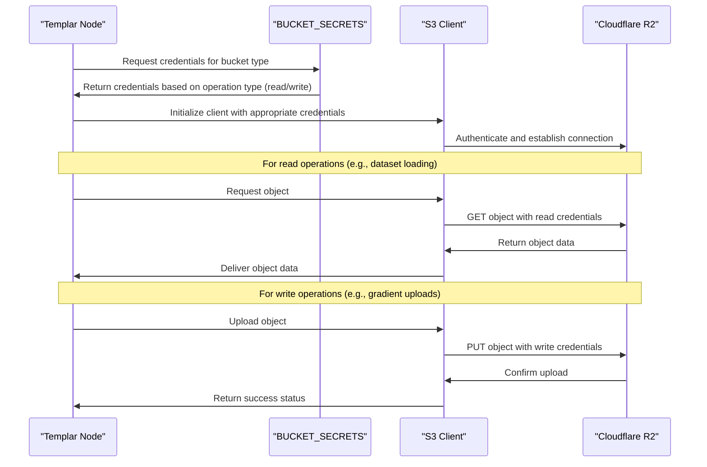
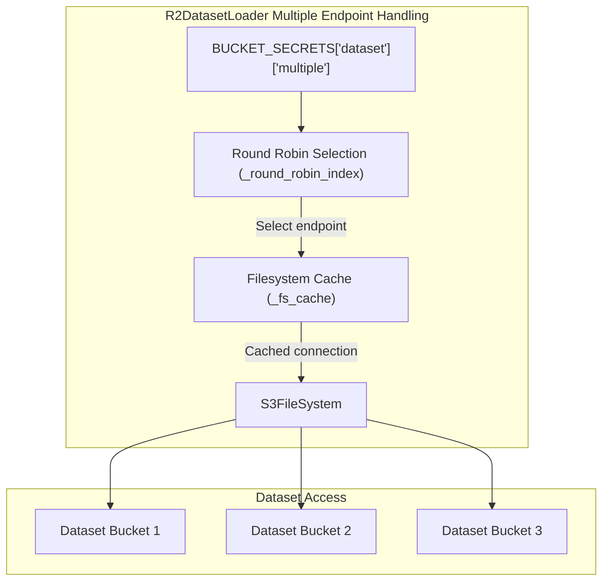
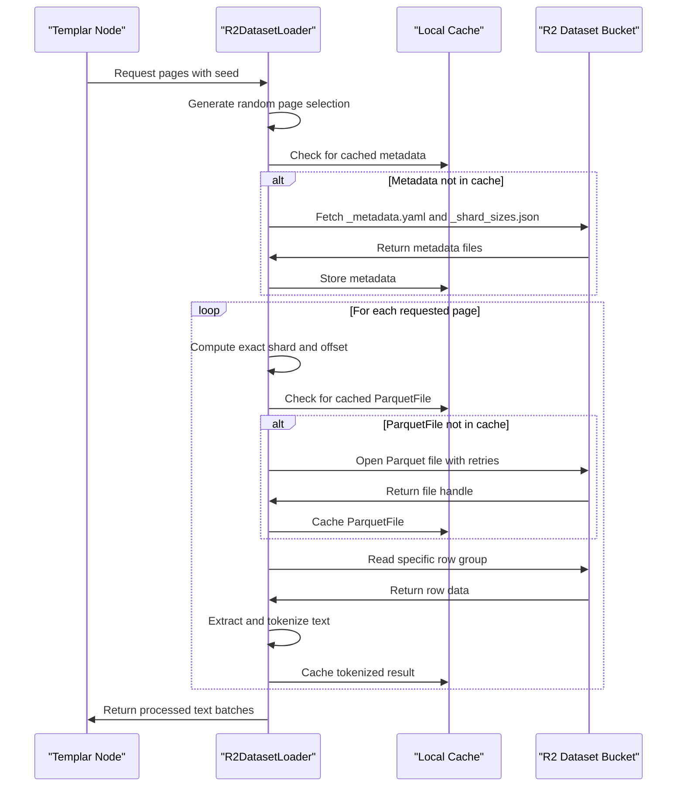
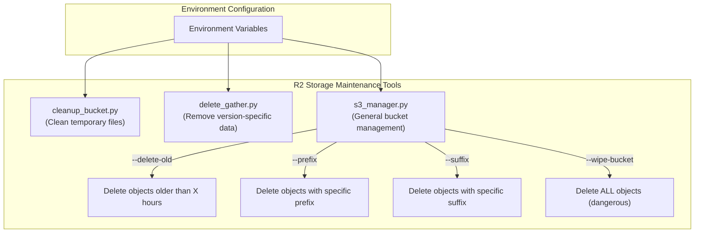
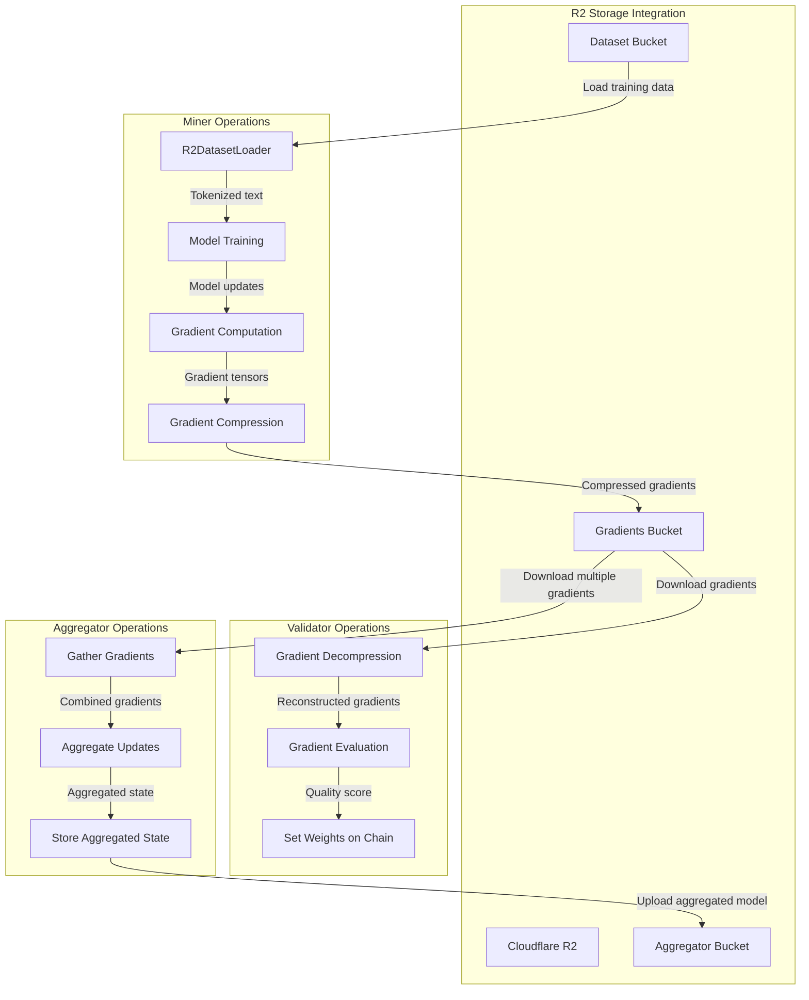

---

title: "R2 Storage"

---

import CollapsibleAside from '@components/CollapsibleAside.astro';

import SourceLink from '@components/SourceLink.astro';

<CollapsibleAside title="Relevant Source Files">

  <SourceLink text="LICENSE" href="https://github.com/tplr-ai/templar/blob/bb2fc2a9/LICENSE" />

  <SourceLink text="_metadata.yaml" href="https://github.com/tplr-ai/templar/blob/bb2fc2a9/_metadata.yaml" />

  <SourceLink text="_shard_sizes.json" href="https://github.com/tplr-ai/templar/blob/bb2fc2a9/_shard_sizes.json" />

  <SourceLink text="docs/r2_bucket_management.md" href="https://github.com/tplr-ai/templar/blob/bb2fc2a9/docs/r2_bucket_management.md" />

  <SourceLink text="scripts/analyser.py" href="https://github.com/tplr-ai/templar/blob/bb2fc2a9/scripts/analyser.py" />

  <SourceLink text="scripts/clean_versions.py" href="https://github.com/tplr-ai/templar/blob/bb2fc2a9/scripts/clean_versions.py" />

  <SourceLink text="scripts/cleanup_bucket.py" href="https://github.com/tplr-ai/templar/blob/bb2fc2a9/scripts/cleanup_bucket.py" />

  <SourceLink text="scripts/delete_gather.py" href="https://github.com/tplr-ai/templar/blob/bb2fc2a9/scripts/delete_gather.py" />

  <SourceLink text="scripts/get_gradients.py" href="https://github.com/tplr-ai/templar/blob/bb2fc2a9/scripts/get_gradients.py" />

  <SourceLink text="scripts/s3_manager.py" href="https://github.com/tplr-ai/templar/blob/bb2fc2a9/scripts/s3_manager.py" />

  <SourceLink text="scripts/validate_r2_access.py" href="https://github.com/tplr-ai/templar/blob/bb2fc2a9/scripts/validate_r2_access.py" />

  <SourceLink text="src/tplr/config.py" href="https://github.com/tplr-ai/templar/blob/bb2fc2a9/src/tplr/config.py" />

  <SourceLink text="src/tplr/r2_dataset.py" href="https://github.com/tplr-ai/templar/blob/bb2fc2a9/src/tplr/r2_dataset.py" />

  <SourceLink text="tests/test_r2_loader.py" href="https://github.com/tplr-ai/templar/blob/bb2fc2a9/tests/test_r2_loader.py" />

</CollapsibleAside>

This page documents the Cloudflare R2 storage system used in the Templar framework for distributed data exchange. R2 Storage provides reliable object storage that enables efficient sharing of gradients, datasets, checkpoints, and aggregated model data between distributed nodes in the network.

## Overview of R2 Storage in Templar

Templar uses Cloudflare R2 as its primary storage backend for several critical components of the distributed training ecosystem. R2 Storage serves as the communication medium for exchanging large volumes of data that cannot be efficiently transmitted through the blockchain directly.

Sources: <SourceLink text="src/tplr/config.py:27-135" href="https://github.com/tplr-ai/templar/blob/bb2fc2a9/src/tplr/config.py#L27-L135" />, <SourceLink text="src/tplr/r2_dataset.py:33-45" href="https://github.com/tplr-ai/templar/blob/bb2fc2a9/src/tplr/r2_dataset.py#L33-L45" />

## Bucket Structure

Templar uses three primary R2 buckets, each with distinct purposes:

1. **Gradients Bucket**: Stores gradient updates computed by miners. These are compressed via DCT transform to minimize storage requirements and transmission overhead.

2. **Dataset Bucket**: Contains training data in Parquet format, organized by collections and shards. Used by miners to load training data.

3. **Aggregator Bucket**: Stores aggregated model states that are collected from multiple miners' contributions.

Each bucket contains specific file organizations and naming patterns based on its purpose:

Sources: <SourceLink text="_metadata.yaml:1-453" href="https://github.com/tplr-ai/templar/blob/bb2fc2a9/_metadata.yaml#L1-L453" />, <SourceLink text="_shard_sizes.json:1-467" href="https://github.com/tplr-ai/templar/blob/bb2fc2a9/_shard_sizes.json#L1-L467" />, <SourceLink text="scripts/cleanup_bucket.py:75-81" href="https://github.com/tplr-ai/templar/blob/bb2fc2a9/scripts/cleanup_bucket.py#L75-L81" />, <SourceLink text="scripts/delete_gather.py:66-87" href="https://github.com/tplr-ai/templar/blob/bb2fc2a9/scripts/delete_gather.py#L66-L87" />

## Configuration and Authentication

Templar accesses R2 through environment variables that provide authentication credentials and bucket information. Each bucket has separate read and write credentials to enforce proper access control.

### Environment Variable Structure

### Authentication Flow

Sources: <SourceLink text="src/tplr/config.py:28-134" href="https://github.com/tplr-ai/templar/blob/bb2fc2a9/src/tplr/config.py#L28-L134" />, <SourceLink text="scripts/validate_r2_access.py:27-153" href="https://github.com/tplr-ai/templar/blob/bb2fc2a9/scripts/validate_r2_access.py#L27-L153" />

## Multiple Dataset Endpoints Support

The R2 configuration system supports multiple dataset endpoints for load balancing and improved reliability. This feature enables Templar to distribute dataset access across multiple R2 locations.

Sources: <SourceLink text="src/tplr/r2_dataset.py:339-369" href="https://github.com/tplr-ai/templar/blob/bb2fc2a9/src/tplr/r2_dataset.py#L339-L369" />, <SourceLink text="src/tplr/config.py:89-109" href="https://github.com/tplr-ai/templar/blob/bb2fc2a9/src/tplr/config.py#L89-L109" />

## R2DatasetLoader

The `R2DatasetLoader` class is a specialized component for loading training data from R2 storage. It's designed to efficiently load, cache, and process Parquet files containing training text data.

### Dataset Loading Process

### Performance Optimizations

The `R2DatasetLoader` implements numerous optimizations to efficiently handle distributed dataset access:

1. **Multi-level caching**:
   - Filesystem instance caching
   - Parquet file caching
   - Tokenized result caching
   - Metadata caching

2. **Distributed load balancing**:
   - Round-robin selection of multiple dataset endpoints
   - Thread-safe access patterns

3. **Resilient operation**:
   - Retries with exponential backoff
   - Connection pooling
   - Error handling for transient failures

4. **Memory and bandwidth efficiency**:
   - Read specific row groups instead of entire files
   - Parallel tokenization and processing
   - Optimized buffer sizes

Sources: <SourceLink text="src/tplr/r2_dataset.py:33-594" href="https://github.com/tplr-ai/templar/blob/bb2fc2a9/src/tplr/r2_dataset.py#L33-L594" />, <SourceLink text="tests/test_r2_loader.py:64-220" href="https://github.com/tplr-ai/templar/blob/bb2fc2a9/tests/test_r2_loader.py#L64-L220" />

## Storage Management and Maintenance

Templar includes utility scripts for maintaining R2 storage:

### Bucket Maintenance Tools

1. **cleanup_bucket.py**: Deletes temporary files like checkpoints, gradients, and start window markers.

2. **delete_gather.py**: Removes aggregated gradient data from specific versions.

3. **s3_manager.py**: General-purpose R2 bucket management tool with features for:
   - Deleting objects older than X hours
   - Deleting objects with specific prefixes or suffixes
   - Wiping buckets (with confirmation prompts)
   - Supporting different credential sets for different buckets

Sources: <SourceLink text="scripts/cleanup_bucket.py:32-114" href="https://github.com/tplr-ai/templar/blob/bb2fc2a9/scripts/cleanup_bucket.py#L32-L114" />, <SourceLink text="scripts/s3_manager.py:15-441" href="https://github.com/tplr-ai/templar/blob/bb2fc2a9/scripts/s3_manager.py#L15-L441" />, <SourceLink text="scripts/delete_gather.py:31-116" href="https://github.com/tplr-ai/templar/blob/bb2fc2a9/scripts/delete_gather.py#L31-L116" />, <SourceLink text="scripts/clean_versions.py:29-120" href="https://github.com/tplr-ai/templar/blob/bb2fc2a9/scripts/clean_versions.py#L29-L120" />

## Integration with Templar Components

The R2 storage system integrates closely with the core components of the Templar framework:

Sources: <SourceLink text="src/tplr/config.py:27-135" href="https://github.com/tplr-ai/templar/blob/bb2fc2a9/src/tplr/config.py#L27-L135" />, <SourceLink text="src/tplr/r2_dataset.py:33-45" href="https://github.com/tplr-ai/templar/blob/bb2fc2a9/src/tplr/r2_dataset.py#L33-L45" />

## Security Considerations

The R2 storage system implements several security measures:

1. **Separate read and write credentials**:
   - Read-only credentials for operations that only need to fetch data
   - Write credentials carefully restricted to components that need to modify data

2. **Access validation**:
   - The `validate_r2_access.py` script verifies access permissions
   - Tests for correct isolation between read and write permissions

3. **Environment variable management**:
   - Credentials stored in environment variables, not hard-coded
   - Required variables checked at startup

Sources: <SourceLink text="scripts/validate_r2_access.py:25-153" href="https://github.com/tplr-ai/templar/blob/bb2fc2a9/scripts/validate_r2_access.py#L25-L153" />, <SourceLink text="src/tplr/config.py:111-133" href="https://github.com/tplr-ai/templar/blob/bb2fc2a9/src/tplr/config.py#L111-L133" />

## Troubleshooting and Maintenance

Common R2 storage issues and their solutions:

| Issue | Possible Cause | Solution |
|-------|----------------|----------|
| Missing data files | Incorrect bucket configuration | Verify environment variables are correctly set |
| Access denied errors | Invalid or expired credentials | Update R2 tokens and verify with validate_r2_access.py |
| Slow data loading | Network congestion or high latency | Implement additional caching or add more dataset endpoints |
| Out of storage space | Accumulated gradient or checkpoint files | Run cleanup scripts to remove old objects |
| Timeout errors | Connection issues | Increase retry attempts and backoff in config |

Sources: <SourceLink text="scripts/validate_r2_access.py:25-153" href="https://github.com/tplr-ai/templar/blob/bb2fc2a9/scripts/validate_r2_access.py#L25-L153" />, <SourceLink text="tests/test_r2_loader.py:311-438" href="https://github.com/tplr-ai/templar/blob/bb2fc2a9/tests/test_r2_loader.py#L311-L438" />

## Related Pages

For information about how dataset loading works beyond just the R2 storage aspect, see [Data Management](/data-management#7).

For details on how gradient sharing occurs within the network, see [Gradient Processing](/miners/gradient-processing#2.1).

For information on checkpoint management using R2 storage, see [Checkpoint Management](/communication-system/checkpoint-management#6.1).