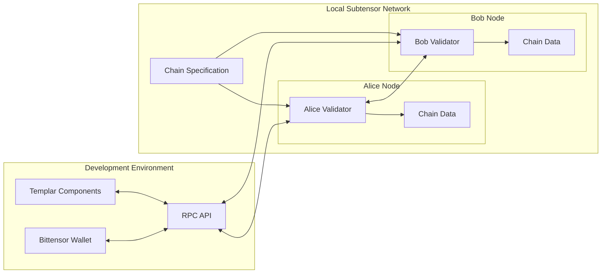
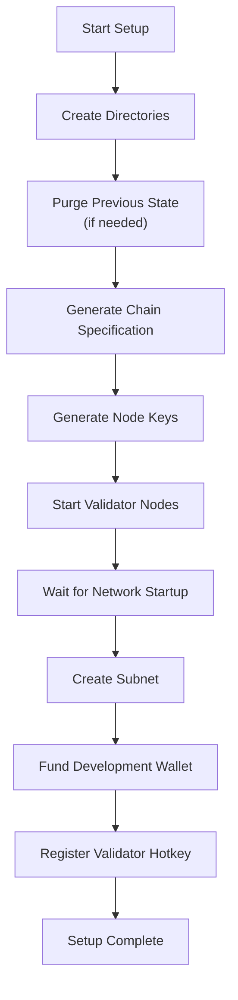
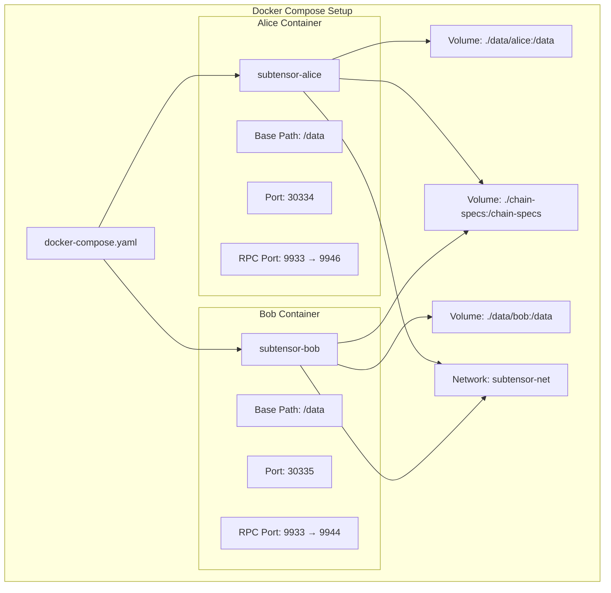
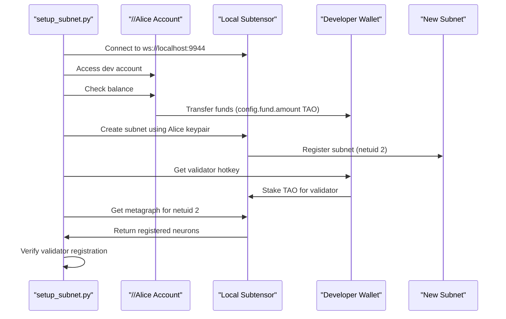

---

title: "Local Chain Setup"

---


import CollapsibleAside from '@components/CollapsibleAside.astro';

import SourceLink from '@components/SourceLink.astro';


<CollapsibleAside title="Relevant Source Files">

  <SourceLink text="scripts/local_chain/README.md" href="https://github.com/tplr-ai/templar/blob/bb2fc2a9/scripts/local_chain/README.md" />

  <SourceLink text="scripts/local_chain/docker-compose.yaml" href="https://github.com/tplr-ai/templar/blob/bb2fc2a9/scripts/local_chain/docker-compose.yaml" />

  <SourceLink text="scripts/local_chain/setup.sh" href="https://github.com/tplr-ai/templar/blob/bb2fc2a9/scripts/local_chain/setup.sh" />

  <SourceLink text="scripts/local_chain/setup_subnet.py" href="https://github.com/tplr-ai/templar/blob/bb2fc2a9/scripts/local_chain/setup_subnet.py" />

</CollapsibleAside>


## Purpose and Scope

This document provides comprehensive instructions for setting up a local Subtensor blockchain for development and testing purposes in the Templar framework. A local chain allows you to develop and test miners, validators, and other components without connecting to the public Bittensor network or spending real TAO tokens.

For deploying with Docker in production environments, see [Docker Deployment](/deployment/docker-deployment#8.1). For Ansible-based deployment, see [Ansible Deployment](/deployment/ansible-deployment#8.2).

## Prerequisites

Before setting up a local Subtensor chain, ensure you have:

- Docker and Docker Compose installed
- Python 3.8 or later
- Bittensor CLI tools installed

## Local Chain Architecture

The local chain setup creates a minimal Subtensor blockchain network running in Docker containers. The setup includes two validator nodes (Alice and Bob) that maintain the network consensus.



Sources: <SourceLink text="scripts/local_chain/docker-compose.yaml" href="https://github.com/tplr-ai/templar/blob/bb2fc2a9/scripts/local_chain/docker-compose.yaml" />, <SourceLink text="scripts/local_chain/setup.sh" href="https://github.com/tplr-ai/templar/blob/bb2fc2a9/scripts/local_chain/setup.sh" />

## Setup Process

The setup process follows these steps:

1. Create directories for chain data
2. Generate a local chain specification
3. Generate node keys for validators
4. Start the validator nodes
5. Create a subnet and fund wallets



Sources: <SourceLink text="scripts/local_chain/setup.sh" href="https://github.com/tplr-ai/templar/blob/bb2fc2a9/scripts/local_chain/setup.sh" />, <SourceLink text="scripts/local_chain/setup_subnet.py" href="https://github.com/tplr-ai/templar/blob/bb2fc2a9/scripts/local_chain/setup_subnet.py" />

## Setting Up the Local Chain

### Step 1: Initialize and Start the Local Chain

To set up the local chain, run the setup script:

```bash
cd scripts/local_chain
./setup.sh
```

This script:
- Creates directories for chain data
- Generates a local chain specification
- Starts two validator nodes (Alice and Bob) using Docker Compose
- Exposes RPC endpoints at `ws://localhost:9944` and `ws://localhost:9945`

If you want to keep existing chain data, use the `--no-purge` flag:

```bash
./setup.sh --no-purge
```

Sources: <SourceLink text="scripts/local_chain/setup.sh:4-47" href="https://github.com/tplr-ai/templar/blob/bb2fc2a9/scripts/local_chain/setup.sh#L4-L47" />

### Step 2: Create a Subnet and Fund Wallets

After the local chain is running, you need to create a subnet and fund your development wallets:

```bash
python scripts/local_chain/setup_subnet.py \
  --wallet.name YourWallet \
  --validator.hotkey validator \
  --miner.hotkeys miner1 miner2
```

The `setup_subnet.py` script performs these operations:

1. Connects to your local chain at `ws://localhost:9944`
2. Accesses the pre-funded development account (//Alice)
3. Funds your specified wallet from the development account
4. Creates a new subnet (which becomes netuid 2)
5. Registers and stakes your validator hotkey on the subnet

Sources: <SourceLink text="scripts/local_chain/setup_subnet.py:11-138" href="https://github.com/tplr-ai/templar/blob/bb2fc2a9/scripts/local_chain/setup_subnet.py#L11-L138" />

### Configuration Options

The subnet setup script accepts several parameters:

| Parameter | Description | Default |
|-----------|-------------|---------|
| `--wallet.name` | Name of your Bittensor wallet | Required |
| `--validator.hotkey` | Hotkey to register as a validator | Required |
| `--miner.hotkeys` | Space-separated list of miner hotkeys | [] |
| `--stake.amount` | Amount to stake for the validator (TAO) | 10.0 |
| `--fund.amount` | Amount to fund your wallet (TAO) | 100.0 |

Sources: <SourceLink text="scripts/local_chain/setup_subnet.py:13-40" href="https://github.com/tplr-ai/templar/blob/bb2fc2a9/scripts/local_chain/setup_subnet.py#L13-L40" />, <SourceLink text="scripts/local_chain/README.md:69-77" href="https://github.com/tplr-ai/templar/blob/bb2fc2a9/scripts/local_chain/README.md#L69-L77" />

## Running Components with the Local Chain

### Running a Validator

To run a validator against your local chain:

```bash
python neurons/validator.py \
  --wallet.name YourWallet \
  --wallet.hotkey validator \
  --subtensor.network ws://localhost:9944 \
  --netuid 2
```

### Running a Miner

To run a miner against your local chain:

```bash
python neurons/miner.py \
  --wallet.name YourWallet \
  --wallet.hotkey miner1 \
  --subtensor.network ws://localhost:9944 \
  --netuid 2
```

Sources: <SourceLink text="scripts/local_chain/README.md:27-39" href="https://github.com/tplr-ai/templar/blob/bb2fc2a9/scripts/local_chain/README.md#L27-L39" />

## Technical Implementation Details

### Docker Compose Configuration

The local chain uses Docker Compose to run two validator nodes:

1. **Alice Node**: Primary validator node with RPC endpoint at `ws://localhost:9946`
2. **Bob Node**: Secondary validator node with RPC endpoint at `ws://localhost:9944`

Both nodes use the `ghcr.io/opentensor/subtensor:v2.0.4` Docker image and run with specific flags to enable validator mode and expose RPC endpoints.



Sources: <SourceLink text="scripts/local_chain/docker-compose.yaml:1-52" href="https://github.com/tplr-ai/templar/blob/bb2fc2a9/scripts/local_chain/docker-compose.yaml#L1-L52" />

### Subnet Creation and Wallet Funding

The `setup_subnet.py` script automates the process of:

1. Connecting to the local chain
2. Accessing the pre-funded development account (//Alice)
3. Transferring funds to your wallet's coldkey
4. Creating a new subnet (which becomes netuid 2)
5. Staking TAO for the validator
6. Registering the validator hotkey on the subnet



Sources: <SourceLink text="scripts/local_chain/setup_subnet.py:45-127" href="https://github.com/tplr-ai/templar/blob/bb2fc2a9/scripts/local_chain/setup_subnet.py#L45-L127" />

## Troubleshooting

### Common Issues and Solutions

| Issue | Possible Cause | Solution |
|-------|---------------|----------|
| Chain doesn't start properly | Docker configuration issue | Check Docker logs with `docker compose logs` |
| Connection issues | Port mapping problem | Ensure ports 9944 and 9945 are exposed with `docker ps` |
| Funding or subnet creation fails | Chain not running or wallet issues | Verify containers are running and wallet exists |
| Need to reset the chain | Corrupt state | Run `docker compose down && rm -rf data chain-specs && ./setup.sh` |

### Verifying the Setup

To verify the local chain is running correctly:

1. Check Docker containers are running:
   ```bash
   docker ps | grep subtensor
   ```

2. Verify you can connect to the RPC endpoint:
   ```bash
   btcli subnet list --subtensor.network ws://localhost:9944
   ```

3. Check that subnet 2 exists:
   ```bash
   btcli subnet info 2 --subtensor.network ws://localhost:9944
   ```

Sources: <SourceLink text="scripts/local_chain/README.md:96-134" href="https://github.com/tplr-ai/templar/blob/bb2fc2a9/scripts/local_chain/README.md#L96-L134" />

## File Structure

The local chain setup uses the following directory structure:

```
scripts/local_chain/
├── README.md            # Documentation
├── setup.sh             # Main setup script
├── setup_subnet.py      # Script to create subnet and fund wallets
├── docker-compose.yaml  # Docker configuration
├── data/                # Created during setup
│   ├── alice/           # Alice node data
│   └── bob/             # Bob node data
└── chain-specs/         # Created during setup
    └── local.json       # Local chain specification
```

Sources: <SourceLink text="scripts/local_chain/README.md:88-95" href="https://github.com/tplr-ai/templar/blob/bb2fc2a9/scripts/local_chain/README.md#L88-L95" />, <SourceLink text="scripts/local_chain/setup.sh:8-9" href="https://github.com/tplr-ai/templar/blob/bb2fc2a9/scripts/local_chain/setup.sh#L8-L9" />