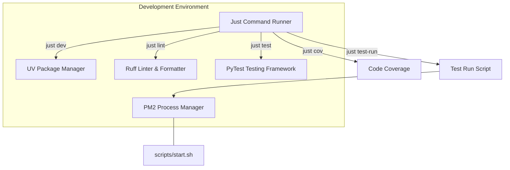
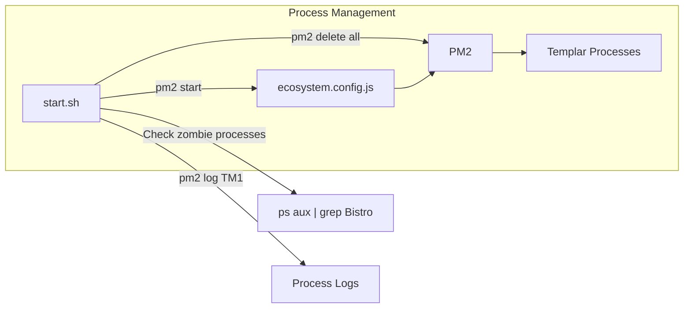
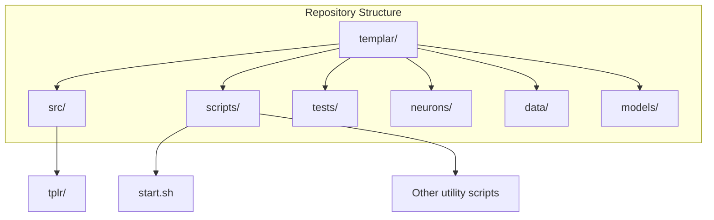
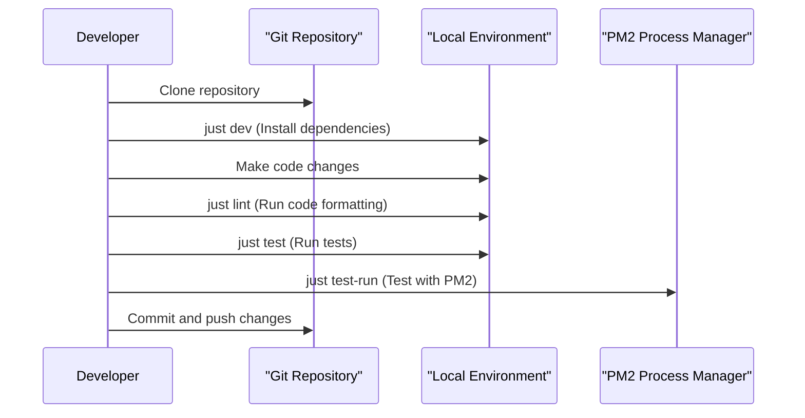

---

title: "Development Environment"

---


import CollapsibleAside from '@components/CollapsibleAside.astro';

import SourceLink from '@components/SourceLink.astro';


<CollapsibleAside title="Relevant Source Files">

  <SourceLink text=".gitignore" href="https://github.com/tplr-ai/templar/blob/bb2fc2a9/.gitignore" />

  <SourceLink text="justfile" href="https://github.com/tplr-ai/templar/blob/bb2fc2a9/justfile" />

  <SourceLink text="scripts/start.sh" href="https://github.com/tplr-ai/templar/blob/bb2fc2a9/scripts/start.sh" />

</CollapsibleAside>


This document provides comprehensive guidance for setting up and using the development environment for the Templar decentralized training framework. It covers environment setup, development tools, and common workflows for contributors. For information about testing specifically, see [Testing](/development-guide/testing#10.2). For deployment options, see [Deployment](/deployment#8).

## Environment Setup

Setting up your development environment for Templar requires installing several dependencies and configuring your local environment.

### Prerequisites

- Python 3.10 or newer
- UV (Python package manager)
- PM2 (Process manager for Node.js)
- Git

### Development Installation

Templar uses UV for dependency management. To set up your development environment:

```bash
# Clone the repository
git clone https://github.com/tplr-ai/templar
cd templar

# Install development dependencies
just dev
```

The `just dev` command runs `uv pip install --pre -e ".[dev]"` which installs the package in development mode with all development dependencies.

Sources: <SourceLink text="justfile:22-23" href="https://github.com/tplr-ai/templar/blob/bb2fc2a9/justfile#L22-L23" />

### Environment Files

Templar uses `.env.yaml` and `.env` files for configuration, which are excluded from version control. You'll need to create these files based on your local setup.

Sources: <SourceLink text=".gitignore:1-2" href="https://github.com/tplr-ai/templar/blob/bb2fc2a9/.gitignore#L1-L2" />

## Development Tools

Templar uses several tools to streamline the development process.



### Just Command Runner

Templar uses `just` as a command runner. The following commands are available:

| Command | Description |
|---------|-------------|
| `just lint` | Run ruff check with auto-fix and format |
| `just fix` | Alias for `just lint` |
| `just test-run` | Run a development version with randomized version |
| `just dev` | Install development dependencies |
| `just test` | Run pytest |
| `just cov` | Run pytest with coverage reporting |
| `just bistro` | Check for zombie Bistro processes |

Sources: <SourceLink text="justfile:5-33" href="https://github.com/tplr-ai/templar/blob/bb2fc2a9/justfile#L5-L33" />

### UV Package Manager

Templar uses UV for Python package management instead of pip. UV provides faster dependency resolution and installation.

Sources: [justfile:22-23](), <SourceLink text=".gitignore:29-34" href="https://github.com/tplr-ai/templar/blob/bb2fc2a9/.gitignore#L29-L34" />

### PM2 Process Manager

Templar uses PM2 to manage its processes. The `scripts/start.sh` script manages the startup of all components using PM2:



The `ecosystem.config.js` file contains the configuration for all processes that need to be started.

Sources: <SourceLink text="scripts/start.sh:1-16" href="https://github.com/tplr-ai/templar/blob/bb2fc2a9/scripts/start.sh#L1-L16" />

## Directory Structure

The Templar repository follows a standard Python package structure with some additional directories for specific purposes.



### Ignored Files and Directories

The `.gitignore` file lists files and directories that are excluded from version control. Notable exclusions include:

- Environment files (`.env.yaml`, `.env`)
- Python cache files (`__pycache__/`, `*.pyc`, etc.)
- Virtual environment directories (`.venv/`, `venv/`, `.env/`)
- Build artifacts (`build/`, `dist/`, `*.egg-info/`)
- IDE-specific files (`.idea/`, `.vscode/`)
- Node.js files (`node_modules/`, package lock files)
- Project-specific files (`wandb`, model files, data directories)

Sources: <SourceLink text=".gitignore:1-84" href="https://github.com/tplr-ai/templar/blob/bb2fc2a9/.gitignore#L1-L84" />

## Development Workflow

The typical development workflow for Templar involves the following steps:



### Making Changes

When making changes to the codebase:

1. **Install dependencies**: Run `just dev` to ensure you have all required dependencies.
2. **Make changes**: Edit code as needed.
3. **Lint code**: Run `just lint` to automatically format and check code style.
4. **Run tests**: Use `just test` to run tests or `just cov` to generate coverage reports.
5. **Test locally**: Run `just test-run` to test your changes using PM2.

Sources: [justfile:5-33](), <SourceLink text="scripts/start.sh:1-16" href="https://github.com/tplr-ai/templar/blob/bb2fc2a9/scripts/start.sh#L1-L16" />

### Running the Application

To start all components locally:

```bash
./scripts/start.sh
```

This command:
1. Stops any existing PM2 processes
2. Checks for zombie Bistro processes
3. Starts all applications defined in the ecosystem.config.js file
4. Attaches to the logs of the TM1 process

Sources: <SourceLink text="scripts/start.sh:1-16" href="https://github.com/tplr-ai/templar/blob/bb2fc2a9/scripts/start.sh#L1-L16" />

## Code Quality Tools

Templar uses several tools to maintain code quality:

### Ruff

Ruff is used for both linting and formatting Python code. Run:

```bash
just lint  # Or just fix
```

This runs `ruff check --fix .` and `ruff format .` to automatically fix issues and format code.

Sources: <SourceLink text="justfile:5-11" href="https://github.com/tplr-ai/templar/blob/bb2fc2a9/justfile#L5-L11" />

### Pytest

Pytest is used for running tests. The project supports several test commands:

```bash
just test  # Run all tests
just cov   # Run tests with coverage reporting
```

Sources: <SourceLink text="justfile:25-32" href="https://github.com/tplr-ai/templar/blob/bb2fc2a9/justfile#L25-L32" />

## Version Management

During development, a temporary version string is generated for test runs:

```bash
just test-run
```

This command:
1. Temporarily modifies the version string in `src/tplr/__init__.py`
2. Runs the application
3. Restores the original version

Sources: <SourceLink text="justfile:13-20" href="https://github.com/tplr-ai/templar/blob/bb2fc2a9/justfile#L13-L20" />

## Common Issues and Troubleshooting

### Zombie Processes

The project includes a command to check for zombie Bistro processes:

```bash
just bistro
```

This runs `ps aux | grep Bistro` to identify any lingering processes.

Sources: <SourceLink text="justfile:28-29" href="https://github.com/tplr-ai/templar/blob/bb2fc2a9/justfile#L28-L29" />, <SourceLink text="scripts/start.sh:5-6" href="https://github.com/tplr-ai/templar/blob/bb2fc2a9/scripts/start.sh#L5-L6" />

### Environment File Issues

If you encounter configuration errors, check that your `.env.yaml` and `.env` files are properly set up. These files are not included in version control and must be created manually.

Sources: <SourceLink text=".gitignore:1-2" href="https://github.com/tplr-ai/templar/blob/bb2fc2a9/.gitignore#L1-L2" />