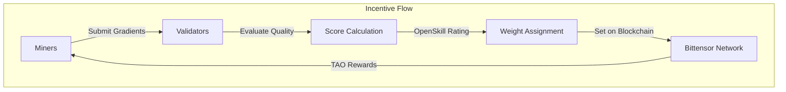
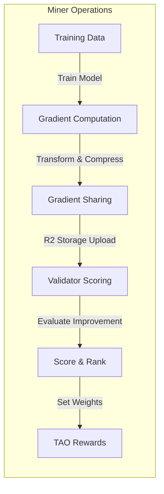
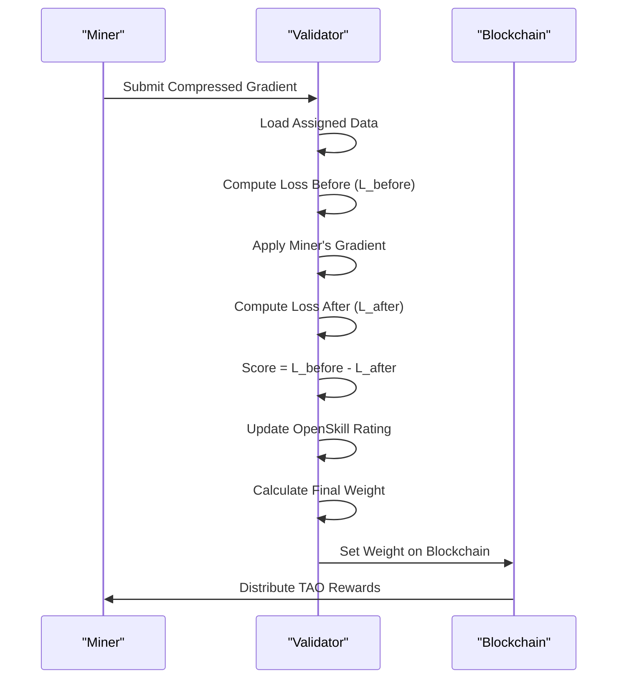
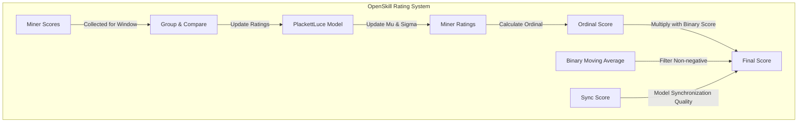
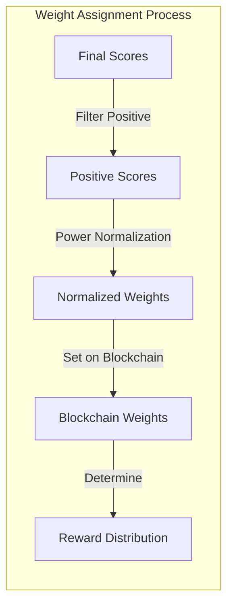

---

title: "Incentive Design"

---


import CollapsibleAside from '@components/CollapsibleAside.astro';

import SourceLink from '@components/SourceLink.astro';

import CollapsibleCode from '@components/CollapsibleCode.astro';


<CollapsibleAside title="Relevant Source Files">

  <SourceLink text="README.md" href="https://github.com/tplr-ai/templar/blob/bb2fc2a9/README.md" />

  <SourceLink text="docs/miner.md" href="https://github.com/tplr-ai/templar/blob/bb2fc2a9/docs/miner.md" />

  <SourceLink text="docs/validator.md" href="https://github.com/tplr-ai/templar/blob/bb2fc2a9/docs/validator.md" />

  <SourceLink text="ecosystem.config.js" href="https://github.com/tplr-ai/templar/blob/bb2fc2a9/ecosystem.config.js" />

  <SourceLink text="hparams.json" href="https://github.com/tplr-ai/templar/blob/bb2fc2a9/hparams.json" />

  <SourceLink text="neurons/miner.py" href="https://github.com/tplr-ai/templar/blob/bb2fc2a9/neurons/miner.py" />

  <SourceLink text="neurons/validator.py" href="https://github.com/tplr-ai/templar/blob/bb2fc2a9/neurons/validator.py" />

  <SourceLink text="src/tplr/__init__.py" href="https://github.com/tplr-ai/templar/blob/bb2fc2a9/src/tplr/__init__.py" />

  <SourceLink text="src/tplr/comms.py" href="https://github.com/tplr-ai/templar/blob/bb2fc2a9/src/tplr/comms.py" />

</CollapsibleAside>


This document explains the incentive mechanisms that drive the distributed training process in the Templar framework. It covers how miners are motivated to contribute quality gradients and how validators evaluate and reward these contributions. For information about the overall system architecture, see [System Architecture](/system-architecture#1.1).

## Overview of Incentive Mechanism

Templar's incentive mechanism aligns the interests of individual miners with the collective goal of improving model performance. The system uses an evaluation-based approach where validators assess the quality of miners' gradient contributions by measuring their impact on model loss.



Sources: <SourceLink text="neurons/validator.py:373-437" href="https://github.com/tplr-ai/templar/blob/bb2fc2a9/neurons/validator.py#L373-L437" />, <SourceLink text="neurons/miner.py:228-329" href="https://github.com/tplr-ai/templar/blob/bb2fc2a9/neurons/miner.py#L228-L329" />

The incentive flow creates a reinforcement loop: miners producing higher quality gradients receive better scores, leading to higher weights on the blockchain and greater TAO rewards, encouraging continued quality contributions.

## Miner Incentive Structure

Miners are incentivized to generate high-quality gradients through the following mechanisms:

1. **Direct performance evaluation**: Miners' contributions are scored based on their ability to improve model performance
2. **Window-based training cycles**: Each miner works on assigned data for a specific window
3. **Gradient sharing system**: Miners benefit from both their contributions and the collective improvement



Sources: <SourceLink text="neurons/miner.py:228-329" href="https://github.com/tplr-ai/templar/blob/bb2fc2a9/neurons/miner.py#L228-L329" />, <SourceLink text="neurons/validator.py:486-515" href="https://github.com/tplr-ai/templar/blob/bb2fc2a9/neurons/validator.py#L486-L515" />

### How Miners Maximize Rewards

Miners aim to maximize their rewards by:

1. Computing accurate gradients that lead to model improvement
2. Maintaining model synchronization with the network
3. Consistently contributing across training windows

The optimal strategy for miners is one that genuinely improves the model performance as measured by the validators.

## Validator Evaluation System

Validators employ a sophisticated evaluation system to measure the quality of miners' contributions and assign appropriate weights.

### Loss Improvement Calculation

The core of the evaluation is measuring how a miner's gradient improves model performance:

1. Compute loss before applying gradient: `L_before`
2. Apply miner's gradient to model
3. Compute loss after applying gradient: `L_after`
4. Calculate improvement score: `s_i = L_before - L_after`



Sources: <SourceLink text="neurons/validator.py:486-515" href="https://github.com/tplr-ai/templar/blob/bb2fc2a9/neurons/validator.py#L486-L515" />, <SourceLink text="neurons/validator.py:356-445" href="https://github.com/tplr-ai/templar/blob/bb2fc2a9/neurons/validator.py#L356-L445" />

### OpenSkill Rating System

Validators use the PlackettLuce model from the OpenSkill library to maintain a probabilistic skill rating for each miner:



Sources: <SourceLink text="neurons/validator.py:356-437" href="https://github.com/tplr-ai/templar/blob/bb2fc2a9/neurons/validator.py#L356-L437" />

The OpenSkill system has these key properties:

- **Mu (μ)**: Represents the estimated skill level of a miner
- **Sigma (σ)**: Represents the uncertainty in the skill estimate
- **Ordinal**: A conservative estimate of skill (μ - k·σ) that accounts for uncertainty
- **Parameters**:
  - Beta: 20 (controls the dynamics of rating updates)
  - Tau: 0.1 (dynamic factor that prevents ratings from stagnating)

### Binary Scores and Sync Quality

In addition to gradient quality, validators track:

1. **Binary Indicator Scores**: Whether miner updates improve or harm the model
2. **Sync Scores**: How well miners' models stay synchronized with the network

These factors are combined with the OpenSkill ordinal to produce the final score.

## Weight Normalization and Assignment

Validator weights are calculated using a power normalization approach to ensure a fair distribution:



Sources: <SourceLink text="neurons/validator.py:446-488" href="https://github.com/tplr-ai/templar/blob/bb2fc2a9/neurons/validator.py#L446-L488" />

The weight normalization process:

1. Creates a mask for peers that have been evaluated
2. Creates a mask for evaluated peers with positive scores
3. Applies power normalization to only the positive scores
4. Verifies that weights sum to approximately 1.0

This approach ensures that:
- Only positive contributions receive rewards
- Higher-quality contributions receive proportionally larger rewards
- The distribution of rewards is balanced across contributors

## Reward Allocation and Penalties

### Reward Allocation

Miners who contribute to model improvement receive weights proportional to their contribution quality. The moving average smooths temporary fluctuations, creating a stable reward mechanism.

### Penalties for Inactivity and Poor Performance

Validators implement several penalty mechanisms:

| Penalty Type | Condition | Reduction Rate |
|--------------|-----------|----------------|
| Inactivity | Peer inactive for a window | 25% per window |
| Missing Gradient | Failed to submit gradient | 75% |
| Poor Sync | Model out of sync with network | 75% |
| Long-term Inactivity | Inactive > 25 windows | Complete reset |

Sources: <SourceLink text="neurons/validator.py:702-770" href="https://github.com/tplr-ai/templar/blob/bb2fc2a9/neurons/validator.py#L702-L770" />, <SourceLink text="neurons/validator.py:877-912" href="https://github.com/tplr-ai/templar/blob/bb2fc2a9/neurons/validator.py#L877-L912" />

## Security Considerations

The incentive design addresses several potential security concerns:

1. **Sybil Resistance**: Creating multiple identities offers no advantage as rewards are based on contribution quality, not peer count
2. **Free-Riding Prevention**: Miners only receive rewards for genuine, measurable contributions
3. **Nash Equilibrium**: The optimal strategy is honest participation and genuine improvement
4. **Collusion Resistance**: Evaluation is based on objective model improvement metrics

## Implementation Details

### Key Parameters

The incentive system is configured with these parameters from hparams.json:

| Parameter | Value | Function |
|-----------|-------|----------|
| gradient_score_ma_alpha | 0.6 | Weight for gradient score moving average |
| binary_score_ma_alpha | 0.05 | Weight for binary indicator score moving average |
| final_score_ma_alpha | 0.75 | Weight for final score moving average |
| power_normalisation | 2.0 | Exponent for power normalization of weights |
| openskill_beta | 20 | Controls dynamics of rating updates |
| openskill_tau | 0.1 | Prevents ratings from stagnating |
| reset_inactivity_windows | 25 | Windows before peer score is fully reset |

Sources: <SourceLink text="hparams.json:14-17" href="https://github.com/tplr-ai/templar/blob/bb2fc2a9/hparams.json#L14-L17" />, <SourceLink text="hparams.json:40" href="https://github.com/tplr-ai/templar/blob/bb2fc2a9/hparams.json#L40" />, <SourceLink text="hparams.json:50-51" href="https://github.com/tplr-ai/templar/blob/bb2fc2a9/hparams.json#L50-L51" />, <SourceLink text="hparams.json:47" href="https://github.com/tplr-ai/templar/blob/bb2fc2a9/hparams.json#L47" />

### Code Implementation

The core validation and scoring system is implemented in validator.py, with key functions:

<CollapsibleCode title="Validator Core Functions" lang="python">

```python
def update_weights(self) -> None:
    """
    Update the weights for all evaluated peers using min power normalization.
    This method:
    1. Creates a mask for peers that have been evaluated.
    2. Creates a mask for evaluated peers with positive scores.
    3. Applies power normalization to only the positive scores.
    4. Verifies that weights sum to approximately 1.0.
    This approach only assigns weights to peers with positive scores.
    """
    self.weights = torch.zeros_like(self.final_scores)
    evaluated_mask = torch.zeros_like(self.final_scores, dtype=torch.bool)
    evaluated_mask[list(self.evaluated_uids)] = True

    # Create a mask for positive scores among evaluated peers
    positive_mask = evaluated_mask.clone()
    positive_mask[evaluated_mask] = self.final_scores[evaluated_mask] > 0

    # Only consider peers with positive scores
    positive_scores = self.final_scores[positive_mask]

    if len(positive_scores) > 0:
        # Apply power normalization to only the positive scores
        normalized_weights = min_power_normalization(
            positive_scores,
            power=self.hparams.power_normalisation,
        )

        # Assign weights only to peers with positive scores
        self.weights[positive_mask] = normalized_weights

        weight_sum = self.weights.sum().item()
        tplr.logger.debug(f"Weight sum: {weight_sum}")

        if abs(weight_sum - 1.0) > 1e-6:
            tplr.logger.warning(
                f"Weights sum to {weight_sum}, expected close to 1.0"
            )
    else:
        tplr.logger.warning(
            "No positive scores found among evaluated peers. All weights set to zero."
        )


def update_openskill_ratings(self):
    """
    Update OpenSkill ratings based on gradient scores and recalculate final scores.

    This method:
    1. Processes all peers evaluated in the current window.
    2. Updates their OpenSkill ratings based on gradient performance.
    3. Recalculates final scores using OpenSkill mu value combined with binary and sync scores.
    4. Logs the updated ratings to monitoring systems (WandB, InfluxDB).

    The OpenSkill rating system provides a probabilistic skill rating that accounts for
    uncertainty and relative performance between peers. Ratings are updated using the
    PlackettLuce model where higher gradient scores indicate better performance.

    The final score calculation combines:
    - OpenSkill ordinal (derived from mean skill estimate, mu)
    - Binary moving average (filtered to non-negative values)
    - Sync score (model synchronization quality)
    """
    if (
        hasattr(self, "current_window_scores")
        and len(self.current_window_scores) > 1
    ):
        # Get UIDs and scores
        window_uids = list(self.current_window_scores.keys())

        # Scores for OpenSkill (higher is better)
        scores = [self.current_window_scores[uid] for uid in window_uids]

        # Create teams list for OpenSkill
        teams = [[self.openskill_ratings[uid]] for uid in window_uids]

        # Rate the teams using scores
        rated_teams = self.openskill_model.rate(teams, scores=scores)

        # Store updated ratings and recalculate final scores
        for i, uid in enumerate(window_uids):
            self.openskill_ratings[uid] = rated_teams[i][0]

            openskill_mu = float(self.openskill_ratings[uid].mu)
            openskill_sigma = float(self.openskill_ratings[uid].sigma)
            openskill_ordinal = float(self.openskill_ratings[uid].ordinal())

            sync_score = float(
                self.sync_scores[uid].item() if uid in self.evaluated_uids else 0.0
            )
            binary_moving_avg = max(0, self.binary_moving_averages[uid].item())

            self.final_scores[uid] = (
                openskill_ordinal
                * binary_moving_avg
                * sync_score
            )
            tplr.logger.info(
                f"Computed Final Score for UID {uid}: {self.final_scores[uid]}"
            )

            # Log to WandB
            if hasattr(self, "wandb") and self.wandb is not None:
                self.wandb.log(
                    {
                        f"validator/openskill/mu/{uid}": openskill_mu,
                        f"validator/openskill/sigma/{uid}": openskill_sigma,
                        f"validator/openskill/ordinal/{uid}": openskill_ordinal,
                    },
                    step=self.global_step,
                )

            # Log to InfluxDB
            if hasattr(self, "metrics_logger") and self.metrics_logger is not None:
                self.metrics_logger.log(
                    measurement="validator_openskill",
                    tags={
                        "eval_uid": str(uid),
                        "window": int(self.sync_window),
                        "global_step": int(self.global_step),
                    },
                    fields={
                        "mu": openskill_mu,
                        "sigma": openskill_sigma,
                        "ordinal": openskill_ordinal,
                    },
                )


def evaluate_model_on_batches(
    self,
    model: torch.nn.Module,
    batches: list[list[int]],
    sampled_indices: list[int],
) -> tuple[float, int]:
    """
    Evaluates a given model's performance (loss) on specified batches of data.

    This method:
    1. Sets the model to evaluation mode.
    2. Iterates through a list of pre-tokenized input batches.
    3. For each batch indicated by `sampled_indices`:
        a. Converts the batch to tensors and moves to the model's device.
        b. Creates labels, masking padding tokens.
        c. Performs a forward pass to get the loss.
        d. Accumulates total loss and counts the number of batches processed.
    4. Uses automatic mixed precision (autocast) for potential performance gains.
    5. Clears CUDA cache after processing each batch to manage memory.

    Args:
        model (torch.nn.Module): The model to be evaluated.
        batches (list[list[int]]): A list of tokenized input batches.
        sampled_indices (list[int]): A list of indices indicating which batches to evaluate.

    Returns:
        tuple[float, int]: A tuple containing the total loss accumulated over
                           the evaluated batches and the number of batches processed.
    """
    total_loss = 0.0
    n_batches = 0
    with torch.no_grad(): # Ensure no gradients are computed during evaluation
        model.eval()      # Set the model to evaluation mode
        # Use autocast for mixed precision inference if supported
        with autocast(device_type=self.model.device.type, dtype=torch.bfloat16):
            for i, batch in enumerate(batches):
                if i not in sampled_indices:
                    continue  # Skip batches not in the sampled list

                input_ids = torch.tensor(batch, dtype=torch.long).to(model.device)
                labels = input_ids.clone()
                # Mask padding tokens for loss calculation
                labels = torch.where(
                    labels == self.tokenizer.pad_token_id, -100, labels
                )

                outputs = model(input_ids=input_ids, labels=labels)
                total_loss += outputs.loss.item()
                n_batches += 1

                # Clean up to free GPU memory
                del input_ids, labels, outputs
                if torch.cuda.is_available():
                    torch.cuda.empty_cache()

    return total_loss, n_batches
``` 

</CollapsibleCode>

Sources: <SourceLink text="neurons/validator.py:356-437" href="https://github.com/tplr-ai/templar/blob/bb2fc2a9/neurons/validator.py#L356-L437" />, <SourceLink text="neurons/validator.py:446-488" href="https://github.com/tplr-ai/templar/blob/bb2fc2a9/neurons/validator.py#L446-L488" />, <SourceLink text="neurons/validator.py:489-515" href="https://github.com/tplr-ai/templar/blob/bb2fc2a9/neurons/validator.py#L489-L515" />

## Alignment with Templar's Goals

The incentive design aligns with Templar's core goals by:

1. **Encouraging Quality**: Rewards are proportional to model improvement
2. **Promoting Collaboration**: Miners benefit from the collective improvement of the model
3. **Ensuring Robustness**: Multiple validation metrics create a more reliable evaluation
4. **Supporting Decentralization**: Independent validators assess contributions fairly
5. **Enabling Heterogeneity**: Miners with varying hardware can contribute meaningfully

In summary, Templar's incentive design creates a self-regulating ecosystem where honest participation and genuine model improvement are the most rewarding strategies.

Sources: <SourceLink text="neurons/validator.py:356-488" href="https://github.com/tplr-ai/templar/blob/bb2fc2a9/neurons/validator.py#L356-L488" />, <SourceLink text="neurons/miner.py:228-329" href="https://github.com/tplr-ai/templar/blob/bb2fc2a9/neurons/miner.py#L228-L329" />