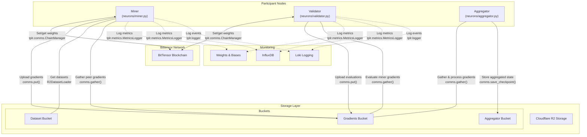
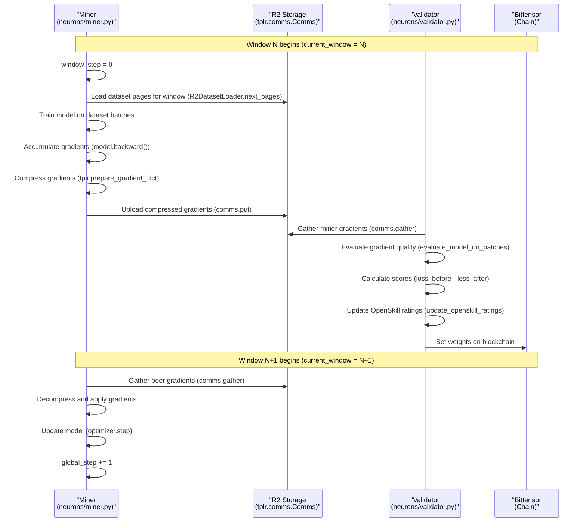
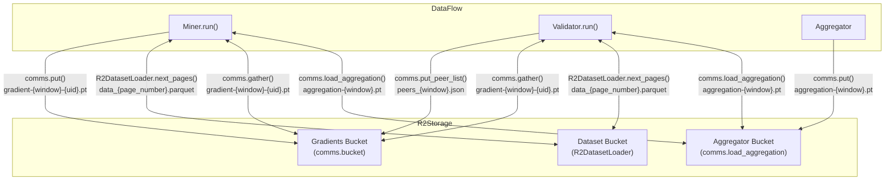

---

title: "Overview"

---

import CollapsibleAside from '@components/CollapsibleAside.astro';

import SourceLink from '@components/SourceLink.astro';

<CollapsibleAside title="Relevant Source Files">

  <SourceLink text="README.md" href="https://github.com/tplr-ai/templar/blob/bb2fc2a9/README.md" />

  <SourceLink text="docs/miner.md" href="https://github.com/tplr-ai/templar/blob/bb2fc2a9/docs/miner.md" />

  <SourceLink text="docs/validator.md" href="https://github.com/tplr-ai/templar/blob/bb2fc2a9/docs/validator.md" />

  <SourceLink text="ecosystem.config.js" href="https://github.com/tplr-ai/templar/blob/bb2fc2a9/ecosystem.config.js" />

  <SourceLink text="hparams.json" href="https://github.com/tplr-ai/templar/blob/bb2fc2a9/hparams.json" />

  <SourceLink text="neurons/miner.py" href="https://github.com/tplr-ai/templar/blob/bb2fc2a9/neurons/miner.py" />

  <SourceLink text="neurons/validator.py" href="https://github.com/tplr-ai/templar/blob/bb2fc2a9/neurons/validator.py" />

  <SourceLink text="pyproject.toml" href="https://github.com/tplr-ai/templar/blob/bb2fc2a9/pyproject.toml" />

  <SourceLink text="src/tplr/__init__.py" href="https://github.com/tplr-ai/templar/blob/bb2fc2a9/src/tplr/__init__.py" />

  <SourceLink text="src/tplr/comms.py" href="https://github.com/tplr-ai/templar/blob/bb2fc2a9/src/tplr/comms.py" />

  <SourceLink text="tests/test_comms.py" href="https://github.com/tplr-ai/templar/blob/bb2fc2a9/tests/test_comms.py" />

  <SourceLink text="uv.lock" href="https://github.com/tplr-ai/templar/blob/bb2fc2a9/uv.lock" />

</CollapsibleAside>

This page provides an introduction to Templar, a decentralized training framework for large language models that leverages the Bittensor network to coordinate distributed training across heterogeneous compute resources connected via the internet.

Sources: <SourceLink text="pyproject.toml:5-9" href="https://github.com/tplr-ai/templar/blob/bb2fc2a9/pyproject.toml#L5-L9" />, <SourceLink text="README.md:38-47" href="https://github.com/tplr-ai/templar/blob/bb2fc2a9/README.md#L38-L47" />

## What is Templar?

Templar is a system for incentivized distributed training of large language models. It connects diverse computational nodes through a carefully designed incentive mechanism, enabling collaborative training while ensuring honest participation and quality contributions. The framework implements a peer-to-peer architecture where participants contribute their computational resources to train a shared model, with rewards proportional to the quality of their contributions.

Sources: <SourceLink text="README.md:38-47" href="https://github.com/tplr-ai/templar/blob/bb2fc2a9/README.md#L38-L47" />, <SourceLink text="README.md:50-57" href="https://github.com/tplr-ai/templar/blob/bb2fc2a9/README.md#L50-L57" />

## System Architecture

### High-Level Architecture

Sources: <SourceLink text="neurons/miner.py:65-755" href="https://github.com/tplr-ai/templar/blob/bb2fc2a9/neurons/miner.py#L65-L755" />, <SourceLink text="neurons/validator.py:85-775" href="https://github.com/tplr-ai/templar/blob/bb2fc2a9/neurons/validator.py#L85-L775" />, <SourceLink text="src/tplr/comms.py:64-221" href="https://github.com/tplr-ai/templar/blob/bb2fc2a9/src/tplr/comms.py#L64-L221" />, <SourceLink text="src/tplr/comms.py:383-414" href="https://github.com/tplr-ai/templar/blob/bb2fc2a9/src/tplr/comms.py#L383-L414" />

### Gradient Exchange Workflow

Sources: <SourceLink text="neurons/miner.py:225-255" href="https://github.com/tplr-ai/templar/blob/bb2fc2a9/neurons/miner.py#L225-L255" />, <SourceLink text="neurons/validator.py:490-514" href="https://github.com/tplr-ai/templar/blob/bb2fc2a9/neurons/validator.py#L490-L514" />, <SourceLink text="neurons/validator.py:516-775" href="https://github.com/tplr-ai/templar/blob/bb2fc2a9/neurons/validator.py#L516-L775" />

## Core Components

### Miners

Miners train the model on assigned data subsets and share their gradients with peers. They:

1. Load a subset of the dataset based on the current window and their UID
2. Perform forward and backward passes to compute gradients
3. Compress gradients using DCT transform and top-k selection
4. Upload compressed gradients to R2 storage
5. Gather and apply peer gradients to update their model
6. Progress to the next window

The `Miner` class in <SourceLink text="neurons/miner.py" href="https://github.com/tplr-ai/templar/blob/bb2fc2a9/neurons/miner.py" /> implements this functionality, with its main loop in the asynchronous `run()` method.

Sources: <SourceLink text="neurons/miner.py:65-229" href="https://github.com/tplr-ai/templar/blob/bb2fc2a9/neurons/miner.py#L65-L229" />, <SourceLink text="README.md:64-117" href="https://github.com/tplr-ai/templar/blob/bb2fc2a9/README.md#L64-L117" />

### Validators

Validators evaluate miners' gradient contributions and set weights on the blockchain. They:

1. Gather gradients submitted by miners
2. Evaluate each miner's contribution by measuring loss improvement
3. Calculate scores based on the performance improvement
4. Update OpenSkill ratings for miners
5. Set weights on the blockchain to influence reward distribution

The `Validator` class in <SourceLink text="neurons/validator.py" href="https://github.com/tplr-ai/templar/blob/bb2fc2a9/neurons/validator.py" /> implements this functionality, with evaluation logic in `evaluate_model_on_batches()` and weight setting in `update_weights()`.

Sources: <SourceLink text="neurons/validator.py:85-144" href="https://github.com/tplr-ai/templar/blob/bb2fc2a9/neurons/validator.py#L85-L144" />, <SourceLink text="neurons/validator.py:356-437" href="https://github.com/tplr-ai/templar/blob/bb2fc2a9/neurons/validator.py#L356-L437" />, <SourceLink text="README.md:140-184" href="https://github.com/tplr-ai/templar/blob/bb2fc2a9/README.md#L140-L184" />

### Communication System

The communication system, implemented in the `Comms` class, handles data exchange between nodes:

1. **Gradient Exchange**: Efficient transfer of compressed gradients
2. **Dataset Access**: Loading training data from R2 storage
3. **Checkpoint Management**: Saving and loading model states
4. **Blockchain Integration**: Setting and getting weights on the Bittensor network

Key methods include `put()` for uploading data, `gather()` for collecting peer gradients, and `s3_get_object()`/`s3_put_object()` for R2 storage operations.

Sources: <SourceLink text="src/tplr/comms.py:64-221" href="https://github.com/tplr-ai/templar/blob/bb2fc2a9/src/tplr/comms.py#L64-L221" />, <SourceLink text="src/tplr/comms.py:322-371" href="https://github.com/tplr-ai/templar/blob/bb2fc2a9/src/tplr/comms.py#L322-L371" />

### Gradient Compression

To reduce communication overhead, Templar uses:

1. **DCT Transform**: Converting gradients to frequency domain
2. **Top-K Selection**: Keeping only the most significant coefficients
3. **Momentum Tracking**: Maintaining gradient momentum between updates

This compression is handled by `TransformDCT` and `CompressDCT` classes (imported in miners and validators).

Sources: <SourceLink text="neurons/miner.py:130-147" href="https://github.com/tplr-ai/templar/blob/bb2fc2a9/neurons/miner.py#L130-L147" />, <SourceLink text="neurons/validator.py:159-175" href="https://github.com/tplr-ai/templar/blob/bb2fc2a9/neurons/validator.py#L159-L175" />

## Storage Architecture

Sources: <SourceLink text="src/tplr/comms.py:174-220" href="https://github.com/tplr-ai/templar/blob/bb2fc2a9/src/tplr/comms.py#L174-L220" />, <SourceLink text="neurons/miner.py:339-350" href="https://github.com/tplr-ai/templar/blob/bb2fc2a9/neurons/miner.py#L339-L350" />, <SourceLink text="neurons/validator.py:832-858" href="https://github.com/tplr-ai/templar/blob/bb2fc2a9/neurons/validator.py#L832-L858" />

## System Configuration

Templar uses a configuration system with parameters defined in <SourceLink text="hparams.json" href="https://github.com/tplr-ai/templar/blob/bb2fc2a9/hparams.json" />. Key parameters include:

| Parameter | Description | Default Value |
|-----------|-------------|--------------|
| `topk_compression` | Compression ratio for gradients | 32 |
| `blocks_per_window` | Blockchain blocks per training window | 7 |
| `pages_per_window` | Dataset pages to process per window | 6 |
| `batch_size` | Training batch size | 6 |
| `learning_rate` | Base learning rate | 4e-4 |
| `checkpoint_frequency` | Windows between checkpoint saves | 100 |
| `validator_offset` | Windows validators lag behind miners | 2 |

Sources: <SourceLink text="hparams.json:1-53" href="https://github.com/tplr-ai/templar/blob/bb2fc2a9/hparams.json#L1-L53" />

## Incentive Mechanism

The incentive system aligns individual miner incentives with the collective goal of improving model performance:

1. **Gradient Evaluation**: Validators compute a score based on loss improvement from each miner's gradient
2. **OpenSkill Ratings**: Miners are rated using the PlackettLuce model based on their contributions
3. **Weight Setting**: Weights on the blockchain are updated based on these ratings
4. **Reward Distribution**: Miners receive rewards proportional to their assigned weights

This mechanism encourages honest participation and quality contributions.

Sources: <SourceLink text="neurons/validator.py:356-437" href="https://github.com/tplr-ai/templar/blob/bb2fc2a9/neurons/validator.py#L356-L437" />, <SourceLink text="README.md:216-270" href="https://github.com/tplr-ai/templar/blob/bb2fc2a9/README.md#L216-L270" />

## Implementation Details

Templar is implemented in Python and relies on several key libraries:

- **PyTorch**: For model definition and training (LlamaForCausalLM)
- **Bittensor**: For blockchain integration and incentive mechanism
- **Cloudflare R2**: For distributed storage
- **OpenSkill**: For fair rating of miner contributions
- **WandB/InfluxDB/Loki**: For monitoring and telemetry

The implementation follows an asynchronous model, with extensive use of Python's `asyncio` for handling concurrent operations.

Sources: <SourceLink text="pyproject.toml:11-36" href="https://github.com/tplr-ai/templar/blob/bb2fc2a9/pyproject.toml#L11-L36" />, <SourceLink text="src/tplr/__init__.py:22-36" href="https://github.com/tplr-ai/templar/blob/bb2fc2a9/src/tplr/__init__.py#L22-L36" />

## Related Pages

- For detailed miner functionality, see [Miners](/miners#2)
- For validator operations, see [Validators](/validators#3)
- For aggregation server, see [Aggregation Server](/aggregation-server#4)
- For communication system details, see [Communication System](/communication-system#6)
- For system architecture, see [System Architecture](/system-architecture#1.1)