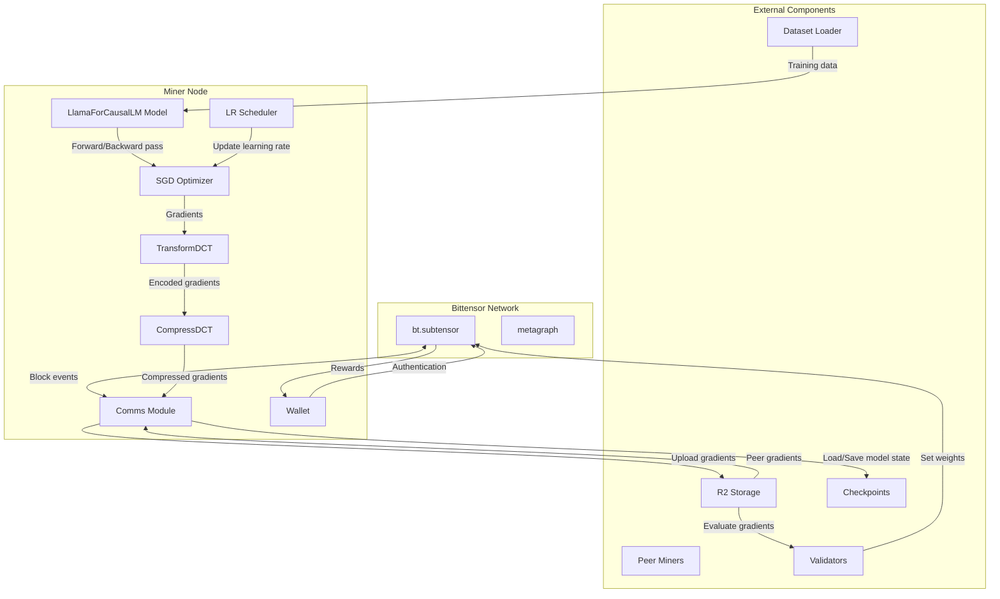
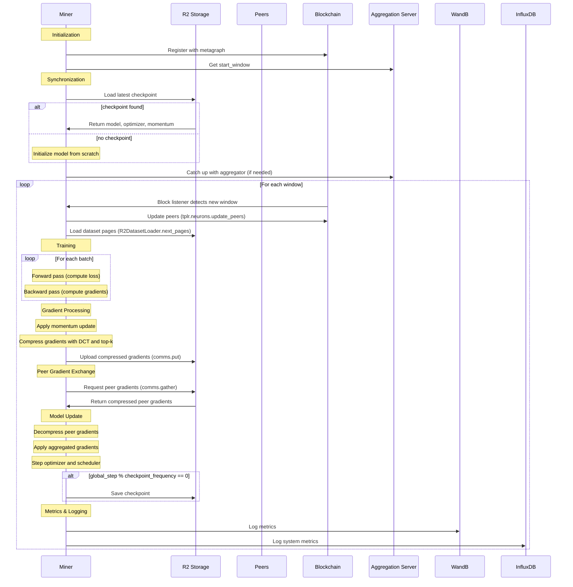
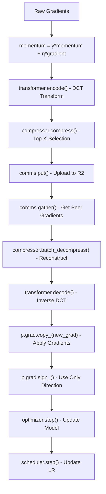

---

title: "Miners"

---


import CollapsibleAside from '@components/CollapsibleAside.astro';

import SourceLink from '@components/SourceLink.astro';


<CollapsibleAside title="Relevant Source Files">

  <SourceLink text="README.md" href="https://github.com/tplr-ai/templar/blob/bb2fc2a9/README.md" />

  <SourceLink text="docs/miner.md" href="https://github.com/tplr-ai/templar/blob/bb2fc2a9/docs/miner.md" />

  <SourceLink text="docs/validator.md" href="https://github.com/tplr-ai/templar/blob/bb2fc2a9/docs/validator.md" />

  <SourceLink text="ecosystem.config.js" href="https://github.com/tplr-ai/templar/blob/bb2fc2a9/ecosystem.config.js" />

  <SourceLink text="hparams.json" href="https://github.com/tplr-ai/templar/blob/bb2fc2a9/hparams.json" />

  <SourceLink text="neurons/miner.py" href="https://github.com/tplr-ai/templar/blob/bb2fc2a9/neurons/miner.py" />

  <SourceLink text="neurons/validator.py" href="https://github.com/tplr-ai/templar/blob/bb2fc2a9/neurons/validator.py" />

  <SourceLink text="src/tplr/__init__.py" href="https://github.com/tplr-ai/templar/blob/bb2fc2a9/src/tplr/__init__.py" />

  <SourceLink text="src/tplr/comms.py" href="https://github.com/tplr-ai/templar/blob/bb2fc2a9/src/tplr/comms.py" />

</CollapsibleAside>


This document provides a detailed explanation of miners in the Templar decentralized training framework. Miners are computational nodes responsible for training language models on assigned data and sharing their gradients with the network. For information about how validators evaluate miners' contributions, see [Validators](/validators#3).

## Miner Architecture and Positioning

Miners are a core component of Templar's distributed training infrastructure. They work alongside validators and the aggregation server to collaboratively train large language models across distributed nodes.

### Miner Position in Templar Architecture



Sources: <SourceLink text="neurons/miner.py:65-226" href="https://github.com/tplr-ai/templar/blob/bb2fc2a9/neurons/miner.py#L65-L226" />

## Miner Implementation

The miner implementation is structured around the `Miner` class, which coordinates training, gradient processing, and communication.

### Key Components

1. **Model**: `LlamaForCausalLM` - The foundational language model being trained
2. **Optimizer**: `SGD` with momentum for updating model parameters
3. **Transformers**: `TransformDCT` and `CompressDCT` for gradient compression
4. **Communications**: `Comms` module for gradient sharing via R2 storage
5. **Scheduler**: Learning rate scheduler combining warm-up and cosine annealing

Sources: <SourceLink text="neurons/miner.py:107-226" href="https://github.com/tplr-ai/templar/blob/bb2fc2a9/neurons/miner.py#L107-L226" />

## Miner Lifecycle

The following sequence diagram illustrates the complete lifecycle of a miner during operation:



Sources: <SourceLink text="neurons/miner.py:229-755" href="https://github.com/tplr-ai/templar/blob/bb2fc2a9/neurons/miner.py#L229-L755" />

## Training Process

The miner's primary responsibility is to train the language model on assigned data and share the resulting gradients. Here's how the training process works:

### Dataset Assignment

For each window, miners receive specific dataset pages:

```python
pages = await tplr.r2_dataset.R2DatasetLoader.next_pages(
    offset=step_window * self.hparams.pages_per_window,
    n_pages=self.hparams.pages_per_window,
    seed=self.uid,  # Each miner gets unique data based on UID
)
```

The data assignment is deterministic - miners with the same UID will always receive the same pages for a given window number.

Sources: <SourceLink text="neurons/miner.py:339-355" href="https://github.com/tplr-ai/templar/blob/bb2fc2a9/neurons/miner.py#L339-L355" />

### Gradient Computation and Accumulation

Miners process batches of data, compute loss, and accumulate gradients:

```python
for i, batch in enumerate(loader):
    input_ids = torch.tensor(batch, dtype=torch.long).to(self.model.device)
    tokens_this_batch = input_ids.numel()
    window_tokens += tokens_this_batch
    labels = input_ids.clone()
    labels = torch.where(
        labels == self.tokenizer.pad_token_id, -100, labels
    )

    with autocast(device_type=self.model.device.type, dtype=torch.bfloat16):
        outputs = self.model(input_ids=input_ids, labels=labels)

    total_loss += outputs.loss.item()
    outputs.loss.backward()
    n_batches += 1
```

Sources: <SourceLink text="neurons/miner.py:360-384" href="https://github.com/tplr-ai/templar/blob/bb2fc2a9/neurons/miner.py#L360-L384" />

## Gradient Processing and Sharing

After computing gradients, miners process and share them with the network:

### Gradient Processing Flow



Sources: <SourceLink text="neurons/miner.py:399-402" href="https://github.com/tplr-ai/templar/blob/bb2fc2a9/neurons/miner.py#L399-L402" />, <SourceLink text="neurons/miner.py:560-601" href="https://github.com/tplr-ai/templar/blob/bb2fc2a9/neurons/miner.py#L560-L601" />

### Compression Techniques

Miners use two key techniques to compress gradients efficiently:

1. **DCT Transformation**: Converts gradients to frequency domain using Discrete Cosine Transform
2. **Top-K Selection**: Only keeps the K most significant coefficients, drastically reducing data size

This compression is essential for efficient sharing over the internet, allowing miners to exchange gradient information without prohibitive bandwidth requirements.

Sources: <SourceLink text="neurons/miner.py:131-147" href="https://github.com/tplr-ai/templar/blob/bb2fc2a9/neurons/miner.py#L131-L147" />

## Communication System

The communication system enables miners to interact with R2 storage, validators, and other miners:

### Gradient Exchange via R2

```python
# Upload own gradients
put_completion_time = await self.comms.put(
    state_dict=processed_state_dict,
    uid=str(self.uid),
    window=step_window,
    key="gradient",
    global_step=self.global_step,
    local=False,
    stale_retention=100,
)

# Gather gradients from peers
gather_result = await self.comms.gather(
    my_uid=self.uid,
    uids=self.comms.peers,
    window=step_window,
    key="gradient",
    timeout=35,
    device="cpu",
    local=False,
    stale_retention=100,
    totalks=self.totalks,
    time_min=time_min,
    time_max=time_max,
)
```

Sources: <SourceLink text="neurons/miner.py:417-427" href="https://github.com/tplr-ai/templar/blob/bb2fc2a9/neurons/miner.py#L417-L427" />, <SourceLink text="neurons/miner.py:489-501" href="https://github.com/tplr-ai/templar/blob/bb2fc2a9/neurons/miner.py#L489-L501" />

## Model Synchronization

Miners synchronize their model with the network using checkpoints:

1. **Initial Synchronization**: When starting, miners load the latest checkpoint
2. **Catch-up Procedure**: If behind, miners catch up with the aggregation server
3. **Periodic Checkpoints**: Save model state every `checkpoint_frequency` windows

```python
if self.global_step % self.hparams.checkpoint_frequency == 0:
    asyncio.create_task(
        self.comms.save_checkpoint(
            model=self.model,
            optimizer=self.optimizer,
            scheduler=self.scheduler,
            momentum=self.momentum,
            global_step=self.global_step,
            current_window=self.current_window,
            start_window=self.start_window,
        )
    )
```

Sources: <SourceLink text="neurons/miner.py:732-747" href="https://github.com/tplr-ai/templar/blob/bb2fc2a9/neurons/miner.py#L732-L747" />

## Configuration Parameters

Miners are configured through both command-line parameters and hyperparameter settings:

### Command-Line Parameters

| Parameter | Description | Default |
|-----------|-------------|---------|
| `--netuid` | Bittensor network UID | 268 |
| `--device` | Computing device | "cuda" |
| `--debug` | Enable debug logging | False |
| `--trace` | Enable trace logging | False |
| `--test` | Test mode (use all peers) | False |
| `--local` | Use toy model for local testing | False |

Sources: <SourceLink text="neurons/miner.py:67-106" href="https://github.com/tplr-ai/templar/blob/bb2fc2a9/neurons/miner.py#L67-L106" />

### Hyperparameters

Key hyperparameters from `hparams.json`:

| Parameter | Value | Description |
|-----------|-------|-------------|
| `sequence_length` | 2048 | Maximum sequence length for training |
| `pages_per_window` | 6 | Number of data pages per window |
| `batch_size` | 6 | Batch size for training |
| `learning_rate` | 4e-4 | Initial learning rate |
| `blocks_per_window` | 7 | Number of blockchain blocks per window |
| `momentum_decay` | 0.999 | Decay rate for momentum |
| `topk_compression` | 32 | Top-K value for gradient compression |
| `target_chunk` | 64 | Chunk size for DCT transform |
| `checkpoint_frequency` | 100 | Windows between checkpoint saves |

Sources: <SourceLink text="hparams.json:1-53" href="https://github.com/tplr-ai/templar/blob/bb2fc2a9/hparams.json#L1-L53" />

## Performance Monitoring

Miners track various metrics to monitor performance:

```python
self.wandb.log(
    {
        # Training metrics
        "miner/loss": total_loss / n_batches if n_batches > 0 else 0,
        "miner/tokens_per_sec": tokens_per_sec,
        "miner/batch_duration": duration,
        "miner/total_tokens": self.total_tokens_processed,
        "miner/batch_tokens": window_tokens,
        "miner/global_step": self.global_step,
        # Resource metrics
        "miner/gpu_memory_allocated": torch.cuda.memory_allocated() / 1024**2,
        "miner/gpu_memory_cached": torch.cuda.memory_reserved() / 1024**2,
        # Network metrics
        "miner/gather_peers": len(self.comms.peers),
        "miner/effective_batch_size": len(self.comms.peers) * self.hparams.batch_size,
        # Optimization metrics
        "miner/learning_rate": self.scheduler.get_last_lr()[0],
        # Gradient statistics
        "miner/mean_grad_norm": sum(grad_norms) / len(grad_norms) if grad_norms else 0,
        "miner/max_grad_norm": max(grad_norms) if grad_norms else 0,
        "miner/min_grad_norm": min(grad_norms) if grad_norms else 0,
        "miner/grad_norm_std": torch.tensor(grad_norms).std().item() if grad_norms else 0,
        "miner/mean_weight_norm": sum(weight_norms) / len(weight_norms),
        "miner/mean_momentum_norm": sum(momentum_norms) / len(momentum_norms),
    },
    step=self.global_step,
)
```

Sources: <SourceLink text="neurons/miner.py:518-552" href="https://github.com/tplr-ai/templar/blob/bb2fc2a9/neurons/miner.py#L518-L552" />

## Hardware Requirements

To run a miner effectively, you need:

- **GPU**: NVIDIA H100 with 80GB VRAM recommended
- **Storage**: 100GB+ for model and data
- **Network**: Stable internet connection with good bandwidth

Sources: <SourceLink text="docs/miner.md:369-373" href="https://github.com/tplr-ai/templar/blob/bb2fc2a9/docs/miner.md#L369-L373" />

## Integration with Validators

Miners work in tandem with validators, who:

1. Gather and evaluate miners' gradients
2. Compute scores based on improvement in loss
3. Set weights on the blockchain
4. Determine reward distribution

For more details on validators and the evaluation process, see [Validators](/validators#3) and [Weight Setting](/validators/weight-setting#3.1).

Sources: <SourceLink text="neurons/validator.py:489-516" href="https://github.com/tplr-ai/templar/blob/bb2fc2a9/neurons/validator.py#L489-L516" />

## Running a Miner

For detailed setup and running instructions, refer to the documentation in <SourceLink text="docs/miner.md" href="https://github.com/tplr-ai/templar/blob/bb2fc2a9/docs/miner.md" />. This includes:

1. Installing dependencies
2. Setting up R2 bucket credentials
3. Configuring Bittensor wallet
4. Running via Docker or directly with Python
5. Monitoring performance and troubleshooting

Sources: <SourceLink text="docs/miner.md:32-302" href="https://github.com/tplr-ai/templar/blob/bb2fc2a9/docs/miner.md#L32-L302" />