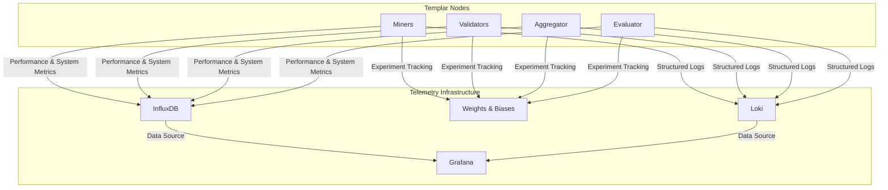
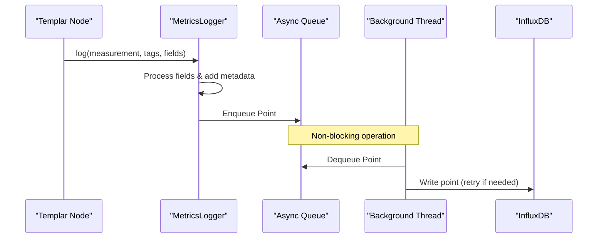
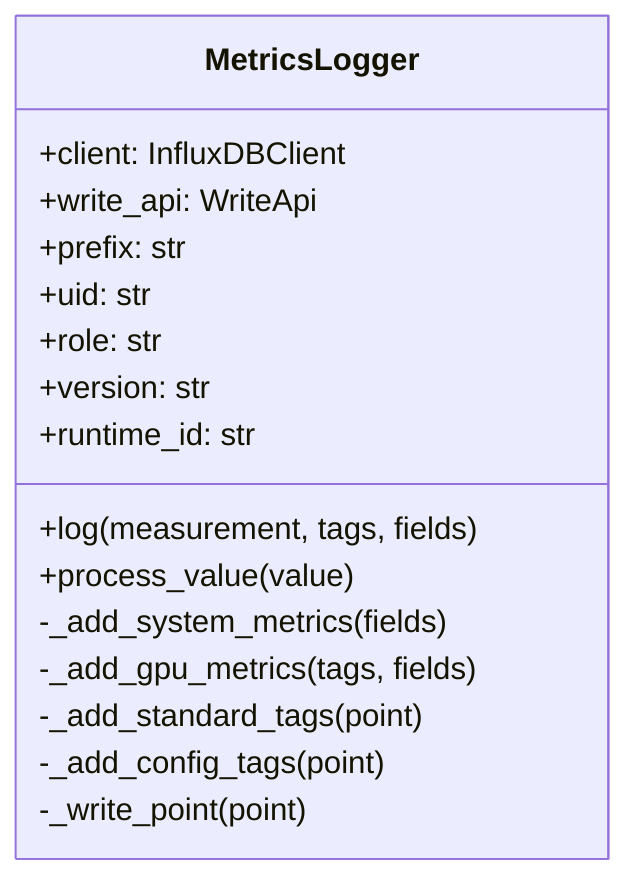
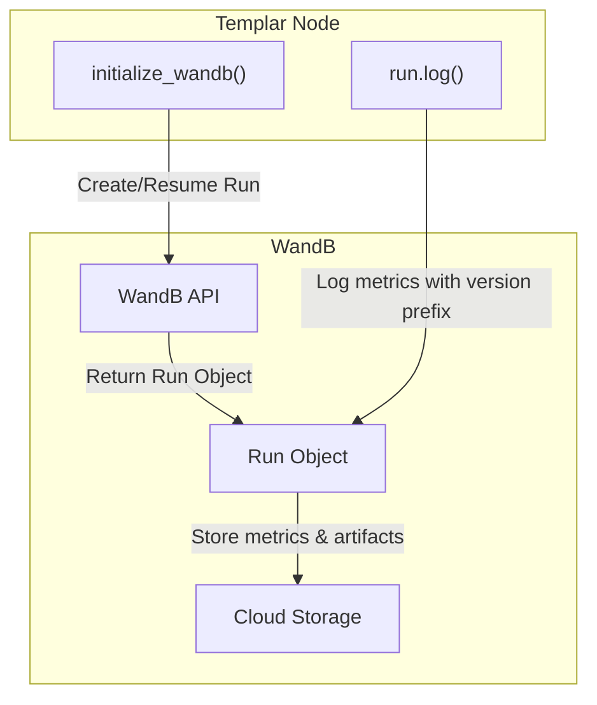
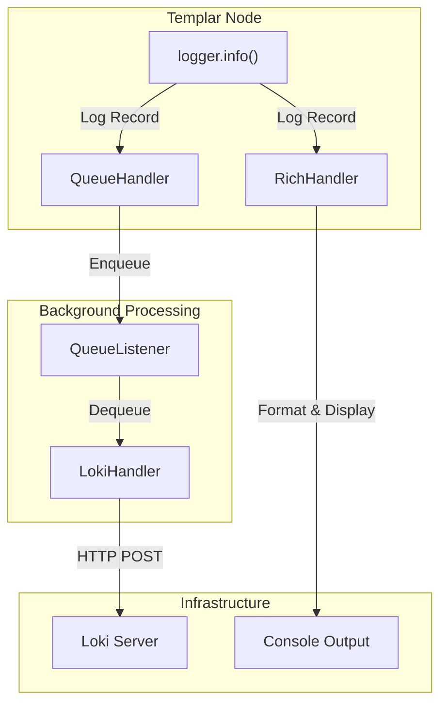
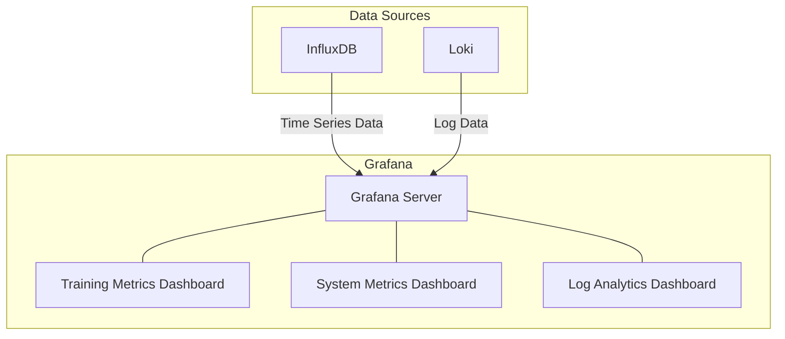
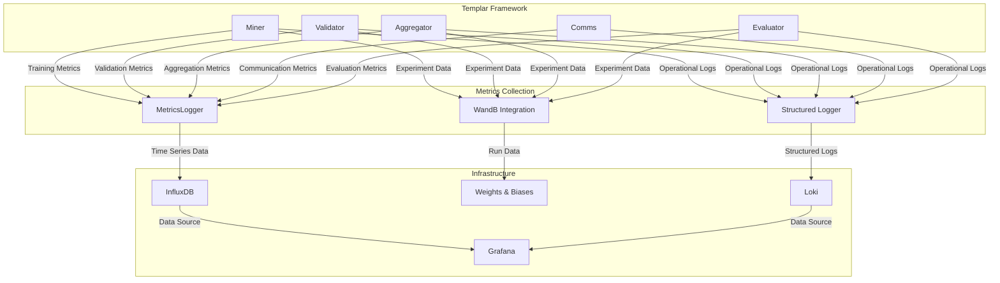

---

title: "Monitoring and Telemetry"

---


import CollapsibleAside from '@components/CollapsibleAside.astro';

import SourceLink from '@components/SourceLink.astro';


<CollapsibleAside title="Relevant Source Files">

  <SourceLink text="hparams-local-run.json" href="https://github.com/tplr-ai/templar/blob/bb2fc2a9/hparams-local-run.json" />

  <SourceLink text="src/tplr/dataset.py" href="https://github.com/tplr-ai/templar/blob/bb2fc2a9/src/tplr/dataset.py" />

  <SourceLink text="src/tplr/hparams.py" href="https://github.com/tplr-ai/templar/blob/bb2fc2a9/src/tplr/hparams.py" />

  <SourceLink text="src/tplr/logging.py" href="https://github.com/tplr-ai/templar/blob/bb2fc2a9/src/tplr/logging.py" />

  <SourceLink text="src/tplr/metrics.py" href="https://github.com/tplr-ai/templar/blob/bb2fc2a9/src/tplr/metrics.py" />

  <SourceLink text="src/tplr/schemas.py" href="https://github.com/tplr-ai/templar/blob/bb2fc2a9/src/tplr/schemas.py" />

  <SourceLink text="src/tplr/wandb.py" href="https://github.com/tplr-ai/templar/blob/bb2fc2a9/src/tplr/wandb.py" />

  <SourceLink text="telemetry/ansible/host_vars/grafana_prod.yml" href="https://github.com/tplr-ai/templar/blob/bb2fc2a9/telemetry/ansible/host_vars/grafana_prod.yml" />

  <SourceLink text="telemetry/simulator/testing_metrics.py" href="https://github.com/tplr-ai/templar/blob/bb2fc2a9/telemetry/simulator/testing_metrics.py" />

  <SourceLink text="tests/conftest.py" href="https://github.com/tplr-ai/templar/blob/bb2fc2a9/tests/conftest.py" />

  <SourceLink text="tests/test_metrics_logger.py" href="https://github.com/tplr-ai/templar/blob/bb2fc2a9/tests/test_metrics_logger.py" />

</CollapsibleAside>


This document describes the monitoring and telemetry system implemented in the Templar framework. It covers the metrics collection, logging infrastructure, and visualization tools that provide observability into the distributed training process. For information about deploying the monitoring services, see [Deployment](/deployment#8).

## Overview

Templar's monitoring and telemetry system provides comprehensive visibility into the distributed training process through three main components:

1. **Metrics Logging** - Collection and storage of time-series metrics in InfluxDB
2. **Experiment Tracking** - Tracking of training runs with Weights & Biases (WandB)
3. **Structured Logging** - Centralized logging with Loki for operational visibility

These components work together to provide a complete view of the training process, from model performance metrics to system resource utilization.



Sources: <SourceLink text="src/tplr/metrics.py" href="https://github.com/tplr-ai/templar/blob/bb2fc2a9/src/tplr/metrics.py" />, <SourceLink text="src/tplr/wandb.py" href="https://github.com/tplr-ai/templar/blob/bb2fc2a9/src/tplr/wandb.py" />, <SourceLink text="src/tplr/logging.py" href="https://github.com/tplr-ai/templar/blob/bb2fc2a9/src/tplr/logging.py" />

## Metrics Logging with InfluxDB

Templar uses a custom `MetricsLogger` class to collect and store metrics in InfluxDB. This system provides insights into training performance, system resource utilization, and gradient processing efficiency.

### Architecture

The metrics logging system is designed to be asynchronous and non-blocking to minimize impact on the training process. It uses a queue-based architecture to buffer metrics before sending them to InfluxDB.



Sources: <SourceLink text="src/tplr/metrics.py:182-226" href="https://github.com/tplr-ai/templar/blob/bb2fc2a9/src/tplr/metrics.py#L182-L226" />

### MetricsLogger Class

The `MetricsLogger` class provides a simple interface for logging metrics while handling the complexity of asynchronous communication with InfluxDB.

Key features:
- Automatic collection of system and GPU metrics
- Statistical processing of list values (mean, min, max, median)
- Tagging with runtime information (version, node role, etc.)
- Configurable batching and retry logic



Sources: <SourceLink text="src/tplr/metrics.py:82-321" href="https://github.com/tplr-ai/templar/blob/bb2fc2a9/src/tplr/metrics.py#L82-L321" />

### Configuration

The `MetricsLogger` can be configured through environment variables and constructor parameters:

| Parameter | Environment Variable | Default | Description |
|-----------|---------------------|---------|-------------|
| host | INFLUXDB_HOST | AWS InfluxDB endpoint | InfluxDB server hostname |
| port | INFLUXDB_PORT | 8086 | InfluxDB server port |
| database | INFLUXDB_DATABASE | "tplr" | InfluxDB bucket/database name |
| token | INFLUXDB_TOKEN | Fallback token | Authentication token |
| org | INFLUXDB_ORG | "tplr" | InfluxDB organization |
| prefix | - | "" | Prefix for all metrics |
| role | - | "" | Node role (miner, validator, etc.) |

Sources: <SourceLink text="src/tplr/metrics.py:45-59" href="https://github.com/tplr-ai/templar/blob/bb2fc2a9/src/tplr/metrics.py#L45-L59" />, <SourceLink text="src/tplr/metrics.py:88-105" href="https://github.com/tplr-ai/templar/blob/bb2fc2a9/src/tplr/metrics.py#L88-L105" />

### System and GPU Metrics

The metrics logging system automatically collects system and GPU metrics when requested:

**System Metrics:**
- CPU usage percentage
- Memory usage (used and total)

**GPU Metrics:**
- GPU memory allocated
- GPU memory cached/reserved
- GPU memory segments
- Total GPU memory used

```python
# Example usage
metrics_logger.log(
    measurement="training_step",
    tags={"uid": 42},
    fields={"loss": 0.75, "learning_rate": 0.001},
    with_system_metrics=True,
    with_gpu_metrics=True
)
```

Sources: <SourceLink text="src/tplr/metrics.py:324-359" href="https://github.com/tplr-ai/templar/blob/bb2fc2a9/src/tplr/metrics.py#L324-L359" />

## Experiment Tracking with Weights & Biases

Templar integrates with Weights & Biases (WandB) for experiment tracking and visualization. This integration provides a way to track training progress, compare different runs, and visualize model performance.

### Integration Architecture

The WandB integration is designed to handle versioning and run resumption, ensuring that training runs are properly tracked even if they span multiple sessions or software versions.



Sources: <SourceLink text="src/tplr/wandb.py:20-125" href="https://github.com/tplr-ai/templar/blob/bb2fc2a9/src/tplr/wandb.py#L20-L125" />

### Version Tracking

A unique feature of Templar's WandB integration is version tracking. Metrics are automatically prefixed with the current software version, allowing for easier comparison of performance across different software versions.

```
v0.1.0/loss
v0.1.0/step
latest/loss
latest/step
```

The system also maintains a version history in the run configuration, enabling tracking of when a run was executed with different versions of the software.

Sources: <SourceLink text="src/tplr/wandb.py:62-68" href="https://github.com/tplr-ai/templar/blob/bb2fc2a9/src/tplr/wandb.py#L62-L68" />, <SourceLink text="src/tplr/wandb.py:104-116" href="https://github.com/tplr-ai/templar/blob/bb2fc2a9/src/tplr/wandb.py#L104-L116" />

### Run Resumption

The integration supports run resumption by maintaining a record of run IDs and checking for existing runs when initializing WandB. This allows for seamless continuation of training across multiple sessions.

```python
# Run ID is stored in a file
run_id_file = os.path.join(wandb_dir, f"wandb_run_id_{run_prefix}{uid}.txt")
```

Sources: <SourceLink text="src/tplr/wandb.py:28-43" href="https://github.com/tplr-ai/templar/blob/bb2fc2a9/src/tplr/wandb.py#L28-L43" />, <SourceLink text="src/tplr/wandb.py:121-123" href="https://github.com/tplr-ai/templar/blob/bb2fc2a9/src/tplr/wandb.py#L121-L123" />

## Structured Logging with Loki

Templar uses a structured logging system with Loki integration for centralized log collection and analysis. This system provides operational visibility into the distributed training process.

### Architecture

The logging system is built on Python's standard logging module with enhancements for structured logging and Loki integration. It uses a queue-based architecture for asynchronous log transmission.



Sources: <SourceLink text="src/tplr/logging.py:149-287" href="https://github.com/tplr-ai/templar/blob/bb2fc2a9/src/tplr/logging.py#L149-L287" />

### Context-based Logging

The logging system supports context-based logging, allowing additional metadata to be attached to log messages. This metadata can include information like trace IDs, batch identifiers, or custom metrics.

```python
# Example context-based logging
log_with_context(
    'info', 
    'Processing batch', 
    batch_size=32, 
    batch_id='abc123'
)
```

Sources: <SourceLink text="src/tplr/logging.py:290-309" href="https://github.com/tplr-ai/templar/blob/bb2fc2a9/src/tplr/logging.py#L290-L309" />

### Log Filtering

The logging system includes custom filters to reduce noise and focus on relevant information. For example, it filters out common subtensor warnings that are not actionable.

```python
class NoSubtensorWarning(logging.Filter):
    def filter(self, record: logging.LogRecord) -> bool:
        # Return False if the record contains the undesired subtensor warning
        return (
            "Verify your local subtensor is running on port" not in record.getMessage()
        )
```

Sources: <SourceLink text="src/tplr/logging.py:91-96" href="https://github.com/tplr-ai/templar/blob/bb2fc2a9/src/tplr/logging.py#L91-L96" />

## Dashboards and Visualization

Templar uses Grafana for dashboard visualization of metrics stored in InfluxDB and logs stored in Loki. This provides a unified view of system performance and health.

### Grafana Configuration

Grafana is configured to connect to InfluxDB and Loki as data sources. The configuration is managed through Ansible for automated deployment.



Sources: <SourceLink text="telemetry/ansible/host_vars/grafana_prod.yml" href="https://github.com/tplr-ai/templar/blob/bb2fc2a9/telemetry/ansible/host_vars/grafana_prod.yml" />

### Available Metrics

The monitoring system collects a wide range of metrics that can be visualized in Grafana:

| Category | Metrics |
|----------|---------|
| Training | Loss, learning rate, gradient norms |
| System | CPU usage, memory usage |
| GPU | Memory allocated, memory cached |
| Network | Active peers, sync status |
| Performance | Gradient compression ratio, training throughput |

Sources: <SourceLink text="src/tplr/metrics.py:182-226" href="https://github.com/tplr-ai/templar/blob/bb2fc2a9/src/tplr/metrics.py#L182-L226" />, <SourceLink text="tests/test_metrics_logger.py:315-331" href="https://github.com/tplr-ai/templar/blob/bb2fc2a9/tests/test_metrics_logger.py#L315-L331" />

## Integration in the Templar Ecosystem

The monitoring and telemetry system is integrated throughout the Templar ecosystem, providing visibility into all components of the distributed training process.



Sources: <SourceLink text="src/tplr/metrics.py" href="https://github.com/tplr-ai/templar/blob/bb2fc2a9/src/tplr/metrics.py" />, <SourceLink text="src/tplr/wandb.py" href="https://github.com/tplr-ai/templar/blob/bb2fc2a9/src/tplr/wandb.py" />, <SourceLink text="src/tplr/logging.py" href="https://github.com/tplr-ai/templar/blob/bb2fc2a9/src/tplr/logging.py" />

## Usage Examples

### Logging Training Metrics

```python
# Initialize MetricsLogger
metrics_logger = MetricsLogger(
    prefix="miner",
    uid="123",
    role="miner",
    group="finney",
    job_type="training"
)

# Log training metrics
metrics_logger.log(
    measurement="training_step",
    tags={"batch_id": batch_id},
    fields={
        "loss": loss.item(),
        "learning_rate": current_lr,
        "gradient_norm": gradient_norm
    },
    with_system_metrics=True,
    with_gpu_metrics=True
)
```

Sources: <SourceLink text="src/tplr/metrics.py:88-105" href="https://github.com/tplr-ai/templar/blob/bb2fc2a9/src/tplr/metrics.py#L88-L105" />, <SourceLink text="src/tplr/metrics.py:182-226" href="https://github.com/tplr-ai/templar/blob/bb2fc2a9/src/tplr/metrics.py#L182-L226" />

### Initializing W&B for Experiment Tracking

```python
# Initialize W&B
run = initialize_wandb(
    run_prefix="miner_",
    uid="123",
    config=config,
    group="finney",
    job_type="training"
)

# Log metrics to W&B
run.log({
    "loss": loss.item(),
    "learning_rate": current_lr,
    "gradient_norm": gradient_norm
})
```

Sources: <SourceLink text="src/tplr/wandb.py:20-125" href="https://github.com/tplr-ai/templar/blob/bb2fc2a9/src/tplr/wandb.py#L20-L125" />

### Setting Up Structured Logging

```python
# Setup Loki logger
logger = setup_loki_logger(
    service="miner",
    uid="123",
    version="0.1.0",
    environment="finney"
)

# Log with context
logger.log_with_context(
    "info",
    "Completed training step",
    step=current_step,
    loss=loss.item(),
    duration=step_duration
)
```

Sources: <SourceLink text="src/tplr/logging.py:149-287" href="https://github.com/tplr-ai/templar/blob/bb2fc2a9/src/tplr/logging.py#L149-L287" />, <SourceLink text="src/tplr/logging.py:290-309" href="https://github.com/tplr-ai/templar/blob/bb2fc2a9/src/tplr/logging.py#L290-L309" />

## Troubleshooting

If metrics are not appearing in Grafana dashboards:

1. Check that the `INFLUXDB_TOKEN` environment variable is set correctly
2. Verify that the InfluxDB host is reachable from the Templar nodes
3. Check the console logs for any errors related to metrics logging
4. Verify that Grafana is properly configured to connect to InfluxDB and Loki

If W&B integration is not working:

1. Check for the existence of a `wandb_run_id_*.txt` file in the `wandb` directory
2. Verify that the W&B API can be reached from the Templar nodes
3. Check that the project name is correctly configured

Sources: <SourceLink text="src/tplr/metrics.py:254" href="https://github.com/tplr-ai/templar/blob/bb2fc2a9/src/tplr/metrics.py#L254" />, <SourceLink text="src/tplr/wandb.py:36-43" href="https://github.com/tplr-ai/templar/blob/bb2fc2a9/src/tplr/wandb.py#L36-L43" />