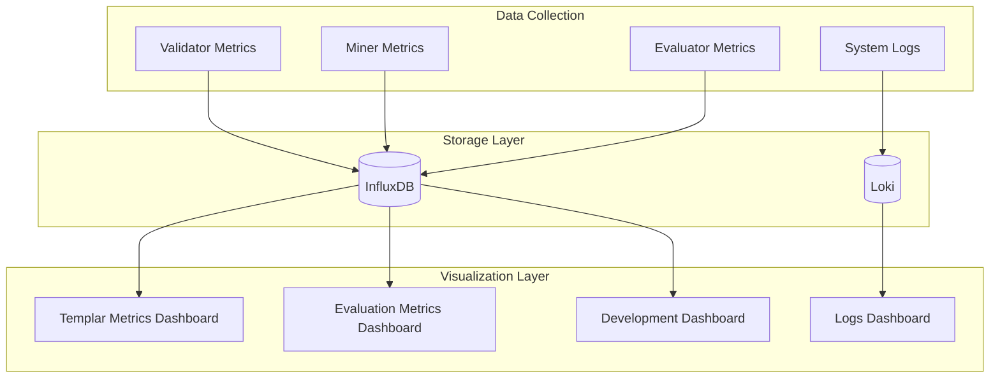
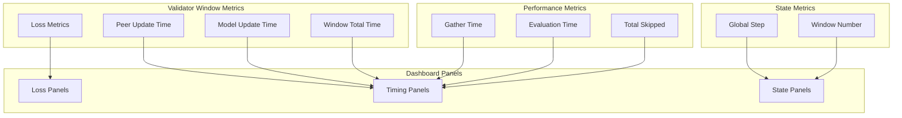
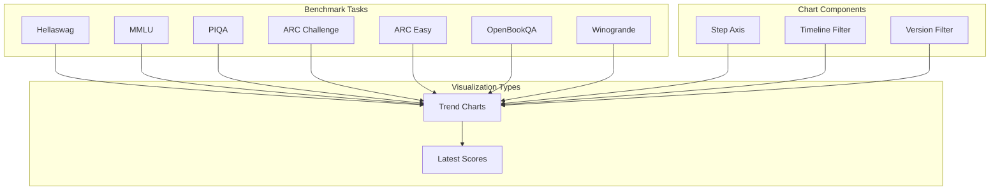
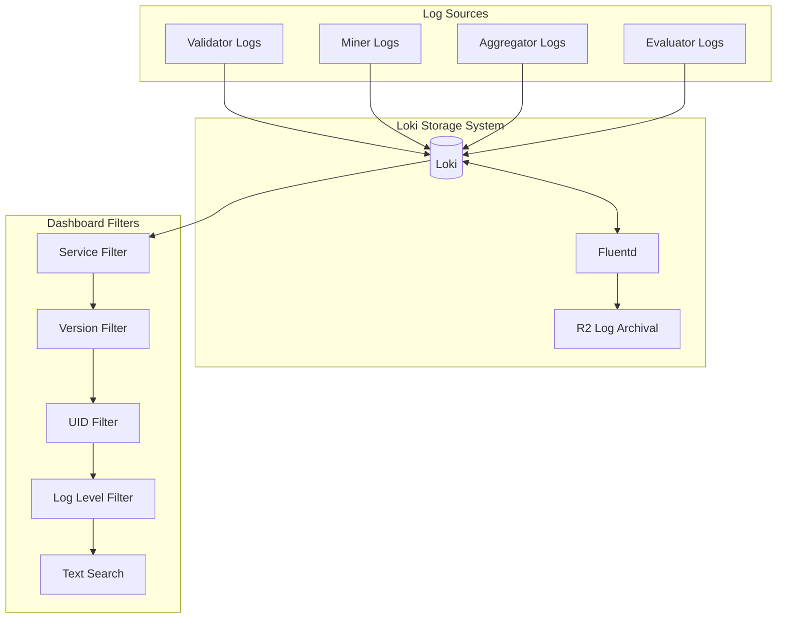
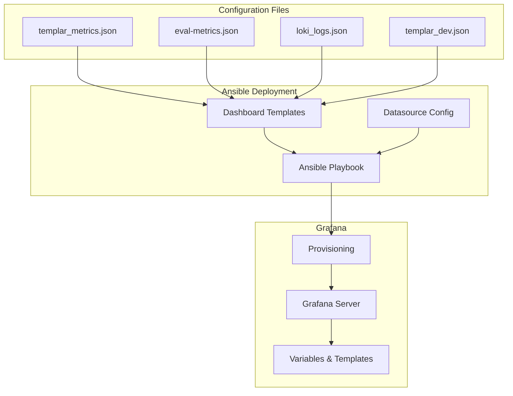

---

title: "Dashboards"

---

import CollapsibleAside from '@components/CollapsibleAside.astro';

import SourceLink from '@components/SourceLink.astro';

<CollapsibleAside title="Relevant Source Files">

  <SourceLink text="telemetry/ansible/group_vars/all.yml.example" href="https://github.com/tplr-ai/templar/blob/bb2fc2a9/telemetry/ansible/group_vars/all.yml.example" />

  <SourceLink text="telemetry/ansible/group_vars/vault.yml.example" href="https://github.com/tplr-ai/templar/blob/bb2fc2a9/telemetry/ansible/group_vars/vault.yml.example" />

  <SourceLink text="telemetry/ansible/roles/dashboards/files/eval-metrics.json" href="https://github.com/tplr-ai/templar/blob/bb2fc2a9/telemetry/ansible/roles/dashboards/files/eval-metrics.json" />

  <SourceLink text="telemetry/ansible/roles/dashboards/files/loki_logs.json" href="https://github.com/tplr-ai/templar/blob/bb2fc2a9/telemetry/ansible/roles/dashboards/files/loki_logs.json" />

  <SourceLink text="telemetry/ansible/roles/dashboards/files/templar_dev.json" href="https://github.com/tplr-ai/templar/blob/bb2fc2a9/telemetry/ansible/roles/dashboards/files/templar_dev.json" />

  <SourceLink text="telemetry/ansible/roles/dashboards/files/templar_metrics.json" href="https://github.com/tplr-ai/templar/blob/bb2fc2a9/telemetry/ansible/roles/dashboards/files/templar_metrics.json" />

  <SourceLink text="telemetry/ansible/roles/loki/templates/loki-config.yaml.j2" href="https://github.com/tplr-ai/templar/blob/bb2fc2a9/telemetry/ansible/roles/loki/templates/loki-config.yaml.j2" />

</CollapsibleAside>

The Templar framework includes a comprehensive set of monitoring dashboards built with Grafana that provide real-time visibility into the distributed training process. These dashboards allow operators to track validator performance, model evaluation metrics, and system logs across the network.

For information about metrics collection and logging implementation, see [Metrics Logging](/monitoring-and-telemetry/metrics-logging#9.1) and [Experiment Tracking](/monitoring-and-telemetry/experiment-tracking#9.2).

## Dashboard Architecture

The Templar monitoring system uses Grafana dashboards powered by InfluxDB for time-series metrics and Loki for logs. These dashboards are deployed through Ansible playbooks and provide visualizations for different aspects of the Templar system.

Sources: <SourceLink text="telemetry/ansible/group_vars/all.yml.example" href="https://github.com/tplr-ai/templar/blob/bb2fc2a9/telemetry/ansible/group_vars/all.yml.example" />

## Available Dashboards

### Templar Metrics Dashboard

The main metrics dashboard provides comprehensive visibility into validator performance and is defined in `templar_metrics.json`. It includes panels for:

- Validator loss tracking (by training window)
- Time-based performance metrics
- Processing time breakdowns
- Global state metrics

Sources: <SourceLink text="telemetry/ansible/roles/dashboards/files/templar_metrics.json:66-748" href="https://github.com/tplr-ai/templar/blob/bb2fc2a9/telemetry/ansible/roles/dashboards/files/templar_metrics.json#L66-L748" />

#### Key Features

The Templar Metrics Dashboard includes:

1. **Loss Tracking**: Visualizes validator loss by window with both window-axis and time-axis views
2. **Performance Monitoring**: Tracks key timing metrics:
   - Peer update time
   - Model update time
   - Window total time
   - Gather time
   - Evaluation time
3. **State Monitoring**: Shows global step and window number information
4. **Filtering**: Supports filtering by UID and version

All metrics are tagged with version, UID, and configuration parameters, enabling precise filtering and correlation across different system components.

Sources: <SourceLink text="telemetry/ansible/roles/dashboards/files/templar_metrics.json:179-198" href="https://github.com/tplr-ai/templar/blob/bb2fc2a9/telemetry/ansible/roles/dashboards/files/templar_metrics.json#L179-L198" />

### Evaluation Metrics Dashboard

The evaluation dashboard (`eval-metrics.json`) focuses on model benchmark performance with trend charts for various benchmark tasks:

- Hellaswag
- MMLU
- PIQA
- ARC Challenge
- ARC Easy
- OpenBookQA
- Winogrande

Sources: <SourceLink text="telemetry/ansible/roles/dashboards/files/eval-metrics.json:117-142" href="https://github.com/tplr-ai/templar/blob/bb2fc2a9/telemetry/ansible/roles/dashboards/files/eval-metrics.json#L117-L142" />, <SourceLink text="telemetry/ansible/roles/dashboards/files/eval-metrics.json:204-236" href="https://github.com/tplr-ai/templar/blob/bb2fc2a9/telemetry/ansible/roles/dashboards/files/eval-metrics.json#L204-L236" />

#### Key Features

1. **Step-based Tracking**: Charts show model performance vs. training step
2. **Multi-version Comparison**: Supports comparing multiple Templar versions
3. **Benchmark Aggregation**: Displays all benchmark scores on a single panel
4. **Time Range Selection**: Customizable time range for historical analysis

Sources: <SourceLink text="telemetry/ansible/roles/dashboards/files/eval-metrics.json:737-773" href="https://github.com/tplr-ai/templar/blob/bb2fc2a9/telemetry/ansible/roles/dashboards/files/eval-metrics.json#L737-L773" />

### Logs Dashboard

The Logs Dashboard (`loki_logs.json`) provides a centralized view of system logs from all Templar components:

Sources: <SourceLink text="telemetry/ansible/roles/dashboards/files/loki_logs.json:87-97" href="https://github.com/tplr-ai/templar/blob/bb2fc2a9/telemetry/ansible/roles/dashboards/files/loki_logs.json#L87-L97" />, <SourceLink text="telemetry/ansible/roles/loki/templates/loki-config.yaml.j2" href="https://github.com/tplr-ai/templar/blob/bb2fc2a9/telemetry/ansible/roles/loki/templates/loki-config.yaml.j2" />

#### Key Features

1. **Service Filtering**: Filter logs by service (validator, miner, etc.)
2. **UID Filtering**: Focus on specific node UIDs
3. **Log Level Filtering**: Filter by severity (error, warning, info, debug)
4. **Text Search**: Full-text search capabilities
5. **Real-time Updates**: Live streaming of new log entries
6. **Integration**: Links to other dashboards for context

Sources: <SourceLink text="telemetry/ansible/roles/dashboards/files/loki_logs.json:94-97" href="https://github.com/tplr-ai/templar/blob/bb2fc2a9/telemetry/ansible/roles/dashboards/files/loki_logs.json#L94-L97" />, <SourceLink text="telemetry/ansible/roles/dashboards/files/loki_logs.json:110-143" href="https://github.com/tplr-ai/templar/blob/bb2fc2a9/telemetry/ansible/roles/dashboards/files/loki_logs.json#L110-L143" />

### Development Dashboard

The Development Dashboard (`templar_dev.json`) provides similar metrics to the main dashboard but is configured specifically for development environments:

- Additional filtering parameters
- Development-specific metrics
- Customized for local testing

Sources: <SourceLink text="telemetry/ansible/roles/dashboards/files/templar_dev.json:192-197" href="https://github.com/tplr-ai/templar/blob/bb2fc2a9/telemetry/ansible/roles/dashboards/files/templar_dev.json#L192-L197" />

## Dashboard Deployment and Configuration

The dashboards are deployed and configured using Ansible playbooks within the telemetry subsystem:

Sources: <SourceLink text="telemetry/ansible/group_vars/all.yml.example:6-69" href="https://github.com/tplr-ai/templar/blob/bb2fc2a9/telemetry/ansible/group_vars/all.yml.example#L6-L69" />

### Configuration Parameters

Key configuration parameters for the dashboard deployment include:

| Parameter | Description | Default |
|-----------|-------------|---------|
| `grafana_version` | Grafana version to install | 10.4.0 |
| `grafana_http_port` | HTTP port for Grafana | 3000 |
| `grafana_auth_anonymous_enabled` | Enable anonymous access | true |
| `grafana_influxdb_host` | InfluxDB host | localhost |
| `grafana_influxdb_port` | InfluxDB port | 8086 |
| `loki_http_listen_port` | Loki HTTP port | 3100 |
| `loki_retention_period` | Log retention period | 720h (30 days) |

Sources: <SourceLink text="telemetry/ansible/group_vars/all.yml.example:7-14" href="https://github.com/tplr-ai/templar/blob/bb2fc2a9/telemetry/ansible/group_vars/all.yml.example#L7-L14" />, <SourceLink text="telemetry/ansible/group_vars/all.yml.example:95-101" href="https://github.com/tplr-ai/templar/blob/bb2fc2a9/telemetry/ansible/group_vars/all.yml.example#L95-L101" />

### Vault Integration

Sensitive configuration values such as API tokens and credentials are stored in an Ansible vault:

- InfluxDB tokens
- Grafana admin credentials
- R2 storage credentials

Sources: <SourceLink text="telemetry/ansible/group_vars/vault.yml.example" href="https://github.com/tplr-ai/templar/blob/bb2fc2a9/telemetry/ansible/group_vars/vault.yml.example" />

## Using the Dashboards

### Dashboard Variables

All dashboards use template variables for filtering:

1. **templar_version**: Filter by specific Templar version
2. **uid**: Filter by specific node UID
3. **config_netuid**: Filter by network UID (for dev dashboard)
4. **log_level**: Filter logs by severity level

Variables can be changed using the dropdown selectors at the top of each dashboard.

Sources: <SourceLink text="telemetry/ansible/roles/dashboards/files/loki_logs.json:111-205" href="https://github.com/tplr-ai/templar/blob/bb2fc2a9/telemetry/ansible/roles/dashboards/files/loki_logs.json#L111-L205" />, <SourceLink text="telemetry/ansible/roles/dashboards/files/eval-metrics.json:784-813" href="https://github.com/tplr-ai/templar/blob/bb2fc2a9/telemetry/ansible/roles/dashboards/files/eval-metrics.json#L784-L813" />

### Interpreting Key Metrics

#### Validator Performance

The most important validator metrics to monitor are:

1. **Loss Metrics**: Track how loss changes across training windows
2. **Timing Metrics**: Monitor for processing bottlenecks
3. **Skipped Updates**: High skip counts may indicate problems
4. **Global Step**: Shows training progress

#### Evaluation Benchmarks

Evaluation charts show model performance on standard benchmarks:

1. **Step-based Charts**: Track improvement over training steps
2. **Latest Scores Panel**: Quick overview of current performance
3. **Version Comparison**: Compare different model versions

#### Log Analysis

The logs dashboard helps with troubleshooting:

1. **Error Investigation**: Filter for error/critical logs
2. **Component Isolation**: Filter by service name
3. **UID Correlation**: Track issues on specific nodes
4. **Text Search**: Find specific error messages or patterns

## Best Practices

1. **Regular Monitoring**: Check dashboards regularly during training
2. **Version Tagging**: Always use consistent version tagging
3. **Custom Time Ranges**: Adjust time ranges for relevant views
4. **Dashboard Links**: Use links between dashboards for context
5. **Variable Combinations**: Combine multiple filters for precise analysis

Sources: <SourceLink text="telemetry/ansible/roles/dashboards/files/templar_metrics.json:27-64" href="https://github.com/tplr-ai/templar/blob/bb2fc2a9/telemetry/ansible/roles/dashboards/files/templar_metrics.json#L27-L64" />, <SourceLink text="telemetry/ansible/roles/dashboards/files/loki_logs.json:28-40" href="https://github.com/tplr-ai/templar/blob/bb2fc2a9/telemetry/ansible/roles/dashboards/files/loki_logs.json#L28-L40" />