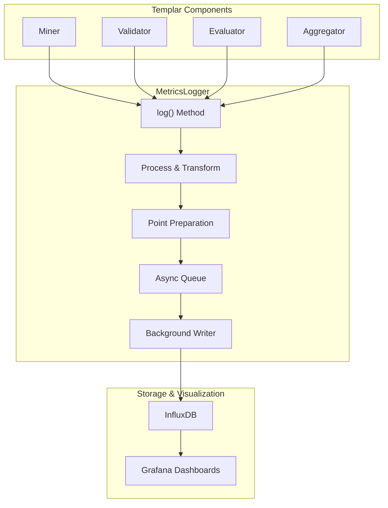
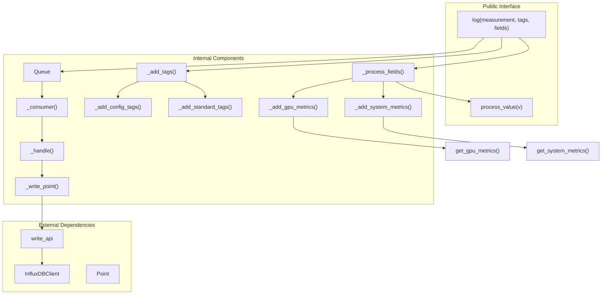
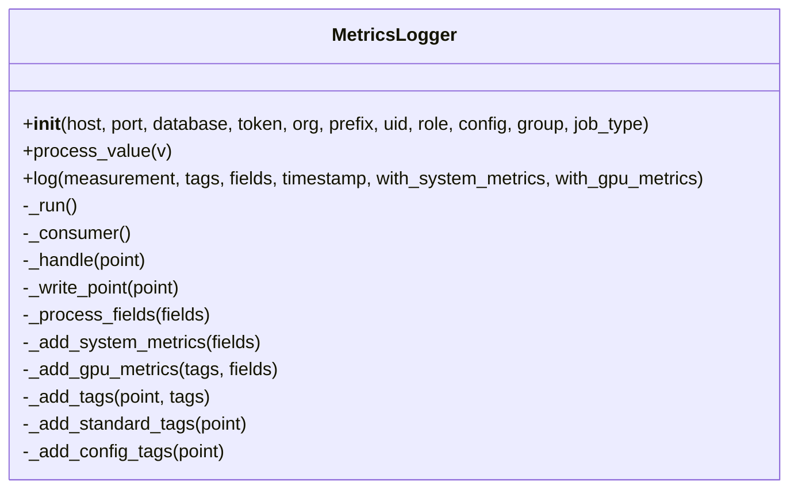

---

title: "Metrics Logging"

---


import CollapsibleAside from '@components/CollapsibleAside.astro';

import SourceLink from '@components/SourceLink.astro';


<CollapsibleAside title="Relevant Source Files">

  <SourceLink text="src/tplr/metrics.py" href="https://github.com/tplr-ai/templar/blob/bb2fc2a9/src/tplr/metrics.py" />

  <SourceLink text="telemetry/ansible/host_vars/grafana_prod.yml" href="https://github.com/tplr-ai/templar/blob/bb2fc2a9/telemetry/ansible/host_vars/grafana_prod.yml" />

  <SourceLink text="telemetry/simulator/testing_metrics.py" href="https://github.com/tplr-ai/templar/blob/bb2fc2a9/telemetry/simulator/testing_metrics.py" />

  <SourceLink text="tests/conftest.py" href="https://github.com/tplr-ai/templar/blob/bb2fc2a9/tests/conftest.py" />

  <SourceLink text="tests/test_metrics_logger.py" href="https://github.com/tplr-ai/templar/blob/bb2fc2a9/tests/test_metrics_logger.py" />

</CollapsibleAside>


## Purpose and Scope

The Metrics Logging system in Templar provides comprehensive monitoring capabilities for tracking training progress, system performance, and resource utilization across the distributed training framework. It enables real-time collection of metrics from miners, validators, and other components, with data stored in InfluxDB for subsequent analysis and visualization. For information about visualizing this data through dashboards, see [Dashboards](/monitoring-and-telemetry/dashboards#9.3). For experiment tracking with Weights & Biases, see [Experiment Tracking](/monitoring-and-telemetry/experiment-tracking#9.2).

## Architecture Overview

The Metrics Logging system is built around the `MetricsLogger` class, which collects metrics data and asynchronously sends it to an InfluxDB instance.

### Data Flow Diagram



Sources: <SourceLink text="src/tplr/metrics.py:82-360" href="https://github.com/tplr-ai/templar/blob/bb2fc2a9/src/tplr/metrics.py#L82-L360" />

### MetricsLogger Internal Architecture



Sources: <SourceLink text="src/tplr/metrics.py:182-255" href="https://github.com/tplr-ai/templar/blob/bb2fc2a9/src/tplr/metrics.py#L182-L255" />

## Core Components

### MetricsLogger Class

The `MetricsLogger` class is the central component of the metrics logging system. It handles initialization of the InfluxDB connection, processes data types appropriately, and manages asynchronous writes to avoid blocking the main training loop.



Sources: <SourceLink text="src/tplr/metrics.py:82-321" href="https://github.com/tplr-ai/templar/blob/bb2fc2a9/src/tplr/metrics.py#L82-L321" />

### Configuration Options

The metrics logger can be configured with the following parameters:

| Parameter | Description | Default |
|-----------|-------------|---------|
| `host` | InfluxDB host | From `INFLUXDB_HOST` env var or AWS TimeStream instance |
| `port` | InfluxDB port | From `INFLUXDB_PORT` env var or `8086` |
| `database` | InfluxDB bucket | From `INFLUXDB_DATABASE` env var or `"tplr"` |
| `token` | Authentication token | From `INFLUXDB_TOKEN` env var or fallback |
| `org` | InfluxDB organization | From `INFLUXDB_ORG` env var or `"tplr"` |
| `prefix` | Metric name prefix | `""` |
| `uid` | Unique identifier | `None` |
| `role` | Node role | `""` (e.g., "miner", "validator") |
| `config` | Bittensor config | `None` |
| `group` | Group identifier | `""` |
| `job_type` | Job type | `""` |
| `max_queue_size` | Max queue size | `600_000` |
| `max_workers` | Thread pool size | `1` |

Sources: <SourceLink text="src/tplr/metrics.py:88-105" href="https://github.com/tplr-ai/templar/blob/bb2fc2a9/src/tplr/metrics.py#L88-L105" />, <SourceLink text="src/tplr/metrics.py:44-53" href="https://github.com/tplr-ai/templar/blob/bb2fc2a9/src/tplr/metrics.py#L44-L53" />

### Data Processing

The `process_value` method handles different types of data with type-specific processing:

| Data Type | Processing Behavior |
|-----------|---------------------|
| Integer | Preserved as integer |
| Float | Preserved as float |
| List of integers | Converted to string (for peer IDs) |
| List of numbers | Converted to statistics object (mean, min, max, median) |
| String | Preserved as string |
| None | Converted to `0.0` |
| Other types | Converted to string |

Sources: <SourceLink text="src/tplr/metrics.py:154-180" href="https://github.com/tplr-ai/templar/blob/bb2fc2a9/src/tplr/metrics.py#L154-L180" />

### System and GPU Metrics Collection

The metrics logger can automatically collect and include system and GPU metrics when requested:

```python
# System metrics collected (when with_system_metrics=True)
{
    "sys_cpu_usage": <percent>,             # CPU utilization percentage
    "sys_mem_used": <megabytes>,            # RAM used in MB
    "sys_mem_total": <megabytes>            # Total RAM in MB
}

# GPU metrics collected (when with_gpu_metrics=True)
{
    "gpu_mem_segments": <count>,            # GPU memory segments
    "gpu_mem_allocated_mb": <megabytes>,    # Allocated GPU memory
    "gpu_mem_cached_mb": <megabytes>,       # Cached GPU memory
    "gpu_mem_total_mb": <megabytes>,        # Total GPU memory
    "gpu_name": <device_name>,              # GPU device name (as tag)
    "gpu_id": <device_id>                   # GPU device ID (as tag)
}
```

Sources: <SourceLink text="src/tplr/metrics.py:324-359" href="https://github.com/tplr-ai/templar/blob/bb2fc2a9/src/tplr/metrics.py#L324-L359" />

## Asynchronous Processing

The `MetricsLogger` uses asynchronous processing to avoid blocking the main thread during metric collection:

1. Each log call adds a point to an async queue
2. A background thread continuously processes items from the queue
3. Write operations are performed in a thread pool executor
4. Failed writes are logged but do not crash the application

Sources: <SourceLink text="src/tplr/metrics.py:227-255" href="https://github.com/tplr-ai/templar/blob/bb2fc2a9/src/tplr/metrics.py#L227-L255" />

## Usage Examples

### Basic Initialization

```python
from tplr.metrics import MetricsLogger

# Basic initialization with role
logger = MetricsLogger(
    prefix="miner",
    uid="123",
    role="miner",
    group="training_group"
)

# With custom InfluxDB settings
logger = MetricsLogger(
    host="custom.influxdb.host",
    port=8086,
    token="your-token",
    org="your-org",
    database="your-bucket",
    prefix="validator",
    uid="456",
    role="validator"
)
```

### Logging Metrics

```python
# Basic metrics logging
logger.log(
    measurement="training_step",
    tags={"step": 42},
    fields={"loss": 0.75}
)

# With system and GPU metrics
logger.log(
    measurement="training_step",
    tags={"batch": 100, "epoch": 5},
    fields={"loss": 0.345, "accuracy": 0.92},
    with_system_metrics=True,
    with_gpu_metrics=True
)

# Logging metrics with lists that will be processed automatically
logger.log(
    measurement="training_step",
    tags={"step": 42},
    fields={
        "peer_ids": [1, 2, 3, 4],           # Will be stored as string
        "losses": [0.1, 0.2, 0.3, 0.4]      # Will be stored as statistics
    }
)
```

Sources: <SourceLink text="src/tplr/metrics.py:182-201" href="https://github.com/tplr-ai/templar/blob/bb2fc2a9/src/tplr/metrics.py#L182-L201" />

## Integration with InfluxDB

The `MetricsLogger` integrates with InfluxDB via the official InfluxDB client library. It uses:

1. A custom write options class (`MertricsLoggerWriteOptions`) for configuration
2. The `Point` class for structuring metrics data
3. Batched writes with configurable batch sizes (defaults: 10,000 for validators, 1,000 for other roles)
4. The InfluxDB 2.0 API with organization and bucket concepts

Sources: <SourceLink text="src/tplr/metrics.py:62-79" href="https://github.com/tplr-ai/templar/blob/bb2fc2a9/src/tplr/metrics.py#L62-L79" />, <SourceLink text="src/tplr/metrics.py:130-136" href="https://github.com/tplr-ai/templar/blob/bb2fc2a9/src/tplr/metrics.py#L130-L136" />

## Best Practices

1. **Use consistent measurement names**: Keep measurement names consistent across related metrics for easier querying
   
2. **Add contextual tags**: Include tags like `step`, `epoch`, `batch` to segment and filter data

3. **Include system metrics for performance-related data**: Always enable `with_system_metrics=True` when logging performance data

4. **Group related metrics in single calls**: Combine related metrics in a single `log()` call rather than multiple calls

5. **Handle exceptions**: The logger is designed to handle exceptions internally, but be aware of potential connection issues

6. **Use appropriate value types**: The `process_value()` method handles type conversion, but using appropriate types initially improves clarity

Sources: <SourceLink text="tests/test_metrics_logger.py:316-331" href="https://github.com/tplr-ai/templar/blob/bb2fc2a9/tests/test_metrics_logger.py#L316-L331" />

## Testing and Debugging

The metrics logger includes comprehensive test coverage. For troubleshooting:

1. Enable debug logging to see detailed information about metric writes
2. Use the `testing_metrics.py` script to verify connectivity to InfluxDB
3. Check the Grafana dashboards to confirm metrics are being received

Sources: <SourceLink text="tests/test_metrics_logger.py:1-342" href="https://github.com/tplr-ai/templar/blob/bb2fc2a9/tests/test_metrics_logger.py#L1-L342" />, <SourceLink text="telemetry/simulator/testing_metrics.py:1-52" href="https://github.com/tplr-ai/templar/blob/bb2fc2a9/telemetry/simulator/testing_metrics.py#L1-L52" />