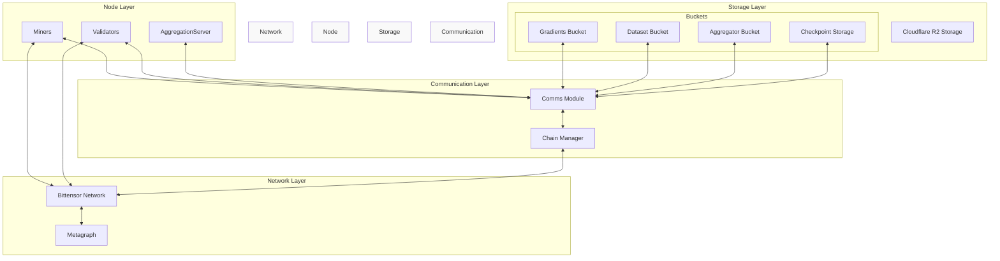
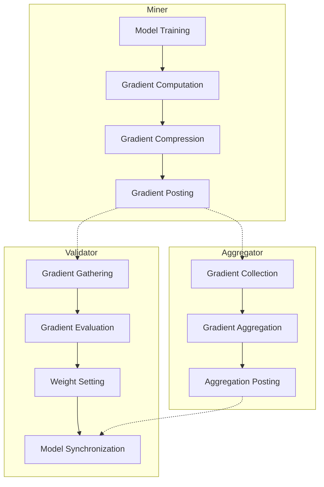
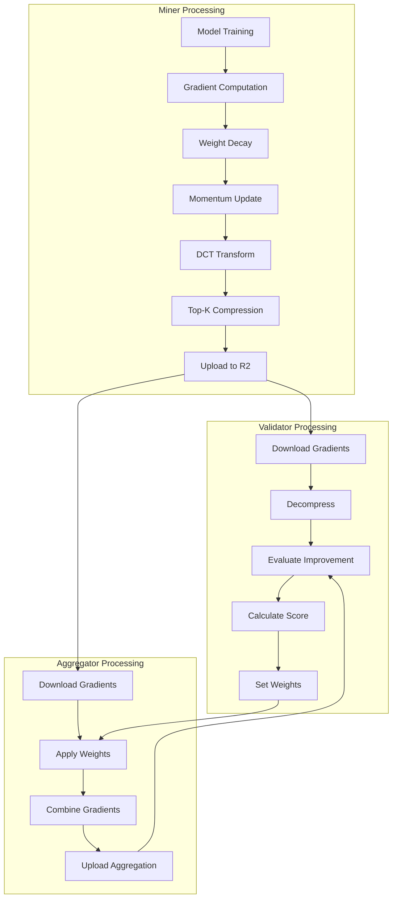
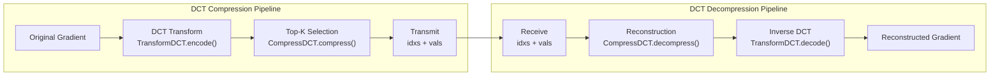
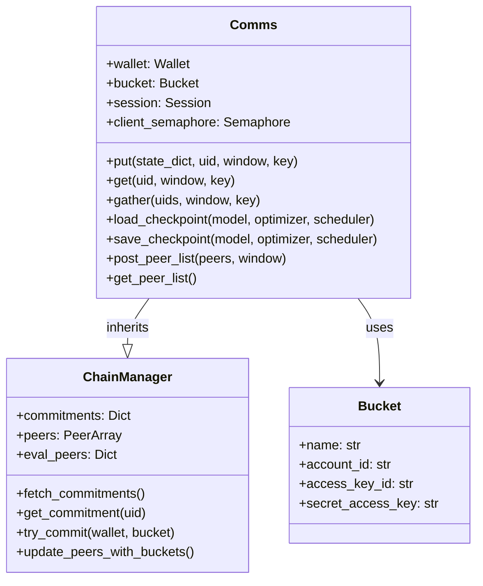
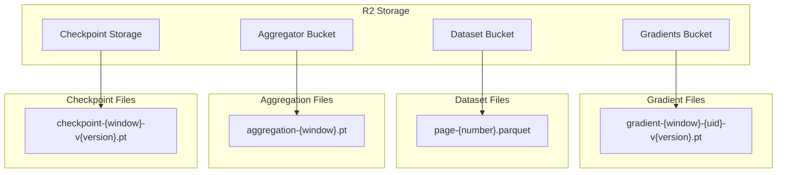
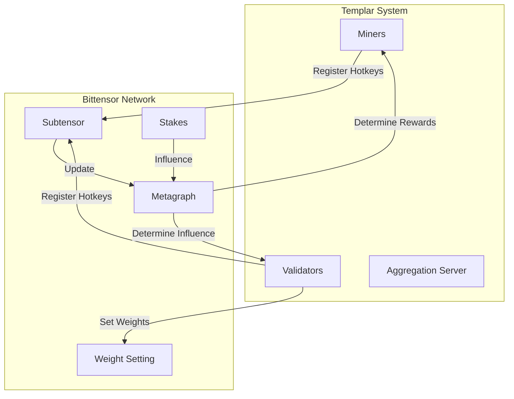
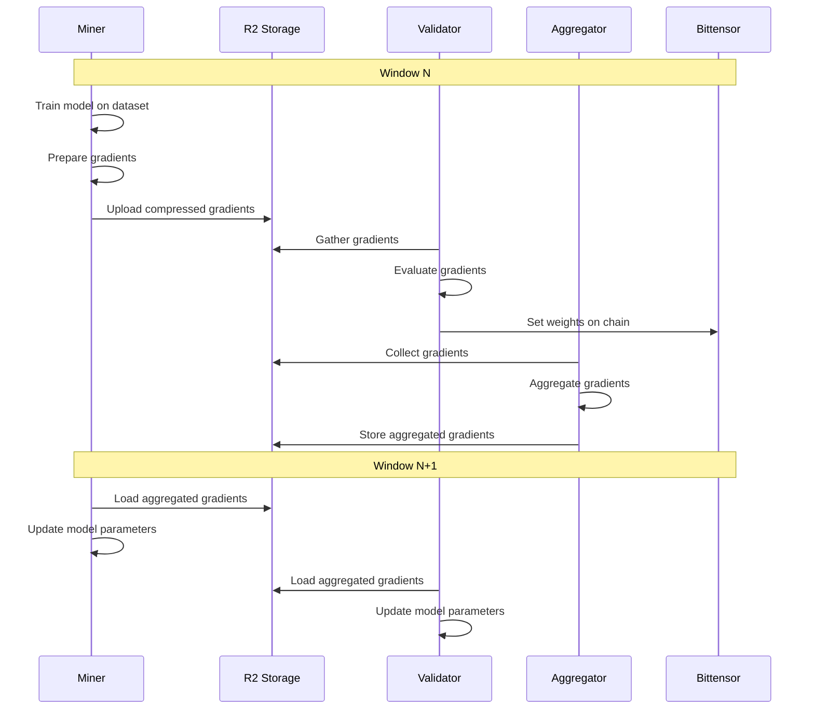
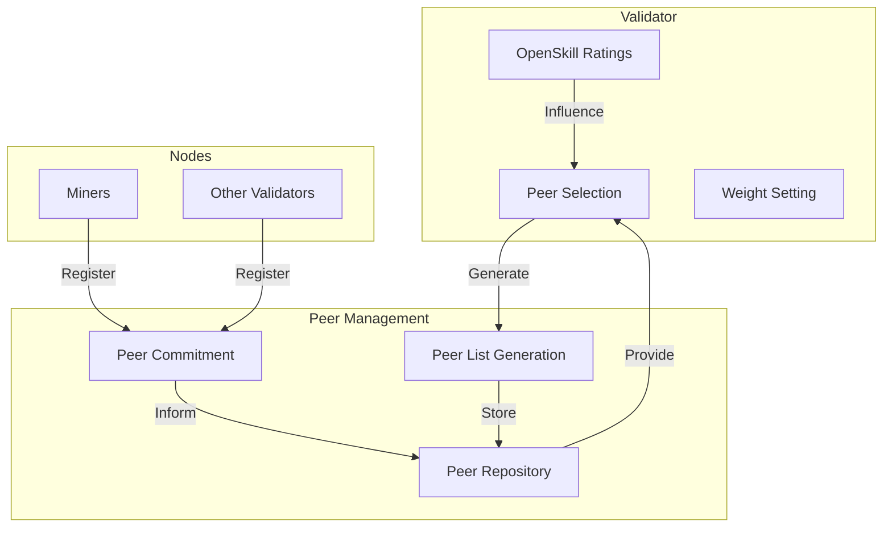
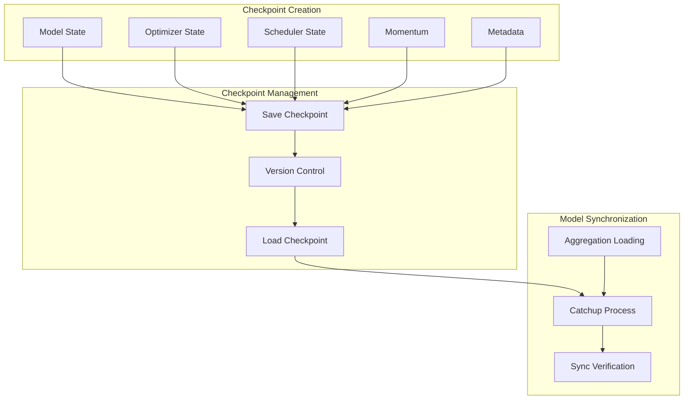

---

title: "System Architecture"

---

import CollapsibleAside from '@components/CollapsibleAside.astro';

import SourceLink from '@components/SourceLink.astro';

<CollapsibleAside title="Relevant Source Files">

  <SourceLink text="ecosystem.config.js" href="https://github.com/tplr-ai/templar/blob/bb2fc2a9/ecosystem.config.js" />

  <SourceLink text="hparams.json" href="https://github.com/tplr-ai/templar/blob/bb2fc2a9/hparams.json" />

  <SourceLink text="neurons/aggregator.py" href="https://github.com/tplr-ai/templar/blob/bb2fc2a9/neurons/aggregator.py" />

  <SourceLink text="neurons/miner.py" href="https://github.com/tplr-ai/templar/blob/bb2fc2a9/neurons/miner.py" />

  <SourceLink text="neurons/validator.py" href="https://github.com/tplr-ai/templar/blob/bb2fc2a9/neurons/validator.py" />

  <SourceLink text="pyproject.toml" href="https://github.com/tplr-ai/templar/blob/bb2fc2a9/pyproject.toml" />

  <SourceLink text="src/tplr/__init__.py" href="https://github.com/tplr-ai/templar/blob/bb2fc2a9/src/tplr/__init__.py" />

  <SourceLink text="src/tplr/chain.py" href="https://github.com/tplr-ai/templar/blob/bb2fc2a9/src/tplr/chain.py" />

  <SourceLink text="src/tplr/comms.py" href="https://github.com/tplr-ai/templar/blob/bb2fc2a9/src/tplr/comms.py" />

  <SourceLink text="src/tplr/compress.py" href="https://github.com/tplr-ai/templar/blob/bb2fc2a9/src/tplr/compress.py" />

  <SourceLink text="src/tplr/neurons.py" href="https://github.com/tplr-ai/templar/blob/bb2fc2a9/src/tplr/neurons.py" />

  <SourceLink text="telemetry/simulator/loki-test.py" href="https://github.com/tplr-ai/templar/blob/bb2fc2a9/telemetry/simulator/loki-test.py" />

  <SourceLink text="tests/test_comms.py" href="https://github.com/tplr-ai/templar/blob/bb2fc2a9/tests/test_comms.py" />

  <SourceLink text="tests/test_model_comparison.py" href="https://github.com/tplr-ai/templar/blob/bb2fc2a9/tests/test_model_comparison.py" />

  <SourceLink text="uv.lock" href="https://github.com/tplr-ai/templar/blob/bb2fc2a9/uv.lock" />

</CollapsibleAside>

This document provides a comprehensive overview of the Templar framework's architecture, outlining its core components and their interactions. Templar is a decentralized training framework built on the Bittensor network that enables collaborative training of large language models across distributed compute resources.

For information about the incentive mechanisms that drive the distributed training process, see [Incentive Design](/incentive-design#1.2).

## Core Components

Sources:
- <SourceLink text="neurons/miner.py:124-184" href="https://github.com/tplr-ai/templar/blob/bb2fc2a9/neurons/miner.py#L124-L184" />
- <SourceLink text="neurons/validator.py:173-222" href="https://github.com/tplr-ai/templar/blob/bb2fc2a9/neurons/validator.py#L173-L222" />
- <SourceLink text="neurons/aggregator.py:120-132" href="https://github.com/tplr-ai/templar/blob/bb2fc2a9/neurons/aggregator.py#L120-L132" />
- <SourceLink text="src/tplr/comms.py:64-122" href="https://github.com/tplr-ai/templar/blob/bb2fc2a9/src/tplr/comms.py#L64-L122" />

The Templar system consists of four main architectural layers:

1. **Network Layer**: Provides the decentralized infrastructure via Bittensor blockchain
2. **Node Layer**: Comprises the different types of nodes that perform specific roles
3. **Storage Layer**: Offers distributed storage for gradients, datasets, and model checkpoints
4. **Communication Layer**: Facilitates data exchange between nodes and storage

## Node Types and Responsibilities

Sources:
- <SourceLink text="neurons/miner.py:228-755" href="https://github.com/tplr-ai/templar/blob/bb2fc2a9/neurons/miner.py#L228-L755" />
- <SourceLink text="neurons/validator.py:516-1866" href="https://github.com/tplr-ai/templar/blob/bb2fc2a9/neurons/validator.py#L516-L1866" />
- <SourceLink text="neurons/aggregator.py:162-380" href="https://github.com/tplr-ai/templar/blob/bb2fc2a9/neurons/aggregator.py#L162-L380" />

### Miner Neurons

Miners are responsible for training the language model and generating gradients. Their key functions include:

1. Loading training data from the dataset bucket
2. Performing forward and backward passes through the model
3. Compressing gradients using DCT-based compression
4. Uploading compressed gradients to the gradient bucket

### Validator Neurons

Validators evaluate the quality of miners' gradients and set weights on the blockchain. Their key functions include:

1. Gathering gradients from miners
2. Evaluating gradient quality by measuring loss improvement
3. Calculating and setting weights on the blockchain
4. Tracking miner performance with OpenSkill ratings

### Aggregation Server

The aggregation server collects and combines gradients from miners, providing a consolidated source for model updates. Its key functions include:

1. Gathering gradients from miners
2. Aggregating gradients based on validator weights
3. Storing aggregated gradients for validators and miners to use

## Data Flow and Gradient Processing

Sources:
- <SourceLink text="src/tplr/neurons.py:40-124" href="https://github.com/tplr-ai/templar/blob/bb2fc2a9/src/tplr/neurons.py#L40-L124" />
- <SourceLink text="neurons/miner.py:395-405" href="https://github.com/tplr-ai/templar/blob/bb2fc2a9/neurons/miner.py#L395-L405" />
- <SourceLink text="neurons/validator.py:489-514" href="https://github.com/tplr-ai/templar/blob/bb2fc2a9/neurons/validator.py#L489-L514" />

### Gradient Compression Mechanism

A key innovation in Templar is the DCT-based gradient compression system that enables efficient sharing of gradients across nodes.

1. **Transform DCT**: Converts gradients to frequency domain using Discrete Cosine Transform
2. **Compression**: Selects top-K coefficients for transmission
3. **Decompression**: Reconstructs gradients from compressed representation

Sources:
- <SourceLink text="src/tplr/compress.py:35-98" href="https://github.com/tplr-ai/templar/blob/bb2fc2a9/src/tplr/compress.py#L35-L98" />
- <SourceLink text="src/tplr/compress.py:123-177" href="https://github.com/tplr-ai/templar/blob/bb2fc2a9/src/tplr/compress.py#L123-L177" />

## Communication System

The communication system is the backbone of Templar, enabling data exchange between nodes and storage. It provides a unified interface for all data operations.

Sources:
- <SourceLink text="src/tplr/comms.py:64-154" href="https://github.com/tplr-ai/templar/blob/bb2fc2a9/src/tplr/comms.py#L64-L154" />
- <SourceLink text="src/tplr/chain.py:37-72" href="https://github.com/tplr-ai/templar/blob/bb2fc2a9/src/tplr/chain.py#L37-L72" />

The `Comms` class provides the following key functions:

1. **Data Exchange**: Methods for storing and retrieving data from R2 storage
2. **Gradient Gathering**: Collects and processes gradients from multiple miners
3. **Checkpoint Management**: Saves and loads model checkpoints
4. **Peer Management**: Handles peer discovery and selection

The `ChainManager` is responsible for:

1. **Chain Commitments**: Manages commitments to the Bittensor blockchain
2. **Bucket Authentication**: Stores and retrieves bucket credentials
3. **Peer Management**: Tracks active peers and updates peer lists

## Storage System

Sources:
- <SourceLink text="src/tplr/comms.py:265-318" href="https://github.com/tplr-ai/templar/blob/bb2fc2a9/src/tplr/comms.py#L265-L318" />
- <SourceLink text="src/tplr/comms.py:322-371" href="https://github.com/tplr-ai/templar/blob/bb2fc2a9/src/tplr/comms.py#L322-L371" />
- <SourceLink text="src/tplr/comms.py:373-455" href="https://github.com/tplr-ai/templar/blob/bb2fc2a9/src/tplr/comms.py#L373-L455" />

Storage in Templar is handled through Cloudflare R2, which provides a scalable and distributed storage solution. The system uses four main buckets:

1. **Gradients Bucket**: Stores gradients uploaded by miners
2. **Dataset Bucket**: Contains training data in Parquet format
3. **Aggregator Bucket**: Stores aggregated gradients from the aggregation server
4. **Checkpoint Storage**: Maintains model checkpoints for recovery and synchronization

## Integration with Bittensor Network

Sources:
- <SourceLink text="neurons/validator.py:134-142" href="https://github.com/tplr-ai/templar/blob/bb2fc2a9/neurons/validator.py#L134-L142" />
- <SourceLink text="neurons/miner.py:114-123" href="https://github.com/tplr-ai/templar/blob/bb2fc2a9/neurons/miner.py#L114-L123" />
- <SourceLink text="src/tplr/chain.py:174-195" href="https://github.com/tplr-ai/templar/blob/bb2fc2a9/src/tplr/chain.py#L174-L195" />

The Templar system integrates with the Bittensor network through several mechanisms:

1. **Hotkey Registration**: Miners and validators register their hotkeys on the subnet
2. **Weight Setting**: Validators set weights on the blockchain based on gradient quality
3. **Metagraph Synchronization**: Nodes periodically synchronize with the metagraph
4. **Chain Commitments**: Nodes commit bucket information to the chain for discovery

## Window-Based Training Cycle

Sources:
- <SourceLink text="neurons/miner.py:320-406" href="https://github.com/tplr-ai/templar/blob/bb2fc2a9/neurons/miner.py#L320-L406" />
- <SourceLink text="neurons/validator.py:626-643" href="https://github.com/tplr-ai/templar/blob/bb2fc2a9/neurons/validator.py#L626-L643" />
- <SourceLink text="neurons/aggregator.py:210-310" href="https://github.com/tplr-ai/templar/blob/bb2fc2a9/neurons/aggregator.py#L210-L310" />

The Templar system operates on a window-based cycle, where each window corresponds to a specific number of blockchain blocks. The training process follows these steps:

1. **Miners**:
   - Train models on data for the current window
   - Generate and compress gradients
   - Upload gradients to R2 storage

2. **Validators**:
   - Gather gradients from miners
   - Evaluate gradient quality
   - Set weights on the blockchain

3. **Aggregator**:
   - Collect gradients from miners
   - Aggregate gradients based on weights
   - Store aggregated result for next window

4. **Next Window**:
   - All participants load aggregated gradients
   - Update model parameters
   - Begin next training cycle

## Peer Selection and Management

Sources:
- <SourceLink text="neurons/validator.py:396-423" href="https://github.com/tplr-ai/templar/blob/bb2fc2a9/neurons/validator.py#L396-L423" />
- <SourceLink text="src/tplr/chain.py:426-487" href="https://github.com/tplr-ai/templar/blob/bb2fc2a9/src/tplr/chain.py#L426-L487" />
- <SourceLink text="src/tplr/neurons.py:127-196" href="https://github.com/tplr-ai/templar/blob/bb2fc2a9/src/tplr/neurons.py#L127-L196" />

Peer selection and management is a critical aspect of the Templar system:

1. **Peer Selection**:
   - Validators select peers based on OpenSkill ratings
   - Ratings are calculated from gradient evaluation results
   - Peer lists are periodically updated to maintain system health

2. **Peer Commitment**:
   - Nodes commit their bucket information to the blockchain
   - Commitments include account ID, access keys, and bucket names
   - Other nodes discover peers by reading these commitments

3. **Peer Update Mechanism**:
   - New peer lists are generated with a future effective window
   - Nodes fetch peer lists and update them when appropriate
   - Inactive peers are pruned and replaced with active ones

## Checkpoint Management

Sources:
- <SourceLink text="neurons/miner.py:730-747" href="https://github.com/tplr-ai/templar/blob/bb2fc2a9/neurons/miner.py#L730-L747" />
- <SourceLink text="neurons/validator.py:582-620" href="https://github.com/tplr-ai/templar/blob/bb2fc2a9/neurons/validator.py#L582-L620" />
- <SourceLink text="src/tplr/neurons.py:199-284" href="https://github.com/tplr-ai/templar/blob/bb2fc2a9/src/tplr/neurons.py#L199-L284" />

The checkpoint management system in Templar ensures model consistency and enables recovery:

1. **Checkpoint Creation**:
   - Saves model state, optimizer state, scheduler state, and momentum
   - Includes metadata like current window and version information
   - Checkpoints are created periodically based on configuration

2. **Checkpoint Loading**:
   - Loads model state from checkpoints during initialization
   - Supports version-based checkpoint selection
   - Handles compatibility between different versions

3. **Model Synchronization**:
   - Provides a catchup mechanism for nodes that are behind
   - Loads aggregated gradients to sync with current state
   - Verifies sync status between nodes

## Configuration Management

The Templar system uses a centralized hyperparameter configuration system that controls various aspects of the distributed training process.

| Parameter Category | Example Parameters | Description |
|-------------------|-------------------|-------------|
| Model Configuration | `hidden_size`, `num_hidden_layers`, `sequence_length` | Controls the structure and size of the language model |
| Training Parameters | `learning_rate`, `batch_size`, `momentum_decay` | Defines the training process behavior |
| System Configuration | `blocks_per_window`, `checkpoint_frequency`, `topk_compression` | Controls system-wide behavior and timing |
| Peer Management | `topk_peers`, `peer_replacement_frequency`, `minimum_peers` | Configures peer selection behavior |
| Evaluation Metrics | `openskill_beta`, `openskill_tau`, `binary_score_ma_alpha` | Parameters for scoring and rating miners |

Sources:
- <SourceLink text="hparams.json:1-53" href="https://github.com/tplr-ai/templar/blob/bb2fc2a9/hparams.json#L1-L53" />
- <SourceLink text="neurons/validator.py:87-124" href="https://github.com/tplr-ai/templar/blob/bb2fc2a9/neurons/validator.py#L87-L124" />
- <SourceLink text="neurons/miner.py:67-105" href="https://github.com/tplr-ai/templar/blob/bb2fc2a9/neurons/miner.py#L67-L105" />

## Error Handling and Recovery

The Templar system implements several mechanisms for error handling and recovery:

1. **Gradient Gathering Retries**: When gathering gradients fails, nodes retry with exponential backoff
2. **Catchup Mechanism**: Nodes that are behind can catch up using aggregated gradients
3. **Peer Replacement**: Inactive or failing peers are automatically replaced
4. **Checkpoint Recovery**: Nodes can restore from checkpoints after failures
5. **Connection Error Handling**: R2 storage connections are retried and recreated on failure

These mechanisms ensure the system's resilience in the face of network issues, node failures, and other adverse conditions.

Sources:
- <SourceLink text="src/tplr/comms.py:321-370" href="https://github.com/tplr-ai/templar/blob/bb2fc2a9/src/tplr/comms.py#L321-L370" />
- <SourceLink text="src/tplr/neurons.py:199-284" href="https://github.com/tplr-ai/templar/blob/bb2fc2a9/src/tplr/neurons.py#L199-L284" />
- <SourceLink text="neurons/validator.py:758-813" href="https://github.com/tplr-ai/templar/blob/bb2fc2a9/neurons/validator.py#L758-L813" />

## Summary

The Templar system architecture provides a robust framework for decentralized training of large language models. Key architectural features include:

1. **Decentralized Node Structure**: Separate roles for miners, validators, and aggregators
2. **Efficient Gradient Sharing**: DCT-based compression for bandwidth optimization
3. **Distributed Storage**: Cloudflare R2 for reliable data persistence
4. **Blockchain Integration**: Bittensor network for coordination and incentives
5. **Window-Based Processing**: Synchronized training cycles across all nodes
6. **Checkpoint Management**: Model preservation and recovery mechanisms

This architecture enables collaborative training across diverse compute resources while maintaining model consistency and providing appropriate incentives for participation.