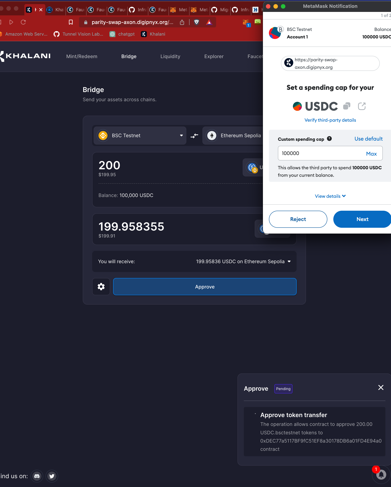
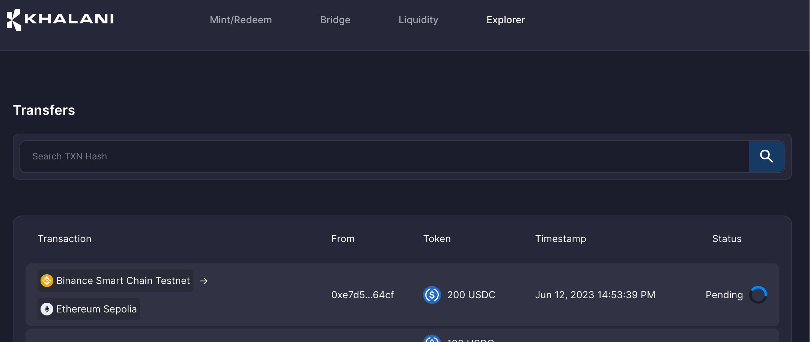
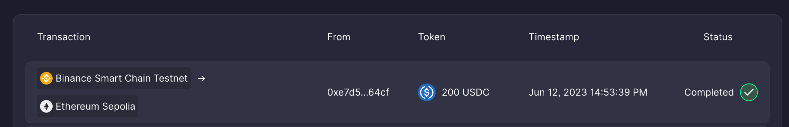

# Bridging

Bridging tokens involves moving your assets from one chain (source), to another (destination).

In order to bridge assets:

- Navigate to the bridging tab and set the network in Metamask to the Network you want to bridge from. In our case, we will be bridging from `BSC Testnet` to `Sepolia (Ethereum)`. You would need testnet tokens. In order to get some, navigate to the `Faucet` tab.
- Select the number of tokens you want to bridge, and click on approve. A pop-up will appear for you to confirm the approval in Metamask

- Once this is success, click on `Bridge` and confirm the transactions in Metamask.

- To check on the status of your transaction, click on the explorer tab.

- On success, the explorer should show the transaction as `Confirmed`.

- You can click on the transaction to see its route.

