# Liquidity Providers

In order to facilitate cross-chain transfers, Khalani requires Liquidity providers to add assets to chain-specific pools on the Khalani chain.

Each pool consists of a chain-specific asset (e.g. USDC on Arbitrum), paired with KAI, our interchain chain stable coin.

## Adding Liquidity

To add liquidity to a pool:

- Navigate to https://app.testnet.khalani.network/.

- Mint KAI: KAI is minted by depositing white-listed assets to the PSM (we need to explain this beforehand). To get white-listed assets for the testnet, click on the `Faucet` tab.

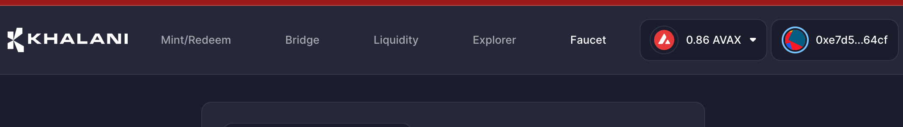

- Select the network you need assets for. In our case, we will be requesting USDC on Polygon Mumbai. Please note that the faucets are only for ERC 20 tokens. In order to get native tokens (for gas), please visit [here](add page for public faucets).

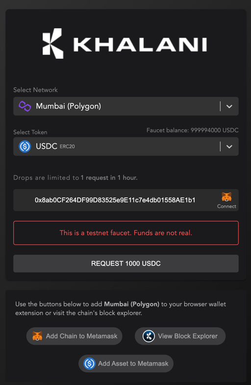

- If the action is successful, you should see this on the screen

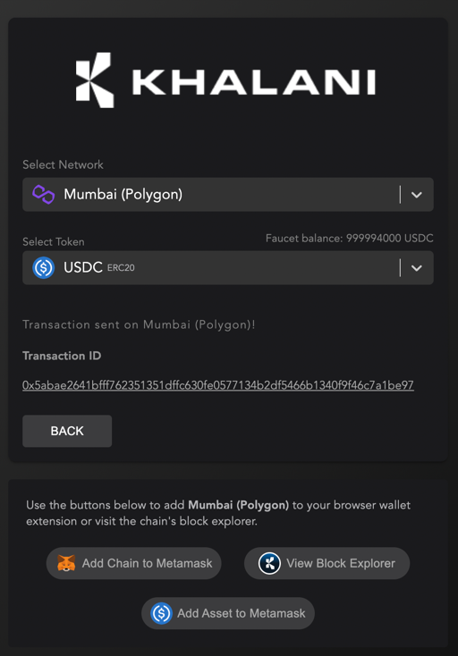

- Go to https://app.testnet.khalani.network/mint and select the network you wish to add liquidity to.
In our case, we are adding USDC from Polygon Mumbai. Since we need to add an equal proportion of liquidity to the pools, we will be adding 100 USDC, and 100 KAI. 
We, therefore, mint 100 KAI. Select the amount of KAI you wish to mint, and click "Approve". 

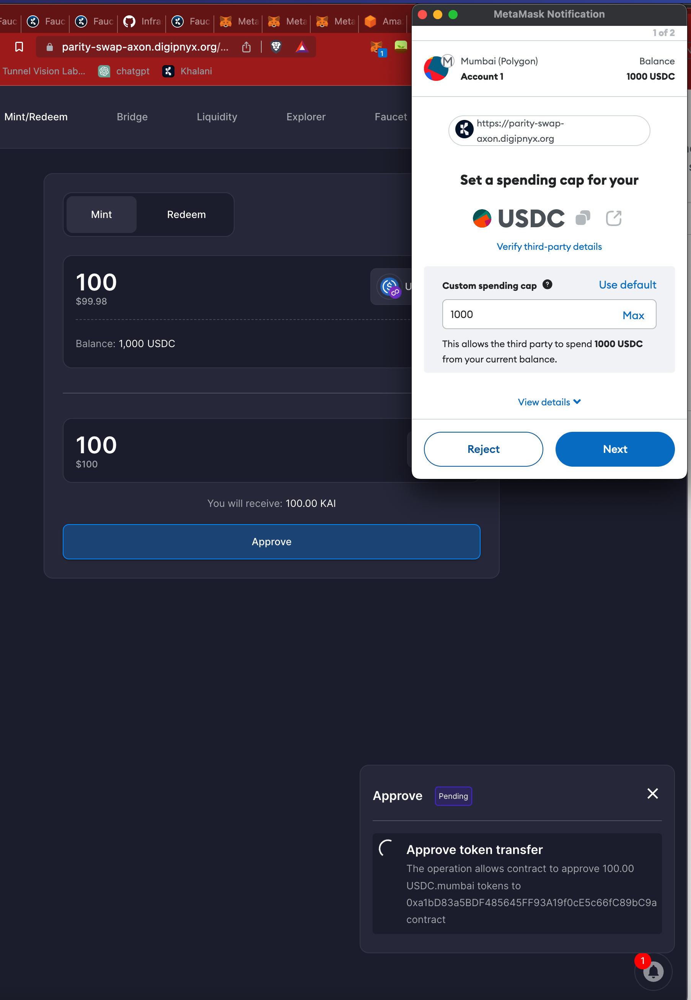

- If this action is successful, you should see this in the right-hand corner of your screen.

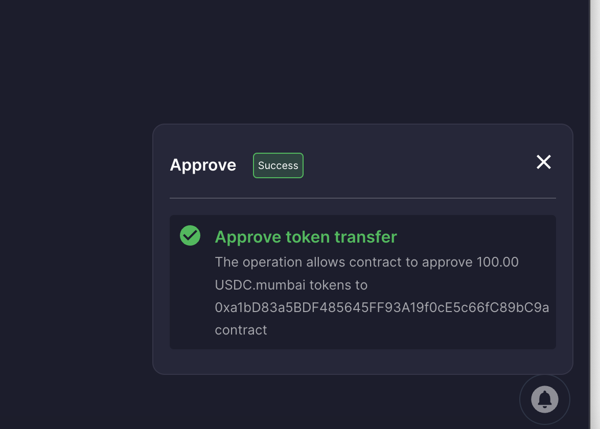

- Click on `Mint` and confirm the transaction in Metamask.

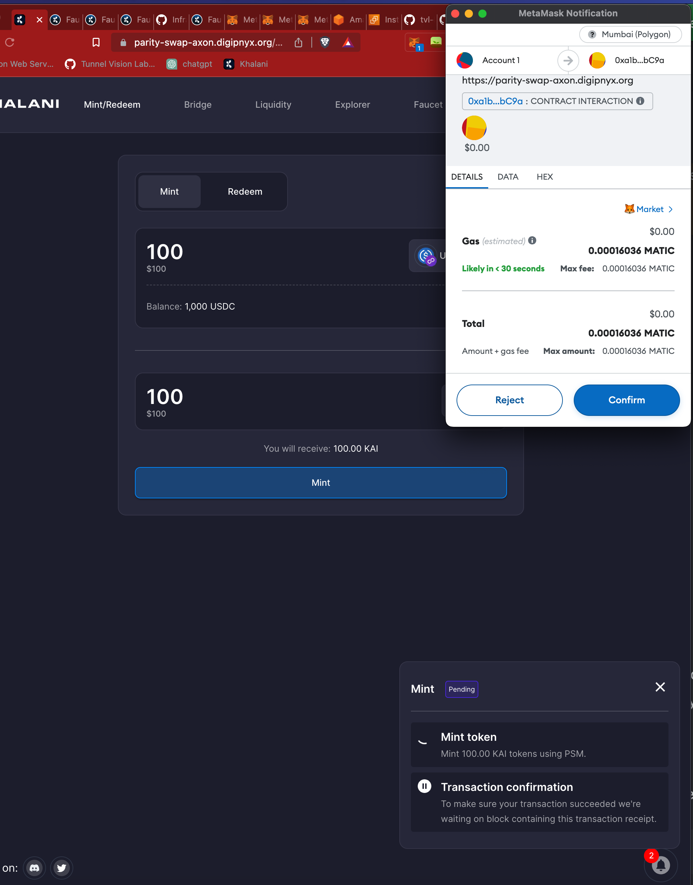

- If this action is successful, you should see this in the right-hand corner of your screen.

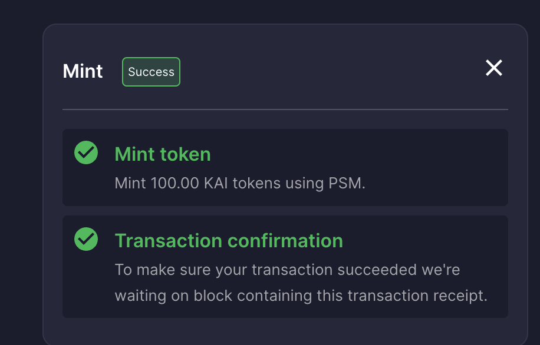

- Go to the `Liquidity` tab and select your pool. In our case, we are adding assets to the `USDC-KAI` pool on Polygon Mumbai.

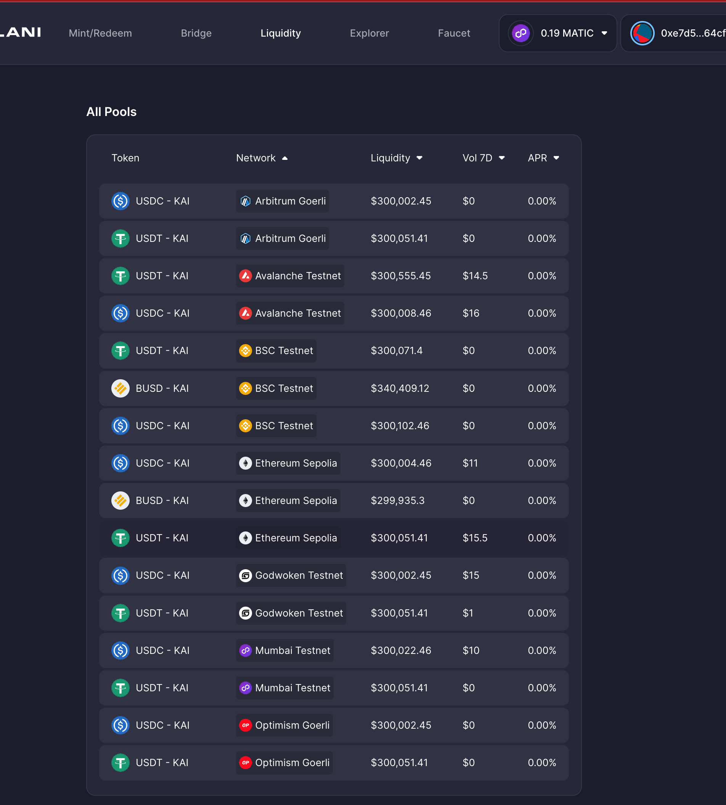

- Enter the number of assets you wish to add the pool, click on approve. 
It is important to note that you will have to approve 2 transactions. In our case, USDC and KAI.

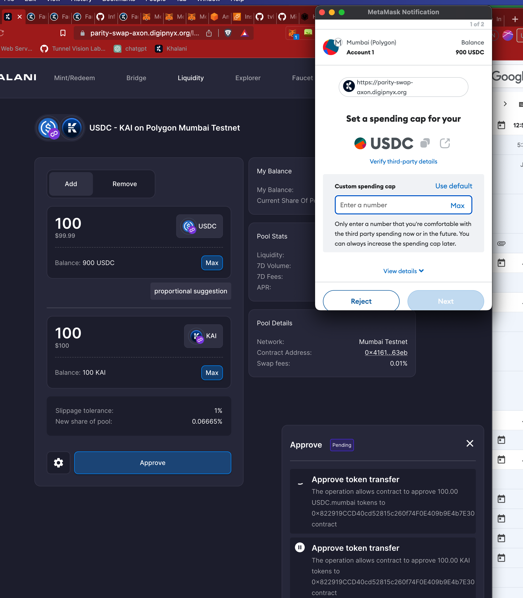

- If this action is successful, you should see this in the right-hand corner of your screen.

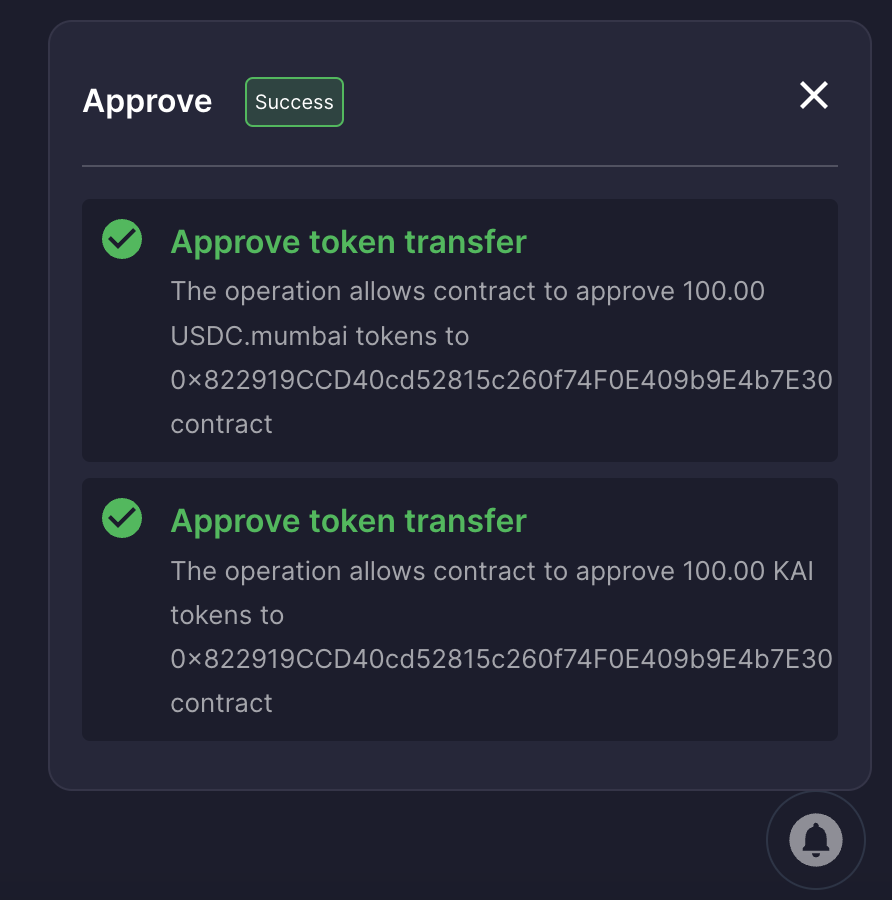

- Click on `Deposit`. This will create a pop-up, where you confirm the transaction.

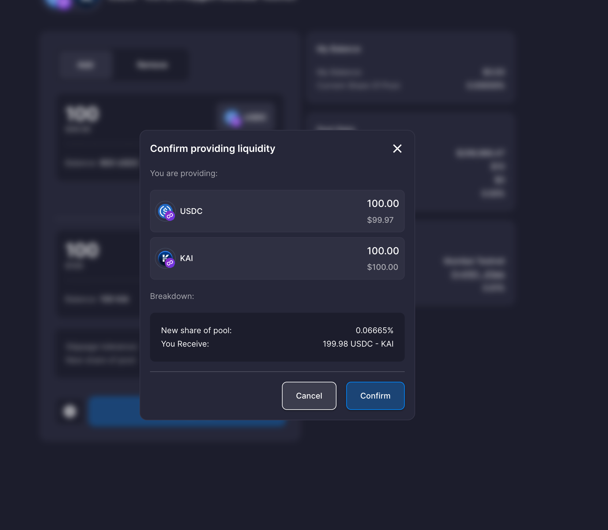

- If this action is successful, you should see this in the right-hand corner of your screen.

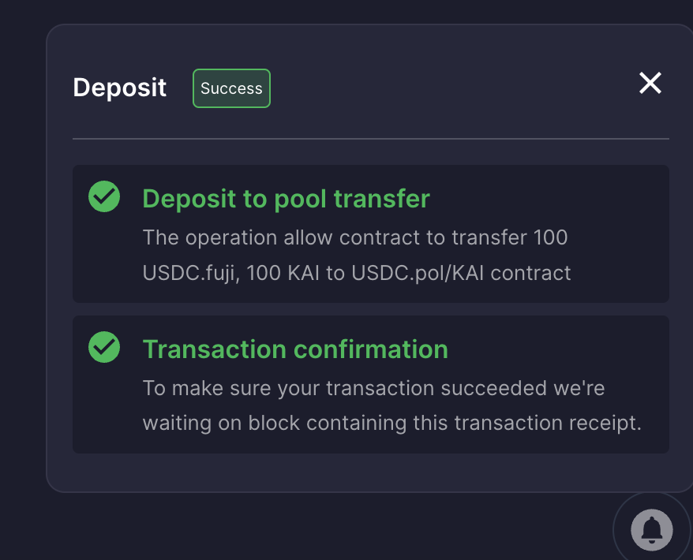

- If you navigate back to the main Liquidity page, you should see your positions there.

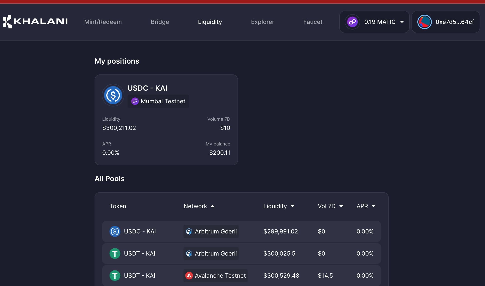
## Removing Liquidity

To remove liquidity from a pool:

- Navigate to the Liquidity tab, and select the pool you want to remove liquidity from.

- Click on the `Remove` tab, and select the percentage of liquidity you want to remove. You must be on the Khalani Chain to remove liquidity.