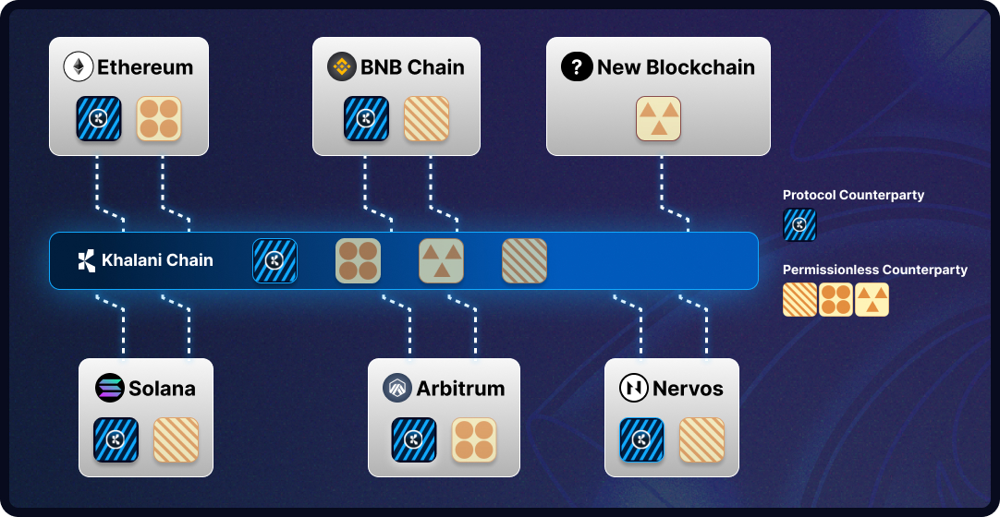

In traditional finance, a counterparty is the other party involved in a financial transaction. In the context of decentralized finance, the counterparty for a user's transaction is typically a set of smart contracts. However, when a user's transaction spans multiple blockchains, local smart contracts alone cannot execute the transaction completely. This requires a combination of smart contracts, cross-chain messaging infrastructure, and inter-chain liquidity all come together to achieve the user's objectives.

Khalani's default deployment can be viewed as a multi-chain financial counterparty. Developers can interact with Khalani's contracts on their local blockchains and rely on Khalani to deliver services on a different blockchain. Khalani's built-in counterparty services are primarily focused on aggregating inter-chain security, facilitating the cross-chain exchange of its balance sheet assets and providing funding liquidity, to provide developers with a foundation for building more advanced use cases.

While Khalani's built-in counterparty, known as Protocol Counterparty, focuses on well-established blockchains and integrates with the most battle-tested protocols, the protocol also offers a feature called Permissionless Integration. This allows anyone to deploy counterparties across any blockchains they wish to connect, or provide liquidity services that meet unique requirements.

Permissionless Counterparties can specialize in their deployments and operations, including:

- Connecting to and providing liquidity for emerging blockchains
- Integrating with innovative, and early-stage DeFi applications
- Providing fast value transfers for smaller amounts or batching multiple transfers for cost efficiency.
- Providing blockchain or application specific reserved liquidity

Permissionless Counterparties have the option to directly use Khalani's fungible inter-chain native tokens and tap into its existing liquidity. Alternatively, they can bootstrap their own liquidity against Khalani's inter-chain native tokens.

The role of Permissionless Counterparties is crucial in scaling Khalani to thousands of additional blockchains, expanding the reach and impact of the protocol.
