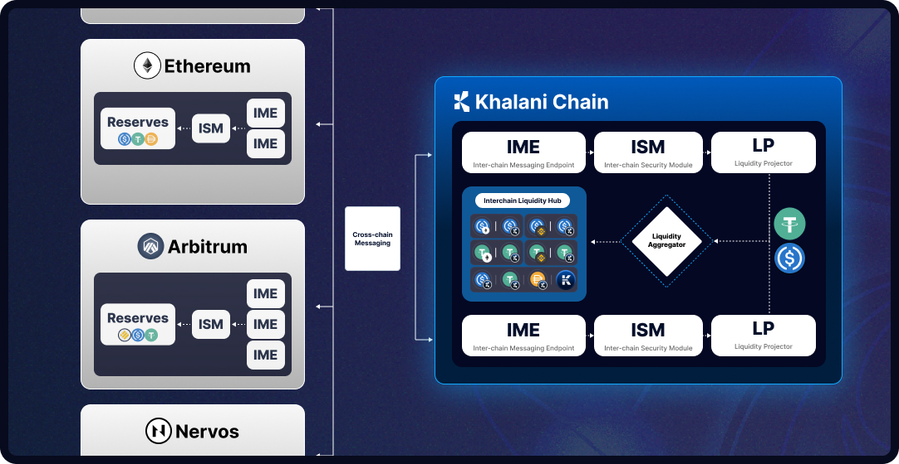

The diagram below presents an overview of Khalani's overall architecture:

Khalani, as an inter-chain native application, is deployed on multiple blockchains, with its own home chain, the Khalani Chain acting as the hub that connects to external blockchains. Functioning as a universal liquidity protocol, Khalani accepts user's chain-specific asset deposits on various blockchains and makes them available for liquidity consumers from everywhere.

**Asset Reserves**

Khalani uses Asset Reserves on every connected blockchain to keep custody of provided liquidity. Liquidity Providers can supply single or multiple sided liquidity and expect to withdraw their funds on the same blockchain.

**Inter-chain Messaging Endpoints (IMEs)**

Khalani's Inter-chain Messaging Endpoints can integrate with any inter-chain messaging protocol to facilitate message exchange between a connected blockchain and the Khalani Chain.

**Inter-chain Security Modules (ISMs)**

An Inter-chain Security Module defines how a cross-chain message should be verified on the destination chain. An ISM can be regarded as the codified security assumption for a one way cross-chain messaging mechanism.

**Liquidity Projector**

A Liquidity Projector monitors the balances of all asset reserves on a connected blockchain and issues mirror tokens as depository receipts for liquidity providers. These depository receipts can be used to redeem against the reserves on the original chain, allowing the assets to stay on the original chain, while the claims against them can be traded outside of it. The functioning of a Liquidity Projector relies on cross-chain messaging and it's tightly coupled with a specific ISM. As such, a projected liquidity token can also be viewed as a mirror token that's bundled with the infrastructure risks associated with the external blockchain and the cross-chain messaging mechanisms, as surfaced by the ISMs deployed on the connected blockchain and the Khalani Chain.

**Liquidity Aggregator**

The Liquidity Aggregator enables Khalani to aggregate multiple chain-specific asset liquidity into chain-agnostic and fungible liquidity. The protocol can then utilize this aggregated fungible liquidity to enable inter-chain value transfers, essentially operating as a cross-chain market maker.

**Interchain Liqudity Hub**

The Interchain Liquidity Hub acts as the central trading hub of Khalani's universal liquidity. User-provided, chain-specific liquidity is isolated in individual liquidity pools within the Interchain Liquidity Hub. Liquidity takers deposit into the asset reserve on the source blockchain and draw liquidity from the asset reserve on the target blockchain. The fees for this process are automatically quoted on bonding curves in the Inter-chain Liquidity Hub, determined by the supply and demand of the target liquidity.

**The Khalani Chain**

The Khalani Chain, serving as the Khalani Protocol's home blockchain, functions as the central liquidity hub for all value exchanges. Economically, it forces a synchronous execution environment for all balance sheet updates, facilitating a unified, global accounting of all assets and liabilities. This arrangement enables the protocol to effectively manage its global exposure across all connected blockchains.
