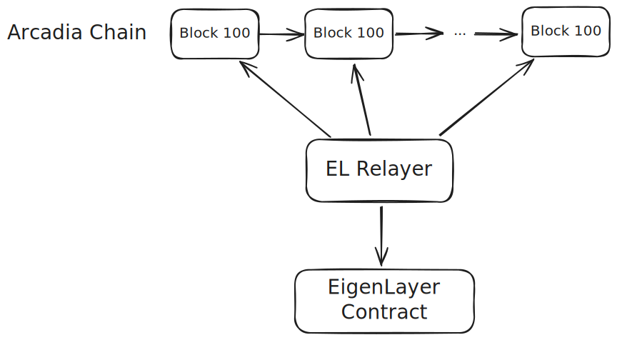
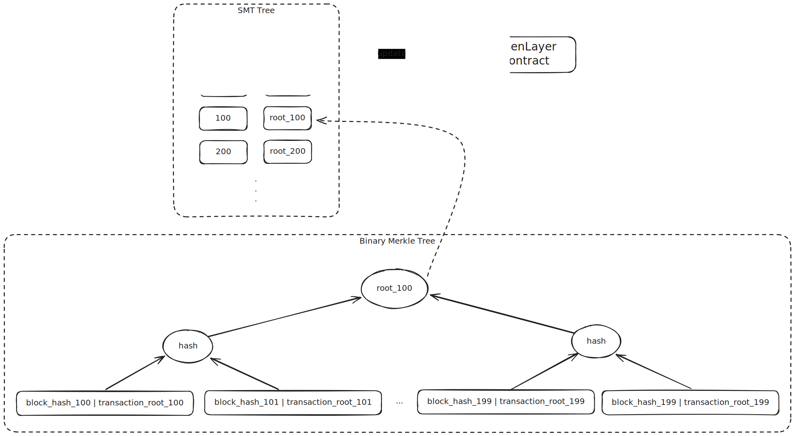

# el-relayer
The EigenLayer message relayer of Arcadia chain.

## Motivation

Arcadia is an EVM compatible network. Meanwhile, it is also the infrastructure network of the Khalani intent settlement App. In order to avoid nefarious actions by node operators, the Arcadia network will run as an AVS and recruit restaked operators to run the consensus. To objectively attribute fault to an operator may not be trivial, so Arcadia ask for intersubjective slashing with EIGEN, and we'll locally store all block data and all signatures. In case 3 out of 10 operators collude, we'll simply publish their signed blocks.

## Architecture

Arcadia is a network with a BFT-like consensus algorithm. It need some of the validators to verify the transaction and sign the block. The consensus protocol can only tolerance the fault of 1/3 of the validators. If more than 1/3 of the validators are malicious, the network will be forked. The EigenLayer acts as the stake platform of the Arcadia network. Over 80% of the validator will be elected by the EigenLayer. These nodes are called operator. The operator will run the consensus protocol and sign the block.

In order to prove the malicious behavior of the operator, the EigenLayer will store the block hash and the transaction root of each number. If the operator is malicious, participant can use the data in the EigenLayer contract to prove and punish the operator.
In this process, the el-relayer is the bridge between the Arcadia network and the EigenLayer. It will get all of the block header and calculate a binary merkle tree root every 100 block number. The binary merkle root will be updated in a SMT tree and the SMT root will be updated to the EigenLayer contract. The construction of the SMT tree is shown below.

The process in detail is as follow:
1. The el-relayer will get 100 to 199 block header from the Arcadia network.
2. Use the `keccak256(header.hash | header.transactionRoot)` as binary merkle tree leaves.
3. Calculate the binary merkle tree root.
4. Update the SMT tree with the binary merkle tree root.
5. Update the SMT root to the EigenLayer contract.
