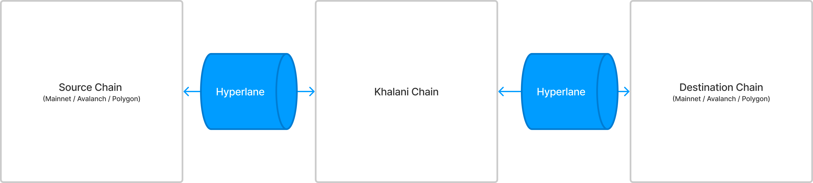

# Hyperlane overview
[Hyperlane](https://www.hyperlane.xyz/) allows to permissionlessly send a message (bytes, "hello", or external contract call) from chain A to chain B.

Khalani heavily depends on Hyperlane infrastructure. Khalani team has [permissionlessly deployed](https://docs.hyperlane.xyz/docs/deploy/permissionless-interoperability) Hyperlane
smart contracts, validators and relayers to connect the custom [Axon chain](https://testnet.khalani.network) (chainId = 10012) to the public EVM networks.



# [Architecture](https://www.figma.com/file/0N905WOhyF7HZkbLzWhgyH/Hyperlane-Overview?node-id=727-291&t=iPkn9aDQ42ZJ72NW-0)


## Contracts
### Mailbox
The main contract to send and receive messages. 
- The sender calls `Mailbox.dispatch` on the source chain. 
- When the message is signed by a quorum of validators, a relayer sends the message and _metadata_ to `Mailbox.process`.
The _metadata_ contains signatures of the validators' quorum (N/M signatures, e.g. 3/5)
- The _metadata_ signatures are verified on chain using `MultisigIsm`, which contains a list of _enrolled_ validators. 
This is to make sure that only the expected validators signed the proofs.

```solidity
contract Mailbox {
    // The default ISM, used if the recipient fails to specify one.
    IInterchainSecurityModule public defaultIsm;

    /**
     * @notice Emitted when a new message is dispatched via Hyperlane
     */
    event Dispatch(
        address indexed sender,
        uint32 indexed destination,
        bytes32 indexed recipient,
        bytes message
    );

    /**
     * @notice Emitted when a new message is dispatched via Hyperlane
     */
    event DispatchId(bytes32 indexed messageId);

    /**
     * @notice Emitted when a Hyperlane message is processed
     */
    event ProcessId(bytes32 indexed messageId);

    /**
     * @notice Emitted when a Hyperlane message is delivered
     */
    event Process(
        uint32 indexed origin,
        bytes32 indexed sender,
        address indexed recipient
    );

    /**
     * @notice Dispatches a message to the destination domain & recipient.
     * @return The message ID inserted into the Mailbox's merkle tree
     */
    function dispatch(
        uint32 _destinationDomain,
        bytes32 _recipientAddress,
        bytes calldata _messageBody
    ) external override notPaused returns (bytes32);

    /**
     * @notice Attempts to deliver `_message` to its recipient. Verifies
     * `_message` via the recipient's ISM using the provided `_metadata`.
     */
    function process(bytes calldata _metadata, bytes calldata _message);
    
    /**
     * @notice Returns the ISM to use for the recipient, defaulting to the
     * default ISM if none is specified.
     */
    function recipientIsm(address _recipient) returns (IInterchainSecurityModule);
}
```

### MultisigISM
`MultisigISM` security contract verifies validators' quorum.

A relayer, when delivering a message to the destination chain, calls `MultisigIsm.validatorsAndThreshold(message)` 
to fetch the set of validator addresses and the required threshold number. Messages sent to `Mailbox` reference 
different validators depending on the _origin_ of the messages. Those validators are registered per-origin chain 
via `MultisigIsm.enrollValidator` called by an admin.

The relayer then starts polling the referenced validators until they reach a quorum: N/M validators need to sign a proof.
The proof is packages to a _metadata_ (a set of signatures) and sent to `Mailbox.process`.

The `Mailbox.process` receives the _message_ and _metadata_ and calls `MultisigIsm.verify` on chain to recover and validate
the signatures provided by validators. `MultisigIsm` verifies that the set of validators provided is known.

```solidity
contract MultisigIsm is IInterchainSecurityModule  {
    /// @notice The validator threshold for each remote domain.
    mapping(uint32 => uint8) public threshold;

    /// @notice The validator set for each remote domain.
    mapping(uint32 => address[]) private validatorSet;

    /**
     * @notice Enrolls a validator into a validator set.
     */
    function enrollValidator(uint32 _domain, address _validator) onlyAdmin;

    /**
     * @notice Verifies that a quorum of the origin domain's validators signed
     * a checkpoint, and verifies the merkle proof of `_message` against that
     * checkpoint.
     */
    function verify(bytes calldata _metadata, bytes calldata _message) returns (bool);

    /**
     * @notice Gets the current validator set
     */
    function validators(uint32 _domain) public view returns (address[] memory);

    /**
     * @notice Returns the set of validators responsible for verifying _message
     * and the required threshold of signatures.
     */
    function validatorsAndThreshold(bytes calldata _message) returns (address[] memory, uint8);
}


interface IInterchainSecurityModule {
    function verify(bytes calldata _metadata, bytes calldata _message) returns (bool);
}
```

### ValidatorAnnounce
This contract is an on-chain registry of validators singing messages outgoing from a chain's `Mailbox.dispatch`.
Each validator specifies URL location (AWS S3 bucket) where the validator's proofs are stored. New validators are registered by calling `ValidatorAnnounce.announce` on the chain being validated (Khalani chain).

A relayer, while processing a message, fetches the set of validator addresses 
that need to reach a quorum by calling the **destination**'s `MultisigIsm.validatorsAndThreshold`. 
Then it calls the `ValidatorAnnounce.getAnnouncedStorageLocation` on the **source** chain to fetch their AWS S3 locations, starts polling the validators, etc... 

```solidity
contract ValidatorAnnounce {
    /**
     * @notice Announces a validator signature storage location.
     * Requires that the validator signed the message [<origin>, <mailbox>, HYPERLANE_ANNOUNCEMENT].
     */
    function announce(
        address _validator,
        string calldata _storageLocation,
        bytes calldata _signature
    ) external returns (bool);

    /**
     * @notice Returns a list of all announced storage locations per validator.
     */
    function getAnnouncedStorageLocation(address calldata _validator) returns (string[]);
}
```

### Recipient (example implementation)
Recipient is the destination's chain contract responsible for `handle`ing the message, which essentially constitutes the cross-chain application logic. In Khalani the recepient contract handles cross-chain transfers. 

Recipient implements two interfaces:
- [`ISpecifiesInterchainSecurityModule.interchainSecurityModule`](https://github.com/hyperlane-xyz/hyperlane-monorepo/blob/9a373d0ec92cc5f161f6e8b8edd5a0015fdc5bc2/solidity/interfaces/IInterchainSecurityModule.sol#L33) — called by a relayer off-chain
to reach the validators' quorum AND by `Mailbox.process` to delegate the message verification to the ISM module.  
- [`IMessageRecipient.handle`](https://github.com/hyperlane-xyz/hyperlane-monorepo/blob/9a373d0ec92cc5f161f6e8b8edd5a0015fdc5bc2/solidity/interfaces/IMessageRecipient.sol#L4) — the application logic to execute on receiving the fully verified message from the remote chain.

```solidity
contract Recipient {
    /**
     * @notice Returns an ISM that on chain verifies the messages being `handle`d.
     * In most cases this is the `MultisigIsm` contract.
     */
    function interchainSecurityModule() returns (IInterchainSecurityModule);

    /**
     * @notice Handles the fully verified message from the `_origin` chain's
     * `_sender` address containing the `_data.
     */
    function handle(
        uint32 _origin,
        bytes32 _sender,
        bytes calldata _data
    );
}
```

### InterchainGasPaymaster
Set of contracts responsible for charging payment for the gas used by the relayer on the destination chain.

Message sender calls the `Mailbox.dispatch` and gets the message `ID` to pay gas for. 
The sender needs to estimate the total amount of gas (`gasAmount`) that will be spent on the destination chain
when `Mailbox.process` is called by relayer. The gas consumption consists of several parts:
- gas used by `Mailbox` contract itself
- gas used by `InterchainSecurityModule`
- gas used by `IMessageRecipient.handle`

DApp developers should estimate the gas usage by the application-specific `IMessageRecipient.handle`
but it is unclear how much will be used by Hyperlane's `Mailbox` and `InterchainSecurityModule`.
In the most common case, the `MultisigIsm` is used for message security and its gas consumption is known. 
To simplify the dev experience, Hyperlane allows to specify only the `handle`'s gas amount 
and Hyperlane adds the intrinsic gas on top of it. A contract  `OverheadIgp` serves this purpose: for each
destination chain it stores the overhead gas and adds it to the user's provided gas when calling `quoteGasPaymemt`.

`InterchainGasPaymaster.quoteGasPayment()` can be used by DApp developers on-chain or off-chain to calculate
the amount of *source chain native tokens* that should be paid to the `InterchainGasPaymaster` to make the relayer
willing to relay the message.

Now the user knows the `gasAmount` (either only the `Mailbox.handle`'s gas or the total gas, depending on the `InterchainGasPaymaster` used), 
he/she calls the `InterchainGasPaymaster.payForGas` and pays in native tokens.  The `InterchainGasPaymaster` is connected to `GasOracle`-s and knows the latests exchange rates and gas prices on destination chains.
`InterchainGasPaymaster.payForGas` receives the native tokens as `value` and calculates the `sourcePrice = gasAmount * gasPrice * exchange_rate(source / destination)`
and deposits that amount to the `InterchainGasPaymaster` contract, from where the relayer can withdraw the fees.

If the paid `value` is not enough to cover the `sourcePrice`, the `InterchainGasPaymaster.payForGas` transaction is reverted.
Otherwise, if there is more `value` than needed, the `refundAddress` (parameter of the `payForGas`) receives the overpayment
and an event `GasPayment` is emitted from the `InterchainGasPaymaster` contract.

Relayers may have different and customizable strategy for accepting payments: don't charge gas fees at all, charge a fixed amount, 
or charge how much is spent by the destination transaction (`Mailbox.process`) when sending it, plus a small fee  — the default strategy.

Relayers index `GasPayment` events emitted by the `InterchainGasPaymaster` for each message ID when the message is paid 
for using `InterchainGasPaymaster.payForGas`, and accumulate the total received payment `paid gas amount`, since there may be several calls to the `payForGas` for a single message ID.

When a message has achieved the consensus, the relayer uses the following logic:
- the relayer simulates the `Mailbox.process` transaction using `etc_call` on an RPC node and gets the most probable `gasLimit` and `gasPrice`
- if the `paid gas amount` is not enough to send the transaction, the relayer postpones sending it and waits for more payments   
- if the `paid gas amount` is enough, the relayer sets the `gasLimit` to the `paid gas amount` and sends the transaction
  - if the transaction spends <= `paid gas amount`, no **overpayment is returned**, the message processing succeeds, and relayer goes on to the next message
  - otherwise, the transaction fails because the actual gas usage is more than `paid gas amount`. Since the relayer has spent its funds
  for sending this failed transaction, the message will not be processed until after it gets paid again. The relayer records how much gas has been used already.
  For UX/UI it means that sometimes the message sender needs to `InterchainGasPaymaster.payForGas` more gas, otherwise the message will be retried forever.

```solidity
contract InterchainGasPaymaster {
    /// @notice Keyed by remote domain, the gas oracle to use for the domain.
    mapping(uint32 => IGasOracle) public gasOracles;

    /// @notice The benficiary that can receive native tokens paid into this contract.
    address public beneficiary;

    /**
     * @notice Quotes the amount of native tokens on the source chain 
     * to pay for the interchain gas on the destination chain.
     * @param _gasAmount The amount of destination gas to pay for.
     */
    function quoteGasPayment(uint32 _destinationDomain, uint256 _gasAmount) returns (uint256);

    /**
     * @notice Gets the token exchange rate (quoted in the local native token) 
     * and gas price from the configured gas oracle for a given destination domain.
     */
    function getExchangeRateAndGasPrice(uint32 _destinationDomain)
        returns (uint128 tokenExchangeRate, uint128 gasPrice) {
        //Delegates to gasOracles[_destinationDomain].getExchangeRateAndGasPrice(_domain);
    }

    /**
     * @notice Deposits msg.value as a payment for the relaying of a message
     * to its destination chain.
     * @dev Overpayment will result in a refund of native tokens to the _refundAddress.
     * Callers should be aware that this may present reentrancy issues.
     */
    function payForGas(
        bytes32 _messageId,
        uint32 _destinationDomain,
        uint256 _gasAmount,
        address _refundAddress
    ) payable;
}

interface IGasOracle {
    /**
     * @return tokenExchangeRate The exchange rate of the remote native token quoted in the local native token,
     * scaled with 10 decimals, i.e. 1e10 is "one".
     * @return gasPrice The gas price on the remote chain.
     */
    function getExchangeRateAndGasPrice(uint32 _destinationDomain)
        returns (uint128 tokenExchangeRate, uint128 gasPrice);
}

contract StorageGasOracle is IGasOracle {
    struct RemoteGasData {
        // The exchange rate of the remote native token quoted in the local native token.
        // Scaled with 10 decimals, i.e. 1e10 is "one".
        uint128 tokenExchangeRate;
        uint128 gasPrice;
    }

    struct RemoteGasDataConfig {
        uint32 remoteDomain;
        uint128 tokenExchangeRate;
        uint128 gasPrice;
    }

    /// @notice Keyed by remote domain, gas data on that remote domain.
    mapping(uint32 => IGasOracle.RemoteGasData) public remoteGasData;

    /**
     * @notice Sets the remote gas data using the values in `_config`.
     */
    function setRemoteGasData(RemoteGasDataConfig calldata _config);
}
```
