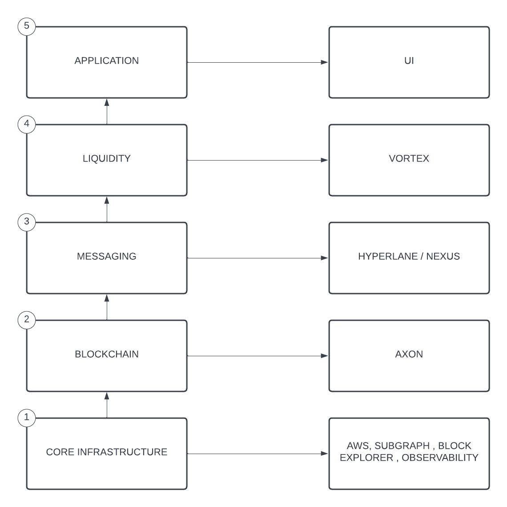
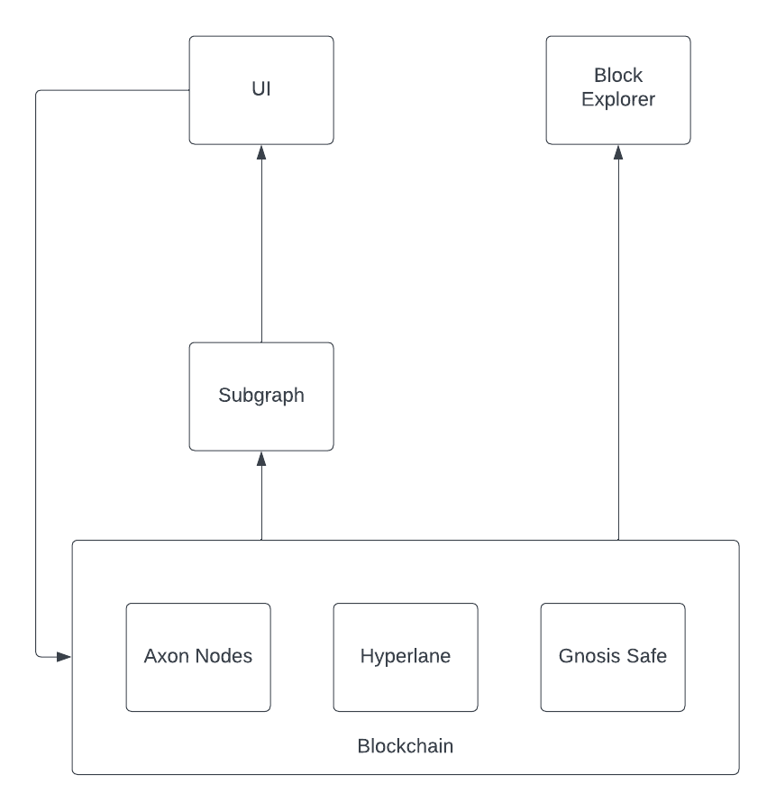
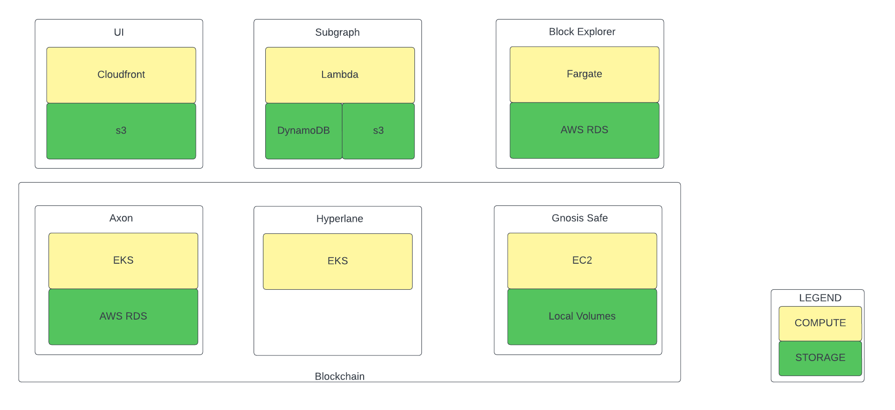

# [RFC - 1] Khalani Infrastructure Playbook

## Introduction

This documents assesses the current state of Khalani's infrastructure and operational procedures , assesses gaps , proposes a desired state, and outlines a high level implementation plan for realizing the desired state.

## Khalani Cross Chain Stack

In order to reason about the about the different components of Khalani , we borrow concepts from the popular [Open Systems Interconnection Model](https://en.wikipedia.org/wiki/OSI_model). We represent this as a 5 layer model. The image below depicts each of these

1. Core Infrastructure: This layer captures the hosting environment , AWS, along with auxilary services (Subgraphs , Block Explorer and Observability tooling.)
   1. [Block Explorer](https://khalani-axon-explorer-staging.digipnyx.org/): This is an instance of [Blockscout](https://www.blockscout.com/). The block explorer helps visualize the state of transactions on the Khalani chain.
   2. [Subgraph](https://thegraph.com/docs/en/about/): These simply indexing and querying complex smart contracts by extracting data from the blockchain , processing it and storing it , so that it can be easily retrieved via GraphQL. This is the primary method by which the front end reads state from the blockchain.
   3. [Safe](https://safe.global/) : This is a smart contract based wallet. We currently leverage its multi-signature capabilities to ensure that privileged interactions are only triggered once a quorum of signers have approved it.
2. Blockchain: This layer  captures the blockchain client we run , in order to execute smart contracts. We currently leverage [Axon](https://github.com/axonweb3/axon), a highly performant EVM compatible side chain . It hosts the Khalani chain , and supporting smart contracts infrastructure.
3. Liquidity: This layer capture the smart contracts responsible for facilitating interchain liquidity between different blockchain ecosystems.
   1. Vortex
   2. Nexus
4. Messaging: This layer captures the cross chain messaging protocol that Khalani uses to trigger interactions between Khalani , Source and Destination chains. We have chosen [Hyperlane](https://github.com/hyperlane-xyz/hyperlane-monorepo) as our cross chain messaging protocol.:  We currently run hyperlane via [Permissionless Interoperability](https://docs.hyperlane.xyz/docs/deploy/permissionless-interoperability), which means that we need to host the following resources:  
   1. Hyperlane Core: These represent the smart contracts deployed that different chains
   2. Validators: Validators are responsible for attesting to the validity of messages in the mailbox by signing them. Once messages have reached a redefined threshold , the are picked up by the relayers to be delivered on the target chains.
   3. Relayers: Relayers are agents that read signed messages from the the Hyperlane mailbox and deliver them to the destination chains.
5. Application: This layer captures the [UI](https://github.com/tvl-labs/stableswap-app/commit/9fee3565e914c2d804c9700d6e0f1890ef018aae): This is the primary user facing application. It reads data from Subgraphs , and writes directly to the blockchain.

## Gap Analysis

Having defined the Khalani Cross chain stack , we proceed to traverse the stack , enumerating the current state , gaps , desired state , and the implementation plan to realize the desired state.

### Core Infrastructure

#### Current State of Core Infrastructure

This section assesses the current state of Khalani infrastructure.

### Existing infrastructure components

The entirety of Khalani's infrastructure is hosted on AWS, with code hosted on Github.

#### Compute resources  

Computing Resources are split across Cloudfront , Lambda , Fargate ,  EC2 and EKS.

#### Storage services

Storage is split across s3, DynamoDB, RDS , and local volumes.

#### Security measures

* We inherit the baseline security from AWS.
* For Hyperlane Relayers , and validators, the private key are generated via KMS and never exposed to the user , or compute's memory.

#### Current DevOps and SecOps practices

This process is currently fragmented across servies, with github actions been used to automated as much of the deployment as possible.

* UI
  * Automated via [Github actions](https://github.com/tvl-labs/stableswap-app/blob/develop/.github/workflows/deploy.yml)
* Subgraph
  * [Manual Deployment via AWS SAM cli](https://github.com/tvl-labs/stableswap-app/blob/develop/.github/workflows/deploy.yml)
* Block Explorer.
  * [Manual Deployment via AWS SAM cli](https://github.com/tvl-labs/infrastructure/blob/af20ce75938e6aa533cff2a015c9a12e3b559c11/axon-explorer/staging/Makefile#L27)
* Axon
  * [Manual Deployment via Helm Charts](https://github.com/tvl-labs/axon-devops/tree/1831b7a600f8fd61a5c4cafcb2da30694e4622e8/k8s-deploy)
* Hyperlane
  * Manual deployment via Helm Charts

#### Smart contract development and deployment process

We currently our develop our smart contracts using [Foundry](https://github.com/foundry-rs/foundry), and deployments done via [Solidity Scripting](https://book.getfoundry.sh/tutorials/solidity-scripting)

### Identified gaps and areas for improvement

#### General

* Lack of observability solutions in a number of our services.
* Lack of High Availability / Disaster Recovery solutions.

#### Scalability

* All
  * Resources have to be manually scaled , when they reach capacity , which often resolves in a service disruption.

#### Security

* AWS
  * We do not utilize fine grained role, and most users are granted more access than they require.
* Axon
  * We currently do not have a solution for storing the validator's BLS keys . See [here](https://github.com/orgs/tvl-labs/projects/2?pane=issue&itemId=13233645)
  * Deployment is manual.
  
#### Automation

* All
  * A number of our services still requires manual deployments.

### Desired State of Infrastructure

#### Goals and objectives

##### General

* Implement High Availabilty / Disaster recovery processes.
* Implement unified observability solution.

##### Scalability

* We should default to autoscaling groups  where ever possible to avoid the need for manual intervention.
* Resources consumption should be estimated prior so services being deployed , so that we can get a better sense compute / storage requirements.

##### Security

* We should adopt the [Principles of Least  Privilege](https://www.paloaltonetworks.com/cyberpedia/what-is-the-principle-of-least-privilege#:~:text=The%20principle%20of%20least%20privilege%20(PoLP)%20is%20an%20information%20security,to%20complete%20a%20required%20task.), creating roles that give the users permissions that are required to perform their task, and nothing more.

##### Automation

* All deployments should be automated via Github actions.

## Escalation Points

In the cases unexpected service down time the following people can be reached. It is expected that  these individuals keep their phone on vibrate mode.

|        | Timezone | Phone Number   |
| ------ | -------- | -------------- |
| Sam    | GMT + 4  | +971 585294724 |
| Daniel | GMT + 2  |                |
| Sergei | GMT + 1  |

### Blockchain

In order to facilitate development of the smart contracts and the applications , we currently run an axon cluster.

We currently run a testnet with 4 nodes all running as stateful sets within the `axon` EKS namespace.

The current genesis file be found [here](https://github.com/tvl-labs/axon-devops/blob/1831b7a600f8fd61a5c4cafcb2da30694e4622e8/k8s-deploy/k8s/axon/axon-config/genesis.json), and the node configuration [here](https://github.com/tvl-labs/axon-devops/blob/1831b7a600f8fd61a5c4cafcb2da30694e4622e8/k8s-deploy/k8s/axon/axon-config/node_1.toml).

#### Identified gaps and areas for improvement

* Fault Tolerance: Axon is built on top [Overlord](https://github.com/nervosnetwork/overlord/blob/master/docs/architecture_en.md#overlord) , a BFT based consensus , running a 4 nodes cluster is not fault tolerant , as the network can be partitioned by 2 nodes going offline. We should run a minimum of 5 nodes.
* Security: Nodes currently have the private keys hard coded into the toml . This is hard to resolve , as they are required to esthablishing authenticated sessions in pentacle. We need to investigate how to resolve this.
* Backup and restoration: We are currently unable to back up and restore our nodes in a new cluster.
* Outdated version: We are currently runnning a version of Axon that is 6 months olds
* Chain upgrades: There is not clear path to upgrading the chain. Currently it means restarting from scratch.
* Paying for Gas: We are currently unable to control our token emissions.

### Messaging

We currently run Hyperlane via permissionless interoperability.

We deploy the ISM and mailbox contract using [Hyperlane Deploy](https://github.com/tvl-labs/hyperlane-deploy) scripts , and run the agents in the `hyperlane` namespace in EKS.

We currently run a single validator on [Khala chain](https://github.com/tvl-labs/hyperlane-deploy/blob/main/config/multisig_ism.json#L147-L155), and 3 relayers.

1. Goerli => Khalani
2. Khalani => Fuji
3. Khalani => Goerli

The relayer configurations can be found [here](), and the validator configuration [here](https://github.com/tvl-labs/infrastructure/blob/hyperlane/hyperlane/hyperlane-validators/values.yaml#L60-L77)

#### Identified gaps and areas for improvement

* Security: The relayer currently hard codes private keys. We should use the option that allows us to use KMS.
* Single Instance: We currently run only one instance of an agent per chain . There should be multiple independent relayers/ validators running. We should also have a validator set of at least 3 , requiring a 2/3 threshold.
* More chains: We plan to support 8 chains on launch , and would need to scale these agents , and permissionlessly deploy the hyperlane contracts there.  
  
### Liquidity #TODO

### Application #TODO

### Conclusion

The infrastructure playbook currently highlights the current system, assesses gaps and suggests  remediation steps. It is our intention that such actions improve the reliability and security of our services.

This is intended to be an ongoing process , and will be reviewed periodically.

## TODO

* Complete Liquidity / Application
* Economic Security
